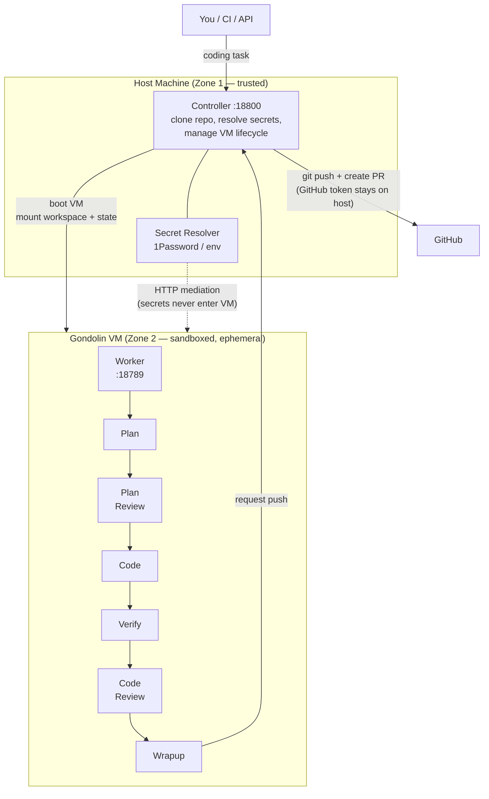

# agent-vm

A self-hosted system for running LLM coding agents safely. Each task gets its own fresh QEMU micro-VM that boots in seconds, does the work, and is destroyed when done. API keys are injected at the network layer so the agent never sees raw credentials.

---

## System Overview



---

## How It Works

```
  You / CI / API
       |
       |  "Add pagination to /api/users"
       v
  Controller        (your host machine, :18800)
       |            Clones your repo, assembles config,
       |            boots a fresh VM, submits the task,
       |            waits for completion, pushes the PR.
       v
  Gateway VM        (Gondolin QEMU micro-VM, ~2s boot)
       |            Runs the coding agent inside a sandbox.
       |            Full filesystem + shell access inside.
       |            Can't touch the host or other tasks.
       v
  Tool VMs          (ephemeral, on-demand)
                    Extra sandboxed environments for
                    database containers, build tools, etc.
```

The **Controller** is a Node.js process on your machine. It never runs untrusted code — it just manages VMs and credentials.

The **Gateway VM** is where the LLM agent works. A lightweight QEMU virtual machine (via [Gondolin](https://github.com/nicholasgasior/gondolin)) that boots in ~2 seconds. Your repo is mounted read-write inside the VM. The agent can run any command — npm, git, python — but it's sandboxed. When the task finishes, the VM is destroyed.

**Tool VMs** are additional sandboxes for backing services (postgres, redis) that your tests might need. Booted on demand and cleaned up with the task.

---

## The Agent Pipeline

Six phases, three with retry loops:

1. **Plan** — reads your codebase, writes an implementation plan
2. **Plan Review** — separate LLM reviews the plan, revises if rejected (max 2 loops)
3. **Work** — writes code with full shell access (default: GPT-5.4)
4. **Verify** — runs your tests + linter, auto-fixes failures (max 3 retries)
5. **Work Review** — separate LLM reviews the diff, requests changes if needed (max 3 loops)
6. **Wrapup** — commits changes, controller pushes branch + opens PR from host

Every state change is logged to a JSONL event log for debugging and crash recovery.

---

## Security Model

```
  +====================================================================+
  |  ZONE 1: HOST  (fully trusted)                                      |
  |                                                                     |
  |  Controller process, secret resolver, GitHub token, Docker daemon   |
  |  Can: resolve secrets, push branches, manage VMs                    |
  |  Never: runs untrusted code                                         |
  |                                                                     |
  |  +---------------------------------------------------------------+  |
  |  |  ZONE 2: GATEWAY VM  (sandboxed)                              |  |
  |  |                                                                |  |
  |  |  Per-task ephemeral VM with full shell access                  |  |
  |  |  Can: make outbound HTTP (allowlisted hosts only)              |  |
  |  |  Cannot: see API keys, access host filesystem, persist state   |  |
  |  |                                                                |  |
  |  |  +----------------------------------------------------------+  |  |
  |  |  |  ZONE 3: TOOL VM  (untrusted)                            |  |  |
  |  |  |                                                           |  |  |
  |  |  |  Ephemeral, per-lease. Runs LLM-generated code.           |  |  |
  |  |  |  Has: workspace mount only. No secrets, no network.       |  |  |
  |  |  +----------------------------------------------------------+  |  |
  |  +---------------------------------------------------------------+  |
  +=====================================================================+
```

**Key properties:**
- **Secrets never enter the VM** — Gondolin's HTTP mediation proxy intercepts outbound requests and injects API keys at the network layer. The agent process makes normal HTTP calls without ever seeing credentials.
- **Each task is isolated** — fresh VM, fresh workspace, fresh Docker namespace. Tasks can't contaminate each other.
- **GitHub token stays on host** — the VM asks the controller to push. The controller runs `git push` from Zone 1 where the token lives.
- **Allowlisted egress** — outbound traffic is restricted per-zone. No arbitrary internet access.
- **.env / secrets never readable by agent** — contrast with container-based approaches where `process.env` exposes everything.

---

## Operating Modes

|                    | OpenClaw                        | Worker                                              |
|--------------------|---------------------------------|------------------------------------------------------|
| **Purpose**        | Interactive chat agent          | Autonomous coding pipeline                           |
| **Gateway type**   | `openclaw`                      | `worker`                                             |
| **VM lifecycle**   | Long-running per zone           | Per-task ephemeral                                   |
| **Pipeline**       | User-driven conversation        | 6-phase: plan → review → work → verify → review → wrapup |
| **Output**         | Chat responses + tool calls     | Pull requests                                        |
| **Backing services** | Discord, WhatsApp channels    | Docker compose (postgres, etc.)                      |

---

## Package Map

| Package | Description |
|---------|-------------|
| `@shravansunder/agent-vm` | CLI + controller runtime |
| `@shravansunder/agent-vm-worker` | Task pipeline (runs inside VM) |
| `@shravansunder/gondolin-core` | VM adapter + secret resolver |
| `@shravansunder/gateway-interface` | Shared gateway lifecycle types |
| `@shravansunder/openclaw-gateway` | OpenClaw gateway implementation |
| `@shravansunder/worker-gateway` | Worker gateway implementation |
| `@shravansunder/openclaw-agent-vm-plugin` | OpenClaw sandbox plugin |

All packages live under `packages/` in this monorepo.

---

## Quick Start

See [SETUP.md](SETUP.md) for prerequisites, installation, and first-run instructions.

---

## Reading Guide

### By audience

| You want to... | Read |
|----------------|------|
| **5-min pitch** — understand what this is and why it's secure | This README (you're done) |
| **15-min technical walkthrough** — understand all the moving parts | README → [architecture.md](architecture.md) → [worker-pipeline.md](worker-pipeline.md) |
| **Work on the codebase** — understand implementation details | + [subsystems/](subsystems/) deep dives |
| **Configure or operate** — look up config fields, run E2E checks | [reference/](reference/) |

### Full doc tree

```
docs/
├── README.md                              You are here
├── architecture.md                        System architecture, packages, controller,
│                                          gateway, secrets, trust zones
├── worker-pipeline.md                     Inside the VM: 6-phase pipeline, event
│                                          sourcing, executors, MCP tools
├── SETUP.md                               Prerequisites + quick start
│
├── subsystems/                            Implementation deep dives
│   ├── controller.md                      Controller runtime, HTTP API, leases
│   ├── gateway-lifecycle.md               Gateway abstraction, OpenClaw vs Worker
│   ├── gondolin-vm-layer.md               VM adapter, VFS, HTTP mediation
│   ├── secrets-and-credentials.md         Secret resolution + injection modes
│   └── worker-task-pipeline.md            Controller-side task lifecycle
│
└── reference/                             Lookup material
    ├── configuration-reference.md         All config fields (system.json, worker.json)
    ├── project-status.md                  Build history, E2E verification matrix
    └── e2e-verification.md                Live testing checklist
```
