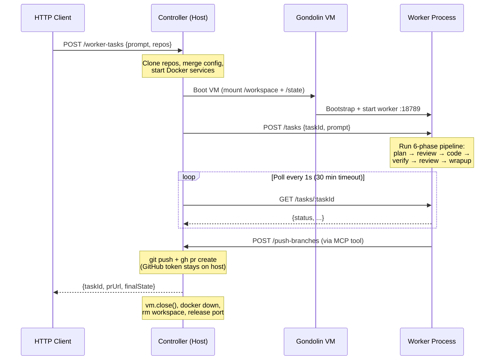
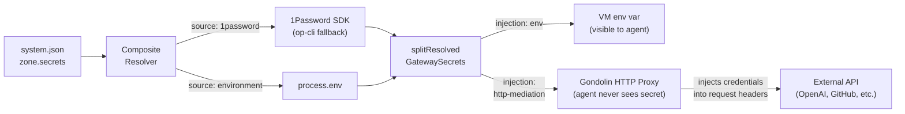

# System Architecture

[Overview](README.md) > Architecture

Level 2 architecture guide covering all packages, both gateway types, the controller, and the Gondolin VM layer. For the worker pipeline internals (6-phase task execution, event sourcing, executors), see [worker-pipeline.md](worker-pipeline.md).

---

## Package Dependency Graph

Seven packages compose the system. Dependencies flow downward.

```
  openclaw-agent-vm-plugin
      |
  agent-vm  (controller + CLI)
      |              |              |
  openclaw-       worker-       gondolin-core
  gateway         gateway           |
      |              |              |
      +----- gateway-interface -----+---- @earendil-works/gondolin
```

| Package | npm Name | Responsibility |
|---------|----------|----------------|
| `agent-vm` | `@shravansunder/agent-vm` | CLI entry point, controller runtime, HTTP API, lease manager, gateway orchestrator |
| `agent-vm-worker` | `@shravansunder/agent-vm-worker` | Task pipeline that runs inside the VM (plan, review, work, verify, wrapup) |
| `gateway-interface` | `@shravansunder/gateway-interface` | Shared types: `GatewayLifecycle`, `GatewayVmSpec`, `GatewayProcessSpec`, `GatewayZoneConfig` |
| `openclaw-gateway` | `@shravansunder/openclaw-gateway` | OpenClaw-specific lifecycle: VM spec, process spec, auth profiles, config merging |
| `worker-gateway` | `@shravansunder/worker-gateway` | Worker-specific lifecycle: minimal VM spec, bootstrap via tarball, codex worker process |
| `gondolin-core` | `@shravansunder/gondolin-core` | VM adapter wrapping `@earendil-works/gondolin`, build pipeline, secret resolver, VFS mount helpers |
| `openclaw-agent-vm-plugin` | `@shravansunder/openclaw-agent-vm-plugin` | OpenClaw sandbox backend plugin: lease client, plugin registration, SDK compatibility |

The external dependency `@earendil-works/gondolin` is the Gondolin SDK itself -- QEMU micro-VM runtime, VFS providers, HTTP mediation hooks, and the image build toolchain.

---

## Controller Architecture

The controller is the host-side process that owns VM lifecycles, serves the HTTP API, and never executes untrusted code. It runs on the host machine and communicates with gateway VMs over HTTP.

### Startup Sequence

`startControllerRuntime()` in `controller-runtime.ts` executes these steps in order:

```
  1. Resolve secrets         createSecretResolver() -> composite resolver
  2. Create TCP pool         createTcpPool(config.tcpPool)
  3. Create lease manager    createLeaseManager({ tcpPool, createManagedVm })
  4. Start idle reaper       createIdleReaper({ ttlMs: 30min }) on 60s interval
  5. Find active zone        findConfiguredZone(systemConfig, zoneId)
  6. Start gateway zone      startGatewayZone() -- skipped for worker type
  7. Wire HTTP routes        createControllerService() -> Hono app
  8. Bind HTTP server        startControllerHttpServer({ port: config.host.controllerPort })
```

For worker-type zones, the gateway is not started at boot. Instead, a per-task VM is created on demand when a worker task is submitted (see Worker Mode below).

### HTTP API (Hono on :18800)

The controller exposes a REST API. Routes are split across two modules: core lease routes in `controller-http-routes.ts` and zone operation routes in `controller-zone-operation-routes.ts`.

| Method | Path | Purpose | Mode |
|--------|------|---------|------|
| `GET` | `/health` | Controller liveness check | Both |
| `POST` | `/lease` | Acquire a tool VM lease (scope key, zone, profile) | OpenClaw |
| `GET` | `/lease/:leaseId` | Inspect a single lease (SSH access, slot) | OpenClaw |
| `GET` | `/leases` | List all active leases | OpenClaw |
| `DELETE` | `/lease/:leaseId` | Release a tool VM lease | OpenClaw |
| `GET` | `/controller-status` | Controller operational status | OpenClaw |
| `GET` | `/zones/:zoneId/logs` | Fetch gateway VM logs | OpenClaw |
| `POST` | `/zones/:zoneId/credentials/refresh` | Re-resolve zone secrets and update auth | OpenClaw |
| `POST` | `/zones/:zoneId/destroy` | Stop and destroy a gateway zone | OpenClaw |
| `POST` | `/zones/:zoneId/upgrade` | Restart gateway zone with fresh image | OpenClaw |
| `POST` | `/zones/:zoneId/enable-ssh` | Enable SSH access to the gateway VM | OpenClaw |
| `POST` | `/zones/:zoneId/execute-command` | Execute a shell command in the gateway VM | OpenClaw |
| `POST` | `/zones/:zoneId/worker-tasks` | Submit a worker task (prompt, repos, context) | Worker |
| `POST` | `/zones/:zoneId/tasks/:taskId/push-branches` | Push task branches to remote | Worker |
| `POST` | `/stop-controller` | Graceful shutdown: release leases, stop gateway, close server | Both |

### Key Subsystems

**TCP Pool** (`tcp-pool.ts`): Manages a fixed pool of TCP port slots. Each tool VM gets a unique slot mapped to `127.0.0.1:{basePort + slot}`. The gateway VM sees these as `tool-{slot}.vm.host:22` via Gondolin's synthetic DNS. Pool size is configured in `systemConfig.tcpPool.size`.

**Lease Manager** (`lease-manager.ts`): Creates, tracks, and releases tool VM leases. Each lease holds a reference to a `ManagedVm`, a TCP slot, SSH access details, and timestamps. Leases are scoped by `scopeKey` to enable reuse within the same agent conversation.

**Idle Reaper** (`idle-reaper.ts`): Runs on a 60-second interval. Any lease with `lastUsedAt` older than the TTL (default 30 minutes) is automatically released. This prevents orphaned tool VMs from consuming resources.

**Active Task Registry** (`active-task-registry.ts`): Tracks in-flight worker tasks by zone and task ID. Used by the push-branches endpoint to verify a task is still active before allowing branch pushes.

---

## Gateway Abstraction

The `GatewayLifecycle` interface (`gateway-interface` package) is the contract every gateway type must implement. The controller never knows the specifics of OpenClaw or worker -- it calls the lifecycle methods and gets back pure data specs.

### Interface

```
  GatewayLifecycle
  |
  |-- authConfig?                     Static auth configuration (optional)
  |     listProvidersCommand: string   Shell command to list auth providers
  |     buildLoginCommand(provider)    Shell command for interactive login
  |
  |-- buildVmSpec(options)            Pure data -> GatewayVmSpec
  |     environment                    Env vars for the VM
  |     vfsMounts                      Host-to-guest folder mappings
  |     mediatedSecrets                Secrets injected via HTTP mediation
  |     tcpHosts                       Synthetic DNS -> TCP host mappings
  |     allowedHosts                   Outbound HTTP allowlist
  |     rootfsMode                     cow | memory | readonly
  |     sessionLabel                   {namespace}:{zone}:gateway
  |
  |-- buildProcessSpec(zone, secrets) Pure data -> GatewayProcessSpec
  |     bootstrapCommand               Setup shell env, install packages
  |     startCommand                   Launch the gateway process
  |     healthCheck                    HTTP or command-based readiness probe
  |     guestListenPort                Port the process listens on inside VM
  |     logPath                        Guest-side log file path
  |
  |-- prepareHostState?(zone, resolver)  Optional side-effect hook
        Write auth profiles, merge configs on the host before VM boots
```

### Lifecycle Loader

`gateway-lifecycle-loader.ts` dispatches by the zone's `gateway.type` field. Both implementations are statically imported -- no dynamic loading.

### How the Implementations Differ

| Concern | OpenClaw (`openclaw-lifecycle.ts`) | Worker (`worker-lifecycle.ts`) |
|---------|------|--------|
| **authConfig** | Present: `openclaw models auth login` | Absent: no interactive auth |
| **VFS mounts** | 3 mounts: config, state, workspace | 2 mounts: state, workspace |
| **Environment** | `OPENCLAW_*` vars, `HOME=/home/openclaw` | `CONTROLLER_BASE_URL`, `WORKER_CONFIG_PATH`, `HOME=/home/coder` |
| **TCP hosts** | Controller + all tool VM slots + websocket bypass | Controller only |
| **Bootstrap** | Write shell env profile, configure bashrc | Conditionally install worker tarball from `/state/` |
| **Start command** | `openclaw gateway --port 18789` | `agent-vm-worker serve --port 18789 --config ...` |
| **Health check** | HTTP GET `:18789/` | HTTP GET `:18789/health` |
| **prepareHostState** | Writes effective-openclaw.json (config + gateway token), writes auth-profiles.json from 1Password | None |
| **Rootfs mode** | `cow` (copy-on-write) | `cow` (copy-on-write) |

Both implementations call `splitResolvedGatewaySecrets()` to partition resolved secrets into environment variables (injection: `env`) and HTTP-mediated secrets (injection: `http-mediation` with required `hosts[]`). See the Secrets Flow section below for the full picture.

---

## Gondolin VM Layer

Gondolin (`@earendil-works/gondolin`) provides QEMU micro-VMs with sub-second boot times and strong host isolation. The `gondolin-core` package wraps the SDK and exposes a simplified interface.

### What Gondolin Provides

| Capability | Description |
|-----------|-------------|
| **QEMU micro-VMs** | Lightweight VMs with configurable memory and CPU |
| **VFS mounts** | `RealFSProvider` (read/write), `ReadonlyProvider`, `MemoryProvider`, `ShadowProvider` (deny/tmpfs overlays) |
| **Rootfs modes** | `readonly` (immutable), `memory` (RAM-backed, ephemeral), `cow` (copy-on-write, persists within session) |
| **HTTP mediation** | `createHttpHooks` intercepts outbound HTTP, injects secrets into request headers by host match |
| **Synthetic DNS** | Maps virtual hostnames (e.g., `controller.vm.host:18800`) to real TCP endpoints |
| **Ingress** | Routes external HTTP traffic into the VM at a specified guest port |
| **SSH** | On-demand SSH access into the VM for debugging |
| **Image build** | `buildAssets()` converts a build config into a VM image: `rootfs.ext4`, `initramfs.cpio.lz4`, `vmlinuz-virt` |

### gondolin-core Wrapper

The `gondolin-core` package wraps the raw SDK into higher-level operations:

- **`createManagedVm(options)`** -- assembles VFS mounts, creates HTTP hooks, boots the VM, returns a `ManagedVm` handle (`exec`, `enableSsh`, `enableIngress`, `close`).
- **`buildImage(options)`** -- fingerprint-cached image builds (SHA-256 of build config + Gondolin version).
- **`SecretResolver` / `resolveServiceAccountToken`** -- resolve `SecretRef` values from 1Password or environment variables.

### VFS Mount Types

```
  Mount Kind        Provider           Behavior
  -----------       --------           --------
  realfs            RealFSProvider     Host directory shared read/write with VM
  realfs-readonly   ReadonlyProvider   Host directory shared read-only
  memory            MemoryProvider     RAM-backed, ephemeral (lost on VM close)
  shadow            ShadowProvider     Overlay: deny writes to specific paths,
                                       or redirect writes to tmpfs
```

---

## Gateway Zone Orchestrator

`gateway-zone-orchestrator.ts` is the boot sequence for any gateway VM, regardless of type. It coordinates the lifecycle, image builder, and Gondolin adapter.

```
  startGatewayZone(options)
    |
    |-- 1. Clean orphaned gateway    cleanupOrphanedGatewayIfPresent()
    |-- 2. Load lifecycle            loadGatewayLifecycle(type) -> GatewayLifecycle
    |-- 3. Resolve zone secrets      resolveZoneSecrets() -> Record<string, string>
    |-- 4. Build gateway image       buildGatewayImage() -> { imagePath, fingerprint }
    |-- 5. Create host directories   mkdir stateDir, workspaceDir
    |-- 6. Prepare host state        lifecycle.prepareHostState() [optional]
    |-- 7. Build VM spec             lifecycle.buildVmSpec() -> GatewayVmSpec
    |-- 8. Build process spec        lifecycle.buildProcessSpec() -> GatewayProcessSpec
    |-- 9. Create managed VM         createManagedVm(vmSpec) -> ManagedVm
    |-- 10. Bootstrap                vm.exec(processSpec.bootstrapCommand)
    |-- 11. Start process            vm.exec(processSpec.startCommand)
    |-- 12. Wait for readiness       poll healthCheck (HTTP 2xx or exit 0, max 30 attempts)
    |-- 13. Set ingress routes       vm.setIngressRoutes([{ port, prefix: '/' }])
    |-- 14. Enable ingress           vm.enableIngress({ listenPort: zone.gateway.port })
    |-- 15. Write runtime record     writeGatewayRuntimeRecord() for crash recovery
    |
    v
  Returns { vm, ingress, processSpec, image, zone }
```

---

## OpenClaw Mode

OpenClaw mode runs a long-lived gateway VM that hosts an interactive chat agent. The gateway VM persists across requests and conversations.

```
  Controller (:18800)
       |
       |-- Gateway VM (openclaw, long-running)
       |      |-- OpenClaw process (:18789)
       |      |-- /home/openclaw/.openclaw/config/  (host: config dir, realfs)
       |      |-- /home/openclaw/.openclaw/state/   (host: stateDir, realfs)
       |      |-- /home/openclaw/workspace/         (host: workspaceDir, realfs)
       |      |
       |      |-- Talks to Controller via controller.vm.host:18800
       |      |-- Requests tool VM leases for code execution
       |
       |-- Tool VM 0 (on-demand via lease, tool-0.vm.host:22)
       |-- Tool VM 1 (on-demand via lease, tool-1.vm.host:22)
       |-- ...up to tcpPool.size
```

The gateway VM boots at controller startup and stays running. Tool VMs are created on demand via the lease API -- each gets a TCP slot, SSH access, and a workspace mount. Auth profiles and the effective OpenClaw config are written to the host-side state directory before the VM boots via `prepareHostState()`. The gateway reaches tool VMs via synthetic DNS (`tool-{n}.vm.host:22`) and the controller via `controller.vm.host:18800`. Websocket bypass hosts get direct TCP passthrough (for Discord, etc.).

---

## Worker Mode

Worker mode runs a per-task ephemeral VM. There is no long-running gateway -- each task gets a fresh VM that is destroyed on completion.

### Task Lifecycle



### Controller-Side Lifecycle

The full per-task lifecycle is managed by `worker-task-runner.ts`:

```
  POST /zones/:zoneId/worker-tasks
    { prompt, repos: [{ repoUrl, baseBranch }], context }
       |
       v
  1. PRE-START (preStartGateway)
     |-- Generate task ID (UUID)
     |-- Create taskRoot/{workspace, state} directories
     |-- Copy local worker tarball if AGENT_VM_WORKER_TARBALL_PATH set
     |-- Clone repos into taskRoot/workspace/
     |-- Read .agent-vm/config.json from primary repo
     |-- Deep-merge: zone gateway config + project config -> effective config
     |-- Validate against workerConfigSchema
     |-- Write effective-worker.json to taskRoot/state/
     |-- Start Docker services (docker-compose up) if compose files found
     |
  2. BOOT VM (startGatewayZone with zoneOverride)
     |-- Use worker lifecycle (buildVmSpec, buildProcessSpec)
     |-- Mount taskRoot/workspace -> /workspace
     |-- Mount taskRoot/state -> /state
     |-- Bootstrap: install agent-vm-worker from tarball
     |-- Start: agent-vm-worker serve --port 18789
     |-- Wait for health check: GET :18789/health
     |
  3. SUBMIT TASK
     |-- POST http://vm:18789/tasks
     |   { taskId, prompt, repos, context }
     |
  4. POLL
     |-- GET http://vm:18789/tasks/:taskId
     |-- Repeat every 1s until status is completed | failed | closed
     |-- 3 consecutive poll failures = abort
     |-- 30-minute timeout (configurable)
     |
  5. TEARDOWN (always runs, even on failure)
     |-- vm.close() -- RAM filesystem wiped
     |-- docker-compose down
     |-- rm taskRoot/workspace/
     |-- Deregister task from active task registry
```

For the worker pipeline internals (what happens inside the VM after step 3), see [worker-pipeline.md](worker-pipeline.md). That document covers the 6-phase pipeline: plan, plan-review, work, verification, work-review, and wrapup.

---

## Secrets Flow

Secrets are resolved on the host and delivered to VMs through two channels. Host-only secrets (e.g., `githubToken` for push-branches) never enter any VM.

```
  system-config.json
    |
    |  host.secretsProvider.tokenSource
    |    -> resolve 1Password service account token (op-cli | env | keychain)
    v
  Composite Secret Resolver
    |  Dispatches by SecretRef.source:
    |    '1password' -> onePasswordResolver.resolve(ref)
    |    'environment' -> process.env[ref.ref]
    |
    +---> resolveZoneSecrets(zone, resolver)
    |       |  For each zone.secrets[name]: resolve to plain text
    |       v
    |     splitResolvedGatewaySecrets(zone, resolvedSecrets)
    |       |
    |       +---> injection: 'env'            -> VM environment variable
    |       +---> injection: 'http-mediation' -> Gondolin HTTP hooks inject
    |                                            secret for matching hosts[]
    |
    +---> resolveControllerGithubToken()
            HOST-ONLY: never enters any VM
            Used by push-branches to push task branches from the host
```



### Secret Injection Modes

| Mode | Config | How It Works | Use Case |
|------|--------|-------------|----------|
| `env` | `injection: 'env'` | Secret set as environment variable in VM | API keys the process reads from env |
| `http-mediation` | `injection: 'http-mediation', hosts: [...]` | Gondolin intercepts outbound HTTP to listed hosts and injects secret into request headers | API keys for specific services (OpenAI, Anthropic) -- the VM process never sees the raw secret |
| Host-only | `host.githubToken` | Resolved on controller, never passed to VM | Git push operations from the controller |

---

## VM Image Build

VM images are built from Docker OCI base images via Gondolin's build pipeline. Images are cached by a content-addressed fingerprint.

### Build Pipeline

```
  build-config.json (referenced from system-config.json)
    |
    v
  buildGatewayImage() / buildGondolinImage()
    |-- 1. Load build config JSON
    |-- 2. Fingerprint: SHA-256(config + gondolinVersion), truncated to 16 hex
    |-- 3. Cache hit?  cacheDir/{fingerprint}/ has all 4 assets -> return cached
    |-- 4. Cache miss: gondolin.buildAssets() -> Docker pull, extract, build rootfs
    |-- 5. Output: { imagePath, fingerprint, built: true|false }
    v
  cacheDir/{fingerprint}/
    manifest.json, rootfs.ext4, initramfs.cpio.lz4, vmlinuz-virt
```

### Two Image Types

| Image | Config Path | Used By | Rootfs Mode |
|-------|-------------|---------|-------------|
| Gateway | `images.gateway.buildConfig` | Gateway VMs (OpenClaw or Worker) | `cow` |
| Tool | `images.tool.buildConfig` | Tool VMs (on-demand code execution) | `memory` |

Gateway images use copy-on-write rootfs so the gateway process can install packages and modify the filesystem within the session. Tool images use memory-backed rootfs for full ephemeral isolation -- everything is lost when the VM closes.

---

## Configuration Overview

The system is configured via a single `system-config.json` file (validated by Zod in `system-config.ts`). All relative paths are resolved relative to the config file's directory.

```
  system-config.json
  |-- host              Controller port, project namespace, secrets provider, GitHub token
  |-- cacheDir          Image build cache directory
  |-- images            Build config paths for gateway and tool VM images
  |-- zones[]           Zone definitions: gateway type, resources, secrets, allowed hosts
  |-- toolProfiles      Named VM resource profiles (memory, cpus, workspace root)
  |-- tcpPool           Port range and pool size for tool VM TCP slots
```

Each zone declares its `gateway.type` (`openclaw` or `worker`), resource limits, a set of secret references with injection mode, an outbound host allowlist, and a tool profile reference. The schema validates that every zone's `toolProfile` exists and that `host.secretsProvider` is present when any secret uses the `1password` source.

For the full field-by-field reference, see [configuration-reference.md](reference/configuration-reference.md).

---

## Trust Zones

The system operates across three trust boundaries:

```
  +====================================================================+
  |  ZONE 1: HOST  (fully trusted)                                      |
  |                                                                     |
  |  Controller process, secret resolver, GitHub token, Docker daemon   |
  |  Can: resolve secrets, push branches, manage VMs                    |
  |  Never: runs untrusted code                                         |
  |                                                                     |
  |  +---------------------------------------------------------------+  |
  |  |  ZONE 2: GATEWAY VM  (partially trusted)                      |  |
  |  |                                                                |  |
  |  |  Long-running (OpenClaw) or per-task (Worker) process          |  |
  |  |  Has: env-injected secrets, HTTP-mediated secrets               |  |
  |  |  Can: make outbound HTTP (allowlisted), reach controller       |  |
  |  |  Cannot: access host filesystem outside VFS mounts             |  |
  |  |                                                                |  |
  |  |  +----------------------------------------------------------+  |  |
  |  |  |  ZONE 3: TOOL VM  (untrusted)                            |  |  |
  |  |  |                                                           |  |  |
  |  |  |  Ephemeral, per-lease. Runs LLM-generated code.           |  |  |
  |  |  |  Has: workspace mount (realfs), no secrets, no network    |  |  |
  |  |  |  Can: read/write /workspace, run arbitrary commands       |  |  |
  |  |  |  Cannot: reach the internet, access secrets, persist      |  |  |
  |  |  +----------------------------------------------------------+  |  |
  |  +---------------------------------------------------------------+  |
  +=====================================================================+
```

---

## Go Deeper

| Document | Scope |
|----------|-------|
| [worker-pipeline.md](worker-pipeline.md) | Worker pipeline: 6-phase state machine, event sourcing, executors, MCP tools |
| [configuration-reference.md](reference/configuration-reference.md) | All configuration fields for system.json, zone configs, worker config, env vars |
| [SETUP.md](SETUP.md) | Prerequisites, installation, first-run instructions |
| [subsystems/controller.md](subsystems/controller.md) | Controller internals: lease lifecycle, TCP pool, idle reaper |
| [subsystems/secrets-and-credentials.md](subsystems/secrets-and-credentials.md) | Secret resolution, 1Password integration, HTTP mediation details |
| [subsystems/gondolin-vm-layer.md](subsystems/gondolin-vm-layer.md) | Gondolin VM adapter, VFS mounts, rootfs modes, HTTP mediation, image build pipeline |
| [subsystems/gateway-lifecycle.md](subsystems/gateway-lifecycle.md) | Gateway abstraction: GatewayLifecycle interface, OpenClaw vs Worker |
| [subsystems/worker-task-pipeline.md](subsystems/worker-task-pipeline.md) | Controller-side task lifecycle: pre-start, boot, poll, teardown |
