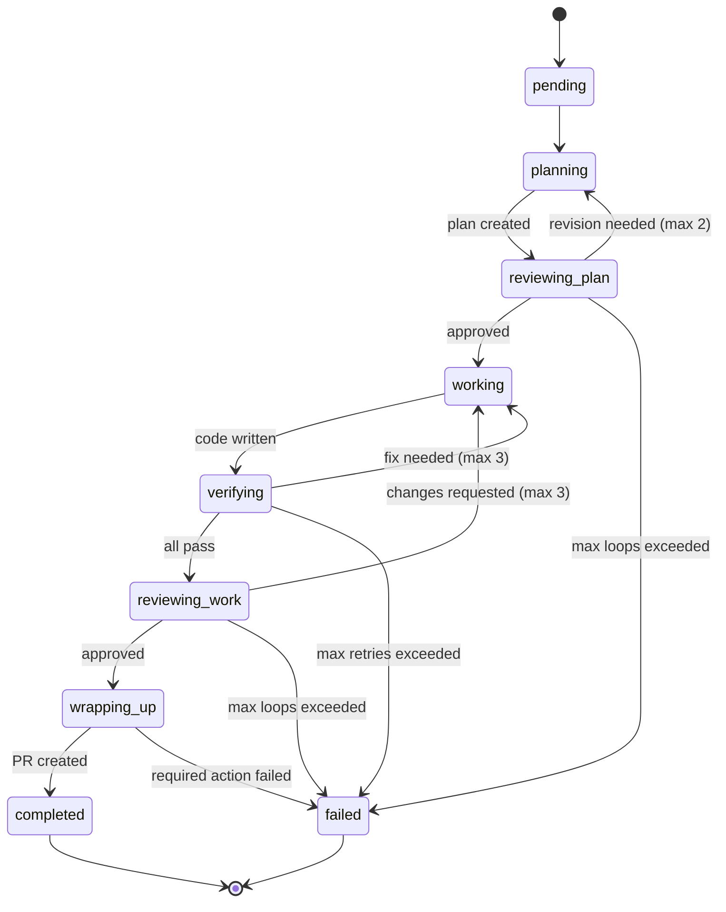
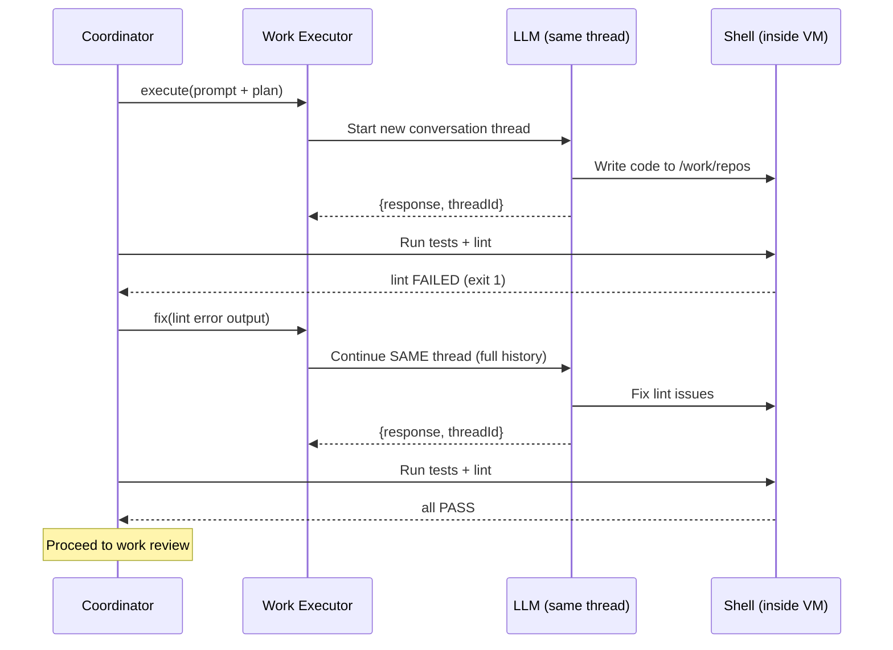

# Agent Worker Gateway

[Overview](../README.md) > [Architecture](overview.md) > Agent Worker Gateway

How the agent-vm-worker system works inside the VM — from receiving a coding task to delivering a pull request.

---

## What Is This System?

The agent-vm-worker is an **autonomous coding agent**. You give it a task like "Add pagination to the /api/users endpoint" and it:

1. Plans an implementation approach
2. Reviews its own plan for quality
3. Writes the code
4. Runs your tests and linter to check its work
5. Reviews the code changes
6. Signals the controller to push branches, then creates a pull request with `gh`

It does all of this inside a disposable virtual machine so it can't affect your real systems. Git push happens on the **controller** (host side). PR creation happens from the worker via `gh pr create` after the push succeeds, with GitHub HTTP traffic mediated by the controller proxy.

---

## The Big Picture

There are two processes that work together: a **Controller** (on your host machine) and a **Worker** (inside a sandboxed VM).

```
  You / Your CI / Your API
         |
         |   "Add pagination to /api/users"
         v
  +-------------------------------+
  |  CONTROLLER  (host machine)   |
  |  Port 18800                   |
  |                               |
  |  Jobs:                        |
  |   - Clone your repo           |
  |   - Assemble configuration    |
  |   - Boot a fresh VM           |
  |   - Submit the task           |
  |   - Wait for completion       |
  |   - Push branches             |
  |   - Tear everything down      |
  +----------|--------------------+
             |
             |  Shares control/Git folders with the VM:
             |    /state    (config + event logs)
             |    /gitdirs  (Git objects/refs/index)
             |  /work/repos is VM-local rootfs/COW.
             |
  +----------v--------------------+
  |  WORKER  (inside Gondolin VM) |
  |  Port 18789                   |
  |                               |
  |  Jobs:                        |
  |   - Run the plan/work/review  |
  |     pipeline                  |
  |   - Drive the LLM             |
  |   - Run tests & linter        |
  |   - Request PR via controller  |
  |   - Log every state change    |
  +-------------------------------+
```

**Why two processes?** Separation of concerns. The controller owns the VM lifecycle and never runs untrusted code. The worker runs inside the sandbox where the LLM agent has full access to the filesystem and can execute arbitrary commands safely.

---

## How the Sandbox Works

The sandbox is a **Gondolin virtual machine** — a lightweight VM that boots in seconds and provides strong isolation. Here's what makes it safe:

```
  +===================================================================+
  |  HOST MACHINE                                                      |
  |                                                                    |
  |  stateDir/tasks/<taskId>/                                          |
  |    state/       <-- config file + event logs (read/write)          |
  |    agent-vm/    <-- generated runtime docs/resources               |
  |                                                                    |
  |  runtimeDir/worker-tasks/<zone>/<taskId>/                          |
  |    gitdirs/     <-- Git objects/refs/index, not normal backup      |
  |                                                                    |
  |  These two folders are the ONLY connection between host and VM.    |
  |  Everything else in the VM is ephemeral.                           |
  |                                                                    |
  |  +--------------------------------------------------------------+  |
  |  |  GONDOLIN VM                                                 |  |
  |  |                                                              |  |
  |  |  rootfs/COW work-area storage                                 |  |
  |  |  Erased when VM shuts down unless explicitly checkpointed.    |  |
  |  |                                                              |  |
  |  |  /work/repos --> rootfs/COW repo files                   |  |
  |  |  /gitdirs    --> mounted from task runtime RealFS gitdirs    |  |
  |  |  /state      --> mounted from host (config + logs)           |  |
  |  |  /work/tmp   --> rootfs/COW large temp target                |  |
  |  |                                                              |  |
  |  |  The LLM agent can:                                          |  |
  |  |    - Read and write files in /work/repos                      |  |
  |  |    - Run any shell command (npm, git, etc.)                  |  |
  |  |    - Install packages                                        |  |
  |  |                                                              |  |
  |  |  The LLM agent CANNOT:                                       |  |
  |  |    - Access host files outside explicit VFS mounts           |  |
  |  |    - Affect the host filesystem                              |  |
  |  |    - Persist work after VM shutdown except committed Git     |  |
  |  |      state in /gitdirs or explicit recovery artifacts        |  |
  |  |    - Interfere with other tasks (each gets its own VM)       |  |
  |  +--------------------------------------------------------------+  |
  +====================================================================+
```

### Isolation Layers

| Layer | What it prevents | How |
|---|---|---|
| **Gondolin VM** | Agent escaping to host | Memory-backed rootfs, VFS mounts limit visibility |
| **Per-task directory** | Tasks contaminating each other | Fresh `taskRoot/` and fresh VM per task |
| **TCP port pool** | VMs colliding on ports | Slot-based allocation: VM-0 gets port 19000, VM-1 gets 19001, etc. |
| **Docker namespace** | Service cross-talk | Each task's database/redis/etc. is scoped by task ID |
| **Temp HOME dirs** | Executor configs leaking | Each LLM executor gets its own HOME directory |

---

## Controller Lifecycle: Step by Step

When someone submits a task, the controller runs through 5 stages:

```
  POST /zones/:zoneId/worker-tasks
  { requestTaskId: "task-001", prompt: "Add pagination", repos: [...] }
        |
        v
  +------------------------------------------+
  |  STAGE 1: PREPARE  (on host filesystem)  |
  |                                          |
  |  Create fresh directories:               |
  |    stateDir/tasks/<taskId>/state/        |
  |    stateDir/tasks/<taskId>/agent-vm/     |
  |    runtimeDir/.../gitdirs/               |
  |                                          |
  |  Prepare Git metadata:                   |
  |    git clone --bare --branch main <url>  |
  |      runtimeDir/.../gitdirs/<repo>.git   |
  |    extract .agent-vm/ metadata only      |
  |                                          |
  |  Build configuration:                    |
  |    Read .agent-vm/config.json from repo  |
  |    Merge: repo config > zone > defaults  |
  |    Write effective-worker.json           |
  |      -> stateDir/tasks/<taskId>/state/   |
  |                                          |
  |  Resolve repo resources:                 |
  |    load .agent-vm/repo-resources.ts |
  |    select one provider per resource name |
  |                                          |
  |  Start selected providers (if needed):   |
  |    docker compose -p agent-vm-* up |
  +------------------------------------------+
        |
        v
  +------------------------------------------+
  |  STAGE 2: BOOT VM                        |
  |                                          |
  |  Build Gondolin VM image (cached)        |
  |  Allocate a TCP port slot                |
  |  Create VM with targeted mounts:         |
  |    /work/repos stays rootfs/COW           |
  |    host:task state        -> /state      |
  |    host:task gitdirs      -> /gitdirs    |
  |  Apply resource TCP/env/VFS overlays     |
  |  Boot, run startup commands              |
  |  Worker process starts on :18789         |
  +------------------------------------------+
        |
        v
  +------------------------------------------+
  |  STAGE 3: SUBMIT TASK                    |
  |                                          |
  |  POST http://vm:18789/tasks              |
  |    { taskId, prompt, repos, context }    |
  |                                          |
  |  Worker accepts, begins executing        |
  +------------------------------------------+
        |
        v
  +------------------------------------------+
  |  STAGE 4: WAIT                           |
  |                                          |
  |  Poll: GET /tasks/:taskId                |
  |  Repeat until status is one of:          |
  |    completed, failed, or closed          |
  +------------------------------------------+
        |
        v
  +------------------------------------------+
  |  STAGE 5: TEARDOWN                       |
  |                                          |
  |  vm.close()                              |
  |    RAM filesystem wiped instantly         |
  |  Release TCP port slot                   |
  |  Stop selected repo resource providers   |
  |  Remove repo files + generated resources |
  |  Keep task state for status replay       |
  |  Return results to caller                |
  +------------------------------------------+
```

**Key point**: Runtime execution state is cleaned up after teardown. The VM's
memory filesystem is gone, selected repo-resource providers are stopped, the
VM-local repo files and generated resource outputs are deleted, and the port
slot is freed. Task state and event logs remain on the controller so status
reads can replay the result.

---

## Worker: The Task Pipeline

Once the worker receives a task, it runs a deterministic 6-phase pipeline. Three of these phases have retry loops so the agent can fix its own mistakes.

### State Machine

The task moves through these statuses:

```
  pending --> planning --> reviewing-plan --> working --> verifying --> reviewing-work --> wrapping-up
                                                                                            |
                                                                    +----------+----------+-+
                                                                    |          |          |
                                                                completed   failed     closed
                                                               (success)   (gave up)  (user stopped)
```



### The 6 Phases

```
  Task submitted
        |
        v
  +===================================================================+
  |  PHASE 1: PLAN                                                     |
  |                                                                    |
  |  The agent reads your codebase (file tree, CLAUDE.md,              |
  |  package.json) and generates an implementation plan.               |
  |  It does NOT write code yet.                                       |
  |                                                                    |
  |  Input:  task prompt + repo context + config instructions          |
  |  Output: plan text (stored as event)                               |
  +===================================================================+
        |
        v
  +===================================================================+
  |  PHASE 2: PLAN REVIEW  (loop, max 2 iterations by default)        |
  |                                                                    |
  |  A separate LLM executor reviews the plan.                        |
  |  Returns: { approved: true/false, summary, comments }             |
  |                                                                    |
  |      +----------- approved? ----------+                            |
  |      |                                |                            |
  |     YES                              NO                            |
  |      |                                |                            |
  |      v                                v                            |
  |   Continue to                  Revise the plan                     |
  |   WORK phase             (using reviewer feedback)                 |
  |                                       |                            |
  |                          Still not approved after max loops?        |
  |                                       |                            |
  |                                    TASK FAILS                      |
  +===================================================================+
        |
        v
  +===================================================================+
  |  PHASE 3: WORK                                                     |
  |                                                                    |
  |  The agent writes code. It has full access to /work/repos           |
  |  and can run any command (npm install, create files, etc.).        |
  |  The approved plan guides what it builds.                          |
  |                                                                    |
  |  Input:  plan + task prompt + repo context                         |
  |  Output: code changes in /work/repos                                |
  +===================================================================+
        |
        v
  +===================================================================+
  |  PHASE 4: VERIFICATION  (loop, max 3 retries by default)          |
  |                                                                    |
  |  Runs your test and lint commands:                                 |
  |    npm test                                                        |
  |    npm run lint                                                    |
  |                                                                    |
  |      +---------- all pass? ---------+                              |
  |      |                              |                              |
  |     YES                            NO                              |
  |      |                              |                              |
  |      v                              v                              |
  |   Continue to                Agent fixes the code                  |
  |   WORK REVIEW          (on the same LLM thread, so it             |
  |                          remembers what it already did)            |
  |                                     |                              |
  |                        Still failing after max retries?            |
  |                                     |                              |
  |                                  TASK FAILS                        |
  +===================================================================+
        |
        v
  +===================================================================+
  |  PHASE 5: WORK REVIEW  (loop, max 3 iterations by default)        |
  |                                                                    |
  |  First runs verification again (as a gate).                        |
  |  If tests pass, a separate LLM reviews the git diff.              |
  |  Returns: { approved: true/false, summary, comments }             |
  |                                                                    |
  |      +----------- approved? ----------+                            |
  |      |                                |                            |
  |     YES                              NO                            |
  |      |                                |                            |
  |      v                                v                            |
  |   Continue to                  Agent fixes code                    |
  |   WRAPUP phase           (using reviewer feedback)                 |
  |                                       |                            |
  |                          Still not approved after max loops?        |
  |                                       |                            |
  |                                    TASK FAILS                      |
  +===================================================================+
        |
        v
  +===================================================================+
  |  PHASE 6: WRAPUP                                                   |
  |                                                                    |
  |  The agent runs configured "finishing" actions:                     |
  |                                                                    |
  |    git-push (required before PR creation):                         |
  |      Stage & commit -> call controller push-branches endpoint       |
  |      Controller pushes branch from the host                         |
  |                                                                    |
  |    gh pr create:                                                   |
  |      Worker creates the PR after git-push succeeds                  |
  |                                                                    |
  |  If a required action fails -> TASK FAILS                          |
  |  If all required actions succeed -> TASK COMPLETED                 |
  +===================================================================+
```

### Retry Behavior

The loops are the system's self-healing mechanism. When verification fails or a review is rejected, the agent doesn't start from scratch. It uses the `fix()` method on the **same LLM thread**, which means the agent has the full conversation history (what it planned, what it built, what went wrong). This is much more effective than starting over.

```
  Work executor thread (single conversation):

    execute() ----> "Here's the code I wrote"
                         |
    [lint fails]         |
                         v
    fix() ----------> "I see the lint error, fixing..."
                         |
    [lint passes]        |
    [review rejects]     |
                         v
    fix() ----------> "Reviewer said X, updating..."
                         |
    [tests pass]         |
    [review approves]
```



---

## Event Sourcing: How State Works

The worker never mutates state directly. Instead, every state change is recorded as an **event**, and the current state is computed by replaying all events in order.

### Why Events?

1. **Auditability**: You can see exactly what happened and when by reading the JSONL file
2. **Crash recovery**: If the VM reboots, replay the log to reconstruct where things were
3. **Debugging**: "Why did this task fail?" — read the event log

### How It Works

```
  Event happens (e.g., plan was created)
        |
        |  1. Append to /state/tasks/{taskId}.jsonl
        |  2. Run applyEvent(currentState, event) -> newState
        |  3. Update in-memory state map
        v

  File on disk (one JSON object per line):

    {"ts":"10:00:00","data":{"event":"task-accepted","taskId":"t-001","config":{...}}}
    {"ts":"10:00:01","data":{"event":"phase-started","phase":"plan"}}
    {"ts":"10:01:30","data":{"event":"plan-created","plan":"Step 1: ...","threadId":"th_abc"}}
    {"ts":"10:01:31","data":{"event":"phase-completed","phase":"plan"}}
    {"ts":"10:01:32","data":{"event":"phase-started","phase":"plan-review","loop":1}}
    ...
```

### On Startup (State Reconstruction)

```
  Worker boots
        |
        v
  Read all .jsonl files in /state/tasks/
        |
        v
  For each file:
    Parse line by line
    Start with empty state
    Apply each event -> compute current state
        |
        v
  In-memory map of all task states, ready to serve via HTTP
```

### All 11 Event Types

| Event | When It Fires | What It Records |
|---|---|---|
| `task-accepted` | Task submitted | Task ID, full config, prompt |
| `phase-started` | Entering a phase | Which phase, loop number (if retry) |
| `phase-completed` | Exiting a phase | Which phase, token count |
| `plan-created` | Plan generated or revised | Plan text, LLM thread ID |
| `work-started` | Code execution begins | LLM thread ID |
| `review-result` | Plan or work reviewed | Approved/rejected, summary, comments |
| `verification-result` | Tests/lint ran | Per-command pass/fail, exit codes, output |
| `fix-applied` | Agent fixed an issue | Token count |
| `wrapup-result` | PR created, Slack posted | Per-action success/fail, artifacts (PR URL) |
| `task-completed` | Pipeline finished | (terminal) |
| `task-failed` | Something went wrong | Failure reason |
| `task-closed` | User stopped the task | (terminal, user-initiated) |

---

## Executors: How the LLM Is Called

An **executor** is the bridge between the coordinator and an LLM. The coordinator says "plan this" or "fix that", and the executor translates it into an LLM API call.

```
  Coordinator                    Executor                         LLM (OpenAI/Claude)
      |                              |                                   |
      |  execute(prompt)             |                                   |
      |----------------------------->|                                   |
      |                              |  Start new thread                 |
      |                              |---------------------------------->|
      |                              |                                   |
      |                              |  Response + threadId              |
      |                              |<----------------------------------|
      |  { response, threadId }      |                                   |
      |<-----------------------------|                                   |
      |                              |                                   |
      |  fix(feedback)               |                                   |
      |----------------------------->|                                   |
      |                              |  Continue SAME thread             |
      |                              |---------------------------------->|
      |                              |                                   |
      |                              |  Response (with full history)     |
      |                              |<----------------------------------|
      |  { response, threadId }      |                                   |
      |<-----------------------------|                                   |
```

### Key Concepts

- **`execute()`** starts a fresh LLM conversation thread
- **`fix()`** continues the existing thread — the LLM sees the full history of what it already did, plus the new feedback
- **Thread persistence** matters because it means the agent learns from its mistakes within a single task

### OpenAI Executor (Current Implementation)

The OpenAI executor wraps the `@openai/codex-sdk`. On first use, it:

1. Creates an isolated HOME directory (so config doesn't leak between executors)
2. Registers any MCP servers (like deepwiki for documentation lookup)
3. Registers local controller tools when the phase needs them (like `git-push`)
4. Initializes the OpenAI SDK

The executor runs with `sandboxMode: 'danger-full-access'` — this sounds scary but is safe because **the VM is the sandbox**. The LLM agent gets full access to run commands and write files, but it's all contained inside the ephemeral Gondolin VM.

### Per-Phase Executors

Each phase creates its own executor. You can configure different LLM providers and models per phase:

```json
{
  "defaults": { "provider": "codex", "model": "latest-medium" },
  "phases": {
    "plan":       { "model": "latest" },
    "planReview": {},
    "work":       {},
    "workReview": {},
    "wrapup":     {}
  }
}
```

For example, you might use a more capable (and expensive) model for planning, and a faster model for the work phase.

---

## MCP Tools: How the Agent Pushes Branches

During the wrapup phase, the agent calls controller tools exposed inside the VM. The `git-push` tool calls the **controller's push-branches endpoint**; the actual git push happens on the host, not inside the VM. After that succeeds, the worker can run `gh pr create` from the shell. GitHub HTTP traffic is mediated by the controller proxy.

```
  Coordinator (wrapup phase)
        |
        |  Build tool definitions:
        |    git-push         -> calls controller push-branches API
        |    git-pull-default -> refreshes the protected/default branch
        |
        v
  Start local MCP server
    Hono HTTP server on 127.0.0.1:{random-port}/mcp
    Implements MCP protocol (ListTools, CallTool)
        |
        v
  Register with executor:
    codex mcp add agent-vm-local-tools --url http://127.0.0.1:{port}/mcp
        |
        v
  Executor runs wrapup phase
    LLM decides which tools to call based on the prompt
    LLM calls git-push -> controller pushes branch
    LLM runs gh pr create -> mediated GitHub HTTP creates PR
        |
        v
  Results collected and emitted as wrapup-result event
```

**MCP** (Model Context Protocol) is a standard way for LLMs to discover and call tools. By wrapping our tools as an MCP server, the LLM agent can call them naturally as part of its conversation.

**Why controller-side push?** The host-only GitHub token never enters the VM. The worker stages and commits changes locally, then tells the controller "push this branch." The controller runs `git push` on the host side. After that succeeds, the worker runs `gh pr create`; GitHub HTTP traffic is mediated by the controller proxy. See [worker task pipeline](../subsystems/worker-task-pipeline.md) for the full push flow.

---

## Configuration Reference

The worker config controls every aspect of the pipeline. It's assembled by the controller before the VM boots and loaded from `/state/effective-worker.json`.

### Config Assembly

```
  .agent-vm/config.json          (checked into your repo)
    overrides
  Zone config                    (set when controller starts)
    overrides
  Hardcoded defaults             (in worker-config.ts)
    =
  effective-worker.json          (written to /state/, loaded by worker)
```

### Full Schema

```
  defaults:
    provider: "codex"              Which LLM provider to use
    model: "latest-medium"         Which model (alias or concrete ID)

  phases:
    plan:
      provider/model:              Override default for this phase
      skills: [...]                Skill files to include in prompt
      instructions: "..."         Custom instructions for this phase
      maxReviewLoops: 2            How many times to retry plan review

    planReview:
      provider/model/skills/instructions

    work:
      provider/model/skills/instructions
      maxReviewLoops: 3            How many times to retry work review
      maxVerificationRetries: 3    How many times to retry after test failure

    workReview:
      provider/model/skills/instructions

    wrapup:
      provider/model/skills/instructions

  mcpServers: [                    External MCP servers the agent can use
    { name: "deepwiki", url: "..." }
  ]

  verification: [                  Commands to run after the agent writes code
    { name: "test", command: "npm test" },
    { name: "lint", command: "npm run lint" }
  ]
  verificationTimeoutMs: 300000    5 minutes per command

  branchPrefix: "agent/"          PR branches are named agent/{taskId}
  stateDir: "/state"               Where event logs are written
```

### Model Aliases

Human-friendly names that resolve to concrete model IDs:

| Alias | OpenAI (codex provider) | Claude |
|---|---|---|
| `latest` | gpt-5.4-high | claude-opus-4-6 |
| `latest-medium` | gpt-5.4-low | claude-sonnet-4-6 |
| `latest-mini` | gpt-5.4-mini | claude-haiku-4-5 |

---

## HTTP API

The worker exposes a simple REST API for the controller to interact with:

| Endpoint | Method | What It Does |
|---|---|---|
| `GET /health` | GET | Is the worker alive? What task is running? How long has it been up? |
| `POST /tasks` | POST | Submit a new task. Returns 409 if one is already running. |
| `GET /tasks/:id` | GET | Get the full state of a task (status, plan, results, etc.) |
| `POST /tasks/:id/close` | POST | Gracefully stop a running task. |

**One task at a time**: Each VM runs exactly one task. This is by design — the VM is the isolation boundary for that task.

---

## End-to-End Walk-Through

Here's a concrete trace of a successful task from start to finish:

```
  CONTROLLER                                    WORKER (inside VM)
  ----------                                    ------------------

  create gitdir -> runtimeDir/.../gitdirs/repo.git
  Write config  -> stateDir/tasks/<taskId>/state/
  Boot Gondolin VM (rootfs /work/repos + /gitdirs + /state)
  POST /tasks { "Add pagination" }
                                                Emit: task-accepted
                                                Status: pending

                                                --- PLAN ---
                                                Status: planning
                                                Bootstrap /work/repos repo files
                                                from /gitdirs/repo.git
                                                Scan /work/repos (file tree, CLAUDE.md)
                                                Ask LLM: "Create a plan for pagination"
                                                LLM returns plan text
                                                Emit: plan-created

                                                --- PLAN REVIEW ---
                                                Status: reviewing-plan
                                                Ask separate LLM: "Review this plan"
                                                LLM returns { approved: true }
                                                Emit: review-result (approved)

                                                --- WORK ---
                                                Status: working
                                                Ask LLM: "Implement this plan"
                                                LLM writes code to /work/repos
                                                Emit: work-started

                                                --- VERIFICATION (attempt 1) ---
                                                Status: verifying
                                                Run: npm test     -> PASS
                                                Run: npm run lint  -> FAIL (exit 1)
                                                Emit: verification-result

                                                --- FIX ---
                                                Status: working
                                                Ask SAME LLM thread: "Lint failed, fix it"
                                                LLM fixes the code
                                                Emit: fix-applied

                                                --- VERIFICATION (attempt 2) ---
                                                Status: verifying
                                                Run: npm test     -> PASS
                                                Run: npm run lint  -> PASS
                                                Emit: verification-result

                                                --- WORK REVIEW ---
                                                Status: reviewing-work
                                                Ask LLM to review the git diff
                                                LLM returns { approved: true }
                                                Emit: review-result (approved)

                                                --- WRAPUP ---
                                                Status: wrapping-up
                                                Start MCP tools
                                                LLM calls git-push:
                                                  Create branch agent/t-001
                                                  Stage & commit with co-author
                                                  Call controller push-branches API
                                                  Controller pushes branch
                                                LLM runs gh pr create
                                                Emit: wrapup-result (PR URL)
                                                Emit: task-completed
                                                Status: completed

  GET /tasks/t-001 -> completed
  vm.close() (VM wiped)
  stop repo resource providers; push/export/discard before gitdir cleanup
  remove task runtime files after cleanup decision
  Return PR URL to caller
```

---

## Source File Map

Quick reference for finding things in the code:

```
  packages/agent-vm-worker/src/
  |
  |-- main.ts ..................... CLI: `serve` and `health` commands
  |-- server.ts .................. HTTP routes (Hono framework)
  |
  |-- coordinator/
  |   |-- coordinator.ts ......... THE CORE LOOP (plan -> review -> work -> verify -> review -> wrapup)
  |   |-- coordinator-types.ts ... Coordinator interface (submitTask, getTaskState, closeTask)
  |   |-- coordinator-helpers.ts . Event recording, error sanitization
  |
  |-- state/
  |   |-- task-event-types.ts .... All 11 event types (Zod discriminated union)
  |   |-- task-state.ts .......... State reducer (applyEvent), hydration from disk
  |   |-- event-log.ts ........... JSONL append + replay
  |
  |-- work-executor/
  |   |-- executor-interface.ts .. WorkExecutor contract (execute, fix, resumeOrRebuild)
  |   |-- executor-factory.ts .... Provider dispatch (codex vs claude)
  |   |-- codex-executor.ts ...... OpenAI SDK wrapper (threads, MCP registration)
  |   |-- local-tool-mcp-server.ts  Wraps tools as MCP server (Hono + MCP SDK)
  |
  |-- plan-phase/
  |   |-- plan-cycle.ts ......... Plan generation + review cycle
  |
  |-- work-phase/
  |   |-- work-cycle.ts ......... Work agent + reviewer cycle
  |   |-- validation-tool.ts ..... Exposes configured checks to the agent
  |   |-- controller-tools/
  |       |-- git-push-tool.ts ........ Calls controller push-branches API
  |       |-- git-pull-default-tool.ts  Refreshes protected/default branch
  |
  |-- validation-runner/
  |   |-- verification-runner.ts . Runs test/lint commands safely
  |
  |-- wrapup-phase/
  |   |-- wrapup-runner.ts ...... Final PR URL extraction and summary
  |
  |-- prompt/
  |   |-- prompt-assembler.ts .... Builds structured prompts per phase
  |
  |-- context/
  |   |-- gather-context.ts ...... Scans repo files for file tree + metadata
  |
  |-- git/
  |   |-- git-operations.ts ...... Git primitives (branch, commit, diff)
  |
  |-- shared/
      |-- phase-names.ts ......... Phase name constants
      |-- review-result.ts ....... { approved, comments, summary } schema
      |-- repo-location.ts ....... { repoUrl, baseBranch, repoWorkPath }
      |-- skill-types.ts ......... { name, path } for skill files
```
