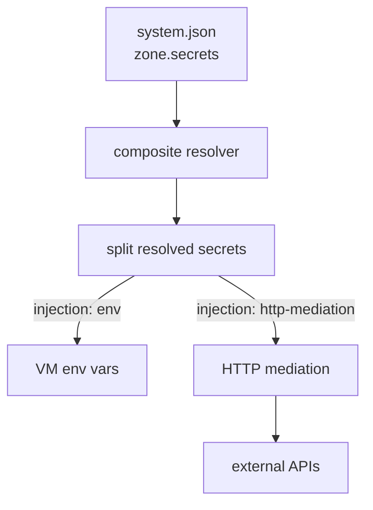
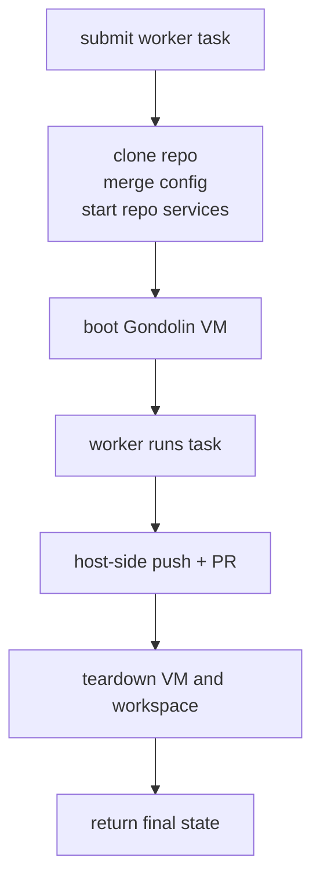
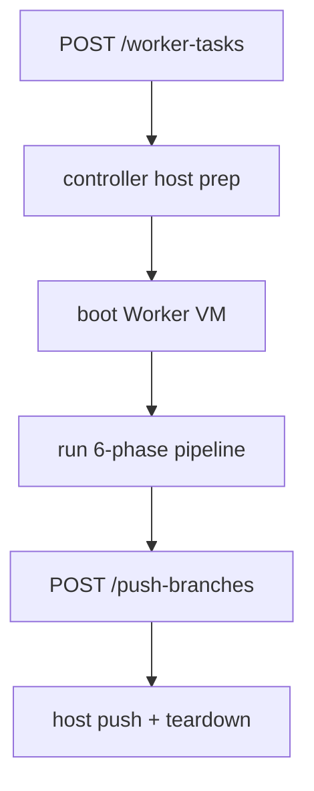
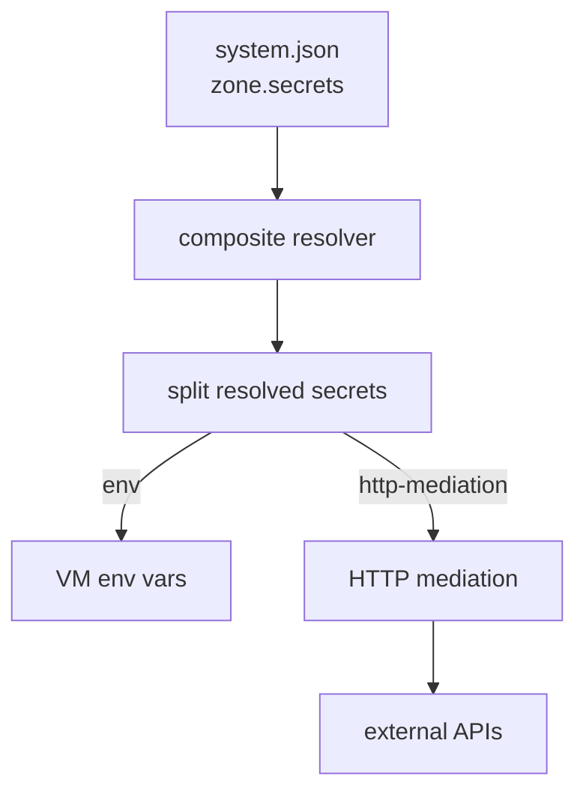

# System Architecture

[Overview](../README.md) > Architecture

System architecture covering all packages, both gateway types, the controller,
and the Gondolin VM layer. For mode-specific details:
[Agent Worker Gateway](agent-worker-gateway.md) |
[OpenClaw Gateway](openclaw-gateway.md) |
[Storage Model](storage-model.md).

---

## How Components Interact

The system is nested containers. A caller sends tasks to the agent runtime. The
controller inside that runtime manages VMs and secrets. The agent runs inside a
Gondolin VM. Docker services run alongside when repo resources require them.

The inner VM is the sandbox boundary. In Agent Worker Gateway we usually call it the
Worker VM or Agent VM because it runs `agent-vm-worker`.

Workspace git repositories live on the controller side first. The controller
clones them, then mounts the checkout into the VM at `/workspace` with
Gondolin realfs. The agent edits that mounted checkout. It requests host-side
push/PR work through the controller instead of pushing directly.

```
  Caller (CLI / CI / API)
       |
       v  Submit task
  +----------------------------------------------------+
  | Agent Runtime (host process)                        |
  |                                                     |
  |  +----------------------+  +---------------------+ |
  |  | Controller :18800    |  | Environment         | |
  |  | - secret resolver    |  | (Docker Compose)    | |
  |  | - git push (host)    |  | PG, Redis, etc.     | |
  |  | - VM lifecycle       |  |                     | |
  |  | - lease manager      |  |                     | |
  |  +----------------------+  +---------------------+ |
  |          |                         |                |
  |          v (boot VM)               | (tcpHosts)     |
  |  +------------------------------------------+       |
  |  | Gondolin VM                              |       |
  |  |                                          |       |
  |  |  +------------------------------------+  |       |
  |  |  | Agent (worker :18789 or openclaw)  |  |       |
  |  |  +------------------------------------+  |       |
  |  |                                          |       |
  |  |  /workspace (VFS mount from host)        |       |
  |  |  /state (VFS mount from host)            |       |
  |  +------------------------------------------+       |
  +----------------------------------------------------+
```

### Controller ↔ Gondolin

The controller calls `gondolin-adapter` to create VMs. It passes a `GatewayVmSpec` (VFS mounts, secrets, tcpHosts, allowedHosts, rootfsMode) and gets back a `ManagedVm` handle with `exec()`, `enableSsh()`, `enableIngress()`, `close()`.

→ Deep dive: [subsystems/gondolin-vm-layer.md](../subsystems/gondolin-vm-layer.md)
→ Upstream Gondolin sandbox example:
[Quick Example](https://github.com/earendil-works/gondolin/blob/main/README.md#quick-example)

### Controller ↔ Worker (Agent Worker Gateway)

The controller POSTs a task to the worker's HTTP API inside the VM, then polls until complete. The worker calls back to the controller's `push-branches` endpoint via MCP tool to trigger host-side git push. After that succeeds, the worker can run `gh pr create`; GitHub HTTP traffic is mediated by the controller proxy.

→ Full gateway: [agent-worker-gateway.md](agent-worker-gateway.md)
→ Controller-side lifecycle: [subsystems/worker-task-pipeline.md](../subsystems/worker-task-pipeline.md)

### Controller ↔ OpenClaw (OpenClaw Gateway)

The gateway VM runs long-term. When the agent needs tool execution, it requests a lease from the controller's HTTP API. The controller boots a tool VM and returns SSH access details.

→ Full gateway: [openclaw-gateway.md](openclaw-gateway.md)
→ Lease manager: [subsystems/controller.md](../subsystems/controller.md#lease-manager)

### Secrets Flow

Secrets are resolved on the host and split into two channels:



→ Deep dive: [subsystems/secrets-and-credentials.md](../subsystems/secrets-and-credentials.md)
→ Upstream mediation reference:
[Quick Example](https://github.com/earendil-works/gondolin/blob/main/README.md#quick-example)

### Docker Services ↔ VM

The controller resolves task-level repo resources, starts only the selected
repo-local Compose providers, extracts container IPs, and passes them to
Gondolin as TCP host mappings. The VM sees services via synthetic DNS.
Selected Compose services must not publish host ports; Docker-network IPs are
the resource boundary so parallel repos and parallel tasks do not collide.

```
  docker compose -p agent-vm-<taskId>-<repoId> up
       |
       v
  selected container starts (IP: 172.17.0.2)
       |
       v
  Controller passes tcpHosts to Gondolin:
    "postgres.local:5432" → "172.17.0.2:5432"
       |
       v
  Inside VM: Gondolin synthetic DNS
    postgres.local resolves → virtual IP → TCP forwarded to 172.17.0.2:5432
       |
       v
  Agent connects to postgres.local:5432 (standard connection string)
```

Note: `<taskId>` is currently the worker-task id used as a temporary
per-run namespace. Resource task segregation is not fully modeled yet;
future resource lifecycles should introduce an explicit resource
namespace/id rather than treating the worker task id as the final
resource boundary.

→ Deep dive: [subsystems/worker-task-pipeline.md](../subsystems/worker-task-pipeline.md#repo-resource-routing)

### Gateway Lifecycle Contract

Both modes implement the same `GatewayLifecycle` interface. The controller calls `buildVmSpec()` + `buildProcessSpec()` and gets pure data specs back — it never knows the specifics of Worker or OpenClaw.

→ Deep dive: [subsystems/gateway-lifecycle.md](../subsystems/gateway-lifecycle.md)

### Worker Task Lifecycle



---

## Package Dependency Graph

Seven packages compose the system. Dependencies flow downward.

```
                @earendil-works/gondolin
                (external SDK — QEMU micro-VMs,
                 VFS, HTTP mediation, image builds)
                          |
                          v
                gondolin-adapter
                (VM adapter, secret resolver,
                 image build pipeline, VFS helpers)
                          |
          +---------------+---------------+
          |                               |
          v                               v
  gateway-interface             openclaw-agent-vm-plugin
  (GatewayLifecycle contract,   (OpenClaw sandbox backend,
   VmSpec, ProcessSpec,          lease client, SSH/file bridge)
   splitResolvedSecrets)
          |
     +----+----+
     |         |
     v         v
  openclaw-  worker-
  gateway    gateway
  (OpenClaw  (Worker
   lifecycle) lifecycle)
     |         |
     +----+----+
          |
          v
      agent-vm
      (CLI + Controller runtime,
       HTTP API :18800, lease manager,
       gateway orchestrator,
       worker task runner,
       git push from host)
          |
          | (imports workerConfigSchema)
          v
    agent-vm-worker
    (Runs INSIDE the VM.
     6-phase pipeline, coordinator,
     executors, event sourcing,
     MCP tools, HTTP API :18789)
```

| Package | Responsibility |
|---------|----------------|
| **gondolin-adapter** | Wraps the Gondolin SDK. Creates VMs, resolves secrets (1Password/env), builds images with fingerprint caching, assembles VFS mounts and HTTP mediation hooks. |
| **gateway-interface** | The contract. `GatewayLifecycle` interface, `GatewayVmSpec`, `GatewayProcessSpec`. Both gateway types implement this. `splitResolvedGatewaySecrets()` routes secrets to env or HTTP mediation. |
| **openclaw-gateway** | OpenClaw lifecycle: 4 VFS mounts, TCP pool for tool VM SSH, auth profiles, `prepareHostState` writes effective config to disk. |
| **worker-gateway** | Worker lifecycle: 2 VFS mounts (`/workspace` + `/state`), TCP to controller only, no auth, no `prepareHostState`. |
| **agent-vm** | The controller. CLI (cmd-ts), HTTP API (Hono), lease manager + TCP pool + idle reaper, gateway zone orchestrator, worker task runner, host-side git push. |
| **agent-vm-worker** | Runs inside the VM. 6-phase coordinator, Codex/Claude executors with thread persistence, JSONL event sourcing, and controller tools such as `git-push` and `git-pull-default`. |
| **openclaw-agent-vm-plugin** | Bridge to OpenClaw's sandbox system. Registers Gondolin VMs as an OpenClaw sandbox backend. File bridge + shell execution via SSH into tool VMs. |

---

## Controller Architecture

The controller is the host-side process that owns VM lifecycles, serves the HTTP API, and never executes untrusted code. It runs on the host machine and communicates with gateway VMs over HTTP.

### Startup Sequence

`startControllerRuntime()` in `controller-runtime.ts` executes these steps in order:

```
  1. Resolve secrets         createSecretResolver() -> composite resolver
  2. Create TCP pool         createTcpPool(config.tcpPool)
  3. Create lease manager    createLeaseManager({ tcpPool, createManagedVm })
  4. Start idle reaper       createIdleReaper({ ttlMs: 30min }) on 60s interval
  5. Find active zone        findConfiguredZone(systemConfig, zoneId)
  6. Start gateway zone      startGatewayZone() -- skipped for worker type
  7. Wire HTTP routes        createControllerService() -> Hono app
  8. Bind HTTP server        startControllerHttpServer({ port: config.host.controllerPort })
```

For worker-type zones, the gateway is not started at boot. Instead, a per-task VM is created on demand when a worker task is submitted (see Agent Worker Gateway below).

### HTTP API (Hono on :18800)

The controller exposes a REST API. Routes are split across two modules: core lease routes in `controller-http-routes.ts` and zone operation routes in `controller-zone-operation-routes.ts`.

| Method | Path | Purpose | Mode |
|--------|------|---------|------|
| `GET` | `/health` | Controller liveness check | Both |
| `POST` | `/lease` | Acquire a tool VM lease (scope key, zone, profile) | OpenClaw |
| `GET` | `/lease/:leaseId` | Inspect a single lease (SSH access, slot) | OpenClaw |
| `GET` | `/leases` | List all active leases | OpenClaw |
| `DELETE` | `/lease/:leaseId` | Release a tool VM lease | OpenClaw |
| `GET` | `/controller-status` | Controller operational status | OpenClaw |
| `GET` | `/zones/:zoneId/logs` | Fetch gateway VM logs | OpenClaw |
| `POST` | `/zones/:zoneId/credentials/refresh` | Re-resolve zone secrets and update auth | OpenClaw |
| `POST` | `/zones/:zoneId/destroy` | Stop and destroy a gateway zone | OpenClaw |
| `POST` | `/zones/:zoneId/upgrade` | Restart gateway zone with fresh image | OpenClaw |
| `POST` | `/zones/:zoneId/enable-ssh` | Enable SSH access to the gateway VM | OpenClaw |
| `POST` | `/zones/:zoneId/execute-command` | Execute a shell command in the gateway VM | OpenClaw |
| `POST` | `/zones/:zoneId/worker-tasks` | Submit a worker task (`requestTaskId`, prompt, repos, context) | Worker |
| `GET` | `/zones/:zoneId/tasks/:taskId` | Read worker task state snapshot | Worker |
| `POST` | `/zones/:zoneId/tasks/:taskId/push-branches` | Push task branches to remote | Worker |
| `POST` | `/stop-controller` | Graceful shutdown: release leases, stop gateway, close server | Both |

### Key Subsystems

**TCP Pool** (`tcp-pool.ts`): Manages a fixed pool of TCP port slots. Each tool VM gets a unique slot mapped to `127.0.0.1:{basePort + slot}`. The gateway VM sees these as `tool-{slot}.vm.host:22` via Gondolin's synthetic DNS. Pool size is configured in `systemConfig.tcpPool.size`.

**Lease Manager** (`lease-manager.ts`): Creates, tracks, and releases tool VM leases. Each lease holds a reference to a `ManagedVm`, a TCP slot, SSH access details, and timestamps. Leases are scoped by `scopeKey` to enable reuse within the same agent conversation.

**Idle Reaper** (`idle-reaper.ts`): Runs on a 60-second interval. Any lease with `lastUsedAt` older than the TTL (default 30 minutes) is automatically released. This prevents orphaned tool VMs from consuming resources.

**Active Task Registry** (`active-task-registry.ts`): Tracks in-flight worker tasks by zone and task ID. Used by the push-branches endpoint to verify a task is still active before allowing branch pushes.

---

## Gateway Abstraction

The `GatewayLifecycle` interface (`gateway-interface` package) is the contract every gateway type must implement. The controller never knows the specifics of OpenClaw or worker -- it calls the lifecycle methods and gets back pure data specs.

### Interface

```
  GatewayLifecycle
  |
  |-- authConfig?                     Static auth configuration (optional)
  |     listProvidersCommand: string   Shell command to list auth providers
  |     buildLoginCommand(provider,    Shell command for interactive login
  |       options?)
  |
  |-- buildVmSpec(options)            Pure data -> GatewayVmSpec
  |     environment                    Env vars for the VM
  |     vfsMounts                      Host-to-guest folder mappings
  |     mediatedSecrets                Secrets injected via HTTP mediation
  |     tcpHosts                       Synthetic DNS -> TCP host mappings
  |     allowedHosts                   Outbound HTTP allowlist
  |     rootfsMode                     cow | memory | readonly
  |     sessionLabel                   {namespace}:{zone}:gateway
  |
  |-- buildProcessSpec(zone, secrets) Pure data -> GatewayProcessSpec
  |     bootstrapCommand               Setup shell env, install packages
  |     startCommand                   Launch the gateway process
  |     healthCheck                    HTTP or command-based readiness probe
  |     guestListenPort                Port the process listens on inside VM
  |     logPath                        Guest-side log file path
  |
  |-- prepareHostState?(zone, resolver)  Optional side-effect hook
        Write auth profiles, merge configs on the host before VM boots
```

### Lifecycle Loader

`gateway-lifecycle-loader.ts` dispatches by the zone's `gateway.type` field. Both implementations are statically imported -- no dynamic loading.

### How the Implementations Differ

| Concern | OpenClaw (`openclaw-lifecycle.ts`) | Worker (`worker-lifecycle.ts`) |
|---------|------|--------|
| **authConfig** | Present: `openclaw models auth login` | Absent: no interactive auth |
| **VFS mounts** | 4 mounts: config, cache, state, workspace | 2 mounts: state, workspace |
| **Environment** | `OPENCLAW_*` vars, `HOME=/home/openclaw` | `CONTROLLER_BASE_URL`, `WORKER_CONFIG_PATH`, `HOME=/home/coder` |
| **TCP hosts** | Controller + all tool VM slots + websocket bypass | Controller only |
| **Bootstrap** | Write shell env profile, configure bashrc | Conditionally install worker tarball from `/state/` |
| **Start command** | `openclaw gateway --port 18789` | `agent-vm-worker serve --port 18789 --config ...` |
| **Health check** | HTTP GET `:18789/` | HTTP GET `:18789/health` |
| **prepareHostState** | Writes effective-openclaw.json (config + gateway token), writes auth-profiles.json from 1Password | None |
| **Rootfs mode** | `cow` (copy-on-write) | `cow` (copy-on-write) |

Both implementations call `splitResolvedGatewaySecrets()` to partition resolved secrets into environment variables (injection: `env`) and HTTP-mediated secrets (injection: `http-mediation` with required `hosts[]`). See the Secrets Flow section below for the full picture.

---

## Gondolin VM Layer

Gondolin (`@earendil-works/gondolin`) provides QEMU micro-VMs with sub-second boot times and strong host isolation. The `gondolin-adapter` package wraps the SDK and exposes a simplified interface.

### What Gondolin Provides

| Capability | Description |
|-----------|-------------|
| **QEMU micro-VMs** | Lightweight VMs with configurable memory and CPU |
| **VFS mounts** | `RealFSProvider` (read/write), `ReadonlyProvider`, `MemoryProvider`, `ShadowProvider` (deny/tmpfs overlays) |
| **Rootfs modes** | `readonly` (immutable), `memory` (RAM-backed, ephemeral), `cow` (copy-on-write, persists within session) |
| **HTTP mediation** | `createHttpHooks` intercepts outbound HTTP, injects secrets into request headers by host match |
| **Synthetic DNS** | Maps virtual hostnames (e.g., `controller.vm.host:18800`) to real TCP endpoints |
| **Ingress** | Routes external HTTP traffic into the VM at a specified guest port |
| **SSH** | On-demand SSH access into the VM for debugging |
| **Image build** | `buildAssets()` converts a build config into a VM image: `rootfs.ext4`, `initramfs.cpio.lz4`, `vmlinuz-virt` |

### gondolin-adapter Wrapper

The `gondolin-adapter` package wraps the raw SDK into higher-level operations:

- **`createManagedVm(options)`** -- assembles VFS mounts, creates HTTP hooks, boots the VM, returns a `ManagedVm` handle (`exec`, `enableSsh`, `enableIngress`, `close`).
- **`buildImage(options)`** -- fingerprint-cached image builds (SHA-256 of build config + runtime build version tag + fingerprint input).
- **`SecretResolver` / `resolveServiceAccountToken`** -- resolve `SecretRef` values from 1Password or environment variables.

### VFS Mount Types

```
  Mount Kind        Provider           Behavior
  -----------       --------           --------
  realfs            RealFSProvider     Host directory shared read/write with VM
  realfs-readonly   ReadonlyProvider   Host directory shared read-only
  memory            MemoryProvider     RAM-backed, ephemeral (lost on VM close)
  shadow            ShadowProvider     Overlay: deny writes to specific paths,
                                       or redirect writes to tmpfs
```

---

## Gateway Zone Orchestrator

`gateway-zone-orchestrator.ts` is the boot sequence for any gateway VM, regardless of type. It coordinates the lifecycle, image builder, and Gondolin adapter.

```
  startGatewayZone(options)
    |
    |-- 1. Clean orphaned gateway    cleanupOrphanedGatewayIfPresent()
    |-- 2. Load lifecycle            loadGatewayLifecycle(type) -> GatewayLifecycle
    |-- 3. Resolve zone secrets      resolveZoneSecrets() -> Record<string, string>
    |-- 4. Build gateway image       buildGatewayImage() -> { imagePath, fingerprint }
    |-- 5. Create host directories   mkdir stateDir, workspaceDir
    |-- 6. Prepare host state        lifecycle.prepareHostState() [optional]
    |-- 7. Build VM spec             lifecycle.buildVmSpec() -> GatewayVmSpec
    |-- 8. Build process spec        lifecycle.buildProcessSpec() -> GatewayProcessSpec
    |-- 9. Create managed VM         createManagedVm(vmSpec) -> ManagedVm
    |-- 10. Bootstrap                vm.exec(processSpec.bootstrapCommand)
    |-- 11. Start process            vm.exec(processSpec.startCommand)
    |-- 12. Wait for readiness       poll healthCheck (HTTP 2xx or exit 0, max 30 attempts)
    |-- 13. Set ingress routes       vm.setIngressRoutes([{ port, prefix: '/' }])
    |-- 14. Enable ingress           vm.enableIngress({ listenPort: zone.gateway.port })
    |-- 15. Write runtime record     writeGatewayRuntimeRecord() for crash recovery
    |
    v
  Returns { vm, ingress, processSpec, image, zone }
```

---

## OpenClaw Gateway

OpenClaw Gateway runs a long-lived gateway VM that hosts an interactive chat agent. The gateway VM persists across requests and conversations.

```
  Controller (:18800)
       |
       |-- Gateway VM (openclaw, long-running)
       |      |-- OpenClaw process (:18789)
       |      |-- /home/openclaw/.openclaw/config/  (host: config dir, realfs)
       |      |-- /home/openclaw/.openclaw/state/   (host: stateDir, realfs)
       |      |-- /home/openclaw/workspace/         (host: workspaceDir, realfs)
       |      |
       |      |-- Talks to Controller via controller.vm.host:18800
       |      |-- Requests tool VM leases for code execution
       |
       |-- Tool VM 0 (on-demand via lease, tool-0.vm.host:22)
       |-- Tool VM 1 (on-demand via lease, tool-1.vm.host:22)
       |-- ...up to tcpPool.size
```

The gateway VM boots at controller startup and stays running. Tool VMs are created on demand via the lease API -- each gets a TCP slot, SSH access, and a workspace mount. Auth profiles and the effective OpenClaw config are written to the host-side state directory before the VM boots via `prepareHostState()`. The gateway reaches tool VMs via synthetic DNS (`tool-{n}.vm.host:22`) and the controller via `controller.vm.host:18800`. Websocket bypass hosts get direct TCP passthrough (for Discord, etc.).

---

## Agent Worker Gateway

Agent Worker Gateway runs a per-task ephemeral VM. There is no long-running gateway -- each task gets a fresh VM that is destroyed on completion.

### Task Lifecycle



### Controller-Side Lifecycle

The full per-task lifecycle is managed by `worker-task-runner.ts`:

```
  POST /zones/:zoneId/worker-tasks
    { requestTaskId, prompt, repos: [{ repoUrl, baseBranch }], context }
       |
       v
  1. PRE-START (preStartGateway)
     |-- Generate task ID (UUID)
     |-- Create taskRoot/{workspace, state} directories
     |-- Copy local worker tarball if AGENT_VM_WORKER_TARBALL_PATH set
     |-- Clone repos into taskRoot/workspace/
     |-- Read .agent-vm/config.json from primary repo
     |-- Deep-merge: zone gateway config + project config -> effective config
     |-- Validate against workerConfigSchema
     |-- Write effective-worker.json to taskRoot/state/
     |-- Resolve typed repo resources from .agent-vm/repo-resources.ts
     |-- Start only selected repo-local Compose providers
     |
  2. BOOT VM (startGatewayZone with zoneOverride)
     |-- Use worker lifecycle (buildVmSpec, buildProcessSpec)
     |-- Mount taskRoot/workspace -> /workspace
     |-- Mount taskRoot/state -> /state
     |-- Apply resource TCP, env, and read-only VFS overlays
     |-- Bootstrap: install agent-vm-worker from tarball
     |-- Start: agent-vm-worker serve --port 18789
     |-- Wait for health check: GET :18789/health
     |
  3. SUBMIT TASK
     |-- POST http://vm:18789/tasks
     |   { taskId, prompt, repos, context }
     |
  4. POLL
     |-- GET http://vm:18789/tasks/:taskId
     |-- Repeat every 1s until status is completed | failed | closed
     |-- 3 consecutive poll failures = abort
     |-- 30-minute timeout (configurable)
     |
  5. TEARDOWN (always runs, even on failure)
     |-- vm.close() -- RAM filesystem wiped
     |-- Stop selected repo resource Compose providers
     |-- rm taskRoot/workspace/
     |-- Deregister task from active task registry
```

For the worker pipeline internals (what happens inside the VM after step 3), see [agent-worker-gateway.md](agent-worker-gateway.md). That document covers the 6-phase pipeline: plan, plan-review, work, verification, work-review, and wrapup.

---

## Secrets Flow

Secrets are resolved on the host and delivered to VMs through two channels. Host-only secrets (e.g., `githubToken` for push-branches) never enter any VM.

```
  system.json
    |
    |  host.secretsProvider.tokenSource
    |    -> resolve 1Password service account token (op-cli | env | keychain)
    v
  Composite Secret Resolver
    |  Dispatches by SecretRef.source:
    |    '1password' -> onePasswordResolver.resolve(ref)
    |    'environment' -> process.env[ref.ref]
    |
    +---> resolveZoneSecrets(zone, resolver)
    |       |  For each zone.secrets[name]: resolve to plain text
    |       v
    |     splitResolvedGatewaySecrets(zone, resolvedSecrets)
    |       |
    |       +---> injection: 'env'            -> VM environment variable
    |       +---> injection: 'http-mediation' -> Gondolin HTTP hooks inject
    |                                            secret for matching hosts[]
    |
    +---> resolveControllerGithubToken()
            HOST-ONLY: never enters any VM
            Used by push-branches to push task branches from the host
```



### Secret Injection Modes

| Mode | Config | How It Works | Use Case |
|------|--------|-------------|----------|
| `env` | `injection: 'env'` | Secret set as environment variable in VM | API keys the process reads from env |
| `http-mediation` | `injection: 'http-mediation', hosts: [...]` | Gondolin intercepts outbound HTTP to listed hosts and injects secret into request headers | API keys for specific services (OpenAI, Anthropic) -- the VM process never sees the raw secret |
| Host-only | `host.githubToken` | Resolved on controller, never passed to VM | Git push operations from the controller |

---

## VM Image Build

VM images are built from Docker OCI base images via Gondolin's build pipeline. Images are cached by a content-addressed fingerprint.

### Build Pipeline

```
  build-config.json (referenced from system.json)
    |
    v
  buildGatewayImage() / buildGondolinImage()
    |-- 1. Load build config JSON
    |-- 2. Fingerprint: SHA-256(buildConfig + runtimeBuildVersionTag + fingerprintInput), truncated to 16 hex
    |-- 3. Cache hit?  cacheDir/{fingerprint}/ has all 4 assets -> return cached
    |-- 4. Cache miss: gondolin.buildAssets() -> Docker pull, extract, build rootfs
    |-- 5. Output: { imagePath, fingerprint, built: true|false }
    v
  cacheDir/{fingerprint}/
    manifest.json, rootfs.ext4, initramfs.cpio.lz4, vmlinuz-virt
```

The identifier file is shared by all image profiles because it represents
the system build environment, not an individual gateway or tool VM.

### Two Image Types

| Image | Config Path | Used By | Rootfs Mode |
|-------|-------------|---------|-------------|
| Gateway | `imageProfiles.gateways.<name>.buildConfig` | Gateway VMs (OpenClaw or Worker) | `cow` |
| Tool | `imageProfiles.toolVms.<name>.buildConfig` | Tool VMs (on-demand code execution) | `memory` |

Gateway images use copy-on-write rootfs so the gateway process can install packages and modify the filesystem within the session. Tool images use memory-backed rootfs for full ephemeral isolation -- everything is lost when the VM closes.

---

## Configuration Overview

The system is configured by `system.json` plus gateway-specific config files.
All relative paths in `system.json` are resolved relative to the config file's
directory.

```
  system.json
  |-- host              Controller port, project namespace, secrets provider, GitHub token
  |-- cacheDir          Rebuildable cache directory; not included in zone backups
  |-- images            Build config paths for gateway and tool VM images
  |-- zones[]           Zone definitions: gateway type, resources, secrets, allowed hosts
  |-- toolProfiles      Named VM resource profiles (memory, cpus, workspace root)
  |-- tcpPool           Port range and pool size for tool VM TCP slots
```

Each zone declares its `gateway.type` (`openclaw` or `worker`), resource
limits, secret references, and an outbound host allowlist. OpenClaw zones also
declare a `toolProfile`; Worker-only zones omit tool profiles by default. The
schema validates image profile references and requires `host.secretsProvider`
when any secret uses the `1password` source.

For the field-by-field reference, see
[configuration/README.md](../reference/configuration/README.md).

For state/cache/workspace/backup boundaries, see
[storage-model.md](storage-model.md). Do not move rebuildable dependency trees
into `stateDir` just to make them survive VM reboot; mount a cache path instead.

For upstream Gondolin image-build capabilities and sandbox features, see
[Feature Highlights](https://github.com/earendil-works/gondolin/blob/main/README.md#feature-highlights).

---

## Trust Zones

The system operates across three trust boundaries:

```
  +====================================================================+
  |  ZONE 1: HOST  (fully trusted)                                      |
  |                                                                     |
  |  Controller process, secret resolver, GitHub token, Docker daemon   |
  |  Can: resolve secrets, push branches, manage VMs                    |
  |  Never: runs untrusted code                                         |
  |                                                                     |
  |  +---------------------------------------------------------------+  |
  |  |  ZONE 2: GATEWAY VM  (partially trusted)                      |  |
  |  |                                                                |  |
  |  |  Long-running (OpenClaw) or per-task (Worker) process          |  |
  |  |  Has: env-injected secrets, HTTP-mediated secrets               |  |
  |  |  Can: make outbound HTTP (allowlisted), reach controller       |  |
  |  |  Cannot: access host filesystem outside VFS mounts             |  |
  |  |                                                                |  |
  |  |  +----------------------------------------------------------+  |  |
  |  |  |  ZONE 3: TOOL VM  (untrusted)                            |  |  |
  |  |  |                                                           |  |  |
  |  |  |  Ephemeral, per-lease. Runs LLM-generated code.           |  |  |
  |  |  |  Has: workspace mount (realfs), no secrets, no network    |  |  |
  |  |  |  Can: read/write /workspace, run arbitrary commands       |  |  |
  |  |  |  Cannot: reach the internet, access secrets, persist      |  |  |
  |  |  +----------------------------------------------------------+  |  |
  |  +---------------------------------------------------------------+  |
  +=====================================================================+
```

---

## Go Deeper

| Document | Scope |
|----------|-------|
| [agent-worker-gateway.md](agent-worker-gateway.md) | Agent Worker Gateway: 6-phase state machine, event sourcing, executors, MCP tools |
| [openclaw-gateway.md](openclaw-gateway.md) | OpenClaw Gateway: interactive gateway, tool VM leases, sandbox plugin |
| [reference/configuration/README.md](../reference/configuration/README.md) | Progressive configuration reference |
| [getting-started/setup.md](../getting-started/setup.md) | Prerequisites, installation, first-run instructions |
| [subsystems/controller.md](../subsystems/controller.md) | Controller internals: lease lifecycle, TCP pool, idle reaper |
| [subsystems/secrets-and-credentials.md](../subsystems/secrets-and-credentials.md) | Secret resolution, 1Password integration, HTTP mediation details |
| [subsystems/gondolin-vm-layer.md](../subsystems/gondolin-vm-layer.md) | Gondolin VM adapter, VFS mounts, rootfs modes, HTTP mediation, image build pipeline |
| [subsystems/gateway-lifecycle.md](../subsystems/gateway-lifecycle.md) | Gateway abstraction: GatewayLifecycle interface, OpenClaw Gateway vs Agent Worker Gateway |
| [subsystems/worker-task-pipeline.md](../subsystems/worker-task-pipeline.md) | Controller-side task lifecycle: pre-start, boot, poll, teardown |
