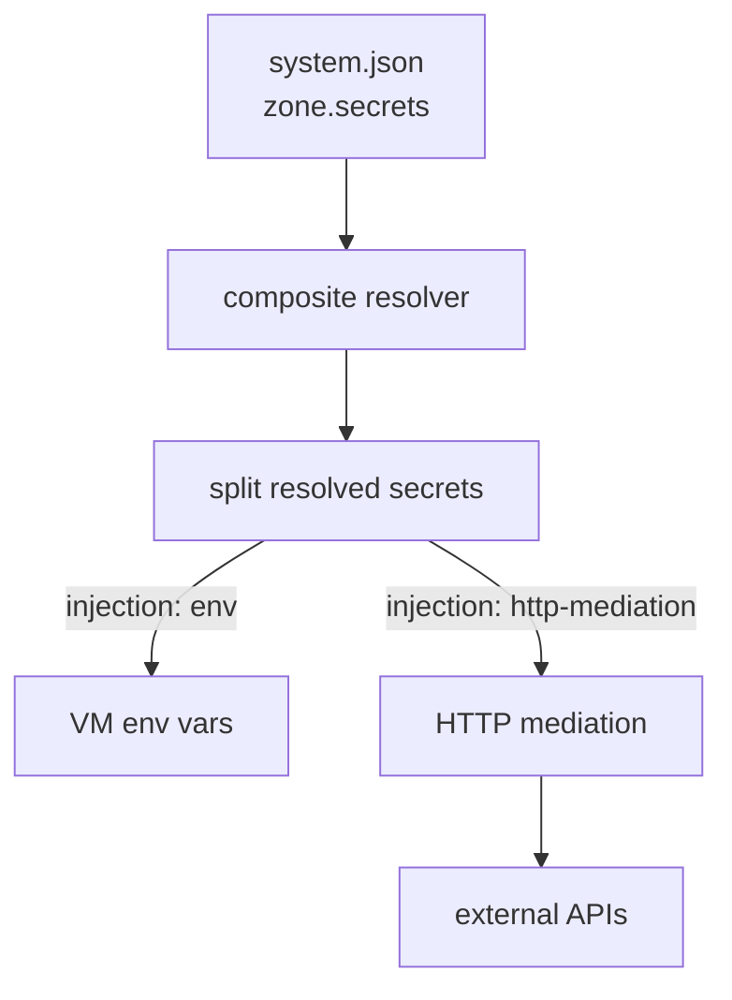
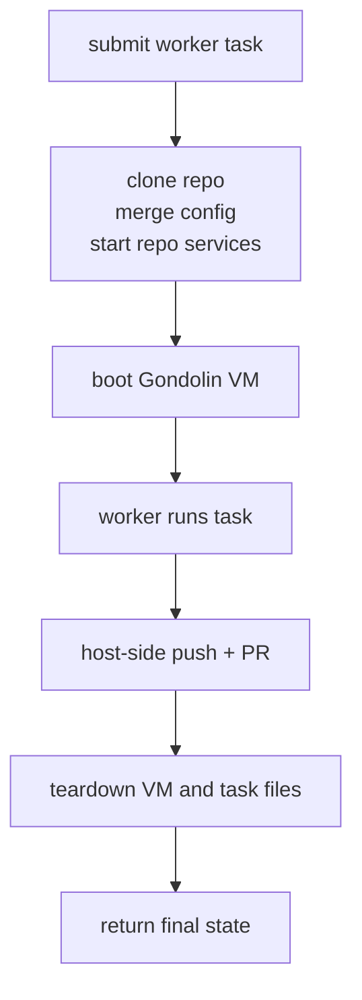
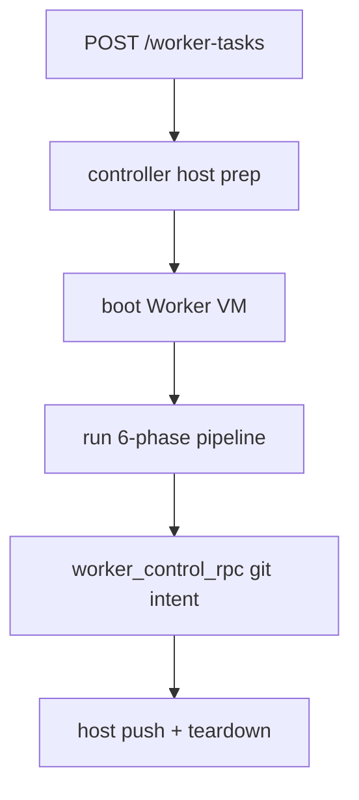
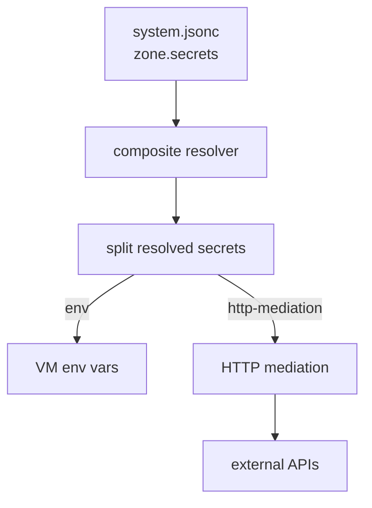

# System Architecture

[Overview](../README.md) > Architecture

System architecture covering all packages, both gateway types, the controller,
and the Gondolin VM layer. For mode-specific details:
[Agent Worker Gateway](agent-worker-gateway.md) |
[Hermes configuration](../reference/configuration/system-json.md) |
[Credentialed Managed Runtimes](credentialed-runtimes.md) |
[Storage Model](storage-model.md).

---

## How Components Interact

The system is nested containers. A caller sends tasks to the agent runtime. The
controller inside that runtime manages VMs and secrets. The agent runs inside a
Gondolin VM. Docker services run alongside when repo resources require them.

The inner VM is the sandbox boundary. In Agent Worker Gateway we usually call it the
Worker VM or Agent VM because it runs `agent-vm-worker`.

Target worker storage model: Git metadata lives in a controller-visible RealFS
gitdir, while the worker edits VM-local rootfs/COW repo files under `/work/repos/<repoId>`.
The worker requests host-side push/PR work through the controller instead of
pushing directly. Hermes profile files are durable zone files, not Worker zone
files.

```
  Caller (CLI / CI / API)
       |
       v  Submit task
  +----------------------------------------------------+
  | Agent Runtime (host process)                        |
  |                                                     |
  |  +----------------------+  +---------------------+ |
  |  | Controller :18800    |  | Environment         | |
  |  | - secret resolver    |  | (Docker Compose)    | |
  |  | - git push (host)    |  | PG, Redis, etc.     | |
  |  | - VM lifecycle       |  |                     | |
  |  | - lease manager      |  |                     | |
  |  +----------------------+  +---------------------+ |
  |          |                         |                |
  |          v (boot VM)               | (tcpHosts)     |
  |  +------------------------------------------+       |
  |  | Gondolin VM                              |       |
  |  |                                          |       |
  |  |  +------------------------------------+  |       |
  |  |  | Agent (Worker or managed Hermes)   |  |       |
  |  |  +------------------------------------+  |       |
  |  |                                          |       |
  |  |  /work/repos (worker rootfs/COW repo files)     |       |
  |  |  /gitdirs   (worker RealFS git metadata) |       |
  |  |  /state     (RealFS state)               |       |
  |  +------------------------------------------+       |
  +----------------------------------------------------+
```

### Controller ↔ Managed VM Provider

The `agent-vm` composition root selects `gondolin-vm-adapter` and projects its
provider into narrow `managed-vm` capabilities for VM creation, owned host
directories, images, and diagnostics. Gateway lifecycles supply neutral
`GatewayVmRequirements`; the controller authorizes paths, resolves resources,
and constructs a neutral VM request. Domain code receives a `ManagedVm` handle
with structural operations such as `exec()`, `enableSsh()`, `enableIngress()`,
and `close()`—never a native Gondolin instance or filesystem object. Zone config
uses audience-scoped `egressHosts`; lifecycle code derives the per-VM
`allowedHosts` list from that higher-level policy.

→ Deep dive: [subsystems/gondolin-vm-layer.md](../subsystems/gondolin-vm-layer.md)
→ Upstream Gondolin sandbox example:
[Quick Example](https://github.com/earendil-works/gondolin/blob/main/README.md#quick-example)

### Controller ↔ Worker (Agent Worker Gateway)

The controller POSTs a task to the worker's HTTP API inside the VM, then polls until complete. Worker controller tools send `worker_control_rpc` git intents over the private control session; the controller performs host-side git push or default-branch refresh from trusted state. After the push succeeds, the worker can run `gh pr create`; GitHub HTTP traffic is mediated by the controller proxy.

→ Full gateway: [agent-worker-gateway.md](agent-worker-gateway.md)
→ Controller-side lifecycle: [subsystems/worker-task-pipeline.md](../subsystems/worker-task-pipeline.md)

### Controller ↔ Hermes (managed Gateway)

The Gateway VM runs long-term. The Hermes adapter reaches Gateway Runtime over
its private managed boundary. When an agent needs tool execution, Gateway
Runtime asks the controller for a Tool VM capability over the private control
session. The controller boots a Tool VM and returns fenced access details; the
Gateway VM does not call the controller's public HTTP lease routes.

→ Configuration: [system-json.md](../reference/configuration/system-json.md)
→ Lease manager: [subsystems/controller.md](../subsystems/controller.md#lease-manager)

### Capability Portals

Agent-facing capability calls are separate from VM execution. Tool Portal is the
managed Hermes capability facade and exposes the native
`tool_portal_list/search/describe/call` surface. MCP Portal is the MCP-specific
provider backend for Tool Portal and also remains available through the separate
`mcp-portal mcp-proxy serve` adapter for external MCP clients.

Tool Portal is the cross-backend contract layer for capabilities that may come
from MCP providers, controller-owned host actions, or Tool VM runner-backed
execution. It uses portal-neutral Zod v4 contracts from
`@agent-vm/agent-portal-sdk` and composes MCP-backed capabilities through
`@agent-vm/mcp-portal/mcp-provider-backend`. Managed Hermes does not reuse the
standalone model-visible `mcp_portal_*` tool names.

Today, Tool Portal is the managed Hermes model-visible portal surface and the
package-level composition layer for backends. MCP Portal remains the MCP
provider/runtime backend instead of a second policy
authority.

→ Deep dive: [subsystems/mcp-portal.md](../subsystems/mcp-portal.md)

### Credentialed Managed Runtimes

A Tool Portal `controller_execution` configured CLI may target a reusable
credentialed Managed VM. The controller owns exactly one current runtime per
zone and authenticated agent; each call is authorized independently, while a
compatible healthy VM may retain CLI state across calls for up to 15 idle
minutes. File credentials are finalized into read-only memory before boot, HTTP
credentials remain host-side behind opaque placeholders, and CLI
config/state/cache stays on disposable COW rootfs.

This is separate from leased Tool VMs: credentialed calls execute direct array
argv through the controller, while `tool_vm_runner` and framework Sandbox APIs
continue to use direct strict-pinned SSH to the current Tool VM.

→ Deep dive: [credentialed-runtimes.md](credentialed-runtimes.md)

### Controller-Owned OAuth Broker

An optional `oauth.config.jsonc` beside a managed Hermes zone's Tool Portal config
enables human Google authorization without exposing refresh tokens to Hermes or a VM.
The controller owns direct tailnet HTTPS on port `18900`, resolves the browser socket
peer through tailscaled LocalAPI, and stores envelope-encrypted grants in controller
state. Gog receives only a short-lived access-token placeholder through the
authenticated agent's singleton credentialed Managed runtime. OAuth consent never
changes Tool Portal visibility or per-call approval policy.

→ Design: [Agent-guided OAuth broker](../specs/2026-08-29-agent-oauth-broker/program-design.md)

### Secrets Flow

Secrets are resolved on the host and split into two channels:


```mermaid
flowchart TB
    config["system.json
zone.secrets"]
    resolver["composite resolver"]
    split["split resolved secrets"]
    env["VM env vars"]
    mediation["HTTP mediation"]
    external["external APIs"]

    config --> resolver
    resolver --> split
    split -->|"injection: env"| env
    split -->|"injection: http-mediation"| mediation
    mediation --> external
```

→ Deep dive: [subsystems/secrets-and-credentials.md](../subsystems/secrets-and-credentials.md)
→ Upstream mediation reference:
[Quick Example](https://github.com/earendil-works/gondolin/blob/main/README.md#quick-example)

### Docker Services ↔ VM

The controller resolves task-level repo resources, starts only the selected
repo-local Compose providers, extracts container IPs, and passes them to
Gondolin as TCP host mappings. The VM sees services via synthetic DNS.
Selected Compose services must not publish host ports; Docker-network IPs are
the resource boundary so parallel repos and parallel tasks do not collide.

```
  docker compose -p agent-vm-<taskId>-<repoId> up
       |
       v
  selected container starts (IP: 172.17.0.2)
       |
       v
  Controller passes tcpHosts to Gondolin:
    "postgres.local:5432" → "172.17.0.2:5432"
       |
       v
  Inside VM: Gondolin synthetic DNS
    postgres.local resolves → virtual IP → TCP forwarded to 172.17.0.2:5432
       |
       v
  Agent connects to postgres.local:5432 (standard connection string)
```

Note: `<taskId>` is currently the worker-task id used as a temporary
per-run namespace. Resource task segregation is not fully modeled yet;
future resource lifecycles should introduce an explicit resource
namespace/id rather than treating the worker task id as the final
resource boundary.

→ Deep dive: [subsystems/worker-task-pipeline.md](../subsystems/worker-task-pipeline.md#repo-resource-routing)

### Gateway Lifecycle Contract

Both modes implement the same `GatewayLifecycle` interface. The controller gets
neutral VM requirements from both. Hermes supplies managed-framework boot
metadata and inputs; Worker supplies a direct process spec.

→ Deep dive: [subsystems/gateway-lifecycle.md](../subsystems/gateway-lifecycle.md)

### Worker Task Lifecycle


```mermaid
flowchart TB
    request["submit worker task"]
    prepare["clone repo
merge config
start repo services"]
    boot["boot Gondolin VM"]
    run["worker runs task"]
    push["host-side push + PR"]
    teardown["teardown VM and task files"]
    result["return final state"]

    request --> prepare
    prepare --> boot
    boot --> run
    run --> push
    push --> teardown
    teardown --> result
```

---

## Package Dependency Graph

Seventeen workspace packages compose the system. Dependencies flow downward.

```
  hermes-gateway ------+
                       +--> gateway-lifecycle --> managed-vm
  worker-gateway ------+                           ^
                                                   |
  agent-vm -----------------------------------------+
      |
      +--> gondolin-vm-adapter ---------------------+
                 |
                 v
         @earendil-works/gondolin

  agent-vm --> agent-vm-worker

  control-protocol-contracts
        |
        +--> gateway-control-contracts
        |          |
        |          v
        |        agent-vm
        |          |
        |          v
        |       agent-vm
        |
        +--> worker-control-contracts
                   |
                   v
              agent-vm-worker

  agent-portal-sdk ---> mcp-portal
            |              |
            |              v
            +---------> tool-portal
                            ^
                            |
             controller-execution-contracts

  gateway-runtime ---> agent-portal-sdk
          |-----------> gateway-control-contracts
          |-----------> mcp-portal
          +-----------> tool-portal

  config-contracts and secret-management provide shared contracts used by the
  controller, gateways, MCP Portal, Tool Portal, and plugins.

  The Hermes Python adapter reaches Gateway Runtime over its private managed
  attachment and uses controller-authorized Tool VMs.
```

| Package | Responsibility |
|---------|----------------|
| **secret-management** | Shared secret contracts and resolvers for environment and 1Password-backed references. |
| **config-contracts** | Zod-owned configuration contracts and generated schema sources for system, worker, MCP Portal, and Tool Portal config. |
| **control-protocol-contracts** | Shared Socket.IO control-session envelope, identity, fencing, delivery, sequencing, close reason, and ack/result Zod contracts. |
| **gateway-control-contracts** | Gateway-domain control RPC Zod contracts for gateway readiness, lease intent/observation, health, recovery, and controller-host-action requests. |
| **worker-control-contracts** | Worker-domain control RPC Zod contracts for worker readiness, task lifecycle observations, runtime status, and controller-backed git operations. |
| **managed-vm** | Backend-neutral structural contracts for VM creation/runtime, images, diagnostics, and owned host-directory capabilities. It exposes no native provider handle or filesystem escape hatch. |
| **gondolin-vm-adapter** | Implements `managed-vm` with the Gondolin SDK, including VM translation, owned host directories, image builds, VFS, ingress, SSH, and HTTP mediation. |
| **gateway-lifecycle** | The gateway contract: `GatewayLifecycle`, neutral `GatewayVmRequirements`, process specs, shared runtime policy, and secret-placement intent. |
| **hermes-gateway** | Hermes lifecycle and immutable managed image recipe: profile directories, exact managed-framework boot inputs, protected interactive SSH, Tool VM TCP hosts, and telemetry projection. |
| **worker-gateway** | Worker lifecycle: RealFS control mounts (`/state` + task `/gitdirs`), rootfs/COW `/work/repos`, private control-session ingress wiring, no auth, no `prepareHostState`. |
| **agent-portal-sdk** | Portal-neutral Zod v4 contracts for list/search/describe/call results, capability descriptions, approvals, artifacts, diagnostics, and adapter envelopes. |
| **mcp-portal** | MCP-specific capability facade, upstream MCP client runtime, scoped catalog/search, schema validation, approval evaluation, external MCP proxy, and MCP provider backend for Tool Portal composition. |
| **tool-portal** | Cross-backend capability portal contracts, CLI allowance validation, and in-process entrypoint that dispatches MCP-backed capabilities through the MCP Portal backend and controller-owned host actions. |
| **gateway-runtime** | Private managed-Gateway attachment, Gateway Control coordination, Tool Portal composition, and common sandbox/process/filesystem/stream execution over controller-authorized Tool VMs. |
| **controller-execution-contracts** | Zod contracts for controller dispatch, controller host-action, and Tool VM runner boundaries. |
| **agent-vm** | The controller and application composition root. Its regular Gondolin adapter dependency is confined to the provider-composition and build-tooling modules; controller domains consume narrow `managed-vm` projections. |
| **agent-vm-worker** | Runs inside the VM. 6-phase coordinator, Codex/Claude executors with thread persistence, JSONL event sourcing, and control-session-backed controller tools such as `git-push` and `git-pull-default`. |

---

## Controller Architecture

The controller is the host-side process that owns VM lifecycles, serves the HTTP API, and never executes untrusted code. It runs on the host machine and communicates with gateway VMs over HTTP.

### Startup Sequence

`startControllerRuntime()` in `controller-runtime.ts` executes these steps in order:

```
  1. Resolve secrets         createSecretResolver() -> composite resolver
  2. Create TCP pool         createTcpPool(config.tcpPool)
  3. Create lease manager    createLeaseManager({ tcpPool, createManagedVm })
	4. Create credential manager and recover recorded child runtimes
	5. Start idle reapers      Tool VM policy + fixed credential-runtime TTL
	6. Create zone registry    one runtime per selected configured zone
	7. Start selected zones    Hermes Gateways at boot; Worker zones on task submit
	8. Wire HTTP routes        createControllerService() -> Hono app
	9. Bind HTTP server        startControllerHttpServer({ port: config.host.controllerPort })
```

For worker-type zones, the gateway is not started at boot. Instead, a per-task
VM is created on demand when a worker task is submitted (see Agent Worker
Gateway below). Hermes and Worker routes dispatch through the requested
`zoneId`; wrong-type operations return typed HTTP errors instead of using one
process-wide active zone.

### HTTP API (Hono on :18800)

The controller exposes a REST API. Routes are split across core health routes,
private control-session owned lease handling, and zone operation routes in
`controller-zone-operation-routes.ts`.

| Method | Path | Purpose | Mode |
|--------|------|---------|------|
| `GET` | `/health` | Controller liveness check | Both |
| `GET` | `/controller-status` | Controller operational status | Managed Gateway |
| `GET` | `/zones/:zoneId/health` | Live gateway health probe | Hermes |
| `GET` | `/zones/:zoneId/logs` | Fetch gateway VM logs | Hermes |
| `POST` | `/zones/:zoneId/credentials/refresh` | Re-resolve zone secrets and restart | Hermes |
| `POST` | `/zones/:zoneId/destroy` | Stop and destroy a gateway zone | Hermes |
| `POST` | `/zones/:zoneId/upgrade` | Restart gateway zone with fresh image | Hermes |
| `POST` | `/zones/:zoneId/enable-ssh` | Enable SSH access to the gateway VM | Hermes |
| `POST` | `/zones/:zoneId/execute-command` | Execute a shell command in the gateway VM; requires zone admin token when adminAccess is configured | Hermes |
| `POST` | `/zones/:zoneId/worker-tasks` | Submit a worker task (`requestTaskId`, prompt, repos, context) | Worker |
| `GET` | `/zones/:zoneId/tasks/:taskId` | Read worker task state snapshot | Worker |
| `POST` | `/stop-controller` | Graceful shutdown: release leases, stop gateway, close server | Both |

### Key Subsystems

**TCP Pool** (`tcp-pool.ts`): Manages a fixed pool of TCP port slots. Each tool VM gets a unique slot mapped to `127.0.0.1:{basePort + slot}`. The gateway VM sees these as `tool-{slot}.vm.host:22` via Gondolin's synthetic DNS. Pool size is configured in `systemConfig.tcpPool.size`.

**Lease Manager** (`lease-manager.ts`): Creates, tracks, and releases Tool VM
leases. Each lease holds a `ManagedVm`, TCP slot, SSH access details, agent
identity, work-mount identity, and timestamps. Live leases are reused by
`zoneId` and `agentId` when the requested profile and validated work mount
match, so one Hermes agent can keep using the same Tool VM while the idle TTL
keeps capacity bounded.

**Idle Reaper** (`idle-reaper.ts`): Runs on a 60-second interval. Any lease
with `lastUsedAt` older than its resolved TTL is automatically released. The
policy uses the single `leaseIdleTtl.defaultMs` value, bounded request overrides,
and the default 100 minute fallback.

**Credentialed Runtime Manager** (`credentialed-runtime/`): Creates or reuses
one compatible Managed VM per zone and authenticated agent, enforces one active
command without queueing, projects credentials only during creation, retires
after 15 idle minutes, and performs exact crash recovery and operator
retirement.

**Active Task Registry** (`active-task-registry.ts`): Tracks in-flight worker tasks by zone and task ID. Used by controller-owned worker control operations to verify a task is still active before allowing branch pushes.

---

## Gateway Abstraction

The `GatewayLifecycle` interface (`gateway-lifecycle` package) is the contract
every Gateway type must implement. The controller consumes neutral lifecycle
data rather than framework-native VM handles.

### Interface

```
  GatewayLifecycle
  |
  |-- buildVmRequirements(options)   Pure data -> GatewayVmRequirements
  |     environment                    Env vars for the VM
  |     vfsMounts                      Host-to-guest folder mappings
  |     mediatedSecrets                Secrets injected via HTTP mediation
  |     tcpHosts                       Synthetic DNS -> TCP host mappings
  |     allowedHosts                   Derived outbound HTTP allowlist
  |     rootfsMode                     cow | memory | readonly
  |     sessionLabel                   {namespace}:{zone}:gateway
  |
  |-- executionModel = managed-gateway
  |     buildFrameworkServiceBootMetadata()
  |     buildFrameworkServiceBootInputs()
  |     interactiveSsh
  |
  |-- executionModel = direct-process
  |     buildProcessSpec()
  |
  |-- prepareHostState?(zone, resolver)
```

### Lifecycle Loader

`gateway-lifecycle-loader.ts` dispatches by the zone's `gateway.type` field. Both implementations are statically imported -- no dynamic loading.

### How the Implementations Differ

| Concern | Hermes (`hermes-lifecycle.ts`) | Worker (`worker-lifecycle.ts`) |
|---------|------|--------|
| **Execution model** | Managed Gateway with exact framework boot inputs | Direct process |
| **VFS mounts** | Protected Hermes home, cache, and profile zone files | State + task gitdirs; `/work/repos` is rootfs/COW |
| **Environment** | Controller-authored Hermes framework/profile environment | `WORKER_CONFIG_PATH`, `HOME=/home/coder` |
| **TCP hosts** | Tool VM SSH slots only | No controller raw TCP control mapping |
| **Bootstrap** | Exact-two-role Gateway Runtime + Hermes service boot | Conditionally install Worker tarball from `/state/` |
| **Start owner** | Managed-framework boot contract | `agent-vm-worker serve --port 18789 --config ...` |
| **prepareHostState** | Creates protected Hermes profile directories | None |
| **Rootfs mode** | `cow` (copy-on-write) | `cow` (copy-on-write) |

Both implementations call `splitResolvedGatewaySecrets()` to partition resolved secrets into environment variables (injection: `env`) and HTTP-mediated secrets (injection: `http-mediation` with required `hosts[]`). See the Secrets Flow section below for the full picture.

---

## Gondolin VM Layer

Gondolin (`@earendil-works/gondolin`) provides QEMU micro-VMs with sub-second boot times and strong host isolation. The `gondolin-vm-adapter` package implements the neutral `managed-vm` contracts with that SDK.

### What Gondolin Provides

| Capability | Description |
|-----------|-------------|
| **QEMU micro-VMs** | Lightweight VMs with configurable memory and CPU |
| **VFS mounts** | `RealFSProvider` (read/write), `ReadonlyProvider`, `MemoryProvider`, `ShadowProvider` (deny/tmpfs overlays) |
| **Rootfs modes** | `readonly` (immutable), `memory` (RAM-backed, ephemeral), `cow` (copy-on-write, persists within session) |
| **HTTP mediation** | `createHttpHooks` intercepts outbound HTTP, injects secrets into request headers by host match |
| **Synthetic DNS** | Maps selected virtual hostnames such as `tool-0.vm.host:22` to real TCP endpoints |
| **Ingress** | Routes external HTTP traffic into the VM at a specified guest port |
| **SSH** | On-demand SSH access into the VM for debugging |
| **Image build** | `buildAssets()` converts a build config into a VM image: `rootfs.ext4`, `initramfs.cpio.lz4`, `vmlinuz-virt` |

### gondolin-vm-adapter Provider

The `gondolin-vm-adapter` package keeps raw SDK operations behind the neutral provider:

- **VM provider** -- translates neutral creation requests into Gondolin VFS,
  mediation, networking, ingress, SSH, and runtime operations.
- **Owned directories** -- pins and revalidates security-sensitive host
  directories without exporting native filesystem handles.
- **Image tooling** -- performs fingerprint-cached Gondolin image builds and
  projects only the primitive build metadata needed by `agent-vm`.

`agent-vm` imports this package only from
`packages/agent-vm/src/composition/gondolin-managed-vm-provider.ts` and
`packages/agent-vm/src/build/gondolin-managed-vm-build-tooling.ts`. Gateway
orchestration, Tool VM orchestration, leases, health, runtime records, recovery,
and supervision use `managed-vm` contracts and cannot call a backend escape
hatch such as `getVmInstance()`.

### VFS Mount Types

```
  Mount Kind        Provider           Behavior
  -----------       --------           --------
  realfs            RealFSProvider     Host directory shared read/write with VM
  realfs-readonly   ReadonlyProvider   Host directory shared read-only
  memory            MemoryProvider     RAM-backed, ephemeral (lost on VM close)
  shadow            ShadowProvider     Overlay: deny writes to specific paths,
                                       or redirect writes to tmpfs
```

---

## Gateway Zone Orchestrator

`gateway-zone-orchestrator.ts` is the boot sequence for any gateway VM, regardless of type. It coordinates the lifecycle, neutral image capability, and injected `ManagedVmFactory`.

Before successor admission, controller startup performs record-based cleanup
from Gateway and Tool VM runtime records; controller restart never adopts an
existing VM. `startGatewayZone` then owns the new Gateway epoch and its exact
runner identity. See [Controller](../subsystems/controller.md), [Gateway
Lifecycle](../subsystems/gateway-lifecycle.md), and [Gondolin VM
Layer](../subsystems/gondolin-vm-layer.md) for the subsystem contracts.

```
  startGatewayZone(options)
    |
    |-- 1. Resolve startup inputs     lifecycle, config, secrets, image, host state
    |-- 2. Allocate Gateway epoch     controller-owned identity seed
    |-- 3. Construct VM handle        createManagedVm(vmSpec) -> unstarted ManagedVm
    |-- 4. Attach VM identity         gateway epoch seed + vm.id
    |-- 5. Start VM                   vm.start()
    |-- 6. Capture runner identity    exact host PID + process identity
    |-- 7. Persist runtime record     schema v2, before guest bootstrap or publication
    |-- 8. Start Gateway service      bootstrap, process start, service-health proof
    |-- 9. Publish ingress            configure routes, enable ingress, enrich runtime record
    |-- 10. Establish control link    connect control session and publish started result
    |
    v
  Returns controller-owned runtime handles, including terminateVm

  startup failure
    -> exact-terminate the captured runner through controller-managed termination
    -> close the stock Gondolin handle directly only when no runner exists
```

---

## Hermes managed Gateway

Hermes runs as the long-lived managed interactive-agent Gateway. Its Gateway VM
persists across requests and contains exactly the common Gateway Runtime service
and the Hermes framework service.

```
  Controller (:18800)
       |
       |-- Gateway VM (Hermes, long-running)
       |      |-- Gateway Runtime service
       |      |-- Hermes framework service
       |      |-- protected Hermes home and per-profile zone files
       |      |
       |      |-- Serves private control session via Gondolin ingress
       |      |-- Requests tool VM leases through gateway_control_rpc
       |
       |-- Tool VM 0 (on-demand via lease, tool-0.vm.host:22)
       |-- Tool VM 1 (on-demand via lease, tool-1.vm.host:22)
       |-- ...up to tcpPool.size
```

The Gateway VM boots at controller startup and stays running. Tool VMs are
created on demand through the private Gateway control session. Each receives a
TCP slot, fenced SSH access, the controller-selected workspace at `/work`, and
reviewed read-only `/agent-vm` inputs. Stable Hermes profile identity and
trusted controller configuration select those capabilities; callers do not
provide host mount paths. `prepareHostState()` creates protected profile
directories before boot. The Gateway reaches Tool VMs through synthetic DNS
(`tool-{n}.vm.host:22`).

---

## Agent Worker Gateway

Agent Worker Gateway runs a per-task ephemeral VM. There is no long-running gateway -- each task gets a fresh VM that is destroyed on completion.

### Task Lifecycle


```mermaid
flowchart TB
    api["POST /worker-tasks"]
    host["controller host prep"]
    vm["boot Worker VM"]
    worker["run 6-phase pipeline"]
    rpc["worker_control_rpc git intent"]
    finalize["host push + teardown"]

    api --> host
    host --> vm
    vm --> worker
    worker --> rpc
    rpc --> finalize
```

### Controller-Side Lifecycle

The full per-task lifecycle is managed by `worker-task-runner.ts`:

```
  POST /zones/:zoneId/worker-tasks
    { requestTaskId, prompt, repos: [{ repoUrl, baseBranch }], context }
       |
       v
  1. PRE-START (preStartGateway)
     |-- Generate task ID (UUID)
     |-- Create task state and non-backup task runtime directories
     |-- Copy local worker tarball if AGENT_VM_WORKER_TARBALL_PATH set
     |-- Create RealFS gitdirs under the task runtime root
     |-- Read .agent-vm/config.jsonc or .agent-vm/config.json from primary repo
     |-- Deep-merge: zone gateway config + project config -> effective config
     |-- Validate against workerConfigSchema
     |-- Write effective-worker.json to taskRoot/state/
     |-- Resolve typed repo resources from .agent-vm/repo-resources.ts
     |-- Start only selected repo-local Compose providers
     |
  2. BOOT VM (startGatewayZone with zoneOverride)
     |-- Use worker lifecycle (buildVmRequirements, buildProcessSpec)
     |-- Keep /work/repos as VM-local rootfs/COW
     |-- Mount task state -> /state
     |-- Mount task gitdirs -> /gitdirs
     |-- Apply resource TCP, env, and read-only VFS overlays
     |-- Bootstrap: install agent-vm-worker from tarball
     |-- Start: agent-vm-worker serve --port 18789
     |-- Wait for health check: GET :18789/health
     |
  3. SUBMIT TASK
     |-- POST http://vm:18789/tasks
     |   { taskId, prompt, repos, context }
     |
  4. POLL
     |-- GET http://vm:18789/tasks/:taskId
     |-- Repeat every 1s until status is completed | failed | closed
     |-- 3 consecutive poll failures = abort
     |-- 30-minute timeout (configurable)
     |
  5. TEARDOWN (always runs, even on failure)
     |-- vm.close() -- RAM filesystem wiped
     |-- Stop selected repo resource Compose providers
     |-- Check worker gitdirs for unpushed/dirty work before cleanup
     |-- Clean task runtime gitdirs after push/export/discard decision
     |-- Deregister task from active task registry
```

For the worker pipeline internals (what happens inside the VM after step 3), see [agent-worker-gateway.md](agent-worker-gateway.md). That document covers the 6-phase pipeline: plan, plan-review, work, verification, work-review, and wrapup.

---

## Secrets Flow

Secrets are resolved on the host and delivered to VMs through two channels. Host-only secrets (e.g., `githubToken` for controller-owned git push) never enter any VM.

```
  system.jsonc
    |
    |  host.secretsProvider.tokenSource
    |    -> resolve 1Password service account token (env | keychain)
    v
  Composite Secret Resolver
    |  Dispatches by SecretRef.source:
    |    '1password' -> onePasswordResolver.resolve(ref)
    |    'environment' -> process.env[ref.ref]
    |    'config' -> ref.value
    |
    +---> resolveZoneSecrets(zone, resolver)
    |       |  For each zone.secrets[name]: resolve to plain text
    |       v
    |     splitResolvedGatewaySecrets(zone, resolvedSecrets)
    |       |
    |       +---> injection: 'env'            -> VM environment variable
    |       +---> injection: 'http-mediation' -> Gondolin HTTP hooks inject
    |                                            secret for matching hosts[]
    |
    +---> resolveControllerGithubToken()
            HOST-ONLY: never enters any VM
            Used by controller-owned git operations from the host
```


```mermaid
flowchart TB
    config["system.jsonc
zone.secrets"]
    resolver["composite resolver"]
    split["split resolved secrets"]
    env["VM env vars"]
    mediation["HTTP mediation"]
    external["external APIs"]

    config --> resolver
    resolver --> split
    split -->|"env"| env
    split -->|"http-mediation"| mediation
    mediation --> external
```

### Secret Injection Modes

| Mode | Config | How It Works | Use Case |
|------|--------|-------------|----------|
| `env` | `injection: 'env'` | Secret set as environment variable in VM | API keys the process reads from env |
| `http-mediation` | `injection: 'http-mediation', hosts: [...]` | Gondolin intercepts outbound HTTP to listed hosts and injects secret into request headers | API keys for specific services (OpenAI, Anthropic) -- the VM process never sees the raw secret |
| Host-only | `host.githubToken` | Resolved on controller, never passed to VM | Git push operations from the controller |

---

## VM Image Build

VM images are built from Docker OCI base images via Gondolin's build pipeline. Images are cached by a content-addressed fingerprint.

### Build Pipeline

```
  build-config.jsonc (referenced from system.jsonc)
    |
    v
  buildGatewayImage() / buildGondolinImage()
    |-- 1. Load authored build config JSONC
    |-- 2. Fingerprint: SHA-256(content-normalized buildConfig + runtimeBuildVersionTag + fingerprintInput), truncated to 16 hex
    |-- 3. Cache hit?  cacheDir/vm-images/{fingerprint}/ passes manifest and file-structure validation -> return cached
    |-- 4. Cache miss: staged Gondolin build -> verify checksums -> native no-replace publication
    |-- 5. Output: { imagePath, fingerprint, built: true|false }
    v
  cacheDir/vm-images/{fingerprint}/
    manifest.json, rootfs.ext4, initramfs.cpio.lz4, vmlinuz-virt
```

Referenced local build inputs contribute their content and relevant file modes,
not their placement on the host, to the effective fingerprint. Python 3 provides
the standard-library bridge to native no-replace publication on macOS/Linux.
Reuse avoids rehashing large image assets; new publication verifies full hashes.

The identifier file is shared by all image profiles because it represents
the system build environment, not an individual gateway or tool VM.

### Two Image Types

| Image | Config Path | Used By | Rootfs Mode |
|-------|-------------|---------|-------------|
| Gateway | `imageProfiles.gateways.<name>.buildConfig` | Gateway VMs (Hermes or Worker) | `cow` |
| Tool | `imageProfiles.toolVms.<name>.buildConfig` | Tool VMs (on-demand code execution) | `cow` |

Gateway and Tool VM images use copy-on-write rootfs so their processes can
modify the filesystem within the session without mutating the base image. Tool
VM teardown still discards that session-local copy-on-write state.

---

## Configuration Overview

The system is configured by `system.json` plus gateway-specific config files.
All relative paths in `system.json` are resolved relative to the config file's
directory.

```
  system.json
  |-- host              Controller port, project namespace, secrets provider, GitHub token
  |-- storageRootDir    Sole authored standard operational storage root
  |                      Derives global cache/controller paths and each zone's
  |                      state, zone-files, and runtime leaves
  |-- images            Build config paths for gateway and tool VM images
  |-- zones[]           Zone definitions: gateway type, resources, secrets, audience-scoped egress hosts
  |                      and managed Tool Portal agent credential bindings
  |-- toolVmProfiles    Named Tool VM profiles (memory, cpus, image profile)
  |-- tcpPool           Port range and pool size for tool VM TCP slots
  |-- leaseIdleTtl      Optional lease idle TTL policy
```

Each zone declares its `gateway.type` (`hermes` or `worker`), resource
limits, secret references, and audience-scoped outbound `egressHosts`.
Gateway VMs receive `gateway | both` egress hosts and secrets; Hermes Tool VMs
receive only `tool-vm | both` mediated secrets and egress hosts. Hermes
zones also declare a fallback `defaultToolVmProfile` and an explicit
`agentToolVmProfiles` map. `agentToolVmProfiles` can override that fallback for
`agent:<agentId>` tool leases inside the same zone. Worker-only zones omit Tool
VM profile fields. The schema validates image profile references and requires
`host.secretsProvider` when any secret uses the `1password` source.

For the field-by-field reference, see
[configuration/README.md](../reference/configuration/README.md).

For state/cache/repo-files/gitdir/backup boundaries, see
[storage-model.md](storage-model.md) and [storage-matrix.md](storage-matrix.md).
Do not move rebuildable dependency trees, worker repos, or worker gitdirs into
`stateDir` just to make them survive VM reboot; use image/rootfs, cache, or
explicit task recovery paths instead.

For upstream Gondolin image-build capabilities and sandbox features, see
[Feature Highlights](https://github.com/earendil-works/gondolin/blob/main/README.md#feature-highlights).

---

## Trust Zones

The system operates across three trust boundaries:

```
  +====================================================================+
  |  ZONE 1: HOST  (fully trusted)                                      |
  |                                                                     |
  |  Controller process, secret resolver, GitHub token, Docker daemon   |
  |  Can: resolve secrets, push branches, manage VMs                    |
  |  Never: runs untrusted code                                         |
  |                                                                     |
  |  +---------------------------------------------------------------+  |
  |  |  ZONE 2: GATEWAY VM  (partially trusted)                      |  |
  |  |                                                                |  |
  |  |  Long-running (Hermes) or per-task (Worker) process            |  |
  |  |  Has: gateway-audience env and HTTP-mediated secrets            |  |
  |  |  Can: make outbound HTTP to gateway-audience hosts, reach       |  |
  |  |       controller                                                |  |
  |  |  Cannot: access host filesystem outside VFS mounts             |  |
  |  |                                                                |  |
  |  |  +----------------------------------------------------------+  |  |
  |  |  |  ZONE 3b: CREDENTIALED MANAGED VM  (untrusted)          |  |  |
  |  |  |  Per-agent reusable CLI runtime; no Tool VM lease/SSH.   |  |  |
  |  |  |  Read-only credential memory + disposable COW rootfs.    |  |  |
  |  |  +----------------------------------------------------------+  |  |
  |  |  |  ZONE 3: TOOL VM  (untrusted)                            |  |  |
  |  |  |                                                           |  |  |
  |  |  |  Ephemeral, per-lease. Runs LLM-generated code.           |  |  |
  |  |  |  Has: filtered /workspace, rootfs /work, no net            |  |  |
  |  |  |  Can: edit its workspace, use /work, run commands          |  |  |
  |  |  |  Cannot: reach the internet, access secrets, persist      |  |  |
  |  |  +----------------------------------------------------------+  |  |
  |  +---------------------------------------------------------------+  |
  +=====================================================================+
```

---

## Go Deeper

| Document | Scope |
|----------|-------|
| [agent-worker-gateway.md](agent-worker-gateway.md) | Agent Worker Gateway: 6-phase state machine, event sourcing, executors, MCP tools |
| [reference/configuration/system-json.md](../reference/configuration/system-json.md) | Hermes managed Gateway configuration, profiles, secrets, ingress, and Tool VM policy |
| [credentialed-runtimes.md](credentialed-runtimes.md) | Per-agent configured CLI runtime ownership, admission, credentials, reuse, and retirement |
| [reference/configuration/README.md](../reference/configuration/README.md) | Progressive configuration reference |
| [getting-started/setup.md](../getting-started/setup.md) | Prerequisites, installation, first-run instructions |
| [subsystems/controller.md](../subsystems/controller.md) | Controller internals: lease lifecycle, TCP pool, idle reaper |
| [subsystems/secrets-and-credentials.md](../subsystems/secrets-and-credentials.md) | Secret resolution, 1Password integration, HTTP mediation details |
| [subsystems/gondolin-vm-layer.md](../subsystems/gondolin-vm-layer.md) | Gondolin VM adapter, VFS mounts, rootfs modes, HTTP mediation, image build pipeline |
| [subsystems/gateway-lifecycle.md](../subsystems/gateway-lifecycle.md) | Gateway abstraction: GatewayLifecycle interface, Hermes managed Gateway vs Agent Worker Gateway |
| [subsystems/worker-task-pipeline.md](../subsystems/worker-task-pipeline.md) | Controller-side task lifecycle: pre-start, boot, poll, teardown |
