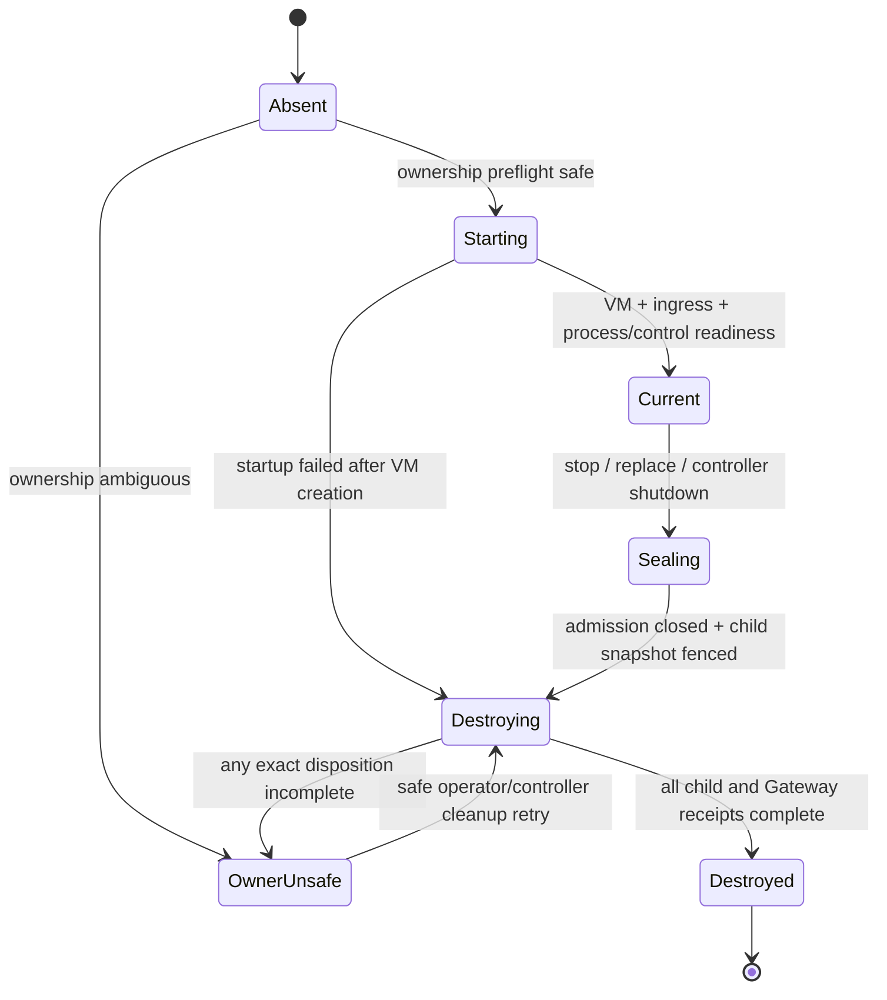
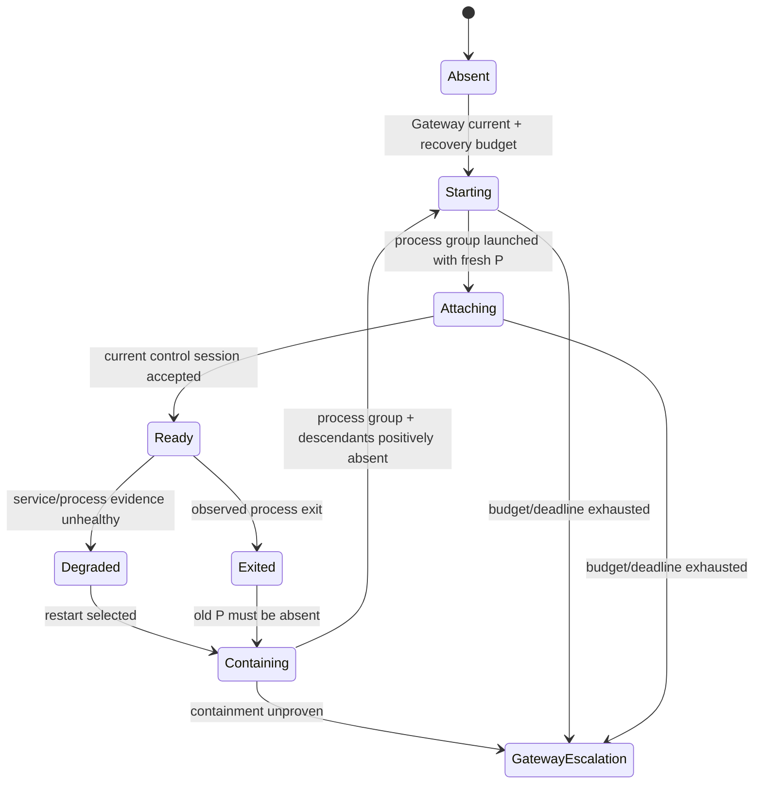
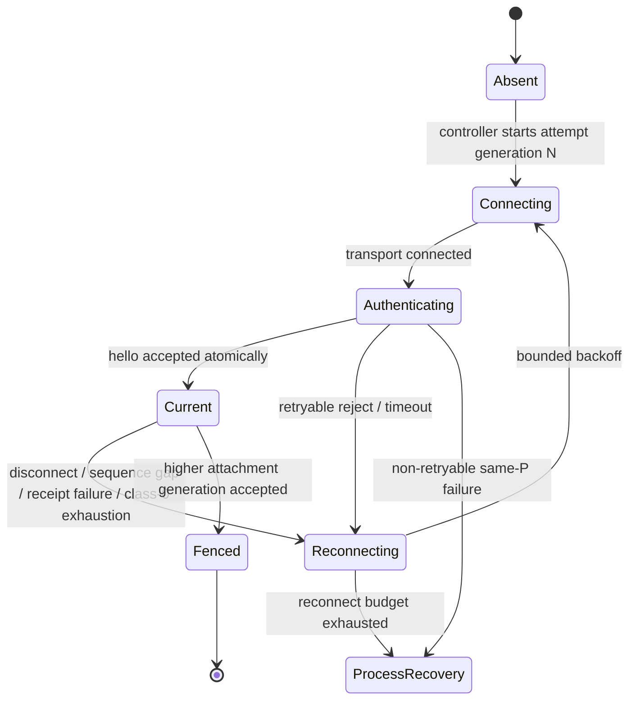
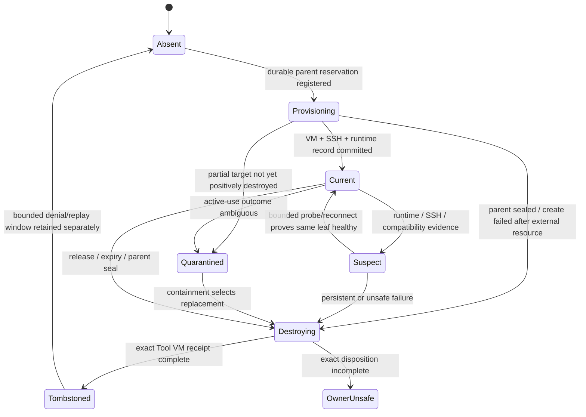
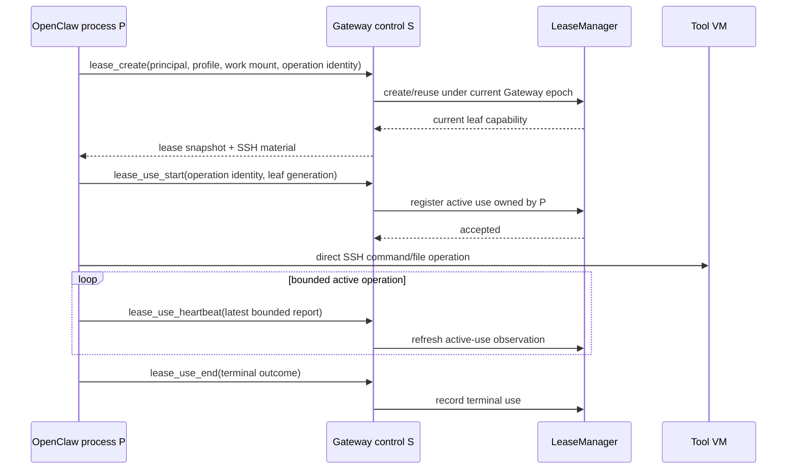

# Control Plane, Gateway Ownership, Tool VM Lease, and SSH Reliability

Date: 2026-07-09

Status: corrective design; implementation authority after focused spec review

Goal id: `2026-07-09-control-lease-reliability`

## Product intent

Agent VM must keep a long-running OpenClaw Gateway useful without confusing a
healthy process, a healthy control link, a healthy Tool VM, and a healthy SSH
path as the same thing.

The system should survive the failures that are safe to survive in place:

- a Socket.IO transport loss reconnects without destroying healthy work;
- an OpenClaw process crash recovers inside the same Gateway VM when the old
  process and its descendants are proven contained;
- a failed Tool VM or persistently unsafe SSH path replaces one lease leaf;
- a failed or replaced Gateway VM destroys its entire Tool VM subtree before a
  clean Gateway epoch starts;
- a controller restart replaces every VM tree it can prove it owns and refuses
  to overlap ambiguous ownership;
- observation pressure never impairs control, lease, provider, or SSH traffic.

The direct data path remains:

```text
OpenClaw in Gateway VM
  └─ SSH over Gondolin tcpHosts
       └─ Tool VM
```

The controller remains the control and authority plane. It does not become a
command, file, SSH, provider, log, trace, metric, or OTLP proxy.

## North star

```text
Controller epoch C
  └─ Gateway VM epoch G
       ├─ recoverable OpenClaw process epochs P1, P2, ...
       │    └─ disposable control-session epochs S1, S2, ...
       ├─ stable principal A
       │    └─ lease leaf LA → Tool VM TA → stable SSH binding
       └─ stable principal B
            └─ lease leaf LB → Tool VM TB → stable SSH binding
```

The Gateway VM epoch is the parent lifetime and security boundary. A Tool VM
belongs to exactly one Gateway VM epoch. Nothing about a Tool VM, lease, SSH
credential, or lease authority transfers to a successor Gateway VM.

OpenClaw process and control-session epochs are replaceable children inside a
live Gateway VM. They may reattach to healthy lease leaves only after current
controller validation. Their replacement does not by itself change lease
authority.

## Normative precedence

This spec is normative for OpenClaw Gateway ownership, process recovery,
Gateway control reconnect, Tool VM lease authority, SSH lifetime, recovery,
and observability isolation.

It supersedes conflicting ownership or recovery text in:

- `2026-06-30-gateway-control-session-hard-cutover.md`;
- `2026-07-01-socketio-control-protocol-semantics.md`;
- `2026-07-08-toolvm-lease-renewal-lifecycle.md`;
- the earlier revision of this spec and its implementation plan.

The earlier specs remain authoritative for protocol fields, delivery policy,
caller-context proof, path validation, and lease behavior where they do not
conflict with this spec.

The Gateway-control changes are a hard cutover. There is no dual legacy/new
reconnect mode, cross-Gateway compatibility path, or transitional authority
shim. Worker-control behavior is unchanged except where a shared contract must
be updated coherently to preserve type and protocol validity.

## Evidence and problem framing

### Proven current-state gaps

1. Gateway control sequence frontiers outlive the accepted socket. A reconnect
   can become `resync_required`, then terminal stale state, after which manual
   reconnect stops.
2. Disconnect clears the accepted session but does not record an explicit
   failed control-session health event. Silence ages the last successful
   heartbeat instead of explaining the transition.
3. Gateway recovery requires dead-control evidence plus failed Gateway service
   probes. Continuous `/health 200` can therefore veto recovery forever.
4. Lease authority is duplicated in an RPC-local mutable store and is bound to
   `connectionId` and `sessionId`, even though the `LeaseManager` owns the Tool
   VM and SSH capability.
5. Command dedupe does not bind stable principal, target generation, or a
   canonical payload digest. Reusing an operation identity with different
   meaning is not safely distinguished from a retry.
6. Gateway restart records failed child lease releases but continues toward a
   successor.
7. Gondolin `VM.close()` returns `Promise<void>`, can stop waiting without an
   observed exact runner exit, and uses a module-global child-kill fallback.
   Ingress, SSH, accepted sockets, and disposable storage do not produce one
   exact-target destruction receipt.
8. Health serving state is bounded, but durable-write and telemetry-sink
   Promise chains have no application-level queue or flush bound.
9. OpenClaw already has an in-Gateway restart loop, but full process death loses
   plugin `globalThis` state and current controller attachment.
10. Active-use expiry or local SSH timeout does not prove that remote work
    stopped.

### Proven package correlation

The `0.0.111` to `0.0.113` behavior-bearing runtime change is the lease
reacquire fallback in `gateway-control-lease-rpc`. The plugin and worker dist
did not contain a separate disconnect change. The fallback can enable more real
Tool VM work; it does not itself close a Socket.IO connection.

### Incident uncertainty retained

The Sunfam incident proves that the accepted control session disappeared,
heartbeats stopped, Gateway `/health` stayed green, readiness degraded, and
recovery did not restart the Gateway. The initial disconnect trigger is not
proven. Sequence failure, stale/resync handling, authentication/generation
mismatch, transport loss, or another trigger remain candidates.

This design fixes the code-backed permanent-stuck and observability gaps. It
does not claim to have reconstructed an unobserved historical trigger.

## Decisions

1. `OpenClawZoneRuntime` owns the Gateway VM epoch, epoch seal, child cascade,
   Gateway destruction, and successor activation.
2. `LeaseManager` owns one complete lease leaf: authority, Tool VM, stable SSH
   binding, active uses, quarantine/tombstone, and leaf replacement.
3. The Gateway control owner owns OpenClaw process attachment and disposable
   control sessions only. It owns no durable lease authority.
4. Control sequence and receipt frontiers are session-local.
5. Semantic operation/result dedupe is bounded to one controller/Gateway epoch
   and binds principal, target generations, operation identity, and canonical
   payload digest.
6. One SSH key/binding belongs to one exact Tool VM lifetime. Persistent or
   uncertain SSH state replaces the whole lease leaf.
7. OpenClaw process recovery is allowed only after positive old-process-group
   and descendant containment. Unproven containment escalates to Gateway
   subtree replacement.
8. Gateway replacement transfers nothing and requires positive destruction of
   every child Tool VM and the Gateway before successor activation.
9. Controller restart adopts no live VM or process-local Gondolin handle.
10. `/health` evidence is one health plane; it cannot veto exhausted recovery
    of another plane.
11. Telemetry is bounded, lossy, non-authoritative, and isolated from serving
    and recovery mutation paths.
12. Gondolin owns exact single-VM destruction. Agent VM owns parent/child
    cascade policy.

## Non-goals

- Tool VM, lease, SSH, authority, or runtime migration across Gateway epochs.
- Multiple active Gateways per zone, rolling Gateway replacement, or
  multi-controller high availability.
- Controller-restart adoption of an existing Gateway or Tool VM.
- Independent SSH credential rotation or revocation at process/session scope.
- Exactly-once arbitrary remote shell commands.
- Replay of uncertain side effects.
- Protection against a compromised Gateway root or privileged OpenClaw broker.
- Lossless telemetry during an indefinite collector outage.
- Raw telemetry, logs, traces, files, SSH, provider traffic, or generic tunnels
  over Gateway control.
- Discord/provider internal redesign. Provider health participates in the
  vector; provider-specific behavior remains owned by OpenClaw.
- General arbitrary remote-command exposure through the controller SSH CLI.

## Vocabulary and identity

### Controller epoch

A fresh random identity for one controller process lifetime. A controller
restart creates a new epoch and invalidates all process-local handles,
attachments, pending results, and dedupe state.

### Gateway VM epoch

The tuple of:

- zone id;
- controller epoch;
- exact `ManagedVm` identity;
- Gateway boot id;
- Gateway generation id;
- verified runtime/process ownership evidence for the QEMU runner.

The tuple identifies one physical Gateway VM boot. It is the parent for every
OpenClaw process epoch, control session, and Tool VM lease leaf in the zone.

### OpenClaw process epoch

One supervised OpenClaw process-group lifetime inside one Gateway VM epoch. A
new process epoch is a liveness and containment boundary, not a durable
authority principal.

`OpenClawZoneRuntime` mints the process epoch selected by controller recovery.
The Gateway bootstrap process owner launches that exact epoch and must not
report a safe successor process until the prior process group and owned
descendants are positively absent.

### Control-session epoch

One accepted Socket.IO connection and its session attachment generation. It
owns only transport-local sequence counters, receipt frontiers, bounded queues,
and pending transport results.

### Stable principal

A controller-derived identity for one declared agent inside one zone. It binds:

- zone id;
- configured agent id.

Validated agent workspace, host work mount, Tool VM profile, zone-git mount,
idle policy, and purpose are compatibility/authorization inputs on that
principal's one current leaf. They are not additional principal dimensions. A
different compatible-context request from the same `zoneId + agentId` is a
typed conflict or explicit leaf-replacement decision; it does not silently
create a second principal or Tool VM.

An OpenClaw session key or control-session id may help authenticate the current
caller context, but neither is the stable principal or durable lease owner. A
compatible lease may be reused across channels, conversations, OpenClaw
processes, and control sessions for the same `zoneId + agentId`.

### Ephemeral caller context

The controller-side Gateway control owner holds bounded P/S-scoped caller
registrations. It validates current session proof, declared agent, workspace,
work mount, purpose, and session-key evidence, then emits a canonical stable
principal plus validated compatibility inputs to `LeaseManager`.

The registry is discarded/fenced on process or session replacement. A new P/S
must register fresh proof. `LeaseManager` never stores or imports
`connectionId`, `sessionId`, raw session keys, or plugin implementation helpers.

### Lease leaf and lease generation

One coherent aggregate containing:

- exact parent Gateway VM epoch;
- stable principal;
- lease id and generation;
- compatibility snapshot and policy expiry;
- exact Tool VM runtime identity and handle;
- one stable SSH binding and server identity;
- active uses and their process ownership;
- quarantine, destruction, and tombstone state;
- runtime record and TCP slot disposition.

Replacing the Tool VM replaces the whole leaf generation.

### Semantic operation identity

A bounded idempotency identity containing:

- Gateway VM epoch;
- stable principal;
- the operation's declared generation profile;
- operation kind and target;
- command id and idempotency key;
- canonical payload digest.

The same identity and digest is a retry. The same command/idempotency identity
with different principal, target, generation, operation, or digest is a typed
collision.

Every operation declares one of these generation profiles in the shared
contract:

- lease-authority operations such as create, get, renew, reacquire, and release
  bind Gateway epoch, stable principal, compatibility/target leaf generation,
  and payload meaning, but not OpenClaw process generation, so a safe same-G
  P/S replacement can retry them;
- active-use start, heartbeat, resume, and end bind the exact process epoch and
  leaf generation, so P1 work can never match or terminate P2 work;
- every other mutating operation must explicitly select and prove one profile.
  There is no implicit "where applicable" behavior.

### Positive destruction

An exact-target receipt based on observed absence/closure, not merely a kill or
close request being accepted. An unobserved runner exit, listener close, socket
close, or storage cleanup is incomplete.

### VM ownership reservation and destroy target

Before VM creation can start external I/O, its parent owner records a durable
ownership reservation containing the parent epoch, operation/reservation id,
stable principal or Gateway role, deterministic session label, and reserved
network/storage resources. That reservation is passed into Gondolin.

Gondolin must make every external resource created for the reservation
discoverable even when create never returns. As soon as exact resource
identities exist, Gondolin atomically extends the reservation with a
`VmDestroyTarget`. The target is sufficient for both live-handle and
post-controller-crash destruction through the same receipt contract.

### Owner-unsafe

A fail-closed state meaning exact ownership or destruction is ambiguous. It
blocks successor activation, authority reuse, TCP slot reuse, and operator
acknowledgement as a shortcut. Operators may diagnose or perform safe cleanup;
they cannot waive the barrier.

## Spec boundary and separability map

```text
Controller composition root
  │
  ├─ OpenClawZoneRuntime                    source of truth: Gateway epoch
  │    owns: seal, child-cascade request, Gateway destroy,
  │          process/Gateway recovery decisions and budgets,
  │          successor activation
  │    exposes: generation-fenced lifecycle and snapshot ports
  │
  ├─ Gateway process-supervisor port        typed mechanical actuator/observer
  │    owner: OpenClawZoneRuntime policy; implemented through fixed
  │           ManagedVm.exec operations + atomic RealFS supervisor state
  │    commands/receipts: expected G/P, action, containment dispositions,
  │                       exact selected successor P
  │    never owns: recovery policy, lease authority, or public command access
  │
  ├─ Gateway control owner                  source of truth: current P and S
  │    owns: process attachment, ephemeral caller contexts, session fences, queues,
  │          session-local ordering, bounded semantic result ledger
  │    exposes: verified stable-principal semantic command port
  │
  ├─ LeaseManager                           source of truth: lease leaves
  │    owns: authority, Tool VM, SSH, active use, quarantine,
  │          runtime record, TCP slot, leaf destruction/replacement
  │    exposes: exact-parent leaf command and snapshot ports
  │
  ├─ Zone recovery reducer                  pure snapshots → typed repair action
  │
  ├─ HealthEventStore / evidence projector  bounded one-way operator evidence
  │
  └─ gondolin-adapter
       exposes: exact-target VM operations and typed destroy receipt
       delegates: destroy-one-VM primitive to Gondolin

Gateway VM
  ├─ OpenClaw bootstrap process owner
  │    owns: one P at a time and mechanical process-group containment proof
  │    does not autonomously start a successor P
  ├─ OpenClaw + agent-vm plugin
  │    exposes: private Gateway-control endpoint
  └─ direct SSH client ───────────────────────────────► Tool VM leaf

All owner transitions ──bounded, one-way─────────────► evidence sinks
Evidence sinks ──X──► mutation authority or recovery eligibility
```

The design deliberately does not add a fourth durable coordinator. Narrow
typed ports and generation checks coordinate the three existing owners.
External I/O is a saga with explicit incomplete outcomes, not an atomic
transaction hidden behind one giant lock.

The supervisor port is not another policy owner or network service. It is a
typed adapter around a fixed guest supervisor command surface and an atomic
host-readable state record. Raw `ManagedVm.exec` process-control strings must
not escape that adapter, and the port is not exposed through the public SSH CLI
or controller remote-command routes.

## Communication topology

### Controller to Gateway control

```text
Controller
  └─ initiates one private Socket.IO/WebSocket connection
       └─ Gondolin Gateway ingress upgrade route
            └─ agent-vm plugin control service in OpenClaw process
```

This channel carries bounded control only: handshake, fences, typed commands,
command acknowledgements/results, liveness, process attachment, lease control,
and small safety/health transitions required by the controller.

### Controller to Gateway process supervisor

The control socket terminates in OpenClaw and cannot prove recovery when
OpenClaw is dead. `OpenClawZoneRuntime` therefore has a control-independent,
controller-only supervisor port over its existing `ManagedVm` handle:

```text
OpenClawZoneRuntime
  └─ typed supervisor adapter
       ├─ fixed ManagedVm.exec command inside exact G
       └─ atomic supervisor state/receipt on controller-owned RealFS
```

The controller owns process epoch issuance, budgets, and restart selection.
The guest supervisor owns only serialized mechanical start, stop, process-group
containment, and observation. Unexpected P exit is contained and recorded; it
does not autonomously start P2. A command and receipt bind current Gateway
epoch, expected P, action id, every process-group/descendant disposition, and
the exact successor P selected by the controller.

P2 hello and any lease redisclosure remain blocked until the controller has
accepted the positive P1 containment/start receipt. If the port or receipt is
unavailable/incomplete, recovery escalates to Gateway subtree replacement.

### Gateway to Tool VM data

```text
OpenClaw/plugin
  └─ SSH to tool-<slot>.vm.host:22
       └─ Gondolin tcpHosts mapping
            └─ host TCP slot
                 └─ Tool VM SSH service
```

Command stdout/stderr and file-bridge payloads stay on this path. The
controller authorizes and observes leases/active uses but does not proxy the
data.

### Provider and telemetry paths

Provider traffic remains OpenClaw-owned. OTLP/export traffic uses its configured
observability path. Neither shares Gateway-control queue capacity except for
small typed state transitions that the controller must consume.

## Ownership invariants

1. Every current lease leaf has exactly one parent Gateway VM epoch.
2. Every mutable lease-authority fact has one owner: `LeaseManager`.
3. Durable lease authority contains no control `connectionId` or `sessionId`.
4. Process identity may own active-use uncertainty; it never grants durable
   lease authority.
5. The Gateway control owner owns ephemeral caller-context proof and emits a
   controller-derived stable principal. `LeaseManager` cannot depend on guest
   plugin implementation or transport identity.
6. Every Gateway or Tool VM create registers a durable ownership reservation
   before external VM creation and belongs to exactly one parent membership
   barrier while provisional or current.
7. Sealing calls one narrow `LeaseManager` parent-fence port that synchronously
   closes admission and returns a barrier covering committed leaves,
   provisional reservations, and late create/destroy dispositions.
8. A sealed Gateway epoch admits no new session, process attachment, lease,
   reattach, active use, provisional allocation, or late asynchronous commit.
9. A successor Gateway is not current while any predecessor provisional child,
   committed child, Gateway, or ownership-journal disposition is incomplete.
10. One stable principal (`zoneId + agentId`) has at most one current compatible
    lease leaf in one Gateway epoch.
11. One leaf repair cannot mutate or consume the reserved control capacity of a
    sibling leaf/principal.
12. Session attachment generation is monotonic for the whole Gateway VM epoch,
    survives P replacement, and resets only with a new G.
13. Session-local sequence state never survives session acceptance.
14. Semantic retries cannot change principal, target, generation, operation, or
    payload meaning.
15. Evidence emission cannot be awaited while holding lifecycle, lease,
    session, or recovery mutation authority.
16. A VM destruction API used for recovery cannot return only `void`.
17. Local process-group absence, socket closure, or heartbeat expiry does not
    prove a remote Tool VM side effect stopped.

## Gateway VM epoch state model



`Sealing` is synchronous with respect to admission: the epoch generation is
advanced, all command ports reject, and `LeaseManager.sealGatewayEpoch(G)`
closes the parent membership set before destructive awaits begin. The returned
barrier includes every committed leaf and every provisional reservation that
registered before the seal linearization point.

Late create/probe/reconnect completions compare the captured generation and
cannot commit into a sealed epoch. A late VM create result must attach its exact
destroy target to its already-registered provisional reservation and proceed to
positive destruction. The Gateway barrier remains incomplete until that
cleanup receipt is complete; failed/unobserved cleanup makes the epoch
`OwnerUnsafe`.

A new Gateway is a new state machine instance. `Destroyed` does not transition
back to `Starting` with the same identity.

## OpenClaw process state model



`OpenClawZoneRuntime` owns the process recovery decision, budget, and selected
process epoch. The bootstrap supervisor owns one OpenClaw process group at a
time as a mechanical actuator. It may contain and report an unexpected exit,
but it cannot autonomously start a replacement. This removes the current risk
of two independent restart loops.

Any helper that must survive process replacement must be explicitly outside the
OpenClaw containment unit and must not hold lease/SSH authority. Otherwise it
is an owned descendant and must be enumerable and terminable by the supervisor
receipt.

Process restart creates the controller-selected fresh process epoch and fresh
session attachments. P2 cannot attach or receive lease material until the
controller accepts the exact P1 containment and P2 start receipt.
Healthy idle or positively contained lease leaves remain. An active use owned
by the old process becomes ambiguous unless its terminal outcome is already
recorded.

## Control-session state model



There is no session-global terminal `stale` state that silently disables all
future reconnect. A sequence gap, resync disagreement, queue overflow, or
receipt failure fences that session and becomes an observed reconnect reason.

The controller issues a monotonically increasing session attachment generation
for the whole Gateway epoch. The counter survives P1 → P2 replacement and
resets only when G changes. Acceptance is atomic: a higher current generation
for the controller-selected current P fences the incumbent; an older/equal
generation from any P is rejected. Every late envelope/result is checked
against the current process and session fence.

Each accepted session starts both directional sequence counters and receipt
frontiers from their initial value. Hello does not negotiate global
`lastSeenControllerSequence`, `lastSeenPeerSequence`, or a durable
`previousSessionId` for Gateway control.

## Lease-leaf state model



`Quarantined` rejects new work and reattachment but retains exact evidence
needed for containment and cleanup. A replacement leaf cannot become current
while its predecessor may still be live or while its TCP slot/credential
disposition is uncertain.

`Provisioning` is already parent membership, not an invisible local promise.
The durable reservation is written and admitted before TCP/VM external work.
Parent seal drains it. Controller crash recovery discovers it through the
ownership journal and Gondolin destroy target even if no current leaf/runtime
record was ever published.

## Active-use state model

An active use records the semantic operation identity, process epoch, session
attachment at admission, lease generation, start time, heartbeat policy, and
latest bounded report.

```text
registered
  └─► running / heartbeat-current
         ├─► terminal-completed
         ├─► terminal-failed-observed   (current valid P/S reported remote terminal)
         ├─► observation-gap       (session lost; same P may recover)
         └─► ambiguous             (P lost or containment unknown)
                                      └─► leaf quarantine/replacement
```

Session loss alone creates an observation gap. It does not prove process death
or remote command termination, and the leaf admits no conflicting new use
during the gap. A same-process reconnect may submit an explicit active-use
resume/terminal report if all identifiers match and the bounded grace has not
expired.

If that grace expires, reconnect is exhausted, or a mismatched/late report
arrives, the use becomes `ambiguous`, the leaf is quarantined, and this design
uses exact Tool VM destruction as the only positive remote-operation
containment oracle. A later terminal report is diagnostic only and cannot
reopen the leaf. The exact grace duration is a planning parameter; this state
transition is not.

Process replacement turns every non-terminal use owned by the old process into
`ambiguous`. The controller does not infer containment from local timeout,
heartbeat expiry, Socket.IO disconnect, or OpenClaw exit. New work remains
blocked on that leaf until positive leaf destruction/replacement. Gateway
process-group containment protects P2 attachment, but it does not prove a
daemonized/disconnected remote Tool VM operation stopped.

## Healthy lease-use sequence



The control messages authorize and track the operation. Command/file bytes do
not traverse the controller.

## Transport-reconnect sequence

```mermaid
sequenceDiagram
    participant C as Controller control owner
    participant P as OpenClaw process P1
    participant L as LeaseManager
    Note over C,P: S1 current; leaf L1 healthy
    C--xP: S1 disconnect / sequence / receipt failure
    C->>C: record explicit transition; fence S1
    C->>P: connect with attachment generation N+1
    P-->>C: fresh hello for same G and P1
    C->>C: atomically accept S2; reset sequence frontiers
    C->>L: validate reattach by G + stable principal + leaf generation
    L-->>C: current L1
    Note over C,L: Gateway, process, Tool VM, and SSH identities unchanged
```

A retry of a controller-side semantic command may return the bounded cached
result only when its full semantic identity and digest match. Unknown or
expired results fail explicitly; they are not guessed or replayed.

## OpenClaw-process recovery sequence

```mermaid
sequenceDiagram
    participant B as Gateway bootstrap supervisor
    participant C as Controller control owner
    participant R as OpenClawZoneRuntime
    participant L as LeaseManager
    participant T as Tool VM
    Note over B,T: G1 / P1 / S1 / healthy leaf L1
    B->>B: observe/contain unexpected P1 exit; do not auto-start P2
    B-->>R: atomic P1 state/containment receipt
    R->>R: select bounded process recovery; mint P2
    C->>L: mark P1 non-terminal uses observation-gap/ambiguous
    R->>B: typed start/contain command(G1, expected P1, selected P2)
    B->>B: prove P1 process group + descendants absent
    alt containment proven within budget
      B->>B: start P2 with fresh process epoch
      B-->>R: positive P1 containment + P2 start receipt
      R->>C: admit expected P2 attachment
      P2->>C: fresh control hello for G1 / P2 / next attachment generation
      C->>C: accept fresh S2; fence P1/S1
      C->>L: reattach exact stable principal
      L-->>C: preserve idle/contained L1; refuse ambiguous leaves
      C-->>P2: current safe lease snapshots
      P2->>T: direct SSH continues on preserved leaf
    else containment unproven or recovery exhausted
      R->>R: select whole-Gateway subtree replacement
    end
```

No lease-authority generation changes solely because P or S changed. Process
and session attachment generations do change. A preserved leaf's SSH material
may be redisclosed only to the same validated stable principal inside the same
Gateway epoch.

The controller is the source of truth for preserved SSH material. P2 receives
it again only through fresh caller-context validation and the current
LeaseManager snapshot; it never adopts a P1 scratch file as authority. A
process-private `0600` identity file may exist while P is current, but the
supervisor must remove/replace process-owned scratch as part of containment.
Credential fingerprints used by tests remain test-local and never enter normal
telemetry.

## Tool VM and SSH recovery sequence

```text
transient transport evidence
  → bounded reconnect/probe of the same SSH binding
  → success keeps the same leaf

persistent runtime, SSH, credential, or containment uncertainty
  → quarantine one leaf
  → positively destroy its exact Tool VM
  → tombstone old authority and credential
  → create a fresh Tool VM + SSH binding on demand
  → keep Gateway and sibling leaves unchanged
```

Closing a host SSH listener or timing out a local client is not credential
revocation proof. Hard revocation is exact Tool VM destruction. This is why SSH
and Tool VM share one leaf lifetime.

## Gateway-subtree replacement sequence

```mermaid
sequenceDiagram
    participant R as OpenClawZoneRuntime
    participant C as Gateway control owner
    participant L as LeaseManager
    participant G as Gondolin adapter
    R->>R: atomically seal Gateway epoch G1
    R->>C: fence process/session admission and pending transport work
    R->>L: sealGatewayEpoch(G1)
    L-->>R: closed membership barrier (current + provisional children)
    par bounded exact child destruction
      L->>G: destroy Tool VM A
      L->>G: destroy Tool VM B
      L->>G: destroy any late provisional target for G1
    end
    G-->>L: typed exact-target receipts
    L-->>R: child set empty OR incomplete dispositions
    alt every child complete
      R->>G: destroy Gateway VM G1
      G-->>R: typed exact-target receipt
      alt Gateway receipt complete
        R->>R: retire G1 artifacts and permit fresh G2
      else incomplete
        R->>R: owner-unsafe; no G2
      end
    else any child incomplete
      R->>R: owner-unsafe; no G2
    end
```

Late completions from G1 are fenced. No Tool VM, lease, SSH key, authority,
session, dedupe result, or runtime handle is copied into G2. Host-owned work
mount data remains durable storage and may be mounted into a newly created leaf
after normal validation.

## Controller-restart contract

Controller startup classifies runtime records before creating new VMs:

```text
exact record + namespace + process identity still match
  → proven-owned
  → exact subtree destruction
  → fresh controller/Gateway/lease generations

record missing, identity reused, ownership evidence contradictory, or target
cannot be positively destroyed
  → owner-unsafe
  → no adoption and no overlapping replacement
```

Process-local `ManagedVm` handles are never reconstructed as live authority.
Runtime records are cleanup evidence, not an event-sourced coordinator.

Gateway, Tool VM, and provisional ownership records must persist the exact
parent Gateway ref, project/zone/config identity, VM id, deterministic session
label, runner PID plus start/command identity, reserved/listening ports,
IPC/QMP/session paths, disposable storage paths, and the Gondolin
`VmDestroyTarget` resource identities needed for detached proof. A parse error,
missing/mismatched identity, incomplete reservation update, or unprovable
resource becomes `owner-unsafe`; it is never filled in from guesswork.

Gondolin exposes live-handle and detached-target destruction into the same
receipt schema. After controller crash, resources already closed by host
process exit may be proven `already-absent`; the exact QEMU runner and every
other persisted target still require exact proof. Detached cleanup cannot use a
module-global child kill.

## Control-session contract

### Bootstrap and acceptance

- The controller initiates the connection only after Gateway ingress and the
  private plugin control endpoint are reachable.
- The hello authenticates controller epoch, Gateway epoch, zone, peer, protocol
  version, process epoch, and session attachment generation.
- Acceptance is atomic and produces fresh connection/session ids.
- A higher valid attachment generation supersedes and fences the incumbent.
- A stale generation, wrong Gateway/process epoch, undeclared peer, invalid
  proof, or protocol mismatch is a typed rejection.
- Retryable transport/authentication timing failures enter bounded reconnect.
- Repeated same-process attachment failure escalates to process recovery.
- Attachment generation is scoped to G, survives P replacement, and resets
  only with a new G.
- P2 attachment is rejected until `OpenClawZoneRuntime` has accepted the
  generation-bound P1 containment and P2 start receipt.

### Session-local ordering

- Both directions begin at the initial sequence for each accepted session.
- Duplicate or out-of-order frames are rejected inside that session.
- A sequence gap closes/fences that session and records a transition reason.
- No global sequence frontier, resync token, or previous session carries
  ordering authority into a new session.
- Late frames/results must match the current Gateway, process, attachment,
  connection, and session fence.

### Semantic retry and result correlation

- Transport acknowledgement means the current peer accepted the frame, not
  that the domain operation succeeded.
- Command results are explicit and bound to semantic operation identity.
- The controller may retain a bounded result promise/result ledger for one
  Gateway epoch across process/session replacement.
- A full semantic-identity match may observe the same pending result or return
  the same completed result within the dedupe window.
- A changed digest/principal/target/generation is `idempotency_collision`.
- Expired or unknown result state is explicit. Side effects are never replayed
  merely because a result is unknown.
- Gateway replacement or controller restart discards the ledger.
- Shared protocol schemas assign each operation an explicit generation profile:
  lease-authority operations are P-independent within G; active-use operations
  are bound to the exact P and leaf generation; other mutations must choose one
  explicitly.

### Backpressure and traffic classes

One socket does not mean one undifferentiated queue.

```text
Class 0  safety and authority
         hello, fence, close, command ack/result,
         lease create/reacquire/use-start/use-end/release
         bounded, reserved capacity, never displaced by evidence

Class 1  liveness and current state
         control/active-use heartbeat, lease renew, process/provider state
         latest-wins/coalescible with freshness

Class 2  diagnostic transitions
         bounded typed failures and state changes
         coalescible/droppable with accounting

Class 3  routine observability
         local counters/gauges/traces; not raw control traffic
```

Class 0 keeps a non-consumable reserve for session safety, acknowledgements, and
results. Agent-originated authority work has per-principal admission limits and
fair scheduling inside its remaining capacity, so one agent cannot consume a
sibling's share or the safety reserve. High-frequency active-use heartbeat and
lease renew are Class 1 latest-wins entries keyed by exact use/leaf rather than
unbounded Class 0 traffic.

Class 0 exhaustion is a control failure that fences the session and triggers
bounded reconnect; it is not a terminal `Fenced` sink. Class 1/2 pressure sheds
or coalesces their own evidence before it can consume Class 0 capacity. Frames,
per-principal queues, and global queues have explicit byte/message bounds and
fairness oracles. No Promise chain may grow without an application-level bound.

## Lease authority and reattachment

The separate RPC-local mutable lease-authority store is removed. `LeaseManager`
stores current authority and tombstones with the leaf it owns.

The control owner retains only ephemeral current-P/S caller contexts. After
proof validation it passes `{ gatewayEpoch, stablePrincipal, compatibility,
semanticOperation }` through a pure controller/shared-contract port.
`LeaseManager` does not import OpenClaw plugin implementation, parse session
keys, or receive transport ids. P/S replacement requires fresh caller proof
before the same stable principal can reattach.

A lease operation is accepted only when all relevant fields match current
controller state:

- controller and Gateway epoch;
- stable principal;
- current leaf generation and lease id;
- current process/session attachment for transport admission;
- operation kind and target;
- policy purpose and expiry;
- command/idempotency identity and canonical digest.

Process/session attachment is checked at the control boundary, then discarded
as durable ownership. A fresh P/S in the same G can reattach the same stable
principal. A different G cannot.

Reacquire after stale Tool VM/SSH evidence is a leaf-replacement operation, not
a cross-session authority hack:

1. validate current Gateway and stable principal;
2. resolve the old leaf/tombstone for correlation;
3. classify transient versus persistent/unsafe evidence;
4. preserve a positively healthy current leaf or quarantine it;
5. positively destroy an unsafe old leaf before replacement;
6. return a fresh lease/SSH capability only for the new current generation.

An old lease id is never sufficient authority. Replaced/retired tombstones
remain bounded so stale calls receive a typed denial rather than accidentally
matching a fresh leaf.

## SSH lifetime and reliability

- One controller-generated client credential and one verified server identity
  belong to one Tool VM leaf lifetime.
- The private key is disclosed only to the exact validated principal inside
  the exact parent Gateway epoch.
- A same-Gateway process/session replacement may receive the same current
  binding after revalidation.
- The controller/LeaseManager remains the source of truth and redelivers the
  current binding through the fresh P/S lease snapshot. P2 does not treat a P1
  scratch file as authority.
- A transient connection failure before side-effect ambiguity receives bounded
  reconnect/probe.
- A persistent connection failure, server identity mismatch, uncertain
  established session, credential exposure outside the current scope, or
  ambiguous remote operation quarantines and replaces the whole leaf.
- Leaf replacement rotates Tool VM and SSH identity naturally.
- Gateway replacement destroys all leaves, so no key crosses Gateway epochs.
- SSH key material, command text, file contents, and known-host details are not
  metric labels or ordinary event fields.

This deliberately pays for a Tool VM replacement when SSH safety is uncertain.
It avoids a second revocation state machine whose listener/session semantics
would still be weaker than destroying the VM.

## Gondolin ownership and exact-destruction contract

Gondolin must accept the Agent VM ownership reservation before spawning an
external runner or listener, and it must make partial creation discoverable by
that reservation if create throws, hangs, or the controller dies. It returns or
atomically persists the exact `VmDestroyTarget` as resource identities become
available.

Gondolin must expose idempotent exact-target `destroy one VM` operations for
both a live handle and a persisted detached target. Both return the same receipt
schema. The receipt identifies the requested reservation/VM/runner identity and
reports at least:

```text
runner process       destroyed | already-absent | unproven
ingress listener     closed    | already-absent | unproven
accepted/upgraded
ingress sockets      closed    | already-absent | unproven
SSH listener         closed    | already-absent | unproven
accepted SSH
sessions/sockets     closed    | already-absent | unproven
session IPC/QMP      closed    | already-absent | unproven
disposable storage   removed   | already-absent | incomplete
overall              complete  | incomplete
```

The runner disposition is based on observed exit/absence of the exact process
identity, not signal delivery or PID alone. PID reuse must not satisfy the
receipt. Listener closure includes accepted/upgraded connections that would
otherwise keep authority or forwarding alive.

The detached target contains enough stable metadata to prove absence after the
owning Node/controller process is gone. A resource that was never created may
be `already-absent`; a resource whose identity was lost is `unproven`, not
silently absent. Agent VM persists the target and exact parent Gateway identity
before declaring a Gateway or leaf current.

The operation must not call a module-global `killActiveChildren()` or kill a
sibling VM to complete one target's receipt. A resistant target produces an
incomplete exact-target receipt.

Agent VM's adapter maps the Gondolin receipt into one stable typed contract.
Agent VM, not Gondolin, decides that all children of a Gateway epoch must be
destroyed. Any incomplete disposition blocks record deletion/resource reuse
and successor activation, with the specific resource reported for diagnosis.

## Health vector

Health is a vector of independently owned planes:

| Plane | Authoritative owner/state | Typical evidence | Repair scope |
| --- | --- | --- | --- |
| controller | controller process/runtime | serving state, shutdown state | controller lifecycle |
| Gateway VM | `OpenClawZoneRuntime` + exact VM identity | process/runner and runtime record | whole subtree |
| Gateway service | OpenClaw HTTP service | `/health` probe | process first, then Gateway |
| OpenClaw process | bootstrap supervisor + current P | process transition/attachment | process group |
| Gateway control | control owner + current S | hello, heartbeat, disconnect, queue state | session, then process |
| lease authority | `LeaseManager` leaf | current/quarantined/tombstone | one leaf |
| Tool VM runtime | exact leaf VM | liveness/probe/destroy receipt | one leaf |
| SSH | stable leaf binding | connect, identity, operation result | reconnect, then one leaf |
| active use | leaf active-use record | heartbeat/terminal/ambiguity | one leaf containment |
| provider/channel | OpenClaw provider owner | bounded typed state | provider/process policy |
| telemetry/export | evidence subsystem | queue/export/drop state | evidence only |

A green plane updates only that plane. In particular:

- Gateway `/health 200` cannot clear dead-control or failed-process recovery;
- a fresh heartbeat cannot prove Tool VM SSH or active-use containment;
- a healthy Tool VM cannot prove current lease authority;
- collector success/failure never decides serving or VM recovery;
- provider churn does not automatically prove Gateway infrastructure failure.

Controller readiness may summarize critical product planes, but diagnostics
must preserve the vector and the exact reason. Telemetry impairment is exposed
as observability status, not a serving-health or restart trigger.

## State-directed recovery

The recovery reducer consumes immutable current-owner snapshots plus prior
bounded budget state and returns one typed action or refusal. It does not close
VMs or mutate owners itself.

| Failure classification | First repair | Escalation | Preserved state |
| --- | --- | --- | --- |
| session/transport only | bounded fresh session | OpenClaw process recovery, then Gateway replacement | G, P, safe leaves |
| OpenClaw process | process-group containment and fresh P | Gateway replacement | G and safe leaves |
| active use ambiguous | quarantine and positively destroy affected leaf | owner-unsafe if destroy incomplete | G and siblings |
| Tool VM dead/incompatible | replace leaf | owner-unsafe if destroy incomplete | G and siblings |
| SSH transient before ambiguity | reconnect/probe same binding | replace leaf | G and siblings |
| SSH persistent/unsafe | replace leaf | owner-unsafe if destroy incomplete | G and siblings |
| Gateway runner/ingress/ownership | seal and replace subtree | owner-unsafe | host data only |
| controller restart | destroy proven-owned trees | owner-unsafe | host data only |
| provider recoverable | provider-owned recovery, optionally process policy | process, then Gateway only after bounded exhaustion | safe leaves until G replaced |
| telemetry unavailable/saturated | shed/coalesce/report | operator diagnosis | all product state |

### Anti-flap invariants

- Every observation is source-keyed and generation-fenced.
- Each boundary has a consecutive-failure/deadline threshold and recovery
  budget appropriate to that boundary.
- One healthy observation from a different plane cannot reset the failing
  plane's budget.
- Recovery success requires the repaired plane to remain stable for a defined
  window; one immediate successful probe is not enough.
- Recovery is single-flight per owner. Gateway sealing supersedes/fences all
  leaf/session work from that epoch.
- Cooldown applies after stable success, not after an unproven attempt.
- Repeated failures escalate outward; they do not restart the same layer
  forever.
- A failed/incomplete destructive action refuses replacement instead of
  flapping between overlapping generations.
- One leaf's cooldown/quarantine cannot suppress a sibling's progress.
- Per-principal control admission and fair scheduling prevent one agent's
  valid-looking authority traffic from starving session safety or a sibling.

Exact thresholds and windows are configuration/design parameters for the
implementation plan. Their relationships and proof obligations are normative.

## Observability and telemetry isolation

### Required transitions

The system records explicit bounded transitions rather than relying on silence:

- control connect, hello outcome, accepted, disconnected, fenced, reconnect
  scheduled, reconnect exhausted;
- OpenClaw process starting, ready, exited, containment complete/incomplete,
  recovery exhausted;
- Gateway seal, child-destruction summary, Gateway destruction, successor
  permitted/refused;
- lease current, suspect, quarantined, replaced, retired, owner-unsafe;
- active-use observation gap, ambiguous, terminal;
- recovery decision, no-op/refusal reason, start, success, failure, suspension;
- evidence coalesced, dropped, exporter unavailable, flush deadline exceeded.

Every transition includes bounded reason codes and the relevant generation
class. Disconnect immediately records a failed/disconnected control event; the
store does not wait for the last `ok` heartbeat to age.

### Metrics

Low-cardinality metrics must expose at least:

- current control/process/Gateway/recovery state by zone and bounded state;
- control hello outcomes, disconnect reasons, reconnect attempts/exhaustion;
- recovery decisions, refusals, failures, cooldown, and suspension;
- current lease-leaf counts by bounded state and replacement reason;
- VM destruction dispositions by resource class and result;
- control/evidence queue depth, byte depth, high-water mark, coalesced count,
  dropped count, and flush timeout;
- heartbeat/control-RPC/lease/SSH latency distributions at bounded operation
  classes;
- provider state transitions at bounded provider type/status classes;
- exporter availability without feeding product readiness.

Session ids, connection ids, operation ids, lease ids, raw agent/session keys,
host paths, command text, payload digests, SSH material, and error strings are
not metric labels. Correlation ids belong in bounded logs/traces, with
redaction and sampling as appropriate.

### Evidence pipeline bounds

- Live owner state updates synchronously in bounded memory.
- Durable JSONL and telemetry sinks consume through fixed-capacity queues.
- Routine success aggregates into counters/gauges rather than one event per
  heartbeat.
- Latest state may coalesce by bounded bucket.
- When capacity is exhausted, diagnostic evidence drops/coalesces according to
  explicit policy and increments its own accounting.
- Shutdown/flush has a deadline and cannot wait indefinitely for a collector.
- Export callbacks cannot reenter owner mutation or recovery decisions.
- A slow/unavailable collector cannot add latency to control, provider, lease,
  SSH, or unrelated-zone work beyond the small bounded admission cost.
- Queue pressure assertions cover both global ceilings and per-principal
  fairness; aggregate capacity exhaustion is never an excuse for silent
  starvation.

### Beta correlation

Every live proof run uses a fresh run marker correlated across controller logs,
Gateway/process transitions, traces, metrics, package identity, zone identity,
Gateway/Tool VM identities, and a bounded time window. Historical data without
that marker is diagnostic context, not proof.

## Security and trust boundaries

### Trust model

- The host/controller is the trust root for configuration, validated paths,
  stable principal derivation, epochs, lease authority, VM ownership, and
  recovery decisions.
- The Gateway VM is semi-trusted. It may hold current same-epoch agent and SSH
  capability material needed to operate Tool VMs.
- Tool VMs execute untrusted work and receive only their scoped mounts,
  network/secret policy, and SSH service.
- A compromised Gateway root or privileged OpenClaw broker is outside this
  design's isolation promise; Gateway replacement remains the security epoch
  reset.

### Required authorization

Before a mutating control command reaches an owner, validate:

- controller, Gateway, process, and current session fences as applicable;
- zone and declared agent;
- stable principal and validated path mapping;
- target lease/Tool VM generation;
- operation kind, purpose, and policy expiry;
- command/idempotency identity and canonical payload digest;
- current owner state permits the transition.

The Gateway control owner performs P/S-bound caller proof and stable-principal
derivation. `LeaseManager` consumes only pure shared/controller contracts and
must not import `@agent-vm/openclaw-agent-vm-plugin` implementation code. This
dependency direction is mechanically enforced.

Network privacy and a valid socket are not authority. The old lease id is not
authority. OpenClaw process identity is not durable authority.

### Multi-agent isolation

- Caller-context proof binds the current declared agent and validated work
  context before stable-principal resolution.
- Agent A cannot read, renew, reattach, redisclose SSH for, start use on, or
  replace Agent B's leaf.
- Dedupe keys and tombstones include stable principal and target generation so
  one agent cannot collide with another agent's operation.
- Repair or evidence pressure for one agent cannot block a healthy sibling;
  shared-capacity exhaustion produces bounded per-principal refusal rather than
  starvation.
- Agent-originated traffic is subject to per-principal quotas/fairness and
  cannot consume the non-agent session-safety reserve; shared-capacity
  exhaustion is typed and observable rather than an unbounded exception.
- Gateway sealing affects all children because it ends their parent security
  epoch; leaf repair does not.

### Secret and evidence hygiene

- SSH private material, raw tokens, caller-context secrets, host paths, command
  payloads, and provider credentials never enter ordinary logs/metrics.
- Error text crossing the control/evidence boundary uses bounded typed codes
  and safe messages.
- Test fault actuators are typed, fenced, authenticated, test-only surfaces.
  They are not a production public remote-command mechanism.

## Operator contract

Operators must be able to answer, without inferring from silence:

- Which controller, Gateway, process, and session generations are current?
- Which health plane is degraded or dead?
- Which repair is running, cooling down, exhausted, or refused, and why?
- Which lease leaf is current, suspect, quarantined, destroying, or unsafe?
- Did exact VM destruction complete, and which resource disposition failed?
- Is telemetry impaired, and how much evidence was shed?
- Is a successor blocked because ownership is unsafe?

The controller status/health surface exposes bounded state and safe reason
codes. Identifiers needed for correlation may appear in protected diagnostics,
not high-cardinality metrics or public responses.

Operators may request safe cleanup, retry exact destruction, or replace a
healthy subtree. They may not acknowledge away an incomplete destruction
receipt, force TCP/credential reuse while the predecessor may live, or replay an
ambiguous operation.

## Requirements

### R1 — Gateway epoch owns the subtree

Every provisional/current Tool VM and durable ownership reservation is parented
to one exact Gateway VM epoch before external creation. Gateway replacement
closes one membership barrier, positively destroys every provisional/current
child and the Gateway, and activates no successor while any disposition is
incomplete.

### R2 — OpenClaw process recovery preserves safe children

A crashed OpenClaw process may recover inside the same Gateway VM through the
controller-owned recovery budget and typed mechanical supervisor port after the
old process group and descendants are positively contained. Healthy
idle/contained Tool VMs keep their identities; ambiguous active leaves do not.

### R3 — Control sessions are disposable

Transport, sequence, receipt, resync, and bounded-queue failures fence one
session and enter bounded reconnect. Ordering resets per accepted session, and
late frames/results cannot act. Attachment generation remains monotonic across
P replacement inside one G.

### R4 — Lease authority is owner-coherent

`LeaseManager` is the sole mutable owner of leaf authority, runtime, SSH,
active use, and tombstones. The control owner owns ephemeral caller proof and
derives the `zoneId + agentId` stable principal. Authority is scoped to Gateway
epoch, stable principal, leaf generation, target, policy, and semantic
operation—not process or session identity.

### R5 — Semantic retries preserve meaning

Bounded dedupe binds principal, the operation's explicit generation profile,
target, command/idempotency identity, and canonical payload digest. Changed
meaning is a typed collision; unknown side effects are not replayed.

### R6 — Tool VM and SSH recover at leaf scope

Transient pre-ambiguity SSH failure receives bounded reconnect/probe.
Persistent runtime, SSH, credential, or containment uncertainty replaces one
complete leaf while the Gateway and siblings remain live.

### R7 — Active-use ambiguity cannot overlap execution

Session loss creates a bounded observation gap during which conflicting work is
blocked. Expired grace, process loss, or unproven containment makes non-terminal
uses ambiguous. Local process/socket/heartbeat state is not remote containment;
the affected leaf requires positive destruction/replacement.

### R8 — Controller restart is replacement, not adoption

A new controller uses persisted ownership reservations and exact detached
destroy targets to destroy proven-owned VM trees, refuses ambiguous ownership,
and creates fresh generations. Host-owned work-mount data may survive; live VM
authority does not.

### R9 — Recovery is vector-based and anti-flapping

Independent health planes retain independent freshness and budgets. A green
plane cannot clear another dead plane. Repairs are bounded, generation-fenced,
single-flight, stability-gated, and outwardly escalating.

### R10 — Telemetry is bounded and non-authoritative

Routine success aggregates; transition evidence is bounded. Collector loss or
saturation cannot delay product/control paths or trigger VM recovery, and shed
evidence is itself accounted for.

### R11 — Semi-trusted commands are capability-limited

Every command validates current epochs, ephemeral caller proof, controller-
derived stable principal, exact target, generation, purpose, expiry,
idempotency, and payload meaning before mutation. Cross-agent and cross-Gateway
use fails closed, and per-principal traffic cannot starve safety/siblings.

### R12 — VM destruction is exact and positive

Gondolin makes partial creation discoverable from a durable ownership
reservation and exposes idempotent live-handle/detached-target destruction
receipts without global sibling kill. Agent VM blocks authority/resource reuse
and successor activation on any incomplete disposition.

### R13 — Product behavior is proven at real boundaries

The implementation must prove session reconnect, process recovery, leaf-only
replacement, Gateway subtree destruction, controller restart, same-Gateway
multi-agent isolation, telemetry pressure isolation, and sustained no-flap
behavior with real processes/VMs and fresh correlated evidence.

### R14 — Delivery reaches ready-but-unmerged PR

The final branch must pass required quality/proof layers, implementation review,
and fresh PR check/thread/mergeability verification. Merge is outside this
goal unless separately authorized.

## Proof expectations

The replacement implementation plan must turn these expectations into exact
test packets, commands, thresholds, and fresh-evidence guards.

### Unit and schema proof

- Gateway/process/session/leaf/active-use transition legality.
- Synchronous parent membership seal across current/provisional children and
  late-completion generation fencing.
- Session attachment supersession across P replacement, Class-0 overflow
  reconnect, and session-local sequence reset.
- Per-operation semantic generation profiles, identity canonicalization, exact
  retry, changed-digest collision, TTL/size eviction, and cross-principal denial.
- Sole-owner lease authority and bounded tombstones.
- Observation-gap grace/resume/expiry, process-loss active-use ambiguity,
  remote-containment classification, and no-replay decisions.
- Health-vector equivalence classes and exhaustive typed recovery actions.
- Independent failure counters, budgets, stability windows, cooldown, and
  suspension.
- Bounded global/per-principal traffic and evidence queues, fair scheduling,
  reserved safety capacity, coalescing/drop policy, and flush deadline.
- Ownership reservation, live/detached target, typed VM destruction receipt
  classification, and incomplete-resource refusal.
- Metric/event schemas reject secrets, unbounded strings, and high-cardinality
  labels.
- Structural dependency proof forbids lease/authority code from importing guest
  plugin implementation or transport identity.

### Integration proof

- Real controller/Gateway-control wiring with forced disconnect, sequence gap,
  receipt failure, authentication rejection, and queue pressure.
- A fresh session succeeds after each retryable control failure with unchanged
  Gateway/process/leaf identities where appropriate.
- Same-Gateway process attachment can reattach safe leaves; stale process and
  session frames are denied.
- Guest supervisor unexpected-exit/controller-restart races yield one selected
  P, one exact receipt, and no autonomous competing start.
- Lease reattach/reacquire proves stable principal, compatibility, leaf
  generation, semantic identity, and cross-agent denial.
- Caller context is freshly registered after P/S replacement and cannot become
  durable leaf authority.
- Observation-gap tests cover within-grace resume, expired-grace ambiguity,
  late terminal reports, and denial of a conflicting second use.
- One ambiguous active use positively destroys/replaces only its leaf.
- Lease create is paused at each external await and raced with parent seal;
  every provisional child joins the barrier or prevents successor activation.
- Gateway service `/health 200` cannot veto exhausted control/process recovery.
- Recovery no-op/refusal decisions emit bounded evidence.
- Collector unavailable/slow/saturated tests prove fixed queue ceilings,
  bounded flush, and serving/control independence.
- Controller-restart ownership classification separates proven-owned from
  ambiguous records.

### Host and Gondolin process proof

- Exact-target destroy observes the target runner exit and closes owned
  ingress, upgrade, SSH, session, IPC/QMP, and disposable storage resources.
- Both live-handle and post-controller-crash detached-target destruction return
  the same complete/incomplete resource dispositions.
- Crash at each VM creation stage leaves a discoverable ownership reservation
  and exact cleanup/refusal path even before leaf/runtime publication.
- A resistant target returns incomplete rather than killing a sibling VM.
- Two sibling VM instances prove destroying one never kills or disconnects the
  other.
- Repeated destroy is idempotent and cannot mistake PID reuse for target exit.
- Agent VM preserves runtime record/TCP quarantine on incomplete leaf destroy
  and refuses a successor on incomplete Gateway subtree destroy.

### Real VM/OpenClaw proof

Each scenario records exact pre/post controller, Gateway, process, session,
lease, Tool VM, SSH, package, and run-marker identity as applicable.

1. Interrupt only the control socket both idle and during active SSH work: G/P/
   leaf stay stable inside the resume grace, a new S becomes current, Tool VM
   SSH/file work succeeds, and no Gateway restart occurs; beyond grace the
   affected leaf is quarantined/replaced without overlapping work.
2. Kill idle OpenClaw: the mechanical supervisor proves P1/descendant absence,
   the controller selects P2, G and healthy Tool VM/SSH identities stay stable,
   P/S change, controller-owned SSH material is redelivered after fresh caller
   proof, and provider/control stabilize.
3. Kill OpenClaw during a side-effecting Tool VM operation, including one that
   survives its SSH client: no replay occurs, old P is contained, P containment
   is not mistaken for remote containment, the affected leaf is positively
   destroyed/replaced, and a sibling remains usable.
4. Kill one Tool VM or corrupt its SSH identity: only that leaf changes and old
   SSH authority fails after destruction.
5. Replace the Gateway: every old Tool VM/SSH/runtime identity is absent before
   G2 readiness; host work-mount data remains available through fresh leaves.
6. Restart/kill the controller at current and provisional VM-creation points:
   live/detached proven-owned old targets are destroyed before new generations;
   ambiguous ownership blocks rather than overlaps.
7. Run at least two agents in one Gateway: one agent's fault, recovery, or
   saturated valid-looking Class-0 traffic cannot authorize or starve the other
   or consume the session-safety reserve.
8. Remove/saturate observability: control heartbeat, lease RPC, provider work,
   SSH, unrelated-zone progress, queue ceilings, and shed accounting stay
   within planned budgets.
9. Repeat bounded fault cycles and a sustained stable window: repair counts
   converge, cooldowns hold, and the system does not flap.

### Beta proof through Terra

Beta proof begins only after local lower-layer and real-runtime proof is green
and the parent authorizes a bounded Terra packet.

The packet must include:

- exact source commit and installed package/tarball identity;
- a snapshot of inherited beta dirt and owned runtime/process/VM state;
- a fresh run marker and bounded Victoria/log/trace/metric queries;
- typed test-only fault actions with exact target/generation fences;
- before/after identity ledger for every scenario;
- control/process/lease/SSH/provider/telemetry assertions;
- sustained soak/no-flap criteria;
- cleanup/restoration and proof that unrelated beta dirt was preserved;
- secret injection only through 1Password/in-memory environment handling, with
  no secret value or secret reference persisted in artifacts/output.

Historical data, inventory skips, or a short happy-path lease proof do not
satisfy sustained reliability proof.

### Implementation and PR proof

- Red-first evidence exists for each behavior change at the appropriate seam.
- Unit, integration, host, real VM, and beta claims are named honestly by the
  highest boundary actually exercised.
- Formatting, lint, typecheck, taxonomy, and repository quality gates pass.
- Implementation review findings are fixed or explicitly rejected with source
  evidence.
- The ready-but-unmerged PR reports fresh head SHA, checks, unresolved review
  threads, mergeability, and any external blocker separately from product
  behavior.

## Alternatives and tradeoffs

### Always replace the whole Gateway on control/process failure

Gain: the simplest containment model.

Cost: every transient socket or recoverable OpenClaw crash destroys all Tool
VMs, SSH sessions, warm work, and provider continuity. It turns common failures
into expensive subtree churn and invites flapping.

Decision: rejected. Bounded session and process recovery inside one Gateway is
worth the additional state because the physical parent remains alive.

### Preserve Tool VMs across Gateway replacement

Gain: maximum Tool VM continuity.

Cost: distributed handoff, cross-Gateway authority rebind, SSH
rotation/redisclosure, dual-owner windows, continuity CAS, and a much larger
security/proof surface.

Decision: rejected. Tool VMs belong to the Gateway VM and die with it.

### Keep a separate lease-authority store

Gain: smaller immediate code movement.

Cost: two mutable owners must stay synchronized across session/process/lease
transitions; the existing session-bound drift remains conceptually possible.

Decision: rejected. Authority moves into the complete LeaseManager leaf.

### One giant per-zone aggregate

Gain: all ownership appears under one object.

Cost: unrelated principals serialize, external I/O looks falsely
transactional, and the aggregate becomes a second system rather than clarifying
the three existing owners.

Decision: rejected. Use narrow typed ports and generation-fenced sagas.

### Independent SSH rotation/revocation

Gain: potentially preserves a Tool VM after credential uncertainty.

Cost: listener, accepted-session, guest authorization, key, and lease
generations require their own reconciliation system, while hard revocation
still depends on VM destruction.

Decision: rejected. Stable binding per Tool VM lifetime; replace the leaf when
unsafe.

### Lossless telemetry spool

Gain: no evidence loss during collector outage.

Cost: durable spool ownership, disk pressure, replay, corruption, and shutdown
semantics enter the reliability-critical design.

Decision: deferred. Bounded lossy evidence is the correct default. Revisit only
if measured evidence loss repeatedly prevents incident diagnosis.

## Planning parameters

The implementation plan must freeze and justify:

- reconnect, process-recovery, leaf-repair, Gateway-replacement, stability,
  cooldown, and suspension budgets;
- fixed controller-only process-supervisor adapter, atomic state/receipt format,
  process-group/descendant containment mechanism, and proof surface;
- session attachment generation and hard-cutover protocol fields;
- per-operation generation profiles, canonical payload encoding/digest, and
  bounded result-ledger limits;
- lease-leaf authority/tombstone schema and migration/deletion of the old store;
- durable VM ownership reservation, persisted live/detached destroy target,
  exact Gondolin destruction receipt, and adapter contract;
- parent-seal/provisional-child barrier contract and crash-stage journal;
- traffic-class global/per-principal queue/message/byte reservations, safety
  reserve, and fairness;
- evidence queue, coalescing, drop, flush, and cardinality ceilings;
- health/readiness summaries and operator diagnostic surface;
- test-only fault actuator authorization and production exclusion;
- beta soak duration, latency/error budgets, no-flap oracle, and restoration.

These values are not implementation trivia: each carries an availability,
safety, memory, or diagnosis tradeoff and requires a proof row.

## Revisit triggers

Reopen the architecture if any of these become product requirements or measured
operational facts:

- multiple controllers or active Gateways per zone;
- rolling Gateway replacement or cross-Gateway Tool VM migration;
- controller restart churn is unacceptable;
- process descendants cannot be contained inside one Gateway without frequent
  whole-Gateway replacement;
- SSH-driven leaf replacement exceeds the agreed rate/latency budget;
- `owner-unsafe` becomes operationally common;
- bounded evidence loss repeatedly blocks root-cause analysis;
- compromised Gateway root must be inside the threat model;
- arbitrary in-flight remote operations must resume after process/Gateway
  failure.

Each trigger justifies a new owner or protocol only when the simpler lifetime
tree no longer satisfies the product requirement.

## Spec completion gate

This corrective spec is accepted when one focused adversarial review confirms:

- the Gateway VM is the unambiguous parent of every Tool VM;
- same-Gateway process/session recovery cannot transfer or duplicate authority;
- controller policy and the mechanical guest supervisor cannot start competing
  process epochs;
- active-use ambiguity cannot overlap execution;
- provisional VM creation and detached cleanup cannot escape the parent seal;
- positive destruction and owner-unsafe refusal are complete;
- control/telemetry bounds cannot starve critical traffic;
- requirements and proof expectations cover the stated failure space;
- no obsolete cross-Gateway preservation, independent SSH-rotation, or global
  sequence-continuity machinery remains.

After accepted review findings are folded in, orchestration moves to replacement
implementation planning. The old plan is not implementation authority.
