# Managed Gateway Control-Session Resilience Program Design

Date: 2026-08-02
Governing specification: `2026-07-31-managed-gateway-control-session-resilience.md`

## Design in one picture

There is one host controller process. For each live managed Gateway, that controller owns one durable control-connection manager. The manager owns the identity and connection-maintenance lifecycle for that exact Gateway. It creates and destroys many disposable Socket.IO attempts until one is accepted, and it resumes doing so whenever the accepted socket is lost.

```text
one controller process
  └─ one manager for Gateway lifetime G
       ├─ immutable identity and admission registration for G
       ├─ zero or one accepted socket
       ├─ zero or one connecting socket attempt
       └─ zero or one scheduled retry

          attempt 1  attempt 2  attempt 3       attempt N
             ╳          ╳          ✓    ...       ✓
          disposable  disposable  accepted      accepted
```

After the first control session has been accepted, the manager has no maximum number of reconnect attempts and no whole-recovery wall-clock deadline. Each socket attempt remains bounded by the existing connection timeout. Failed attempts use the existing exponential delay capped near five seconds. The manager stops only when its exact Gateway lifetime is disposed or superseded.

Initial Gateway startup remains a separate lifecycle boundary. Before the first accepted session, the manager retains the existing 16-attempt/60-second first-acceptance budget solely to settle its `ready` result. If that budget ends first, the manager rejects `ready`; the existing Gateway orchestrator catch invokes the existing destruction transaction and fails startup. Disposal then ends the manager through the ordinary Gateway lifecycle. After the first acceptance, this budget is retired permanently for that manager and cannot terminate reconnect for the still-current Gateway.

The health monitor is not the normal retry driver. It is an independent watchdog that periodically calls an idempotent `ensureDialing()` operation when accepted control is absent. That operation repairs a lost or inert retry loop but does nothing when an attempt, timer, or accepted session already exists.

Whole-Gateway recovery is unchanged and independent.

## Current system and exact defect

Current source already contains most of the required foundation:

- `GatewayDisposableControlSessionClient` owns immutable controller/Gateway/process/peer/zone identity, one process-admission registration, attachment generations, socket attempts, command delivery, and disposal.
- Socket.IO library reconnection is disabled. The client explicitly creates each socket and runs hello/admission itself.
- Per-attempt connection timeout is three seconds. Reconnect delay grows from immediate/250 ms and caps at five seconds with jitter.
- A reconnect episode currently becomes terminal after 16 attempts or 60 seconds.
- An accepted reconnect must satisfy three heartbeats and 30 seconds of stabilization inside that same 60-second episode. A late accepted connection can therefore be marked exhausted before it can stabilize.
- The health monitor has an optional `recoverDeadControlSession` callback, but production controller composition does not provide it.

The resulting current call path is:

```text
accepted socket disconnects
  -> disposable client starts bounded reconnect episode
  -> attempts fail or host sleeps while wall clock advances
  -> 16 attempts or 60 seconds reached
  -> reconnect_exhausted is recorded
  -> no next attempt is scheduled
  -> health monitor later detects dead control
  -> callback is absent in production
  -> same client remains alive but permanently inert
```

The exact reconnect attempts after the Sunfam sleep are not directly observed because controller console output for that window was not retained. The terminal source path exists regardless, and the target removes that failure class without claiming which individual attempt occurred.

## Structural crux and alternatives

The crux is whether reconnect policy belongs to the same object that owns Gateway control identity, or whether recovery creates another owner.

### Selected — one durable manager, disposable attempts

Evolve the existing per-Gateway control client into the durable connection manager. Retain its identity, process admission, attachment generation, command, and fencing responsibilities. Retain bounded failure only before first acceptance; remove post-acceptance terminal episode exhaustion and make the reconnect loop self-sustaining.

Gain: smallest ownership change; one identity owner; no new protocol; no new lifecycle or persistence; sleep cannot outlive the manager's retry eligibility.
Cost: a permanently unreachable current Gateway produces low-rate attempts for its remaining lifetime. The capped delay and bounded attempt timeout contain that cost.

### Rejected — replace the manager after exhaustion

Constructing a successor manager would require transferring or recreating process-admission registration, attachment-generation authority, attachment-local sequence semantics, pending-command behavior, and disposal ownership. Two managers could overlap during races.

This adds lifecycle and handoff complexity while solving a timer-policy defect. No requirement needs it.

### Rejected — health monitor owns normal reconnection

The monitor runs on a slower cadence and observes derived health evidence. Making it the primary dialer would couple normal transport progress to health configuration and repeat the missing-callback failure shape. It remains useful only as an independent idempotent watchdog.

### Rejected — Gateway asks the controller to reconnect

A Gateway-to-controller POST or Gateway-initiated control socket adds a second protocol direction, discovery/authentication surface, and split ownership. It also cannot run while the Gateway VM is paused. The controller already knows the endpoint and owns control authority, so no requirement justifies this path.

## Ownership and interfaces

| Owner | Owns | Does not own |
| --- | --- | --- |
| Per-Gateway control-connection manager | Exact Gateway control identity; one process-admission registration; current attachment generation; socket-attempt lifecycle; retry scheduling; accepted socket; pending command failure; disposal | Gateway VM replacement; health policy; Tool VM lease or SSH; framework reconnects |
| Disposable socket attempt | One Socket.IO transport, hello exchange, ingress/egress admission executors, per-attempt timeout, attempt-local listeners | Retry policy; manager lifetime; Gateway identity |
| Gateway control endpoint | Hello validation; current attachment acceptance; stale/mismatched rejection; supersession of an older accepted socket | Controller retry timing |
| Gateway service health monitor | Independent heartbeat observation; stale/dead classification; periodic watchdog call; operator health evidence | Socket creation; retry timers; manager replacement |
| Managed Gateway zone runtime / controller composition | Current Gateway handle lookup; manager lifetime composition; source validation for watchdog calls; disposal with Gateway lifecycle | Attempt mechanics; a second recovery state machine |
| Existing whole-Gateway recovery | Existing independently-triggered restart/cold-start policy | Repairing control transport by replacing a current manager |

### Manager interface

The manager exposes one idempotent recovery operation:

```text
ensureDialing(reason)
  -> accepted-current
   | attempt-active
   | retry-scheduled
   | retry-started
   | disposed
```

Behavioral guarantees:

- The operation is synchronous with respect to deciding whether work exists; actual socket work remains asynchronous.
- If an accepted current session, connecting attempt, pending attempt start, or retry timer exists, it does not create another.
- If none exists and the manager is current, it schedules or starts exactly one attempt.
- A duplicate trigger does not mutate attachment generation, process admission, backoff, or the current attempt. Every new attachment keeps the existing contract: it receives a fresh attachment generation and fresh attachment-local sequence state; sequence counters never carry across attachments.
- After disposal it returns `disposed`; it never schedules work.
- `reason` affects diagnostic attribution only. It does not grant authority or alter retry eligibility.

Disconnect, attempt failure, and the health watchdog all call this same operation. No caller receives ownership of the retry loop.

## State model

```mermaid
stateDiagram-v2
    [*] --> InitialDialing: manager created
    InitialDialing --> InitialRetryScheduled: attempt fails / budget remains
    InitialRetryScheduled --> InitialDialing: retry due
    InitialDialing --> StartupFailed: first-acceptance budget ends
    InitialRetryScheduled --> StartupFailed: first-acceptance budget ends
    StartupFailed --> Disposed: orchestrator destroys provisional Gateway
    InitialDialing --> AcceptedStable: first current hello accepted; startup budget retired
    Dialing --> RetryScheduled: attempt fails / hello rejected
    RetryScheduled --> Dialing: retry due
    Dialing --> AcceptedStabilizing: current hello accepted
    AcceptedStabilizing --> AcceptedStable: heartbeat/time stability observed
    AcceptedStabilizing --> RetryScheduled: socket lost
    AcceptedStable --> RetryScheduled: socket lost
    RetryScheduled --> RetryScheduled: watchdog ensureDialing is idempotent
    Dialing --> Dialing: watchdog ensureDialing is idempotent
    AcceptedStabilizing --> AcceptedStabilizing: watchdog ensureDialing is idempotent
    AcceptedStable --> AcceptedStable: watchdog ensureDialing is idempotent
    InitialDialing --> Disposed: Gateway startup/lifetime ends
    InitialRetryScheduled --> Disposed: Gateway startup/lifetime ends
    Dialing --> Disposed: Gateway lifetime ends
    RetryScheduled --> Disposed: Gateway lifetime ends
    AcceptedStabilizing --> Disposed: Gateway lifetime ends
    AcceptedStable --> Disposed: Gateway lifetime ends
    Disposed --> [*]
```



State invariants:

| State | Invariant |
| --- | --- |
| `InitialDialing` / `InitialRetryScheduled` | No session has ever been accepted. The existing first-acceptance attempt/deadline budget may reject `ready`; it does not survive first acceptance. |
| `StartupFailed` | `ready` is rejected exactly once. The existing orchestrator/destruction path owns provisional Gateway cleanup and manager disposal. |
| `Dialing` | At most one socket attempt or asynchronous attempt start is current. |
| `RetryScheduled` | No accepted socket exists; exactly one retry is due. There is no terminal exhausted substate. |
| `AcceptedStabilizing` | Hello/admission succeeded and the socket is usable; stabilization is diagnostic confidence, not a deadline that can terminate the manager. |
| `AcceptedStable` | Current accepted connection satisfied the existing heartbeat/time stability criterion. Attempt counters/backoff may reset. |
| `Disposed` | Timers, pending start tokens, socket listeners, admissions, and pending command results are closed or fenced. All late work is inert. |

Sleep is not a separate persisted manager state. During host sleep, the entire controller and VM execution is paused; no transition runs. Wall clock advances while timers do not. On resume, an overdue retry callback runs, or the next health tick calls `ensureDialing()`. Neither path checks a whole-episode deadline.

## Recovery sequences

### Ordinary disconnect or network interruption

```mermaid
sequenceDiagram
    participant G as Gateway VM
    participant M as Per-Gateway manager
    participant A as Disposable socket attempt
    participant H as Health monitor

    G--xM: accepted socket disconnects
    M->>M: clear accepted attempt; fail pending commands
    M->>M: schedule capped-backoff retry
    M->>A: create fresh attempt + attachment generation
    A->>G: Socket.IO connect + hello
    alt current hello accepted
        G-->>A: accepted
        A-->>M: accepted current session
        M->>M: observe stabilization; reset backoff
    else refused, timeout, or transport failure
        A-->>M: bounded failure
        M->>M: dispose attempt; schedule next retry
    end
    H->>M: ensureDialing(stale-health)
    M-->>H: accepted-current / attempt-active / retry-scheduled
```

The health call shown last may occur at any point. It never creates parallel work.

### Sleep longer than the former 60-second budget

```mermaid
sequenceDiagram
    participant OS as macOS
    participant M as Per-Gateway manager
    participant H as Health monitor
    participant G as Gateway control endpoint

    OS->>M: execution pauses during sleep
    Note over M,H: timers and monitor do not run; wall clock advances
    OS->>M: DarkWake or FullWake resumes execution
    alt retry timer is overdue and intact
        M->>G: start next bounded socket attempt immediately
    else retry callback was lost or loop is inert
        H->>M: ensureDialing(stale-health)
        M->>G: start one bounded socket attempt
    end
    G-->>M: hello accepted for current identity
    M->>M: accepted-stabilizing, then accepted-stable
```

After first acceptance, the former 60-second/16-attempt terminal checks are absent. Sleep duration changes the observed attachment gap, not whether the manager is allowed to dial.

## Current-to-proposed call-path delta

| Edge | Status | Current | Proposed consequence |
| --- | --- | --- | --- |
| Disconnect → clear current attempt and reject pending results | Intentionally unchanged | Existing client fences the socket and fails pending commands. | Preserves outcome honesty and no replay. |
| Disconnect/attempt failure → schedule reconnect | Changed | Scheduling stops when episode count or wall-clock deadline is exhausted. | Scheduling continues with bounded attempts and capped delay until accepted or disposed. |
| Initial Gateway startup → await first accepted session | Intentionally unchanged | The client-owned 16-attempt/60-second budget rejects `ready`; the orchestrator catch destroys the provisional Gateway and fails startup. | Keep that bound only until first acceptance. Acceptance retires it permanently for the manager's remaining lifetime. |
| Retry timer → create fresh socket and attachment generation | Intentionally unchanged | Existing explicit Socket.IO attempt path. | Same admission and identity path; no library auto-reconnect. |
| Accepted hello → current session | Intentionally unchanged | Exact identity and attachment acceptance. | Same authority boundary. |
| Accepted hello → stabilization deadline | Changed | Remaining part of the 60-second episode can force exhaustion. | Stabilization observes confidence but has no whole-episode terminal deadline. Disconnect simply resumes dialing. |
| Attempt/count/deadline → terminal result | Changed | One shared terminal check rejects initial `ready` and later makes an accepted manager permanently inert. | It may reject only pre-first-acceptance `ready`. After acceptance, count and wall clock may produce diagnostics but cannot stop dialing. |
| Health monitor → dead-control callback | Changed | Callback is optional and absent from production composition. | When monitoring is enabled, production wires current-source lookup to idempotent `ensureDialing()`. Disabled monitoring leaves the primary manager loop unchanged. |
| Health monitor → Gateway restart policy | Intentionally unchanged | Existing independent broad-health policy. | No new control-loss escalation or replacement rule. |
| Gateway → controller recovery request | No predecessor and not added | No such path exists. | Direction remains controller-initiated. |
| Accepted control → Tool VM binding/lease/SSH | Intentionally unchanged | Existing Gateway Runtime, controller lease authority, Tool Portal, and direct Tool VM SSH path. | Next real tool operation uses the restored control path; no automatic probe is introduced. |

## Failure, concurrency, and recovery

| Interleaving or failure | Required handling | Proof seam |
| --- | --- | --- |
| Retry callback and watchdog fire together | A synchronous state check admits at most one attempt start. | Injected timer plus concurrent `ensureDialing()`. |
| Header refresh is pending when watchdog fires | Pending start identity counts as active; no duplicate socket. Failure clears it and schedules the next retry. | Controllable header promise. |
| Old socket callback arrives after a newer attempt | Attempt identity/generation mismatch makes it a no-op. | Delayed listener callback. |
| Hello is accepted while watchdog fires | Accepted attempt wins; watchdog returns active/accepted without replacing it. | Acceptance/watchdog latch. |
| Accepted socket disconnects during stabilization | Cancel stabilization observation, fence the attempt, and resume retry. No exhaustion. | Fake clock and disconnect event. |
| Host clock jumps hours forward | Retry becomes due; no count/deadline terminal exists. | Injected clock and timer scheduler. |
| Endpoint remains unreachable for hours | One bounded attempt at a time; capped delay; durable failure events; no Gateway restart caused by this loop. | Deterministic long-run policy test and live endpoint fault. |
| Initial control endpoint never accepts | The manager's pre-first-acceptance budget rejects `ready`; the orchestrator catch runs the existing destruction transaction and startup fails. | Deterministic first-acceptance timeout plus exact disposal-call proof. |
| Current hello repeatedly returns identity mismatch or generic rejection | Each attempt is safely fenced and later attempts remain eligible. These outcomes cannot self-repair through dialing; existing independent Gateway lifecycle/health policy owns any replacement decision. | Long-run classified-rejection proof with no reconnect terminality or new replacement trigger. |
| Manager is disposed with timer or attempt pending | Disposal cancels timer, invalidates pending start, closes socket/admissions, and fences late callbacks. | Disposal race matrix. |
| Gateway source changes before watchdog call is applied | Zone-runtime lookup rejects the stale source; the successor Gateway has its own manager. | Source-generation interleaving. |
| Tool command was in flight at disconnect | Existing pending command fails; it is never put into the reconnect queue or replayed. | Cross-process post-effect/pre-result fault. |

There is no recovery-run handle, successor reconnect episode, cause registry, manager handoff, or reconnect-specific Gateway replacement coordinator. The manager's existing serialized attempt state is the concurrency boundary.

## Health and observability realization

Reconnect evidence reuses the existing `gateway-control-session` `AgentVmHealthEvent` pipeline, its single per-zone health bucket, bounded in-memory history, durable JSONL sink, telemetry mapping, and `/health-snapshot` projection. There is no second store or recovery-state owner.

The existing event variant gains a closed `reconnectPhase` for `attachment-lost`, `attempt-started`, `attempt-failed`, `retry-scheduled`, `accepted`, `stabilizing`, and `stable`. Reconnect events retain the existing redacted zone, boot, peer, session/connection, result, elapsed-time, trace, and correlation fields. They add only bounded reconnect detail: attempt count; first and latest observation time for an outage window; next retry time when scheduled; a closed outcome class of transport error, timeout, accepted, rejected, generation mismatch, or stale attachment; `windowState: open | closed`; and, only when closed, `terminalReason: accepted | manager-disposed | gateway-superseded | controller-shutdown`. Raw headers, tokens, secrets, socket material, and unrestricted exception text are excluded.

`attachment-lost`, `attempt-started`, `attempt-failed`, and `retry-scheduled` update the in-memory current event immediately with non-`ok`, so the existing `gateway-control-session-unhealthy` projection cannot report healthy without accepted authority. `accepted`, `stabilizing`, and `stable` update it with `ok`; an accepted current hello is the authority boundary, while stabilization remains diagnostic confidence.

Live phase projection and durable coalescing are deliberately separate. One durable reconnect-outage window is keyed by zone plus exact Gateway source plus manager lifetime. It opens on `attachment-lost`; every `attempt-started -> attempt-failed -> retry-scheduled` cycle updates that same window's count, first/latest observation, latest bounded outcome, and next retry time without closing it. Acceptance closes the outage window before opening normal accepted/stabilizing evidence. Manager disposal, Gateway-source supersession, or orderly controller shutdown closes it with the last bounded outcome. Thus an outage produces an opening record and one terminal summary rather than records proportional to retry count, while the live latest bucket still shows every current phase.

Only evidence from the zone runtime's currently installed Gateway source may update the live latest bucket. The current-source recorder checks the source immediately before the update; a stale manager's late callback is rejected. Disposal or supersession of an old manager is written only as the terminal durable summary for that old source and never updates the zone's live bucket. If no successor is installed, ordinary zone-lifecycle health owns the resulting absence; a disposed control manager does not claim either healthy or unhealthy current control authority.

This is an additive evolution of the existing diagnostic event shape, latest-bucket admission, and durable coalescing behind the `latestEvent` already returned by `/health-snapshot`. It does not add a route, aggregate readiness status, issue kind, HTTP mapping, CLI contract, or Tool VM confirmation state.

When health monitoring is enabled, its watchdog is wired through current zone-runtime lookup so it cannot retain an old manager reference across Gateway replacement. Its callback handles current source validation and calls `ensureDialing()`; it does not reconstruct timers or interpret telemetry as authority. When monitoring is disabled, no watchdog call exists and the manager's primary loop remains self-sustaining.

## Framework and trust boundaries

OpenClaw and Hermes use the same controller-side manager and Gateway Runtime control endpoint. Their framework connectors, user-facing protocols, and Tool VM invocation adapters remain different, so each requires a production-shaped proof at its own normal user path. Neither framework adapter imports or configures retry policy.

The control direction remains controller initiated:

```text
controller manager
  -> authenticated/identified Socket.IO attempt
  -> Gateway Runtime control endpoint
  -> accepted session authorizes Gateway control requests
  -> controller publishes Tool VM binding/lease authority
  -> Tool Portal connects directly to Tool VM over SSH
```

No Tool VM command payload is tunneled through health monitoring, and no recovery event grants authority.

## Proof architecture

| Layer | What it must prove | Real and replaceable boundaries |
| --- | --- | --- |
| Unit | Pre-first-acceptance timeout, post-acceptance non-terminality, manager state transitions, capped backoff, clock jump, idempotent watchdog, stabilization disconnect, stale callback, outage-window coalescing across repeated phase cycles, source-aware live-bucket admission, and disposal races | Injected clock, timer scheduler, socket factory, and header refresh may be controlled. Identity/admission logic remains real in-process code. |
| Integration | Initial `ready` rejection reaches the existing orchestrator destruction path; real controller/zone/monitor composition wires current manager lookup and calls the same `ensureDialing()` path when enabled; existing health events round-trip through durable log and snapshot; missing enabled-monitor wiring is caught | VM and network edges may be fake; controller composition, manager lifecycle, health store, and destruction orchestration are real. |
| OpenClaw E2E | Same Gateway VM and framework process remain usable across a control fault longer than the former budget; restored control enables a fresh real Tool VM-backed operation | Real controller, QEMU Gateway, OpenClaw path, control endpoint, Tool Portal, Tool VM lease, and SSH/data plane. |
| Hermes E2E | Equivalent behavior through Hermes normal managed environment path | Real controller, QEMU Gateway, Hermes path, common control endpoint, Tool VM lease, and SSH data plane. |
| Operational evidence | Attempts and outcomes are reconstructable without console-only gaps or unbounded identical records | Existing durable health events, telemetry, and health snapshot; telemetry remains non-authoritative. |

The live fault harness must be able to reject or blackhole controller-to-Gateway control attempts for longer than the former terminal budget without pausing the test process with wall-clock sleeps. It must expose an explicit protocol/fault event for release and observation.

## Requirement realization

| Requirements | Structural realization | Proof |
| --- | --- | --- |
| R1, R2 | Durable manager; no global episode deadline/count; resume via overdue timer or watchdog | V1, V4, V5 |
| R3 | Same manager and Gateway lifetime; no lifecycle or resolver edge in narrow recovery | V4, V5, V7 |
| R4, R5 | Existing immutable identity, process registration, attachment generations, one attempt/timer, idempotent `ensureDialing()` | V2, V3, V7 |
| R6 | Existing pending-result failure and no reconnect queue/replay edge | V6, V7 |
| R7, R8 | Existing coalesced health-event pipeline plus current-source health-watchdog production wiring when monitoring is enabled | V3, V4, V5 |
| R9 | Shared controller-side owner plus framework-native E2E proofs | V5, V7 |

## Cutover and retained boundaries

This is a hard internal behavior cutover:

- retain the existing client-owned first-acceptance budget until `ready` is accepted or rejected; its rejection follows the existing orchestrator destruction path;
- retire that budget permanently at first acceptance and remove all post-acceptance attempt-count and wall-clock terminality;
- retain bounded per-attempt timeout and capped retry delay;
- retain one existing manager object for the exact Gateway lifetime;
- remove stabilization's dependency on the old episode deadline;
- extend the existing `gateway-control-session` health event and coalescing path; add no second store or aggregate-health vocabulary;
- when health monitoring is enabled, wire its current-source watchdog to `ensureDialing()` in production;
- preserve all existing identity, admission, attachment-generation, sequence, command-result, Gateway lifecycle, lease, and SSH contracts.

No data migration, persisted recovery state, compatibility shim, new configuration, new public protocol, or framework-specific retry implementation is required.

## Source anchors and remaining evidence gap

Repository baseline: `d997cda4421260bbc5f95dcb7e1de8b401e1e0a6`.

- `packages/agent-vm/src/controller/control-session/gateway-disposable-control-session-client.ts`: current manager-like object, terminal budget, socket attempts, hello, stabilization, process admission, disposal.
- `packages/agent-vm/src/controller/control-session/control-session-client.ts` and `packages/control-protocol-contracts/src/index.ts`: capped delay and per-attempt timing.
- `packages/agent-vm/src/controller/health/gateway-service-health-monitor.ts`: stale-control observation and optional recovery callback.
- `packages/agent-vm/src/controller/controller-runtime.ts`: production monitor composition currently omits that callback.
- `packages/agent-vm/src/gateway/gateway-zone-orchestrator.ts` and `packages/agent-vm/src/controller/zone-runtimes/managed-gateway-zone-runtime.ts`: manager creation, returned Gateway handle, current Gateway lifetime, and callback threading.
- `packages/gateway-runtime/src/control-endpoint/gateway-control-session-service.ts`: hello admission and attachment supersession.
- `docs/architecture/openclaw-gateway.md`: controller lease authority, common Tool Portal, and direct Tool VM SSH data plane.
- `tmp/debug-workflows/2026-07-30-agent-vm-openclaw-issues-tool-runner-heartbeat/debug-investigation.md`: observed incident and unretained reconnect window.

The remaining evidence gap is the exact attempt/hello sequence in the first post-sleep reconnect window. Durable transition evidence closes that diagnostic gap for future incidents. It does not block this design because no possible individual attempt outcome justifies permanent manager exhaustion.
