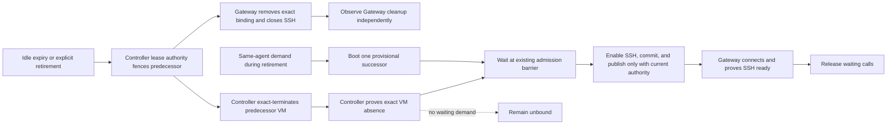

# Tool VM Retirement Authority Program Design

Date: 2026-08-03
Governing specification: [Tool VM Retirement Authority Specification](./2026-08-03-tool-vm-retirement-authority.md)

## Design in one view

The design makes retirement one Controller-owned per-agent transaction while keeping the shared Gateway Runtime binding map locally authoritative only for routing and SSH-client cleanup. OpenClaw and Hermes plugins remain adapters into that shared runtime.



The Gateway path and exact termination path are siblings after the Controller fence. A demand-driven successor may boot provisionally while predecessor destruction runs, preserving the current overlap. Exact predecessor absence releases the existing admission barrier; SSH enablement, current-lease commit, binding publication, routing, and active use remain downstream of that barrier. A reachable Gateway must still synchronously unroute and invoke close on its SSH client before acknowledging retirement. Old host resources remain quarantined until the existing exact cleanup proves release.

## Evidence-backed current system

| Current behavior | Source |
| --- | --- |
| Idle reaping calls `releaseLease`, and release holds the per-agent operation lock through `retirement.completion`. | `packages/agent-vm/src/controller/leases/lease-manager.ts:1600-1729`, `packages/agent-vm/src/controller/leases/idle-reaper.ts` |
| Resource cleanup awaits `managedVm.close()` before closing the retained host SSH access handle. | `packages/agent-vm/src/controller/leases/lease-manager.ts:638-652` |
| The current access-fence helper exact-terminates the process; logical lease fencing and physical destruction are not exposed as separate ordered phases. | `packages/agent-vm/src/controller/leases/lease-manager.ts:442-470` |
| A replacement VM can start provisionally before predecessor access fencing resolves, although it cannot pass the admission barrier to SSH publication. | `packages/agent-vm/src/controller/leases/lease-manager.ts:934-1000,1129-1156` |
| Lease retirement is published only after full destruction completion and is delivered through a fire-and-forget listener. | `packages/agent-vm/src/controller/leases/lease-manager.ts:676-720`; `packages/agent-vm/src/gateway/gateway-zone-orchestrator.ts:2463-2482` |
| The Controller binding coordinator retains one current identity per principal across control-connection changes. | `packages/agent-vm/src/controller/control-session/gateway-control-binding-publication.ts:100-225` |
| The Gateway clears all local binding slots on every accepted-session state change. | `packages/gateway-runtime/src/control-endpoint/gateway-control-published-binding-runtime.ts:205-226` |
| A missing exact predecessor is a `retirement_identity_mismatch`, which rejects the publication sequence before the successor publication. | `packages/gateway-runtime/src/control-endpoint/gateway-control-published-binding-runtime.ts:341-363` |
| Same-principal binding acquisition already coalesces one in-flight request and waits for current publication/SSH connect, but the pending entry is keyed only by principal and can therefore be inherited by a replacement connection. | `packages/gateway-runtime/src/control-endpoint/gateway-control-operation-active-use-runtime.ts:229-341,486-510` |
| Tool VM binding commands carry a shorter command expiry while their result wait may remain open for 180 seconds; the direct binding-request handler currently awaits the whole create/publish operation. | `packages/gateway-runtime/src/control-endpoint/gateway-control-operation-active-use-runtime.ts:233-252`; `packages/gateway-control-contracts/src/index.ts:1263-1275`; `packages/agent-vm/src/controller/control-session/gateway-control-domain-handler.ts:1475-1516` |
| Lease creation commits durable Controller authority before the publication coordinator revalidates connection authority, so a late eligible lease can already remain Controller-current and unbound without compensation. | `packages/agent-vm/src/controller/leases/lease-manager.ts:1010-1058`; `packages/agent-vm/src/controller/control-session/gateway-control-binding-publication.ts:142-205` |
| A binding request has a 180-second result timeout, and timeout closes the control connection. | `packages/gateway-control-contracts/src/index.ts:1273`; `packages/gateway-runtime/src/control-endpoint/gateway-control-application-message-runtime.ts:175-187` |
| Backend-neutral exact recorded-process termination already exists and fails closed when absence is unproven. | `packages/agent-vm/src/shared/controller-managed-vm-termination.ts`; `packages/managed-vm/src/managed-vm-process-termination.unit.test.ts` |
| OpenClaw and Hermes receive distinct managed plugin identities but the same Gateway Runtime service and Tool Portal admission material. | `packages/agent-vm/src/gateway/managed-gateway-runtime-input-builders.ts:64-79,137-207`; `packages/hermes-gateway/src/hermes-lifecycle.ts:120-153` |
| Hermes caches one active environment across successful terminal operations. Environment cleanup sends `sandbox.environment.close`; until then the shared Gateway Runtime continues the active-use heartbeat, and the Controller idle reaper excludes that lease. | `python/agent-vm-hermes-adapter/src/agent_vm_hermes_adapter/managed_gateway_bootstrap.py:629-665`; `python/agent-vm-hermes-adapter/src/agent_vm_hermes_adapter/managed_gateway_runtime_environment.py:503-523,601-612`; `packages/gateway-runtime/src/control-endpoint/gateway-control-operation-active-use-runtime.ts:431-493`; `packages/agent-vm/src/controller/leases/idle-reaper.ts:17-24` |

Installed Gondolin 0.12.0 waits for `forwardServer.close()` without actively destroying accepted SSH-forward sockets. The Gateway's persistent strict SSH client can therefore keep `ManagedVm.close()` pending until that client disconnects. This vendor behavior is a trigger, but the circular ownership ordering is ours to repair.

## Structural crux

Three concerns are currently collapsed into one completion:

1. Logical authority: prevent new work from using the retiring lease.
2. Derived Gateway cleanup: remove the route and close the persistent SSH client.
3. Physical destruction: terminate the exact VM process and prove absence.

Waiting for physical cleanup before requesting derived cleanup creates the circular wait. Treating control-connection identity as durable binding identity creates the later divergence. Reusing principal-only pending work across connection replacement and awaiting leaf work past command expiry lets one slow leaf operation rotate and disrupt the shared connection.

The chosen direction separates those phases inside existing owners. Idle/release retirement holds the existing per-agent lock only through exact absence proof; retained host-resource finalization is observed outside that lock. A demand-triggered replacement continues to use the same lock while its existing provisional successor passes the absence-gated admission barrier and commits current.

## Owners and dependency direction

| Owner | Owns | Must not own |
| --- | --- | --- |
| Tool VM lease authority runtime and lease manager | Current lease/leaf generation, logical fence, per-agent serialization, exact process target, absence proof, provisional boot and successor admission | Gateway-local map contents; control transport retry; whole-Gateway recovery |
| Binding publication coordinator | One accepted control connection's derived publication index, exact current/retired publications, and command/connection-authority revalidation | Durable lease truth; VM process destruction; a cross-connection binding cache; late-lease destruction |
| Gateway published-binding runtime | Current connection's local binding slots, synchronous ready-route removal, strict SSH client close, current/connecting/ready/retired state | Lease or generation authority; VM creation/destruction; cross-connection persistence |
| Existing per-agent operation lock | Serialize retirement and creation for one Gateway epoch plus agent | Global ordering across agents; persistent queuing |
| Existing exact process termination capability | Terminate only the recorded VM process identity and prove absence | Selection of which lease retires; Gateway map cleanup |
| Existing Gateway lifecycle | Replace or reboot a dead Gateway under existing policy | Repair this leaf communication race while the Gateway remains current |
| OpenClaw and Hermes framework plugins | Translate framework tool calls and attach to the shared Gateway Runtime UDS surface | Lease state, binding retirement, VM destruction, successor coordination, framework-specific recovery policy |

Dependency rule:

```text
Controller lease authority
  -> narrow binding-retirement collaborator
  -> Gateway connection-local binding runtime

Controller lease authority
  -> backend-neutral exact process termination

Gateway binding runtime -X-> lease creation or VM destruction

OpenClaw/Hermes plugin -X-> Tool VM lifecycle ownership
```

No native Gondolin handle crosses into lease, control-session, or Gateway Runtime domains.

## Current and proposed sequences

### Current failure

```mermaid
sequenceDiagram
    participant Reaper as Controller idle reaper
    participant Lease as Lease manager / per-agent lock
    participant VM as Gondolin Tool VM handle
    participant GW as Gateway binding + SSH
    participant Call as New tool call

    Reaper->>Lease: release old lease; take per-agent lock
    Lease->>VM: ManagedVm.close()
    VM-->>VM: wait for SSH forward connection to close
    Call->>Lease: request same-agent binding
    Lease-->>Call: waits behind lock
    Call--xGW: 180-second control result timeout
    GW->>GW: control connection changes; clear binding and close SSH
    GW-->>VM: accepted SSH socket closes
    VM-->>Lease: close completes
    Lease->>Lease: retirement event after destruction
    Lease->>VM: waiting request creates successor after caller failure
    Lease--xGW: old connection authority is stale
    Note over Lease,GW: Controller retains predecessor identity; Gateway map is empty
    Call->>Lease: later binding request
    Lease->>GW: retire predecessor under new connection
    GW--xLease: retirement_identity_mismatch
    Note over Call,GW: successor current publication never occurs
```

### Proposed retirement and on-demand replacement

```mermaid
sequenceDiagram
    participant Call as Same-agent calls
    participant Lease as Controller lease transaction
    participant Pub as Binding publication coordinator
    participant GW as Gateway binding runtime
    participant VM as Exact VM termination
    participant New as Provisional successor

    Lease->>Lease: fence L1 from new active use
    par orderly Gateway cleanup, not a successor gate
        Lease-)Pub: start exact B1 retirement for current connection
        Pub->>GW: retired(B1)
        GW->>GW: remove B1 from ready routing
        GW->>GW: close SSH1
        GW-->>Pub: applied, including an exact duplicate
    and authoritative destruction and successor path
        Lease->>VM: terminate exact recorded process for L1
        Call->>Lease: request work while transition is active
        Lease->>New: boot provisional L2 on demand
        Note over Call,New: existing per-agent lock and connection-scoped coalescing keep calls pending; L2 cannot enable SSH or commit
        VM-->>Lease: exact process absent
        Lease->>New: release existing admission barrier; keep old resources quarantined
        alt command and connection authority remain current
            New->>New: enable SSH and commit L2 current
            Lease->>Pub: publish current B2
            Pub->>GW: current(B2)
            GW->>GW: connect and probe SSH2
            GW-->>Pub: ready
            Pub-->>Call: release coalesced calls
        else command or connection authority expired
            New->>Lease: retain eligible L2 as Controller-current and unbound
            Lease-->>Call: bounded timeout/stale-authority result
            Call->>Lease: fresh current-authority request
            Lease-->>Call: reselect L2
            Lease->>Pub: publish current B2 under fresh authority
            Pub->>GW: current(B2)
            GW->>GW: connect and probe SSH2
            GW-->>Pub: ready
            Pub-->>Call: release fresh/coalesced calls
        end
    end
```

Idle retirement with no waiting demand follows only the fence, Gateway cleanup, exact termination, and retained resource finalization branches; it never enters provisional successor boot.

The two retirement branches may complete in either order. Required partial order:

```text
retirement-fenced
  < gateway-binding-unrouted
  < gateway-retirement-acknowledged

retirement-fenced
  < tool-vm-termination-started
  < tool-vm-absence-proven
  < successor-admission-released
  < successor-ssh-enabled
  < successor-current-committed
  < successor-binding-published
  < successor-ssh-ready
  < waiting-call-completed
```

`successor-provisional-boot-started` may occur after `retirement-fenced` and before `tool-vm-absence-proven`; it is intentionally outside the admission chain above. Gateway acknowledgement is useful orderly-cleanup evidence and may settle before or after exact process absence. Exact VM absence plus the logical fence is the non-negotiable successor-admission gate. `ManagedVm.close()`, port release, runtime-record deletion, and other predecessor finalization continue under the existing retained cleanup path; incomplete finalization keeps only the predecessor's resources quarantined.

For idle or explicit release without an already-demanded replacement, `tool-vm-absence-proven < per-agent-lock-released`; `retained-cleanup-completed` is deliberately outside that lock. For a replacement already running under the create transaction, absence releases its admission barrier and the same lock remains with that transaction through current-lease commit.

## Existing state, refined phases

No new durable state machine is introduced. The design makes existing authority phases observable at the internal collaboration seams.

| Phase | Controller lease authority | Gateway local binding | New same-agent call |
| --- | --- | --- | --- |
| Ready L1 | L1 current and usable | B1 ready | Uses L1 |
| Retirement fenced | L1 destroying/retiring; new use denied | B1 may exist for a bounded overlap | Waits behind per-agent transaction |
| Local binding retired | L1 still retiring | B1 not routable; SSH closing/closed | Still waits |
| Predecessor absent | L1 process absent; old resources quarantined while finalizing; successor admission barrier released | B1 retired, being retired, or connection-local state absent | May finish one already-provisional successor or create/select on demand |
| Unbound | No current routable leaf | No ready binding | First demand owns one transition |
| Provisioning L2 | L2 provisional and not routable | No B2 or B2 connecting | Coalesces; cannot execute |
| Ready L2 | L2 current | B2 SSH ready | Waiting calls proceed |
| Current L2, unbound | L2 current, live, and eligible; stale request cannot publish it | No B2 for the current accepted connection | Current-authority demand reselects and publishes L2 |
| Absence unproven | Retiring leaf retained and fenced; TCP slot quarantined | Old binding unavailable or degraded | Fails boundedly; no successor routing |

## Internal interface contracts

### Awaitable exact binding retirement

The current post-cleanup fire-and-forget retirement listener is insufficient for ordered retirement. Replace its semantic role with one narrow internal collaboration owned by Controller composition:

```text
retireTrackedBinding({
  connectionPublicationAuthority,
  leaseId,
  reason
})
  -> publication-applied
   | not-tracked-on-current-connection
```

Contract:

- Lease authority calls it only after the old lease is logically fenced.
- `publication-applied` means the Controller tracked the exact binding on this accepted connection and the Gateway acknowledged the existing retirement publication. The Gateway removes the exact slot from ready routing and invokes synchronous client close before that acknowledgement.
- `not-tracked-on-current-connection` is a Controller-local result. It means this accepted connection never published the predecessor, so there is no local Gateway binding to retire. It adds no wire-protocol result and does not weaken Gateway identity matching.
- An unavailable or stale connection rejects the existing publication operation. That failure cannot block exact VM termination or grant successor authority.
- `retirement_identity_mismatch` remains a real Gateway invariant failure when a retirement publication names a different binding inside one accepted connection. Connection rotation is handled by clearing the Controller's derived index, not by weakening identity comparison.
- The result is observed for cleanup evidence, but neither acknowledgement nor host-resource finalization holds the same-agent successor gate after exact process absence.

### Connection-scoped publication index

`currentBindingByPrincipal` is derived publication state and MUST be scoped to the exact accepted control connection authority. Before request or retirement work uses the index, the coordinator compares the supplied authority with the index authority and clears the index when the accepted connection changes.

The existing Controller in-flight entry remains tagged with its exact publication authority and is reused only by the same principal under that same authority. Work from a replacement connection does not wait on or adopt the stale connection's derived publication work. The durable Controller lease remains the source of truth. Therefore the first demand on a new connection may publish the still-current lease without first retiring a predecessor binding that the new Gateway connection does not contain.

### Late eligible lease retention

No compensation interface or state is added. Lease creation already commits Controller lease authority before the publication coordinator's post-create connection check. The coordinator adds command-expiry revalidation at that same boundary:

```text
create or select exact lease
  -> command or connection authority still current
       -> publish current binding
  -> authority expired
       -> do not publish
       -> retain an otherwise eligible lease Controller-current and unbound
       -> return the command's existing timeout/stale result
```

A new request enters through normal lease selection. The lease-manager per-agent lock either waits for ongoing creation or observes the committed eligible lease and returns it. Current publication authority then publishes that exact lease. Destroying the late lease would add a second destructive race and could remove the healthy Controller-current lease selected by the new request.

### Waiting-call boundary

No new queue or lock is added. The existing Controller lease-manager per-agent lock serializes lease mutations. The existing Controller binding-coordinator `inFlightByPrincipal` entry already coalesces only matching principal-and-publication-authority work. The Gateway pending-binding entry is changed from a principal-only promise to a record containing the stable principal, exact accepted session, and promise; it is reused only when both principal and accepted session match. Current publication already waits for strict SSH connect before the binding becomes ready.

The two in-scope leaf-creating commands, `tool_vm_binding_request` and `lease_reacquire`, receive the command's existing `expiresAtMs` at their current Controller owners and race only the caller-visible response against that deadline. Expiry prevents stale publication and returns an existing timeout/unknown-side-effect result before the 180-second result wait can rotate the shared connection; it does not cancel or destroy lease work already owned by the lease manager. An eligible late-created or late-reacquired lease remains Controller-current and unbound for current-authority selection/publication. The transition adds no unbounded internal wait, general cancellation framework, or application-command replay.

### Idle/release lock boundary

The current `releaseLease` path holds the per-agent operation lock through `retirement.completion`, which includes `ManagedVm.close()` and retained host-resource finalization. The target path awaits only `retirement.accessFenced` inside that lock. `accessFenced` already means the exact recorded predecessor process is proven absent. The lock then releases so later demand can select or create a lease; `retirement.completion` remains observed outside the lock, and its existing TCP-slot quarantine/runtime-record retention handles incomplete finalization.

## Failure, concurrency, and recovery

| Interleaving or fault | Required handling | Smallest proof seam |
| --- | --- | --- |
| Gateway retirement acknowledgement is delayed | Exact process termination proceeds after logical fence; exact absence releases the idle/release per-agent lock or the demanded replacement admission barrier while Gateway cleanup remains independently observed. | Controllable retirement-ack promise plus exact-termination event. |
| Gateway connection is unavailable | Controller destroys exact VM; publication index is cleared with connection authority; later demand starts unbound. | Fake unavailable publisher plus exact process capability. |
| Gateway receives retirement while SSH connect is pending | Exact slot version is removed before close; late connect completion cannot restore it. | Delayed strict-client connect callback. |
| Control connection rotates after Gateway removed B1 | Old publication work is fenced; new connection starts with empty derived index; it does not publish B1 retirement. | Two accepted connection authorities and delayed old callback. |
| Duplicate retirement arrives | Same exact retired identity is idempotent; a different current identity remains protected. | Gateway binding-runtime unit matrix. |
| Caller authority expires before L2 creation | No L2 starts; request fails stale. | Admission barrier before provisioning. |
| Command or connection authority expires after L2 starts | Stale work cannot publish. Eligible L2 may finish as Controller-current and unbound; current authority reselects and publishes it. | Delayed VM readiness, command-expiry barrier, authority rotation, and fresh request. |
| C1 pending binding fails while the first C2 call arrives | C2 does not inherit C1's promise because Gateway coalescing matches both principal and accepted session. | Two accepted sessions and delayed C1 rejection. |
| Leaf creation/selection outlives command expiry | The command returns an existing timeout result before the longer response timer; the shared connection remains usable and leaf work settles under lease authority. | Injected clock/deadline with a held create promise and an unrelated-principal command. |
| Two same-agent calls arrive during L1 retirement | One per-agent transaction and one in-flight binding request; both share L2 readiness/outcome. | Concurrent promises with event barriers. |
| A call selected ready B1 immediately before L1 was fenced | Existing `lease_use_start` rejection (`lease_absent` or `lease_releasing`) triggers the existing one-shot binding-recovery path; the call joins the coalesced transition rather than failing only because retirement started. | Delayed fence between ready lookup and use-start response. |
| A degraded ready binding enters `lease_reacquire` | Reacquire uses the same command-expiry containment as binding request. If it completes in time, binding recovery publishes under the accepted session; if leaf work is late, the command returns boundedly and the eligible current lease remains unbound for a current-authority request. | Existing `lease_reacquire` entry with command-expiry, session-rotation, retained-lease, and publication barriers. |
| Different-agent call arrives | Separate lock/principal key; it completes without waiting for L1. | Two-principal integration fixture. |
| No demand follows idle expiry | L1 is destroyed and no successor is provisioned. | Reaper-only integration path. |
| L1 absence cannot be proven | L1 remains fenced, cleanup evidence retained, TCP resources quarantined, and L2 is not routable. | Exact termination failure fixture. |
| Gateway dies during the transition | Existing Gateway lifecycle owns reboot/replacement; this transaction remains fenced and does not create a second lifecycle owner. | Existing lifecycle boundary assertion; no new restart call. |
| OpenClaw invokes the shared runner after an environment has released active use | The idle-eligible lease follows the shared retirement transaction and on-demand replacement; no adapter-specific retirement branch exists. | Parameterized composition coverage plus real OpenClaw before/after-idle E2E. |
| Hermes invokes the shared runner while its cached environment remains active | The same binding/lease code serves the operation, active-use heartbeat keeps the lease non-idle, and no adapter-specific retirement branch exists. | Active-use/idle-reaper tests plus the existing real Hermes control-recovery Tool VM E2E. |

## Deterministic production simulation

The integration fixture composes the real lease manager, binding-publication coordinator, Gateway published-binding runtime, active-use acquisition runtime, Gateway control-session command-result wait and response-failure close path, and Controller connection-authority checks. The red-path `binding-result-timeout-observed` and `control-connection-rotated` events MUST arise from that real command-result timeout and close mechanism through its injected timeout seam, not from harness-scripted events. VM/process and SSH transport edges may be controllable fakes; timers use injected clocks and protocol barriers.

Each barrier appends one redacted record:

```text
sequence
event
agentKey
leaseId
leafGeneration
connectionGeneration
```

Required event vocabulary:

```text
lease-idle-expired
retirement-fenced
gateway-binding-retirement-requested
gateway-binding-unrouted
gateway-ssh-close-started
gateway-ssh-close-completed
gateway-retirement-acknowledged
tool-vm-termination-started
tool-vm-absence-proven
waiting-acquire-observed
successor-provisional-boot-started
binding-result-timeout-observed
control-connection-rotated
stale-binding-publication-rejected
connection-authority-expired
command-expiry-returned
late-successor-retained-unbound
fresh-acquire-admitted
fresh-authority-reselected-lease
successor-admission-released
successor-ssh-enabled
successor-current-committed
successor-binding-published
successor-ssh-ready
lease-reacquire-observed
lease-reacquire-command-expiry-returned
rejected-use-binding-recovery-observed
waiting-call-completed
```

The assertion checks partial-order constraints because Gateway SSH cleanup and exact process termination intentionally overlap. In addition to the absence-gated order above, it asserts `gateway-binding-unrouted < gateway-ssh-close-started < gateway-retirement-acknowledged`; SSH close completion may occur on either side of acknowledgement according to the synchronous client-close contract. The red path also asserts `waiting-acquire-observed < binding-result-timeout-observed < control-connection-rotated < stale-binding-publication-rejected`, with the changed `connectionGeneration` proving that the rejection occurred on the replacement connection. The emitted log is printed on failure and retained in test evidence. It contains identities and phases, not secrets, SSH keys, command bodies, or unrestricted errors.

This simulation must first reproduce the current failure shape: retirement blocked by the held SSH client, a waiting request reaching the 180-second-shaped result timeout, connection rotation, a late lease, and a poisoned next request. The green version must show early command-expiry containment without connection rotation, an eligible late lease retained unbound, current-authority reselection/publication, the `lease_reacquire` and rejected-use recovery entries, and a later successful call. This is the missing causal proof for the Sunfam incident.

## Alternatives considered

| Alternative | Gain | Cost or unresolved failure | Decision |
| --- | --- | --- | --- |
| Close only the Controller-retained SSH access before `ManagedVm.close()` | Very small cleanup-order edit; may unblock the installed Gondolin forward server. | Does not order Gateway map fencing, fix connection-scoped identity divergence, contain command expiry, or prevent stale publication. It cannot satisfy U2, U3, or U6 alone. | Rejected as incomplete. Its close ordering may still be part of resource finalization. |
| Change Gondolin to destroy every accepted forward socket on close | Fixes the vendor-level close wait for all consumers. | Cross-repository/provider change; does not repair Controller/Gateway authority or stale completion. Wider blast radius and independent release train. | Deferred as useful upstream hardening, not this fix's authority model. |
| Wait for Gateway acknowledgement, then terminate VM | Gives orderly local cleanup when communication works. | Recreates a Controller dependency on the impaired communication path and can stall forever. | Rejected. Request and exact termination are sibling actions after the fence. |
| Exact-terminate VM only, infer Gateway cleanup from transport failure | Breaks the circular wait with existing capability. | Leaves the old binding routable until asynchronous transport failure and makes local cleanup observational rather than explicit. | Rejected as incomplete. |
| Restart the Gateway on retirement failure | Clears all local bindings. | Disrupts healthy framework/channel/model work and conflates leaf failure with Gateway death. | Rejected by U5. |
| Add a recovery supervisor or durable transition queue | Could coordinate retries across processes. | Duplicates existing per-agent serialization and lifecycle owners; adds persistence and recovery policy not required by this incident. | Rejected by U5. |
| Destroy every lease whose requesting command expires | Returns to an unbound state by force. | Can destroy a healthy Controller-current lease that a newer request validly selects; adds destructive compensation and cross-request coordination not required by the incident. | Rejected as unsafe and unnecessary. |
| Existing owners plus an awaitable tracked-binding retirement collaboration, exact termination, connection-scoped derived indexes/pending work, command-expiry containment, and retention of eligible late lease authority | Solves the observed failure links using current state owners and proof seams. | Adds one narrow internal retirement result and explicit expiry revalidation; keeps existing provisional boot overlap while delaying only SSH enablement/commit/publication until predecessor absence. | Selected. |

The design preserves the existing provisional startup overlap. Correctness pays only the already-present admission wait: SSH enablement, current commit, publication, and routing remain after exact predecessor absence. Revisit only if measured live replacement latency still exceeds command expiry after this ordering is proven; do not introduce another queue, cancellation framework, or speculative lifecycle owner.

## Proof architecture

| Layer | Required proof | Real boundaries |
| --- | --- | --- |
| Unit | Logical fence ordering; idle/release lock release at exact absence; exact retired/mismatch behavior; connection-scoped index and pending-request reset; binding-request and `lease_reacquire` command-expiry publication guards; eligible late-lease retention; no SSH enablement/commit/publication before absence | Pure state, injected clock, controllable promises, fake exact-process capability |
| Integration | Full event-log simulation; delayed/unavailable acknowledgement; held SSH close; red-path connection rotation; green-path command-expiry containment; late lease reselection; `lease_reacquire`; rejected-use recovery; concurrent same/different principals; no-demand; absence-unproven | Real lease manager, publication coordinator, Gateway binding runtime, active-use runtime, and authority checks; VM/SSH edges controllable |
| OpenClaw E2E | One real tool call succeeds, lease idle-expires, old binding/VM retires, next real tool call succeeds on a successor while the same Gateway stays live | Real controller, QEMU Gateway, OpenClaw plugin, shared Gateway Runtime, Tool Portal, Tool VM, and SSH; no skips |
| Hermes E2E | A real Tool VM operation succeeds through the shared runtime after control-connection recovery while the same Hermes Gateway and framework stay live; the proof does not force-close the cached active environment to manufacture idle eligibility | Real controller, QEMU Gateway, Hermes plugin, shared Gateway Runtime, Tool Portal, Tool VM, and SSH; no skips |
| Quality | Repository taxonomy, lint, typecheck, format, and full scoped gate remain green | Current monorepo toolchain |

The OpenClaw idle-retirement proof may use a test-configured short idle TTL. It must wait on lease and protocol events, not sleep between probes. It must report the old/new lease identities, exact predecessor absence, same Gateway identity, and successful command result without printing secrets. The Hermes control-recovery proof follows its row above and does not require predecessor/successor identities while its cached environment remains active.

## Requirement realization

| User requirement | Structural realization | Proof |
| --- | --- | --- |
| U1 | Per-agent retirement transaction plus on-demand successor after absence, shared by OpenClaw and Hermes | V1, V4, V6, V10, V11 |
| U2 | Lease-authority fence, exact process termination, absence gate, and stale-publication guard that preserves eligible lease authority | V2, V5 |
| U3 | Awaitable exact binding retirement; Gateway unroute before SSH close acknowledgement | V3 |
| U4 | Existing per-agent lock and Gateway principal coalescing; ready only after SSH connect | V4 |
| U5 | Existing owners and capabilities; framework plugins remain adapters; no new lifecycle, persistence, or public protocol | V6, V7, V10 |
| U6 | Composed red/green integration event log, real OpenClaw idle-expiry E2E, and real Hermes shared-runtime control-recovery E2E | V8, V9, V11 |

## Boundary check 2

The design remains inside boundary check 1:

- No new persistent state, controller, supervisor, queue, database, public route, compatibility path, or Gateway restart rule.
- Durable authority remains in the existing lease runtime. Gateway and Controller publication maps are derived; the target change scopes the Controller index and Gateway pending-binding work to the accepted connection.
- Existing per-agent locking and binding-request coalescing own overlap; no second concurrency mechanism is added.
- The only new structural seam is a narrow awaitable tracked-binding retirement result plus command-expiry revalidation on the existing binding request.
- Exact process termination is reused rather than exposing Gondolin handles or depending on stock `ManagedVm.close()` for fencing.
- Control reconnect preserves a current lease when valid and does not itself create a replacement.
- Provisional successor boot overlap remains; predecessor absence still gates SSH enablement, commit, publication, routing, and use.
- OpenClaw and Hermes share the same Controller/Gateway Runtime correction; their plugins gain no lifecycle state or recovery policy. Proof follows each adapter's real lifecycle: OpenClaw reaches idle retirement, while Hermes retains active use until cached-environment cleanup.
- The deterministic event log is test evidence, not authority or a new production control plane.

The remaining implementation choice is local placement of the narrow collaboration so package dependency direction stays unchanged. Planning may map it to current composition seams; it may not invent a new owner or broaden the contract.
