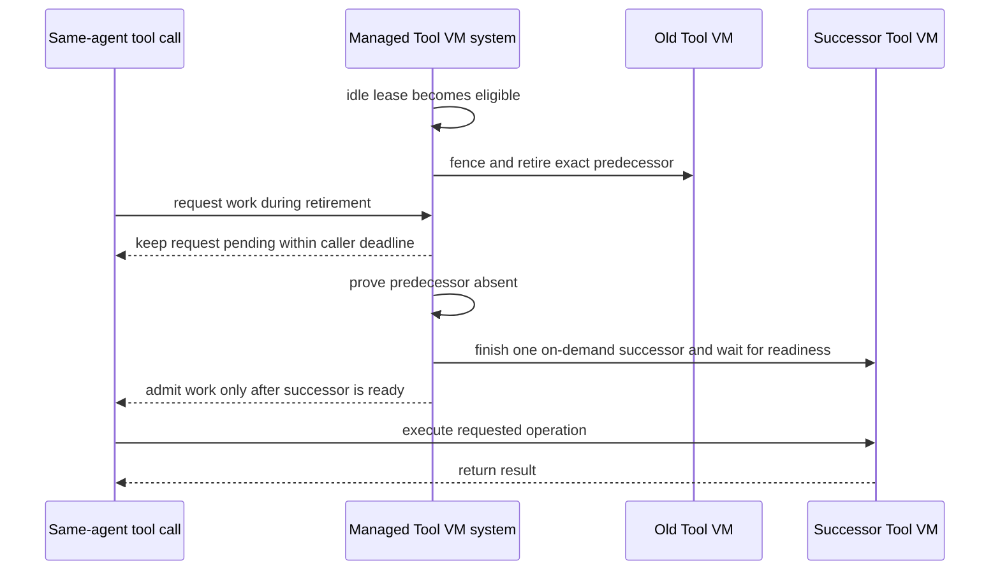

# Tool VM Retirement Authority Specification

Date: 2026-08-03
Scope: managed OpenClaw and Hermes Tool VM retirement, replacement, and binding recovery

Governing requirements: [Tool VM Retirement Authority Requirements](./2026-08-03-tool-vm-retirement-authority-requirements.md)

## The user problem

An otherwise healthy managed OpenClaw or Hermes Gateway can permanently lose Tool VM-backed file and shell tools when a Tool VM crosses idle expiry at the same time as a new tool call. The first call waits for three minutes and fails; later calls fail almost immediately. Restarting the Gateway repairs too much and hides a leaf lifecycle defect.

The user needs the intermediate period to behave as a bounded transition: the old Tool VM becomes unavailable, one replacement becomes ready if work is waiting, and the waiting work continues. The transition must not leave a live but unreachable Tool VM or poison all later binding requests.

## Confirmed production reality

The observed incident occurred through OpenClaw. The aligned 0.0.130 deployment successfully opened Tool VM environments through `2026-08-03T14:05:17Z`. With a 100-minute idle TTL, the first later open started at `16:05:10Z`, failed after 180.102 seconds, and coincided with control-connection loss and a 272 ms reconnect. A replacement lease was persisted 2.314 seconds after the caller had already failed. Every later file or shell open failed in 89-134 ms while the replacement QEMU process and Gateway readiness remained live.

Hermes was not part of that production incident. It is an affected consumer because its `hermes-managed-plugin` attaches to the same managed Gateway Runtime, which owns the published binding map, strict Tool VM SSH client, active-use acquisition, and Controller binding protocol. This specification requires shared behavior and separate proof; it does not claim a second observed Hermes incident.

Current source explains a complete interleaving that fits those observations:

```text
idle lease becomes eligible for retirement
  -> Controller retirement waits for full VM close
  -> full VM close waits for the Gateway-held SSH connection
  -> a new same-agent binding request waits behind retirement
  -> its 180-second binding-result timeout closes the control connection
  -> Gateway connection rotation clears the SSH binding
  -> old VM close finally completes
  -> waiting lease creation completes after caller authority expired
  -> Controller and Gateway binding identities diverge
  -> later binding requests fail before a usable binding is published
```

The missing retained inner production logs mean source attribution is not yet final proof. V9 requires the deterministic composed reproduction that closes that evidence gap.

## Required outcomes

1. Idle retirement cannot permanently disable Tool VM-backed work.
2. The Controller fences and destroys one predecessor before admitting one routable successor.
3. The Gateway removes the retiring binding from local routing and closes its SSH client when it receives the exact retirement request.
4. Same-agent calls arriving during the transition wait within their existing caller deadline and share one result.
5. Expired command or control-connection authority cannot publish a stale binding or poison later requests; an otherwise eligible late lease remains Controller-current and unbound until current authority republishes it.
6. A control reconnect reconciles derived binding state without replacing a healthy Tool VM solely because reconnection occurred.
7. OpenClaw and Hermes obtain the same guarantee through the shared Gateway Runtime without framework-specific retirement ownership.
8. The full interleaving is reproducible without wall-clock sleeps and observable as an ordered test event log.

## Normative requirements

### R1 — Retirement has explicit triggers

A Tool VM lease MUST enter retirement only because it is idle-expired, explicitly released, proven unhealthy, superseded for a compatible new request, or owned by a retiring Gateway. Completion of an ordinary tool call MUST NOT retire the lease.

When retirement starts, the Controller MUST preserve the exact predecessor lease, leaf generation, VM process identity, and Gateway epoch needed to fence and destroy only that predecessor.

### R2 — The Controller fences admission first

Before any retirement side effect may expose a successor, the Controller MUST make the predecessor unavailable for new active use under its existing per-agent authority boundary.

Once fenced, no new operation may acquire the predecessor even if its process or Gateway-local binding still exists temporarily.

### R3 — Gateway retirement is local, exact, and acknowledged

When a reachable Gateway receives a retirement publication for its exact current binding, it MUST remove that binding from ready routing before initiating local SSH close and before acknowledging the publication.

Duplicate retirement for the same already-retired identity MUST be idempotent. A retirement for a different current identity MUST remain rejected. Connection rotation MUST NOT make the Controller repeatedly publish an unprovable predecessor retirement under the new connection authority.

### R4 — VM destruction cannot depend indefinitely on Gateway cooperation

After Controller admission is fenced, the Controller MUST initiate exact predecessor process termination without waiting indefinitely for Gateway retirement acknowledgement or Gateway SSH close.

The Gateway retirement request and Controller exact termination MAY overlap. Successor admission requires the logical fence and Controller proof that the exact predecessor process is absent. It MUST NOT wait indefinitely for Gateway acknowledgement, `ManagedVm.close()`, or old host-access finalization. Those old resources remain quarantined and are finalized under the existing exact cleanup path; they cannot be reused until cleanup proves release. If process absence cannot be proven, the affected agent remains fenced and no successor may become routable.

### R5 — Replacement is one bounded per-agent transition

For one stable agent principal and one accepted control connection, retirement, successor selection or creation, binding publication, and SSH readiness MUST use the existing lease-manager per-agent lock, Controller binding-coordinator in-flight slot, and Gateway binding-request coalescing. The lease lock protects lease mutations. Controller and Gateway request coalescing MUST reuse work only when both the stable principal and accepted connection authority match.

Calls that arrive while this transition is active MUST coalesce behind it and remain pending only within their existing outer call deadline. They MUST NOT create parallel successors or receive a binding before successor SSH readiness. Operations for unrelated agent principals MUST remain independent.

A replacement connection MUST NOT inherit or await a failed pending-binding promise from the predecessor connection. It MAY start its own publication request against durable Controller lease authority; the lease-manager lock serializes any overlapping lease selection or creation.

If no demand exists after idle retirement, the agent MUST remain unbound; idle retirement alone MUST NOT eagerly create a successor.

### R6 — Expired request authority cannot publish stale derived state

Successor work MUST revalidate the exact requesting control connection and command-expiry authority before publication and after every asynchronous boundary that can outlive that authority.

If authority expires after Tool VM creation or selection starts but before a current binding is established, that stale request MUST return within the existing command-expiry bound and MUST NOT publish a binding. If the late lease is otherwise current, live, and eligible under Controller authority, it MUST remain current but unbound. A request carrying current authority reselects that lease and publishes it; stale authority MUST NOT destroy a lease that a newer request may validly adopt.

### R7 — Connection rotation reconciles derived state

The Gateway binding map and the Controller's publication-tracking index are derived from one accepted control connection. When that connection changes, both sides MUST discard connection-local routing claims.

The Controller's durable lease authority remains intact across connection rotation. On later demand, the new connection MAY republish the still-current lease if it remains eligible, or create a successor if the old lease retired. Reconnection alone MUST NOT force Tool VM replacement.

### R8 — Failures stay contained and recoverable

A delayed or unavailable Gateway retirement acknowledgement, SSH close error, control connection rotation, duplicate retirement, stale late completion, command expiry, or concurrent same-agent call MUST NOT poison later requests permanently.

If the transition cannot prove predecessor absence or successor readiness before command expiry, the affected command receives one bounded failure before the longer control-result timeout can rotate the shared connection. The authoritative state remains fenced or current-but-unbound so a later call can retry. The failure MUST NOT restart a healthy Gateway or affect unrelated agents.

### R9 — The production interleaving has deterministic evidence

The composed integration proof MUST use controllable protocol and lifecycle barriers rather than sleeps. It MUST emit a redacted ordered event log containing stable event names and lease/generation identities sufficient to inspect the interleaving.

The proof MUST cover the original three-minute-shaped dependency without waiting three wall-clock minutes: idle expiry, retirement fencing, Gateway-local unroute/SSH close, exact process termination, a waiting acquire, command expiry before the longer response timeout, control-connection rotation in the red path, stale authority during successor work, an eligible late lease retained unbound, a fresh authorized request, lease reselection/publication, successor readiness, the existing `lease_reacquire` path, and successful tool completion.

### R10 — Framework adapters remain consumers, not lifecycle owners

The shared managed Gateway Runtime and Controller path MUST own Tool VM retirement, binding reconciliation, exact destruction, and successor readiness for both OpenClaw and Hermes.

The `openclaw-managed-plugin` and `hermes-managed-plugin` MUST remain framework attachment and tool-call adapters. They MUST NOT implement separate lease state, VM destruction, retirement retry policy, or replacement coordination.

### R11 — Real behavior is proven across idle expiry

The final proof MUST run once through a real controller, real OpenClaw Gateway VM and plugin, real Tool Portal path, real Tool VM, and real Gateway-to-Tool-VM SSH connection, and once through the equivalent real Hermes Gateway VM and plugin path. Each proof MUST demonstrate a successful Tool VM operation before idle expiry and another successful operation after retirement/replacement, with no skipped tests.

The live proof MUST establish that the same Gateway remains running. Inventory-only, fake-VM, or schema tests do not satisfy this requirement.

## Observable transition



## Required failure behavior

| Situation | Required caller-visible and retained outcome |
| --- | --- |
| Gateway receives exact retirement | Old binding is immediately unavailable locally; SSH close begins; acknowledgement follows local removal. |
| Gateway cannot receive retirement | Controller still exact-terminates the VM; affected principal stays fenced until absence is proven. |
| Same-agent call arrives during retirement | It shares matching-authority work and succeeds if readiness fits its deadline; otherwise it receives one bounded failure and a later call succeeds without operator recovery. |
| Two same-agent calls arrive together | One retirement/replacement occurs; both observe the same ready generation or bounded failure. |
| Different-agent call arrives | It proceeds through its own per-agent authority without waiting on this retirement. |
| Control connection changes after local binding removal | Connection-local indexes are cleared; the new connection does not replay a predecessor retirement that it cannot prove locally. |
| Command or connection authority expires during creation | The stale request returns within command expiry and cannot publish. An otherwise eligible late lease remains Controller-current and unbound for reselection by current authority. |
| Exact predecessor absence is unproven | No successor is routed; later calls may retry after authoritative cleanup, and the Gateway is not restarted by this slice. |
| No demand follows idle retirement | The system remains cleanly unbound with no replacement VM. |

## Proof obligations

| ID | Obligation | Required evidence |
| --- | --- | --- |
| V1 | U1, R1: idle expiry becomes a recoverable transition | Deterministic lease/retirement test plus live before/after-idle proof. |
| V2 | U2, R2, R4: Controller fence and exact absence gate successor | Unit state-transition tests and integration process-absence barrier. |
| V3 | U3, R3: Gateway unroutes before SSH close acknowledgement | Gateway binding-runtime unit test with ordered callbacks. |
| V4 | U4, R5: same-agent calls coalesce; unrelated agents do not block | Deterministic concurrency integration test. |
| V5 | U2, R6: stale late completion cannot publish or destroy an eligible current lease | Red/green integration test expiring command/control authority during creation, retaining the late lease unbound, and republishing it under fresh authority. |
| V6 | U1, U5, R7: connection rotation cannot poison later publication | Pair integration test spanning old and new accepted connection identities. |
| V7 | U5, R8: failure remains leaf-scoped and returns before shared-connection rotation | Fault matrix proving command-expiry containment, no Gateway restart, and independent-agent progress. |
| V8 | U6, R9: complete interleaving is inspectable | Ordered redacted event log asserted by partial-order constraints, not sleeps. |
| V9 | U6, R9: source explanation reproduces the production shape | One composed red-path/green-path integration simulation including blocked retirement, response-timeout rotation in the red path, command-expiry containment in the green path, retained late authority, fresh publication, `lease_reacquire`, and next-call recovery. |
| V10 | U1, U5, R10: both framework plugins remain consumers of shared lifecycle | Composition and boundary tests proving no framework-specific retirement owner. |
| V11 | U1, U6, R11: real product paths recover after idle | No-skip OpenClaw and Hermes E2E proofs through their real plugins, shared Gateway Runtime, QEMU Tool VM, and SSH. |

## Requirement coverage

```text
U1 -> P1 permanent post-idle outage -> R1,R5,R7,R8,R10,R11 -> V1,V4,V6,V7,V10,V11
U2 -> P2 ambiguous destruction/successor authority -> R2,R4,R6 -> V2,V5
U3 -> P3 Gateway-held SSH blocks cleanup -> R3,R4 -> V3,V2
U4 -> P4 calls observe intermediate state -> R5,R8 -> V4,V7
U5 -> P5 leaf fault expands into broad or framework-specific recovery machinery -> R7,R8,R10 -> V6,V7,V10
U6 -> P6 incident attribution lacks inner logs -> R9,R11 -> V8,V9,V11
```

## Non-goals

- Change package or managed-image versioning.
- Replace a healthy Gateway, OpenClaw process, Hermes process, or controller for a Tool VM retirement failure.
- Replace Tool VMs on an ordinary control reconnect.
- Add command replay beyond existing independent idempotency authority.
- Add retirement state or replacement policy to the OpenClaw or Hermes framework plugin.
- Add a persistent transition queue, supervisor, database, or new public API.
- Treat process existence, lease state, or a green control heartbeat as proof that a Tool VM operation succeeded.
- Solve unrelated web-fetch, Firecrawl, cron, or broad health-reporting defects in this focused change.
