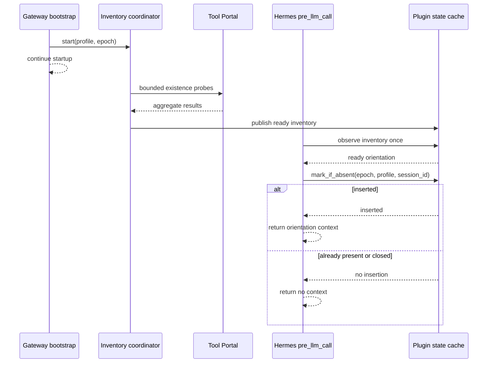

# Hermes Tool Portal Orientation Program Design

Specification authority: [`specification.md`](specification.md)

## Structural overview

```text
managed Gateway bootstrap
  └── managed Tool Portal runtime
      ├── PluginStateCache[InventoryKey, InventoryValue]
      ├── inventory coordinator
      ├── orientation renderer
      └── PluginStateCache[InjectionKey, InjectionMarker]
              ^
              |
         pre_llm_call hook
```

The hook returning orientation is the complete injection lifecycle.

## Ownership

| Component | Responsibility | Reason to change |
| --- | --- | --- |
| `PluginStateCache[TKey, TValue]` | Generic atomic keyed state, single-flight population, nonblocking snapshots, close, and bounded eviction diagnostics | Generic process-local state semantics change |
| Inventory coordinator | Start and resolve one profile/epoch inventory with retry, deadline, and failure logging | Inventory policy or Portal probe contract changes |
| Orientation renderer | Convert one ready inventory into the deterministic bounded model-facing block | Orientation content or byte budget changes |
| Injection state | Atomically record whether one complete injection identity has been used | Session-once identity or atomicity changes |
| Hermes hook adapter | Validate hook/profile inputs, sample inventory, atomically mark, and return context | Hermes `pre_llm_call` boundary changes |
| Managed Gateway bootstrap | Construct the epoch runtime and eagerly start each admitted profile inventory | Gateway startup composition changes |

## Typed state

All consumer-visible models are frozen Pydantic-v2 models.

```text
InventoryKey
  gateway_epoch
  admitted_profile_identity

InjectionKey
  gateway_epoch
  admitted_profile_identity
  exact_session_id

InjectionMarker
  injected = true
```

`admitted_profile_identity` binds the Hermes profile name, managed agent
identity, Tool Portal profile assignment, and assignment revision already
available from the admitted projection. Keys are immutable and hashable.

Inventory values retain only the admitted namespace names, their availability,
the rendered orientation or a typed render failure, and bounded attempt metadata.
They retain no capability summaries or user content.

Injection state stores only the presence of the complete `InjectionKey`.

## Generic cache operations

The generic cache owns synchronization. Domain code uses narrow typed operations:

```text
observe(key) -> unresolved | populating | ready | failed | evicted
populate_single_flight(key, producer) -> shared terminal result
mark_if_absent(key, marker) -> inserted | already_present | closed
close(reason) -> tuple[EvictionRecord, ...]
```

`mark_if_absent` holds the key's cache synchronization boundary across the
absence check and insertion. This makes concurrent first turns linearizable:
exactly one receives `inserted`.

The cache's bounded eviction journal is diagnostic. Live injection marks remain
until runtime close; the Gateway epoch bounds their validity.

## Startup inventory call path

```text
Gateway bootstrap
  -> connect managed Gateway Runtime client
  -> receive admitted profile projections
  -> construct one plugin runtime for the Gateway epoch
  -> submit one inventory task per admitted profile
  -> continue Gateway startup without awaiting those tasks

inventory task
  -> split projected namespaces into bounded Portal aggregate batches
  -> for each namespace request tool_portal_list(namespace, limit=1, cursor=None)
  -> validate the complete aggregate attempt
  -> on success classify all names and render orientation
  -> on retryable failure log and retry while attempts/deadline remain
  -> on retry/deadline/malformed exhaustion publish a ready all-unavailable value
  -> on invalid or withdrawn authority publish terminal failure without orientation
```

The inventory coordinator owns its futures and cancellation. One initial attempt
plus two retries share one deadline measured at task start. Attempt completion
racing with runtime close cannot publish because the cache generation/closed
state rejects late publication.

## Session call path

```text
Hermes pre_llm_call(epoch, projection, session_id)
  -> validate current admitted profile context
  -> build InventoryKey
  -> observe inventory exactly once
  -> unresolved/terminal authority failure/evicted: return no context
  -> ready without rendered orientation: return no context
  -> ready: build InjectionKey
  -> mark_if_absent(InjectionKey, InjectionMarker)
       inserted        -> return {"context": orientation}
       already_present -> return no context
       closed          -> return no context
```

This path performs bounded process-local work only. It does not call Tool Portal,
await a future, start inventory, inspect provider messages, or register delivery
cleanup hooks.

Once `mark_if_absent` returns `inserted`, the state remains marked even if Hermes
or a provider later rejects the turn. That is intentional: the plugin promised
one injection attempt through its owned hook, not a provider delivery protocol.

## Concurrency and validity

- Concurrent inventory starts for one `InventoryKey` collapse through cache
  single flight.
- A turn samples inventory once. Readiness immediately after an unresolved
  sample is visible only to a later turn.
- Concurrent ready turns for one `InjectionKey` race only at `mark_if_absent`;
  exactly one returns orientation.
- Different profiles, session IDs, and Gateway epochs use different keys.
- Runtime close invalidates both cache instances and rejects late inventory
  publication or injection marking.
- No within-epoch refresh or invalidation exists in this version.

## Failure behavior

| Failure | Containment |
| --- | --- |
| Portal request, timeout, or malformed aggregate result | Discard the complete attempt, log bounded metadata, retry within the shared budget |
| Retry, deadline, or malformed-response budget exhausted | Publish a ready `InventoryReadyValue` marking every projected namespace unavailable and render its injectible unavailable orientation; user turns continue |
| Invalid or withdrawn profile authority | Publish terminal `ExhaustedState` with `invalid_authority`; suppress orientation and keep user turns running |
| Render cannot fit | Store typed render failure; user turns return no context and do not mark |
| Inventory unresolved when a turn arrives | Return no context and do not mark |
| Runtime closes during inventory | Cancel owned task and reject late publication |
| Concurrent first ready turns | Atomic mark selects one context producer |

Failures never broaden capability authority or enter the user-call path as
exceptions.

## Prompt-cache boundary

The hook returns only Hermes's existing user-context result. It never mutates the
system prompt or registered tool schemas. Inventory is stable for the epoch and
the rendered block is deterministic. Later calls for a marked identity return no
new block.

## Type boundary

Dynamic Hermes and Gateway Runtime payloads are validated at the plugin boundary
into named Pydantic models. Internal synchronization objects are typed Python
classes and do not escape as consumer state. The managed Tool Portal package and
direct consumers contain no `Any`, `TypedDict`, dataclass, `NamedTuple`, unchecked
cast, variadic untyped callback, or loose state dictionary.

## Proof architecture

| Obligation | Proof seam |
| --- | --- |
| Cache atomicity and validity | Unit tests for single flight, mark-if-absent, close, and eviction records |
| Inventory correctness and retry | Unit tests with injected clock and Portal port; bootstrap integration for eager nonblocking start |
| Rendering | Pure byte-boundary and snapshot tests |
| Session once | Hook tests for ready, repeated, unresolved, failed, later-ready, independent keys, and concurrent first calls |
| Session-path isolation | Test double that fails on Portal I/O or waiting from `pre_llm_call` |
| Prompt-cache preservation | Hermes integration/E2E observation of unchanged system-prompt bytes and one returned context block |
| Type discipline | `ty`, Ruff, and forbidden-construct AST/source checks |
| Removed transaction model | Source and design-artifact scan for removed delivery lifecycle symbols and hooks |

## Sequence



## Explicit exclusions

No downstream delivery tracking, catalog injection, per-turn Portal discovery,
or system-prompt mutation belongs in this design.
