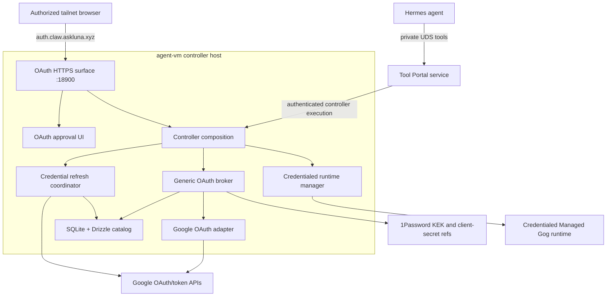
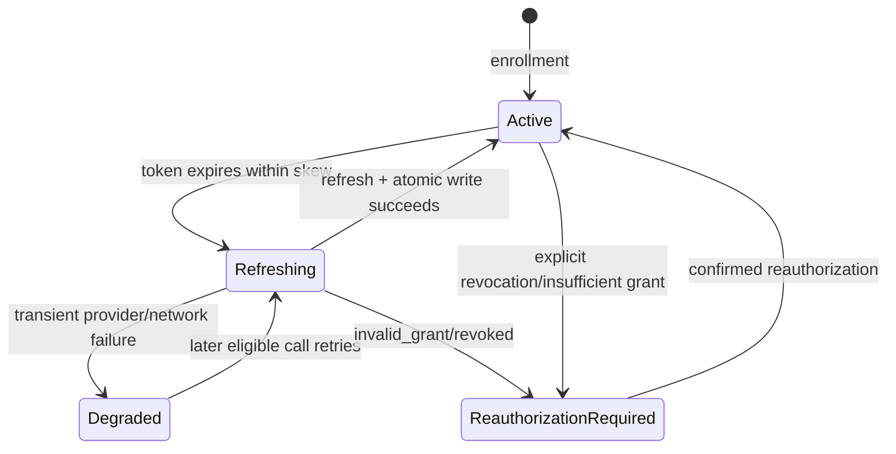

# Agent-Guided OAuth Broker Program Design

## Integrated architecture



The design reuses existing Tool Portal, controller execution, approval, and
credentialed Managed runtime paths. It adds no helper, public ingress, or second provider.

## Package boundaries and dependency direction

```text
@agent-vm/config-contracts
  OAuth JSONC schemas and cross-reference validation

@agent-vm/oauth-broker-contracts               NEW
  portable Zod schemas and inferred types only
  application/account/transaction identifiers
  public status and controller-action contracts
  no SQLite, crypto, provider secret, or host dependency

@agent-vm/agent-portal-sdk
  owns the existing portable Tool Portal capability-summary and
  list/search/describe wire schemas
  extends those schemas with generic truncation and call-disposition fields
  composes the OAuth-specific requirement and availability unions from
  oauth-broker-contracts
  regenerates the checked portable manifest and Python contract fixtures

@agent-vm/oauth-broker                         NEW
  host-only provider-neutral engine
  opaque transaction/completion stores
  envelope crypto
  SQLite/Drizzle catalog
  refresh coordination
  provider adapter port
  ./google provider module
    Google Web OAuth adapter
    principal and scope parsing
    refresh behavior
    Gog access-token projection

@agent-vm/oauth-approval-ui                     NEW
  Hono JSX server renderers and semantic forms
  build-time Tailwind source and packaged static assets
  bounded hono/jsx/dom islands and non-sensitive view models
  no broker, database, provider, secret, or policy authority

@agent-vm/controller-execution-contracts
  composes portable oauth_authorization action contracts

@agent-vm/tool-portal
  unchanged capability and approval authority
  exposes registered controller actions through existing backend

@agent-vm/gateway-runtime
  projects configured CLI authorization requirements
  carries trusted agent/account-profile selection to controller

@agent-vm/agent-vm
  composes listeners, Tailscale identity, secret resolution,
  broker, Google adapter, Tool Portal actions, and Managed runtime
```

Allowed dependency edges:

```text
oauth-broker → config-contracts + oauth-broker-contracts
config-contracts → oauth-broker-contracts
agent-portal-sdk → oauth-broker-contracts
controller-execution-contracts → oauth-broker-contracts
oauth-approval-ui → oauth-broker-contracts + Hono JSX
agent-vm → composed packages
gateway-runtime/tool-portal → controller-execution-contracts
```

Forbidden edges:

```text
oauth-broker ↛ agent-vm controller implementation
oauth-broker/google ↛ Tool Portal or Gateway Runtime
oauth-broker-contracts ↛ SQLite, Drizzle, crypto, secrets, or providers
oauth-approval-ui ↛ broker engine, SQLite, secrets, provider adapters, Tool Portal policy
Tool Portal ↛ SQLite, 1Password, provider tokens, or crypto
agent-portal-sdk ↛ broker engine, controller implementation, SQLite, 1Password,
  provider tokens, or policy decisions
Shravan Claw ↛ SQLite; Managed Gog runtime ↛ refresh token or KEK
```

Three new packages are justified. `oauth-broker-contracts` keeps portable Tool
Portal/controller action schemas free of the broker's native SQLite and host crypto
dependencies. The existing `agent-portal-sdk` remains the sole owner of portable
Tool Portal list/search/describe result envelopes and composes only the OAuth-specific
nested unions from that contract-only package; Tool Portal does not create a second
result schema. `oauth-broker` owns the host engine. Google remains a separate provider
module exported as `@agent-vm/oauth-broker/google`; it does not receive an independent
package. `oauth-approval-ui` isolates browser build dependencies and packaged assets
behind sanitized view models. A later provider may use another broker subpath;
provider extraction still requires an independent consumer, dependency set, release
cadence, or enforceable ownership need.

## Authored configuration model

The controller loads one `oauth.config.jsonc` from the Hermes zone's Tool Portal
configuration directory. `@agent-vm/config-contracts` owns its strict schema and
validates its cross-references with `tool-portal.config.jsonc` before boot.

The complete illustrative JSONC shape is
[oauth-config.example.jsonc](oauth-config.example.jsonc). It shows the browser,
storage, three Google Web applications, service scope mappings, and per-agent
account-profile maxima and authorized Tailscale humans without placing a Google
account email in authored config.

`none` is an enrollment selection, not a scope list stored in application config.
The compiler accepts only `none`, `read`, or `write`, ensures every choice is at
or below the slot maximum, and derives an exact sorted scope set.

Tool Portal configured CLI operations associate admitted argv with OAuth without
duplicating provider scopes. Gog remains one existing `configured_cli` operation;
OAuth is a nested RPC-authorization variant, not a new CLI kind. The RPC carries
`accountProfile` beside `argv`, and only `argv` reaches Gog:

```jsonc
{
  "kind": "configured_cli",
  "safeHelp": "Pass Gog argv without the executable name. Use [\"<command>\", \"--help\"] for command help.",
  "authorization": {
    "kind": "oauth_account_profile",
    "rules": [
      {
        "match": { "path": ["gmail", "search"], "flags": [] },
        "requirement": {
          "kind": "oauth",
          "applicationId": "gmail-app",
          "serviceId": "gmail",
          "minimumPermission": "read"
        }
      },
      {
        "match": { "path": ["gmail", "send"], "flags": [] },
        "requirement": {
          "kind": "oauth",
          "applicationId": "gmail-app",
          "serviceId": "gmail",
          "minimumPermission": "write"
        }
      },
      {
        "match": { "path": ["gmail"], "flags": [] },
        "requirement": { "kind": "no_oauth" }
      }
    ]
  },
  "executionTarget": {
    "kind": "ephemeral_managed_vm",
    "credentialProjection": {
      "kind": "http_mediation",
      "environment": {
        "GOG_ACCESS_TOKEN": { "kind": "oauth_access_token" }
      }
    }
  }
}
```

Cross-reference compilation rejects unknown applications/services, a write
requirement without a configured write choice, an admitted resource command with
zero or multiple authorization matches, a non-Gog executable, any OAuth
environment variable except the code-owned `GOG_ACCESS_TOKEN`, an authored runtime
name/id, or an OAuth-configured operation that the profile cannot call.

OAuth rules reuse `configuredCliPatternRuleSchema` and the existing admitted-command
path resolver. V1 requires `flags: []`: exact command path is the complete OAuth
classification key. The compiler compares the admitted command-path set with the
authorization-rule path set and rejects omissions, duplicate paths with different
requirements, and rules for unadmitted paths. Runtime evaluation repeats the exact
path lookup and fails closed on zero or multiple distinct requirements.

Current file-backed and proposed OAuth projections share the same configured CLI
and per-agent runtime path:

```text
file-backed configured_cli
  authored operation
  → strict file-backed executionTarget
  → agent credentialBinding + credentialFiles/environment paths
  → prepared/effective target with no secret bytes
  → controller resolves configured files
  → credentialed runtime finalizes read-only memory mount

OAuth-backed configured_cli
  authored operation + argv authorization rules
  → strict http_mediation projection with oauth_access_token source
  → RPC input carries accountProfile separately from Gog argv
  → prepared/effective target retains only app/service/permission rules,
    fixed placeholder environment name, and opaque revisions
  → Tool Portal applies profile/tool/call/approval policy
  → controller resolves trusted agent + selected account profile
  → broker returns host-only mediation material + material revision
  → credentialed runtime manager injects only the fixed placeholder environment
```

Portable Gateway/Tool Portal contracts carry identifiers, requirements, and
revisions only. The access token is a host-only controller value represented by:

```ts
type OAuthRuntimeCredentialMaterial = {
  readonly kind: 'oauth-http-mediation';
  readonly credentialId: OAuthCredentialId;
  readonly environmentName: 'GOG_ACCESS_TOKEN';
  readonly materialRevision: OAuthMaterialRevision;
  readonly placeholderValue: string;
  readonly secretValue: Uint8Array;
  readonly allowedHosts: readonly string[];
};
```

This internal value enters the credentialed runtime manager only after Tool Portal
admission and approval. Only `placeholderValue` enters the VM process environment;
`secretValue` remains in host-side Gondolin mediation. Both are excluded from
effective config, dispatch intents, runtime records, compatibility logs, and
portable result schemas. The one runtime slot is keyed only by zone and agent;
compatibility consumes `credentialId + materialRevision`, and retirement disposes
the prior mediation authority before a successor becomes current.

## Strong contract model

Zod schemas own every boundary and infer the TypeScript forms. Representative
contracts use descriptive generic parameters and discriminants:

```ts
const configuredCliAuthorizationSchema = z.discriminatedUnion('kind', [
  z.object({ kind: z.literal('none') }).strict(),
  z.object({
    kind: z.literal('oauth_account_profile'),
    rules: z.array(oauthCliAuthorizationRuleSchema).min(1).readonly(),
  }).strict(),
]);

const oauthConfiguredCliInputSchema = existingConfiguredCliInputSchema.extend({
  accountProfile: oauthAccountProfileIdSchema,
}).strict();
```

The adapter selects the existing input schema for `authorization.kind: none` and
the extended schema for `oauth_account_profile`; authorization kind is never a
caller-selected mode. The controller repeats argv-rule classification and
account-profile authorization from trusted operation configuration; it never
trusts a caller-supplied application, service, permission, or credential ID.

```ts
const oauthPermissionChoiceSchema = z.enum(['none', 'read', 'write']);

const oauthTokenLifecycleSchema = z.discriminatedUnion('kind', [
  z.object({ kind: z.literal('refreshable'), refreshMode:
    z.enum(['stable-refresh-token', 'rotating-refresh-token']) }).strict(),
  z.object({ kind: z.literal('non-refreshable'), expirationMode:
    z.enum(['fixed-expiry', 'provider-managed', 'unknown']) }).strict(),
]);

const oauthPublicAuthorizationResultSchema = z.discriminatedUnion('kind', [
  z.object({
    kind: z.literal('completed'),
    accountLabel: z.string().min(1),
    accountProfileId: oauthAccountProfileIdSchema,
    applicationId: oauthApplicationIdSchema,
    grantedScopes: z.array(z.string().min(1)).readonly(),
  }).strict(),
  z.object({ kind: z.literal('pending'), transactionId: oauthTransactionIdSchema }).strict(),
  z.object({ kind: z.literal('failed'), failure: oauthPublicFailureSchema }).strict(),
]);
```

The Google provider result is internal and structurally cannot satisfy the public
result:

```ts
const googleProviderAuthorizationResultSchema = z.object({
  kind: z.literal('google-provider-authorization'),
  accountSubject: z.string().min(1), accountEmail: z.string().email(),
  accessToken: z.string().min(1), refreshToken: z.string().min(1),
  accessTokenExpiresAt: z.iso.datetime(),
  grantedScopes: z.array(z.string().min(1)).readonly(),
}).strict();
```

The provider port keeps provider-specific sensitive types behind generics:

```ts
interface OAuthProviderAdapter<
  TApplicationConfig,
  TProviderAuthorization,
  TProviderRefreshResult,
> {
  readonly providerKind: string;
  readonly tokenLifecycle: OAuthTokenLifecycle;
  buildAuthorizationRequest(props: BuildAuthorizationRequestProps<TApplicationConfig>):
    OAuthAuthorizationRedirect;
  exchangeAuthorizationCode(props: ExchangeAuthorizationCodeProps<TApplicationConfig>):
    Promise<TProviderAuthorization>;
  refreshAuthorization(props: RefreshAuthorizationProps<TApplicationConfig>): Promise<TProviderRefreshResult>;
}
```

No unvalidated provider response, database JSON, or dynamic configuration reaches
controller policy or runtime materialization.

## Browser transaction ownership and state

Two bounded process-local maps implement the required KV semantics:

```text
Map<OAuthTransactionId, OAuthTransaction>
Map<OAuthCompletionSessionId, OAuthCompletionSession>
```

Typed stores own every transition. The first browser request binds the exact
account profile's authorized Tailscale login. The human submission, sequential app
queue, same-subject commits, partial success, retry, downgrade/revoke rule, CSRF,
CSP, assets, accessibility, and island boundaries are defined in
[web-approval-ui-design.md](web-approval-ui-design.md). Callback consumption moves
to `consuming` synchronously before awaiting Google; terminal entries expire from
memory, and completion rotates away from the original URL identity.

## HTTPS and tailnet identity

Cloudflare owns only the public DNS zone, the `auth.claw.askluna.xyz` DNS-only
record, Google domain-verification TXT records, and DNS-01 certificate challenge.
It does not proxy traffic.

The OAuth server is a second Hono HTTPS app in the controller process. Its listener
binds the current host Tailscale address and port 18900. The controller loads a
deployment-managed certificate/key for `auth.claw.askluna.xyz`; certificate
issuance/renewal is an operator concern and does not place a Cloudflare API token
inside the controller.

This deliberately supersedes the earlier localhost-plus-Tailscale-Serve proposal.
Serve terminates the tailnet's `*.ts.net` identity, while the confirmed Google Web
callback uses the owned/verifiable `auth.claw.askluna.xyz` certificate. Direct
tailnet binding keeps one process and makes the controller's LocalAPI peer lookup,
TLS readiness, and shutdown ownership explicit; no forwarded identity header is
trusted.

Each request's socket peer address is resolved through a narrow Tailscale identity
port backed by the host LocalAPI. The verified login must match the selected
account profile's `authorizedTailnetLogins`; identity-shaped request headers are
ignored. Tests inject a fake identity port; host proof uses the real tailnet.

## SQLite catalog and envelope format

`@agent-vm/oauth-broker` owns one `better-sqlite3` connection and wraps it with
stable `drizzle-orm/better-sqlite3`. No other process opens the file. Startup
applies bundled Drizzle migrations before readiness and configures:

```text
journal_mode = WAL
foreign_keys = ON
synchronous = FULL
bounded busy_timeout
```

The database lives at the canonical per-zone controller durable-authority path:

```text
<controllerStateDir>/zones/<zoneId>/oauth/credentials.sqlite
```

The `oauth/` child is controller-owned durable credential authority, not VM cleanup
evidence. It remains separate from Gateway `stateDir`, runtime roots, and every VM
mount. Its parent directory is `0700`; database, WAL, and SHM creation are
constrained to the controller user. Like the containing controller-state root, it
is excluded from normal zone backup. Loss requires reauthorization. Offline
cleanup and runtime recovery never delete or interpret the catalog; they only own
their existing lifecycle evidence siblings. A future explicit encrypted-catalog
backup can copy a consistent SQLite snapshot without possessing the KEK.

Logical tables:

```text
oauth_account_profiles
  profile ID, zone, agent, slot, provider subject, display email,
  status, revision, timestamps

oauth_grants
  credential ID, profile ID, application ID, granted scopes,
  lifecycle state, material revision, provider credential version,
  refresh metadata, envelope metadata and ciphertext

oauth_schema_metadata
  schema and format versions
```

The encrypted payload contains access token, expiry, refresh token, and provider
fields not required for policy queries. `@noble/ciphers` XChaCha20-Poly1305 uses a
random 32-byte DEK and two independent random 24-byte nonces: one for payload
encryption and one for wrapping the DEK under the 32-byte KEK. Fixed,
NUL-delimited UTF-8 AAD encodings use distinct domain strings:

```text
agent-vm/oauth/payload/v1
agent-vm/oauth/dek-wrap/v1
```

AAD includes credential ID, provider, application, account profile, and provider
subject. Identifier schemas reject NUL. Ciphertext/tag, nonces, algorithm,
envelope version, and KEK version are stored explicitly. Authentication failure,
unknown version, or metadata swap produces a typed unusable-record result without
overwriting the record.

## Account enrollment and partial completion

One active ceremony is allowed per agent + account profile. Hermes may supply
typed suggestions, but the human form owns final choices within slot maxima. App
grants commit independently and must share one Google subject; completed grants
survive later failure. `none` skips and never revokes. Downgrade requires the
approval-gated revoke action followed by same-subject reauthorization. The complete
state and route model is in [web-approval-ui-design.md](web-approval-ui-design.md).

## Tool Portal integration

Tool Portal remains the complete capability and approval owner. The new
`oauth_authorization` namespace uses the existing `controller_execution` backend
and registered actions. The single `gog_cli` operation retains typed
invocation-dependent OAuth rules. Database
state cannot make a denied operation visible, callable, or approval-free. Namespace
help, compact per-tool descriptions, full-text search, approval disposition, live
agent/account availability, truncation bounds, and fail-closed controller batching
are defined in
[tool-portal-discovery-design.md](tool-portal-discovery-design.md). OAuth consent
and Tool Portal approval remain different state machines.

Every OAuth registered action carries the same exact-call authority envelope as a
configured CLI call. The controller reconstructs the trusted namespace, name,
arguments, call ID, surface, principal, semantic revisions, operation ID, and
fingerprint before it arms an approval reservation. A reservation for another
action, account profile, application, or argument set fails before dispatch.

The Hermes orientation renderer consumes the already-resolved visible namespace
and tool inventory as a backend-neutral presentation projection. It renders each
namespace once and nests that namespace's bounded tool names and descriptions
beneath it. MCP provider, controller-execution, and Tool VM runner bindings remain
internal dispatch details and never enter the injected orientation.

The existing `agent-portal-sdk` strict capability-summary and portal-result schemas
remain the only portable wire authority for list, search, and describe. They gain the
generic compact-description truncation and call-disposition fields and compose the
OAuth requirement/availability discriminated unions from
`oauth-broker-contracts`. Tool Portal computes values but cannot widen the wire shape;
Gateway Runtime transports the same validated result; generated TypeScript manifests
and Python fixtures keep Hermes parsing on that exact contract. Full authored text
continues to feed search before compact result truncation.

## Refresh coordination and credential lifecycle

The controller refresh coordinator owns one keyed single-flight entry per
credential ID. Callers share the same promise/result; only the leader contacts the
provider and writes the catalog.

The credentialed runtime manager owns the earlier singleton reservation. Static
Tool Portal/account-profile admission occurs first; the manager then returns busy
or reserves `zone + agent` before the broker decrypts or refreshes anything. The
per-credential single-flight runs only inside that reservation. A busy call has no
provider, catalog, material-revision, retirement, or guest effect. Credential or
provisioning failure releases the reservation after exact containment; final
authorization still runs immediately before dispatch.



The refresh transaction updates encrypted payload, material revision, provider
credential version, access-token expiry, last-attempt/success times, retry
eligibility, and failure class together. A response without a refresh token retains
the current refresh token. A response with one replaces it in the same transaction.
Provider response text is not persisted as status.

## Gog credential projection and runtime consistency

The Google adapter uses Gog's supported `GOG_ACCESS_TOKEN` environment path. The
deployment-pinned Gog v0.38.1 declares the root flag with
`env:"GOG_ACCESS_TOKEN"`, writes it into the command context, and selects an
`oauth2.StaticTokenSource` before stored-auth lookup. The controller refreshes
first and injects only an opaque placeholder into the fixed Gog process
environment. Gondolin replaces that placeholder with the short-lived token only
for controller-allowed Google API hosts; the access token, refresh token, Web
client secret, and KEK never enter the VM. No token is placed in argv.

The credentialed Managed runtime is the one slot keyed by zone + authenticated
agent, with no authored runtime ID. Its compatibility identity additionally
includes account profile, application credential ID, mediation policy, and
material revision. When account selection or refresh changes material:

```text
idle compatible agent runtime
  → retire old runtime
  → create/finalize current credential environment
  → dispatch

active agent runtime using prior still-valid token
  → allow current command to finish
  → mark stale
  → retire before the next command
```

The existing one-command active slot prevents same-agent overlap. Different agents
sharing one credential still converge through the credential single-flight. No
runtime writes credential state back; controller refresh is the only durable
mutation path.

## Listener startup and shutdown

The controller runtime treats both listeners as one readiness transaction:

```text
ownership lock
  → validate cross-file config and port sets
  → open/migrate SQLite
  → resolve/validate KEK and Google client credentials
  → validate TLS certificate/key and Tailscale identity service
  → bind private controller listener :18800
  → bind tailnet HTTPS OAuth listener :18900
  → start/admit Hermes Gateway and Tool Portal
  → ready
```

If any later startup edge fails, the runtime closes every listener it opened and
reverses already-started resources before releasing the ownership lock. Port 18900
participates in deployment identity and collision validation but does not become a
VM ingress port.

Shutdown closes admission in this order:

```text
stop OAuth begin
  → invalidate pending/completion sessions
  → await bounded callback/refresh critical sections
  → close OAuth HTTPS listener
  → retire credentialed runtimes
  → existing Gateway/controller teardown
  → close SQLite and release ownership lock
```

## Failure, concurrency, and containment

| Failure or overlap | Owner and disposition |
| --- | --- |
| Duplicate callback | Transaction store atomically admits one consumer; loser receives a non-secret consumed result and never contacts Google. |
| Controller restart during login | In-memory transaction disappears; callback fails and Hermes begins again. |
| Corrupt credential during revoke | Catalog marks the grant `reauthorization-required / credential-corrupt`; no local deletion or provider-revoked success is reported without a provider token and confirmed revocation. |
| Credential material changes while runtime containment is owner-unsafe | Invalidation failure propagates; enrollment or revocation cannot report terminal success while the prior runtime remains uncontained. |
| Controller crash after Google exchange but before commit | No grant is reported complete; SQLite transaction rollback leaves no usable partial row. |
| KEK unavailable or wrong | Catalog remains unopened for credential use; controller OAuth readiness is false and no destructive rewrite occurs. |
| Envelope authentication failure | Exact record becomes unusable; other records remain available; operator sees non-secret corruption evidence. |
| Concurrent refresh | Per-credential single-flight performs one provider call and one atomic write. |
| Transient refresh failure | Preserve current encrypted payload; enter `degraded` with bounded retry eligibility. |
| Permanent invalid grant | Stop refresh retries and enter `reauthorization-required`. |
| Scope mismatch | Deny before runtime creation; never infer or request broader scopes. |
| Agent/account mismatch | Deny before decrypting provider payload. |
| Tool Portal denial or missing approval | Deny before controller credential resolution. |
| TLS/Tailscale identity unavailable | OAuth listener is non-ready or request fails closed; controller API is never exposed as fallback. |
| Material changes while runtime exists | Material revision prevents stale reuse; retire when safe before next dispatch. |

## Trust boundaries

```text
Untrusted browser input
  state/code/cookies/paths
  → strict route and transaction validation

Trusted network identity
  socket peer → Tailscale LocalAPI result
  request headers are never identity authority

Untrusted agent arguments
  account profile and CLI args
  → Tool Portal profile/tool/call policy
  → controller-authored OAuth requirement

Sensitive host authority
  KEK, client secret, access/refresh token, SQLite plaintext
  → controller/provider package and host-side Gondolin mediation only

Credentialed runtime
  opaque access-token placeholder only
  → no raw access/refresh token, client secret, database, or KEK
```

## Cutover and compatibility

This is a new provider path with no predecessor in current source. Existing
1Password-backed credential bindings, Tool Portal profiles, configured CLI
operations without OAuth requirements, GoPlaces mediation, Tool VM leases, and
Worker Gateway behavior remain unchanged. The configuration cut is strict: no
legacy alias for Desktop clients, Turso, OpenClaw, or combined OAuth/API-key
records is accepted.

The three existing Google Desktop client records are not silently reused as Web
clients. Deployment creates and validates three Web clients before enabling the
OAuth applications. Configuration requires three distinct 1Password references,
and controller startup requires the resolved Web records to contain three distinct
Google client IDs. Existing manual authorization material remains untouched until
the corresponding account/application enrollment succeeds.

## Proof architecture and traceability

| Requirement group | Realization owner | Proof seam |
| --- | --- | --- |
| U-OAUTH-001, 010, 011 | OAuth server, transaction store, Tailscale identity port | Browser-shaped HTTPS callback, different-device tailnet proof, duplicate/state/identity failure observations |
| U-OAUTH-002, 007 | Tool Portal registered actions and existing approval authority | list/begin/status discovery plus read/write/deny approval scenarios |
| U-OAUTH-003 through 006 | Config compiler, account-profile catalog, enrollment service | invalid cross-reference fixtures, first binding, same-subject reauth, different-subject and cross-agent denial |
| U-OAUTH-008, 012 | SQLite catalog, envelope codec, Zod contracts | real transaction, tag/AAD/version tamper, schema/type contract generation and secret/public separation |
| U-OAUTH-009, 014 | Google adapter and refresh coordinator | concurrent refresh single-flight, stable/replacement token writes, degraded/invalid-grant transitions |
| U-OAUTH-013 | Credential mediation adapter and runtime manager | placeholder-only process environment, host-side token substitution, material-revision replacement, no secret residue |
| U-OAUTH-015 | Controller composition | bind rollback, readiness, stop-controller, crash/partial-write, stale-runtime and shutdown ordering |
| U-OAUTH-016 | OAuth approval UI package and controller routes | no-JS SSR/forms, CSP/assets, accessibility, bounded islands, actual-size browser proof |
| U-OAUTH-017 | Agent Portal SDK wire contracts, Tool Portal enrichment, generated Python contracts, and existing Hermes orientation | name/description-only injection, portable-contract freshness, full-text search, approval/OAuth availability on demand, hidden-tool exclusion, full describe |

Live Google proof is isolated and opt-in because it consumes external account and
provider state. Default tests use a protocol-faithful provider fixture and real
SQLite/HTTPS/controller paths without real tokens.
