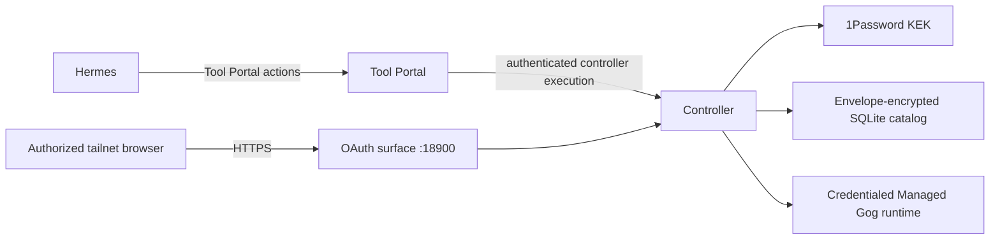

# Agent-Guided OAuth Broker Requirements

## Purpose

Hermes must be able to guide an authorized household user through Google OAuth
from that user's own tailnet-connected browser, then use only the enrolled account
and permissions assigned to the authenticated agent. Refresh tokens, client
secrets, encryption keys, and decrypted authorization files remain controller
authority and never become Hermes or Tool Portal data.

## Consumers and existing foundation

- **Household authorizer:** opens a short-lived HTTPS URL, chooses applications
  and service permissions within the assigned account-profile maxima, signs into
  Google, and confirms the account.
- **Hermes agent:** discovers authorization status and starts an allowed flow
  through Tool Portal, then invokes Gog operations for an allowed account profile.
- **Deployment operator:** authors applications, services, permission choices,
  agent account-profile slots, tailnet users, client-secret references, and
  Tool Portal call/approval policy.
- **Existing foundation:** Hermes is the sole managed Gateway; Tool Portal already
  owns authenticated agent/profile capability and approval policy; the controller
  already owns configured CLI dispatch and reusable credentialed Managed runtimes.

## System goal



The controller intersects five independent authorities before executing Gog:

```text
authored Tool Portal policy
  ∩ exact approval when required
  ∩ authenticated agent/account-profile binding
  ∩ enrolled application credential
  ∩ actual Google-granted scopes
```

## Authorized requirements

| ID | Priority | Authorized need and outcome |
| --- | --- | --- |
| U-OAUTH-001 | required | An authorized human can complete Google OAuth from a different tailnet-connected device through `https://auth.claw.askluna.xyz`. |
| U-OAUTH-002 | required | Hermes starts, lists, and checks authorization only through its authenticated Tool Portal profile; Tool Portal remains the capability and approval plane, not the browser OAuth server. |
| U-OAUTH-003 | required | Deployment configuration defines OAuth applications, services, read/write/none choices, Google scope mappings, client-secret references, and configured-CLI argv-to-authorization rules. Hermes selects an assigned account-profile slot through the Tool Portal RPC and may provide typed permission suggestions; the authorized browser human accepts or changes them within that slot's configured maxima and owns the final selection. Neither may supply arbitrary clients, scopes, redirects, secret references, storage paths, or runtime identities. |
| U-OAUTH-004 | required | The first provider is Google through three independently credentialed Web OAuth applications: `workspace-app`, `gmail-app`, and `youtube-app`. One account profile may hold at most one current grant per application. |
| U-OAUTH-005 | required | Static configuration names account-profile slots and the verified Tailscale logins allowed to authorize each slot, but does not contain Google email addresses. Enrollment records the immutable Google subject and display email, then binds that account to the initiating agent, slot, application, and granted scopes. |
| U-OAUTH-006 | required | An agent can use only account-profile slots assigned to that authenticated agent. A pre-existing slot cannot silently change to a different Google subject. |
| U-OAUTH-007 | required | OAuth scope and Tool Portal call policy remain separate. Google write scope never bypasses `calls.requiresApproval`; a denied Tool Portal operation remains denied even when the token technically permits it. |
| U-OAUTH-008 | required | The controller stores OAuth credentials in a plain, controller-only SQLite catalog using `better-sqlite3` and stable Drizzle ORM. Sensitive payloads are envelope-encrypted with a per-record DEK and a 1Password-held deployment KEK. |
| U-OAUTH-009 | required | The controller owns access-token refresh, per-credential single-flight coordination, and atomic encrypted write-back of access-token state and any replacement refresh token. It never performs resource queries merely to keep credentials alive. |
| U-OAUTH-010 | required | Browser authorization uses opaque, short-lived, server-owned transactions with state, PKCE, initiating tailnet identity, atomic consumption, restart invalidation, and session-fixation prevention. |
| U-OAUTH-011 | required | The OAuth surface is reachable only through the tailnet, uses a valid certificate for the owned callback domain, authenticates the actual Tailscale peer, and is never exposed through Tailscale Funnel or Cloudflare proxy/Tunnel. |
| U-OAUTH-012 | required | OAuth configuration and public/internal results use strict Zod schemas, inferred TypeScript types, descriptive generics, readonly fields, and discriminated unions. Sensitive provider results cannot type-check as public Tool Portal results. |
| U-OAUTH-013 | required | Gog receives only an opaque HTTP-mediation placeholder through the existing per-agent credentialed Managed runtime; Gondolin substitutes the current short-lived access token only on controller-allowlisted Google API requests. Access and refresh tokens, Web client secrets, and the KEK remain outside the VM. Credential material never enters Tool Portal discovery, agent responses, ordinary logs, runtime records, argv, or COW persistence. |
| U-OAUTH-014 | required | The system exposes non-secret `active`, `degraded`, and `reauthorization-required` lifecycle state and the actual granted scopes/account label needed for Hermes guidance without exposing tokens. |
| U-OAUTH-015 | required | Startup, shutdown, port ownership, TLS failure, database failure, provider failure, concurrent callbacks, concurrent refresh, and runtime replacement all fail closed without weakening existing controller or Tool Portal gates. |
| U-OAUTH-016 | required | This delivery includes an accessible, server-authoritative approval experience built with Hono JSX, build-time Tailwind CSS, native forms, and narrowly scoped `hono/jsx/dom` islands where interaction is useful. It is not a client SPA and receives no OAuth or credential secrets. |
| U-OAUTH-017 | required | Tool Portal orientation makes namespace membership obvious through a backend-neutral projection of the agent's already-known visible inventory: one explicit namespace name/summary followed by that namespace's indented tool names and bounded descriptions, without repeating the namespace on each tool. It injects no backend kind, tool schema, or schema summary. On-demand list/search/describe retain their existing discovery roles and may add approval/OAuth availability; full schemas remain an explicit describe step, and database state may narrow readiness but never grant capability. |

## Application boundaries

```text
workspace-app
  Calendar, Contacts, Docs, Sheets, Slides, Forms,
  and authored ordinary/elevated Drive permissions

gmail-app
  Gmail read and authored Gmail mutations

youtube-app
  YouTube account/channel reads and bounded authored mutations
```

Each application uses a separate Google Web OAuth client. Permission selections
are dynamic per account profile, but the available choices and exact scope sets
are authored configuration. Reducing scopes requires reauthorization; the
controller never silently broadens an existing grant.

## Required defense in depth

```text
Tailnet network admission
  → Tailscale peer identity
  → allowed human/agent-account slot
  → opaque transaction + cookie binding
  → state + PKCE + exact redirect/application
  → immutable Google subject binding
  → encrypted credential catalog
  → Tool Portal profile/tool selector
  → exact call approval when configured
  → granted-scope preflight
  → placeholder-only runtime materialization
```

## Non-goals

- No password database, user registration, generic login framework, JWT
  authorization architecture, Clerk, Cloudflare Access, or persistent browser
  login lasting beyond the short OAuth completion flow.
- No public callback, Cloudflare proxy, Cloudflare Tunnel, or Tailscale Funnel.
  Cloudflare owns DNS records and DNS-01 certificate proof only.
- No generic secret/API-key catalog. GoPlaces remains on its existing restricted
  API-key mediation path and is not an OAuth application.
- No OpenClaw compatibility or rejection path; current Agent VM is Hermes-only.
- No SQLCipher or SQLite page/database encryption. Envelope encryption protects
  sensitive OAuth values; FileVault and host permissions protect catalog metadata.
- No background refresh scheduler in the first delivery. Refresh is just-in-time;
  a scheduler may follow only if measured provider behavior requires it.
- No second OAuth provider implementation in the first delivery. The provider
  contract remains generic, while only the Google adapter ships.
- No React, shadcn, Radix, client SPA/router, Tailwind CDN, third-party browser
  assets, inline executable script, or client-owned authorization state. Hono DOM
  is progressive enhancement over the native form path.
- No KEK rotation workflow or whole-database rollback detection in the first
  delivery. Version fields preserve a future migration seam.
- No account-profile subject replacement in the first delivery. Same-subject
  reauthorization is supported; enrolling a different Google subject requires a
  separately authorized future flow or a new authored account-profile slot.

## Evidence expectations

- Unit proof covers config compilation, transaction state and atomic consumption,
  provider/result schemas, scope derivation, authorization decisions, envelope
  round trips and tamper rejection, refresh lifecycle, and single-flight behavior.
- Integration proof covers real SQLite/Drizzle transactions, both controller
  listeners, Tool Portal controller-execution actions, account binding, configured
  CLI preflight, encrypted write-back, and credentialed runtime replacement.
- Host proof covers a real HTTPS browser-shaped callback, Tailscale peer identity,
  an independently connected browser device, no public ingress, and no secret in
  responses/logs/runtime records.
- Live provider proof is opt-in and demonstrates a Google Web client enrollment,
  just-in-time refresh, one read call, one approval-required mutation boundary,
  and reauthorization classification without weakening default non-secret gates.
- UI proof covers semantic form controls, keyboard and focus behavior, error
  summaries, CSP/static assets, server operation without client JavaScript, bounded
  island interaction, multi-application progress, and manual actual-size browser
  verification on a different tailnet device.
- Tool Portal discovery proof covers namespace summaries, full-text search over
  untruncated authored help, name/description-only orientation, list cursor, search
  limit, truncation flags, approval disposition, OAuth/account readiness, and
  full-schema describe without leaking hidden tools or credentials.
