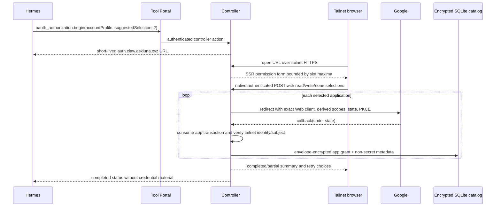

# Agent-Guided OAuth Broker Specification

## Observable journey



## Configuration contract

### OAuth configuration

The deployment MUST author one strict OAuth configuration for the Hermes zone.
It MUST define:

- the public base URL `https://auth.claw.askluna.xyz:18900`;
- the HTTPS listener port `18900` and Tailscale-interface binding policy;
- the deployment KEK secret reference and controller-only catalog path;
- provider definitions;
- application definitions and client-secret references;
- service permission choices and exact scope sets;
- per-agent account-profile slots, verified Tailscale logins allowed to authorize
  each slot, and the applications/maximum permissions each slot may enroll.

The initial provider set MUST contain only Google. The initial application set
MUST contain exactly:

```text
workspace-app  kind: web
gmail-app      kind: web
youtube-app    kind: web
```

Each application MUST use the exact callback URI:

```text
https://auth.claw.askluna.xyz:18900/oauth/google/callback
```

The callback host MUST be an owned Google-verifiable domain. Cloudflare DNS MUST
remain DNS-only; Cloudflare proxy/Tunnel and Tailscale Funnel are invalid
configurations for this deployment contract.

### Account-profile slots

Configuration MUST contain stable slot IDs, not Google email addresses. An agent
assignment MAY have several slots such as `personal-google` and `work-google`.
Each slot MUST define its allowed applications, maximum service permissions, and
one or more verified Tailscale logins allowed to enroll or reauthorize it. A human
allowed for one slot receives no authority over another slot by implication.

A slot with no enrolled Google subject is `unbound`. The first successful human
confirmation binds it. Subsequent enrollment for that slot MUST require the same
Google subject. A different subject MUST fail closed; subject replacement is not
an operation in the first delivery.

### Tool Portal and CLI association

Tool Portal policy remains complete authored authority:

- namespace/tool visibility comes from `tools.allow` and `tools.deny`;
- executable calls must match exactly one of `calls.withoutApproval` or
  `calls.requiresApproval`;
- every mutating Gog operation in the first delivery MUST be authored under
  `calls.requiresApproval`;
- read-only operations MAY be authored under `calls.withoutApproval`;
- OAuth grants MUST NOT add a namespace, tool, call selector, or approval bypass.

The configured Gog CLI operation MUST remain one Tool Portal capability and MUST
declare strict invocation authorization rules. Each rule maps one admitted argv
matcher to exactly one requirement:

```text
OAuth application ID
+ service ID
+ minimum permission: read | write
```

The Tool Portal RPC input, not Gog argv, MUST carry one typed account-profile ID.
Configuration MUST reject an admitted resource command that matches no OAuth rule
or more than one rule. Local help/version invocations MAY match an explicit
`no-oauth` rule. The operation MUST fail before runtime creation when the matched
requirement cannot be satisfied by the authenticated agent's selected account
profile and current grant.

The first delivery MUST reuse the existing configured-CLI matcher shape and exact
command-path resolver. OAuth rules MUST use empty `flags` and classify complete
admitted command paths; flag-sensitive authorization classification is out of
scope. Every admitted Gog command path MUST have exactly one rule. Configuration
rejects missing paths and duplicate paths with different requirements; dispatch
also fails closed if validated argv produces zero or multiple distinct
requirements.

## Agent-facing OAuth capability

Tool Portal MUST expose a controller-execution namespace for authorization
guidance rather than embedding secret or mutable database state into static
namespace discovery. Its typed operations are:

```text
oauth_authorization.list
  returns account-profile slots; configured application and service IDs, labels,
  and maximum permissions needed to form typed suggestions; application grant
  status, granted scopes, lifecycle state, and safe account labels for the
  authenticated agent

oauth_authorization.begin
  begins one assigned account-profile ceremony and returns a short-lived URL;
  it may accept typed read/write/none suggestions but never raw scopes; suggestions
  preselect the browser form and have no authority until the human submits them

oauth_authorization.status
  returns one transaction or enrolled-grant status without secret material

oauth_authorization.cancel
  invalidates one pending transaction owned by the authenticated agent

oauth_authorization.reauthorize
  replaces one application grant only when Google returns the slot's existing
  subject and follows authored approval policy

oauth_authorization.revoke
  explicitly revokes one application grant under authored approval policy;
  permission downgrade may proceed only after successful revocation
```

Static Tool Portal help MUST explain the required account-profile argument and
direct Hermes to `oauth_authorization.list` when authorization is missing. Live
catalog results MUST be returned by the controller action; they MUST NOT be
cached as authorization authority in Gateway config or Tool Portal discovery.

### Tool Portal discovery clarity

Every represented namespace MUST retain its existing discovery summary bound of
500 Unicode code points. The existing per-session Hermes orientation injection
MUST expand each displayed namespace with a bounded prefix of its visible tools.
This expansion MUST project the already-resolved visible inventory without
exposing or depending on whether a namespace is backed by an MCP provider,
controller execution, or a Tool VM runner. Backend kind is not agent orientation.
The renderer MUST preserve its existing 2,000 UTF-8 byte total and 20-namespace
maximum, omit only complete namespace/tool entries, and tell Hermes to use list or
search when tools are omitted.

The readable structure MUST be equivalent to:

```text
Namespace: <namespace name>
Summary: <namespace summary>
Tools:
  <tool name>
    <bounded tool description>
  <tool name>
    <bounded tool description>
```

The namespace heading owns every indented child until the next namespace heading.
The renderer MUST NOT prefix every child with the namespace merely to restate that
ownership.

Current `list` pagination and current bounded `search` limit remain different:
list uses its existing cursor, while search returns one ranked limited result set
and gains no cursor. Their compact tool items retain the current data and add:

```text
namespace, tool name, and canonical opaque tool reference
title when authored
compact description, maximum 240 Unicode code points
descriptionTruncated boolean
compact input/output field summary and safety hints
call disposition: without-approval | requires-approval | invocation-dependent
OAuth requirement when applicable: application + service + permission
agent-scoped availability:
  ready with eligible account-profile IDs/labels
  authorization-required
  reauthorization-required
  scope-insufficient
  authorization-status-unavailable
```

The list/search compact-description limit MUST count Unicode code points, preserve
valid text, and mark truncation explicitly. Search indexing MUST use the full
authored namespace summary, tool name/title/description, schema field text, and
scoped help/relationship text; truncating the returned description MUST NOT reduce
search recall. Full descriptions, help, and schemas remain available through
`describe` or an explicit existing full-detail request, never by default list.

The readable orientation MUST emit one namespace heading/summary followed by child
tool names and descriptions and MUST NOT repeat the namespace on every child.
Within the 2,000-byte budget, each injected child contains only its tool name and
at most 120 description code points. It MUST NOT inject tool schemas, schema field
summaries, safety/relationship metadata, approval metadata, OAuth requirements, or
account availability. At most eight child tools are injected per namespace; the
renderer allocates complete child entries across displayed namespaces
deterministically and reports that more tools are available through list/search.

Machine list/search contracts remain flat and retain the explicit `namespace` on
each tool identity. List stays namespace/tool ordered and cursor-paginated. Search
stays globally score-ordered and limit-bounded. Describe MUST return the full
authored title/description/help and exact schemas for the selected visible tool;
configured CLI help remains bounded by its existing 4,000-character authoring
contract.

Tool Portal MUST derive visibility and approval information from authored profile
and operation policy. Uniform operations expose `without-approval` or
`requires-approval`; configured CLI tools containing both approval-free and
approval-required invocation matchers expose `invocation-dependent` and direct the
agent to describe for exact rules. Tool Portal MUST batch-resolve OAuth availability from the controller for the
authenticated agent and represented OAuth requirements. Enrollment/database state
may change `ready` into a fail-closed availability state; it MUST NOT add a hidden
tool, change deny to allow, or change `requiresApproval` to `withoutApproval`.

When live authorization status is unavailable, the tool MAY remain discoverable
with `authorization-status-unavailable`, but calls MUST fail before credential
resolution. Denied/hidden tools MUST remain absent rather than being advertised as
denied.

## Web approval experience

This delivery MUST include a server-authoritative browser experience built with:

```text
Hono JSX       server-rendered pages and layouts
Tailwind CSS   build-time compiled, self-hosted static CSS
hono/jsx/dom   narrowly scoped interactive islands
native forms   authoritative submission and no-JavaScript fallback
```

The experience MUST provide permission selection, account confirmation,
application progress, partial-completion summary, retry/cancel, expired/error, and
completion pages. Permission controls MUST use semantic grouped form controls with
`none`, `read`, and `write` choices. Hermes suggestions MAY preselect controls, but
the page MUST label them as suggestions and the verified human's submitted POST is
the only permission-selection authority.

Every permission POST MUST be bounded by the selected account profile's authored
application/service maxima, the exact Tailscale login allowed for that slot, the
opaque server session, a session-bound CSRF token, and same-origin validation.
Client-side interaction MUST remain progressive enhancement: disabling JavaScript
must preserve every authorization, confirmation, retry, and cancellation path.

Browser JavaScript may receive only non-sensitive application IDs, service IDs,
labels, current/suggested choices, allowed choice sets, and progress presentation.
It MUST NOT receive OAuth state, PKCE verifier, authorization code, access or
refresh token, client secret, KEK, encrypted payload, database row identity, or
controller authority fingerprints.

Tailwind MUST be precompiled from package-owned TSX/CSS sources. The controller
MUST serve fingerprinted CSS and optional island bundles locally. It MUST NOT use
the Tailwind CDN, external fonts/images/scripts, inline executable script, inline
style helpers, or streaming JSX features that inject executable script.

The OAuth surface MUST send a restrictive CSP including at least:

```text
default-src 'none'
base-uri 'none'
object-src 'none'
style-src 'self'
script-src 'self'
connect-src 'self'
img-src 'self'
form-action 'self'
frame-ancestors 'none'
```

The experience MUST remain usable by keyboard, retain visible focus, use labels
and fieldsets/legends, expose errors and progress to assistive technology, and not
communicate permission or failure state by color alone.

## Browser transaction and session contract

The browser MUST receive only an opaque cryptographically random transaction ID
and, when needed, an opaque completion-session cookie. The controller MUST retain:

```text
authenticated agent and profile
account-profile slot
initiating Tailscale login
Hermes permission suggestions
human-confirmed service permissions and derived scopes
selected application queue and completed/failed application states
current provider and application
exact redirect URI
OAuth state and PKCE verifier
expiry and lifecycle state
```

The pending transaction MUST be process-local and short-lived. Restart MUST
invalidate it. Consumption MUST be atomic and MUST change `pending` to
`consuming` before any asynchronous token exchange; a concurrent callback loses
without contacting Google.

The callback MUST match the transaction ID, OAuth state, PKCE verifier, provider,
application, redirect URI, initiating Tailscale identity, and expiry. An OAuth
authorization code MAY appear only as the transient provider callback parameter;
it MUST never be logged, persisted, returned to Hermes, or copied into a later URL.

After successful code exchange, the original transaction MUST be consumed. If
the browser must confirm the discovered Google subject, the controller MUST issue
a distinct, short-lived completion-session identity. It MUST NOT reuse the
authorization URL as an authenticated browser session.

Any browser-binding cookie MUST be:

```text
Secure
HttpOnly
SameSite=Lax
Path limited to the OAuth surface
short Max-Age bounded by the transaction/completion lifetime
```

## Tailnet identity and HTTPS contract

The OAuth HTTPS listener MUST bind only to the host's Tailscale interface and MUST
not bind a LAN, wildcard, or public interface. For every browser request, the
controller MUST resolve the remote peer through Tailscale's local identity API and
match the resulting login to the exact account profile's authored human allowlist.
Caller-provided
`Tailscale-User-*` headers MUST NOT establish identity.

Cloudflare MUST provide DNS ownership/records and DNS-01 certificate validation
only. The callback hostname MAY resolve publicly to the non-publicly-routable
Tailscale address or through split DNS, but the endpoint MUST be unreachable
without tailnet admission. The controller MUST refuse OAuth readiness when the
certificate, private key, callback hostname, Tailscale identity service, or bind
address is invalid or unavailable.

## Enrollment and account binding

Google MUST return a provider-stable subject and an account label suitable for
human confirmation. The controller MUST record the subject as authority; email is
display metadata and MUST NOT replace the immutable subject.

The controller MUST compare the returned granted scope set with the exact scopes
allowed for the selected application and permission choices:

- missing required scope returns an insufficient-grant result;
- a scope not present in the authored application configuration is rejected;
- the controller never infers broader permission from the client's theoretical
  scope capability;
- scope reduction requires revocation/reauthorization;
- incremental authorization may expand only through a newly authorized selection.

One account profile MAY require up to three separate Google consent flows because
each OAuth application has an independent client and credential. The shared
callback uses server transaction state to identify the current application. Every
application in one ceremony MUST return the same Google subject. A different
subject fails that application without changing completed grants.

Each application grant commits independently after subject/scope confirmation.
Abandoning or failing a later application MUST preserve completed grants and expose
the remaining application as retryable. `none` skips an unselected application or
service; it MUST NOT revoke an existing grant. Changing an existing grant from
write to read MUST first complete an explicit approval-gated revocation, then a new
read-only authorization. The permission form MUST not disguise that sequence as a
normal toggle update.

## Credential catalog and encryption contract

The controller MUST be the sole database owner. It MUST use a plain local SQLite
database through stable Drizzle ORM and `better-sqlite3`. The database MUST NOT be
opened by Shravan Claw, Hermes, Tool Portal, a Gateway VM, or a Managed runtime.

The catalog MUST keep policy/query metadata separate from the sensitive provider
payload. Sensitive payloads MUST be encrypted with this versioned envelope:

```text
payload cipher: XChaCha20-Poly1305
payload key: random 32-byte per-record DEK
payload nonce: random 24-byte value
DEK wrapping: XChaCha20-Poly1305 under the 32-byte deployment KEK
wrap nonce: independent random 24-byte value
authentication tag: carried by the AEAD ciphertext
KEK source: one strict 1Password secret reference
```

Additional authenticated data MUST bind the envelope purpose, format version,
credential ID, provider, application ID, account-profile ID, and Google subject.
Payload and DEK-wrap operations MUST use different purpose strings and nonces.
Unknown versions, unknown algorithms, tag failures, metadata swaps, and malformed
lengths MUST fail closed.

The controller MUST attempt to clear owned plaintext byte arrays after use, while
documenting that JavaScript garbage collection cannot guarantee complete memory
zeroization. Plaintext credentials MUST never be serialized to ordinary files.

The SQLite parent directory and database/WAL/SHM files MUST be controller-only.
Foreign keys MUST be enabled. Credential writes and lifecycle changes MUST use
transactions with durability sufficient to prevent a successfully reported grant
or refresh from existing only in volatile state.

KEK rotation and detection of a host attacker restoring a previously valid whole
database are out of scope. Algorithm, KEK version, envelope version, record
revision, and provider credential version MUST still be stored.

## Token lifecycle contract

The provider-neutral lifecycle MUST distinguish refreshable stable-token,
refreshable rotating-token, and non-refreshable credentials. Google MUST declare
its actual behavior through the provider adapter.

Before each Gog operation, the controller MUST:

1. resolve the authenticated agent, selected account profile, application, and
   required service permission;
2. reserve that agent's singleton credentialed-runtime provisioning/command slot;
   if it is active or already reserved, return `runtime_busy` before decrypting,
   refreshing, writing the catalog, changing material revision, or retiring a VM;
3. obtain a per-credential single-flight lock;
4. decrypt the provider payload;
5. reuse a sufficiently valid access token or refresh it at Google's token
   endpoint;
6. atomically persist the new access token, expiry, and any replacement refresh
   token while retaining the prior refresh token when none is returned;
7. retain the known granted-scope set and validate a returned scope field when
   present without inferring expansion from omission;
8. classify permanent `invalid_grant`/revocation as
   `reauthorization-required` instead of retrying indefinitely;
9. derive a new material revision when credential bytes change;
10. materialize only the current credential revision into host-side mediation;
11. repeat final call authorization before guest dispatch and release or retire the
    reservation on every non-dispatch outcome.

Transient refresh failures MAY enter `degraded` with bounded retry eligibility.
The first delivery MUST NOT run background resource queries or a background token
refresh scheduler.

## Gog execution contract

The OAuth path MUST extend the existing credentialed `ephemeral_managed_vm`
configured CLI target. It is the authenticated agent's one controller-created
reusable credentialed Managed runtime in the zone, not a leased Tool VM and not
one VM per call. Configuration and callers MUST NOT name or select another
credentialed runtime.

Runtime identity MUST be scoped exactly to zone and authenticated agent.
Compatibility MUST additionally bind the active account profile, application
credential ID, and material revision. A changed account profile or material
revision MUST prevent use of an existing runtime with stale mediation authority;
the controller retires and recreates the same agent runtime slot before dispatch.

The Google adapter MUST project an opaque placeholder through Gog's fixed
`GOG_ACCESS_TOKEN` process environment. The credentialed Managed VM's Gondolin HTTP
mediation MUST substitute the current short-lived access token only for the exact
controller-allowed Google API hosts. The raw access token MUST NOT enter VM
environment, argv, files, COW, or process-visible results; refresh tokens, Web
client secrets, and the KEK also remain outside the runtime. Gog config, caches,
and other mutable state remain disposable COW. Runtime retirement destroys the
placeholder environment and COW without write-back. Only the controller refresh
path may update the encrypted catalog and mediation material.

## Typed contract requirements

Every externally read configuration, database row with structured data, provider
response, transaction transition, controller action, authorization decision,
refresh result, and Tool Portal result MUST cross a strict Zod boundary. TypeScript
types MUST be inferred from schemas where a schema owns the runtime contract.

Provider variants, transaction states, authorization decisions, credential
lifecycle states, and public/internal results MUST use discriminated unions.
Important identifiers MUST use named schemas/types rather than interchangeable
plain strings at internal interfaces. No `any`, unchecked cast, or generic secret
bag may cross a broker boundary.

Sensitive provider exchange results and encrypted catalog records MUST be distinct
from public completion/status results. A value containing a refresh token or
client secret MUST not satisfy any Tool Portal result type.

## Listener lifecycle and failure behavior

- Controller startup MUST validate configuration, claim the deployment ownership
  lock, open/migrate the catalog, resolve the KEK, validate TLS/Tailscale identity,
  and bind both listeners before reporting ready.
- The OAuth port MUST not collide with the controller, observability, Gateway, or
  managed-runtime port sets.
- Failure after either listener binds MUST close all newly bound listeners and
  leave the controller non-ready.
- Shutdown MUST stop new OAuth work, atomically invalidate pending/completion
  sessions, wait for bounded in-flight critical sections, close the OAuth listener,
  then continue existing Managed runtime/Gateway/controller teardown.
- `/stop-controller` and `ControllerRuntime.close()` MUST close both listeners.
- Provider, database, KEK, TLS, Tailscale identity, transaction, and refresh errors
  MUST return typed non-secret results and preserve the last valid encrypted grant
  unless a successful atomic replacement commits.

## Requirement and proof coverage

| Requirements | Observable proof obligation |
| --- | --- |
| U-OAUTH-001, U-OAUTH-010, U-OAUTH-011 | Different-device tailnet HTTPS callback with exact identity/state/PKCE binding and no public reachability |
| U-OAUTH-002, U-OAUTH-007 | Tool Portal list/begin/status path plus independent without-approval/requires-approval/deny behavior |
| U-OAUTH-003 through U-OAUTH-006 | Strict config compilation, dynamic per-account selection, immutable-subject binding, and cross-agent/account denial |
| U-OAUTH-008, U-OAUTH-012 | Real SQLite/Drizzle transactions, strict schemas, envelope round trip, tamper/swap/version failure, no secret/public type overlap |
| U-OAUTH-009, U-OAUTH-014 | Just-in-time refresh, single-flight, replacement-token write-back, degraded and reauthorization states |
| U-OAUTH-013 | Current-revision placeholder-only process environment, host-side HTTP substitution, and no raw secret in Gateway/Tool Portal/VM/argv/runtime/COW artifacts |
| U-OAUTH-015 | Listener rollback/shutdown, crash-safe database replacement, concurrent callback/refresh, stale-runtime rejection |
| U-OAUTH-016 | SSR/native-form no-JavaScript journey, CSP and packaged assets, semantic accessibility, bounded island interaction, and actual-size browser proof |
| U-OAUTH-017 | Bounded namespace/name/description-only orientation, list cursor, search limit/full-text recall, truncation signaling, invocation-dependent approval, OAuth availability, hidden-tool exclusion, and full-help/schema describe |
