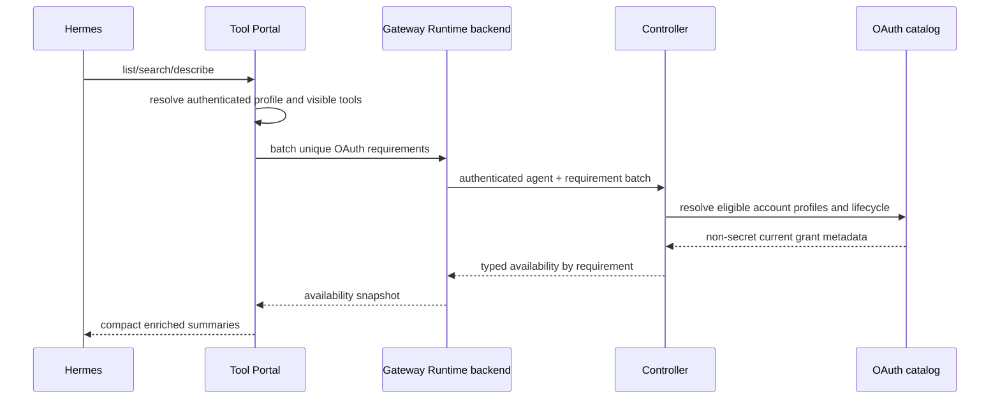

# OAuth-Aware Tool Portal Discovery Design

This supporting view is part of the Agent-Guided OAuth Broker Program Design. It
extends Tool Portal's existing discovery result contract without changing its
capability or approval authority.

## Reader model

```text
Hermes orientation injection
  one namespace heading/summary with bounded child tool name + description only

List/search summary
  which visible tools exist, what each does, whether it requires approval,
  and whether the authenticated agent currently has a usable account grant

Describe
  full help and exact input/output schemas for selected tools

Call
  revalidates policy, approval, account binding, and OAuth state
```

Database enrollment can narrow readiness. It cannot add a namespace/tool, turn a
deny into allow, or remove an approval requirement.

## Injection boundary

Orientation is a backend-neutral presentation of the visible inventory Tool Portal
has already resolved for the authenticated agent. Namespace and tool membership do
not mean MCP or configured CLI. A namespace may be implemented by an MCP provider,
controller execution, or a Tool VM runner; the renderer neither receives nor emits
that backend distinction.

The injected hierarchy is:

```text
Namespace: gog
Summary: Use the Gog CLI with an assigned Google account profile. Pass argv without
the executable name and use ["<command>", "--help"] for command details.
Tools:
  gog_cli
    Execute one admitted Gog CLI invocation.

Namespace: oauth_authorization
Summary: Set up and inspect account authorization.
Tools:
  list
    List account-profile authorization status.
  begin
    Start a human authorization ceremony.
  status
    Check an authorization ceremony.
```

Indentation establishes ownership. Child names remain the capability names already
known to Tool Portal; Gog subcommands such as `gmail search` are argv paths inside
`gog_cli`, not Tool Portal children. The renderer does not repeat `Namespace: gog`
for every child. The injected projection contains only the namespace name/summary
and each included child name/bounded description. Search is the on-demand route to
Tool Portal capabilities omitted from this bounded prefix; configured CLI command
discovery remains the CLI's own `--help` contract.

## Current foundation and delta

Current Tool Portal already:

- returns `namespaceDiscovery` with a summary bounded to 500 Unicode code points;
- lists visible tool summaries with name, description, safety, and compact schema
  field information;
- indexes the full namespace, name, title, description, schema, relationship, and
  scoped-skill text;
- paginates list and limits search;
- returns full schemas through describe or explicit full-detail search.

The OAuth delivery adds:

```text
compact description limit + truncation flag
authored call disposition
static or invocation-dependent OAuth requirement
live agent/account OAuth availability
```

The full search corpus remains untruncated.

## Portable summary contract

`@agent-vm/agent-portal-sdk` remains the sole owner of the strict capability-summary
and list/search/describe wire schemas. It composes the OAuth-specific identifier,
requirement, and availability unions from `@agent-vm/oauth-broker-contracts`, then
regenerates the checked portable manifest and Python contract fixtures. Tool Portal
computes these fields but does not define a parallel result envelope:

```ts
type ToolCallDisposition =
  | { readonly kind: 'without-approval' }
  | { readonly kind: 'requires-approval' }
  | { readonly kind: 'invocation-dependent'; readonly describeBeforeCall: true };

type OAuthToolRequirement =
  | {
      readonly kind: 'oauth-account-profile';
      readonly applicationId: OAuthApplicationId;
      readonly serviceId: OAuthServiceId;
      readonly minimumPermission: 'read' | 'write';
    }
  | {
      readonly kind: 'invocation-dependent-oauth-account-profile';
      readonly accountProfileArgument: 'accountProfile';
      readonly describeBeforeCall: true;
    };

type OAuthToolAvailability =
  | {
      readonly kind: 'ready';
      readonly accountProfiles: readonly {
        readonly accountProfileId: OAuthAccountProfileId;
        readonly accountLabel: string;
      }[];
    }
  | { readonly kind: 'authorization-required' }
  | { readonly kind: 'reauthorization-required' }
  | { readonly kind: 'scope-insufficient' }
  | { readonly kind: 'authorization-status-unavailable' };

type CompactToolDescription = {
  readonly description?: string;
  readonly descriptionTruncated: boolean;
};

type NamespaceOrientationGroup = {
  readonly namespace: string;
  readonly summary?: string;
  readonly tools: readonly CompactToolSummary[];
};
```

Non-OAuth tools omit the OAuth requirement and availability. Hidden tools never
receive a summary.

This dependency remains contract-only:

```text
oauth-broker-contracts
  → portable OAuth identifiers and discriminated unions

agent-portal-sdk
  → generic capability summary and result envelopes
  → composes OAuth requirement/availability fields

tool-portal and Gateway Runtime
  → produce and transport the validated SDK result

generated Python contracts and Hermes adapter
  → consume the same portable schema
```

The SDK does not import the broker engine, controller implementation, SQLite,
1Password, provider tokens, or Tool Portal policy.

`toolRef` remains the canonical opaque machine identity on machine summaries. The
readable orientation renders the namespace once as the group owner, followed by
child tool names. Grouping is orientation presentation, not a replacement list or
search result schema and not alternate call authority.

## Description bounding

The source description remains the full authored `description` or configured CLI
`safeHelp`, already bounded at its authoring contract. A pure Unicode helper creates
the compact output:

```text
maximum: 240 Unicode code points
shorter/equal: return unchanged, descriptionTruncated=false
longer: return first 239 code points + …, descriptionTruncated=true
```

List/search descriptions use the 240-code-point limit. Injected orientation uses a
second 120-code-point description limit and tool name only. No schema or other tool
metadata enters orientation. Truncation happens only after search-index construction
receives the full source record before truncation. Describe receives the full
record. This avoids reducing search recall or making truncation a second help
authority.

## Existing orientation expansion

The current Hermes adapter already renders one deterministic orientation for an
exact session with:

```text
maximum total size: 2,000 UTF-8 bytes
maximum namespaces: 20
greatest complete namespace prefix
explicit omitted namespace count and list/search guidance
```

The expansion keeps those bounds. Inventory population retains only child tool
names and bounded descriptions from the existing namespace list probes instead of
reducing the response to a boolean. The renderer first reserves namespace
name/status/summary coverage, then adds complete name/description entries in
deterministic namespace/tool order, with at most eight children per namespace.
When another complete child would exceed the byte budget, it is omitted and the
namespace says additional tools are available via list/search. The renderer never
cuts UTF-8 bytes or emits a partial tool entry.

## Call disposition

Tool Portal already resolves the authenticated profile, namespace baseline, and
configured-CLI invocation selectors. For each visible tool, summary composition
derives exactly one disposition:

```text
all callable invocations resolve without approval → without-approval
all callable invocations require approval         → requires-approval
callable invocations contain both classes          → invocation-dependent
namespace admits no callable invocation            → blocked and absent
```

Configured CLI classification preserves the existing fixed precedence
`deny > requires_approval > without_approval`. Cross-bucket matcher overlap is
valid; a denied invocation remains unavailable and does not turn into an approval
path. `invocation-dependent` considers only callable admitted invocations after
that precedence. The summary is explanatory only. Dispatch repeats policy and
approval admission; callers cannot submit or override a disposition. Describe
returns the exact configured matcher rules for invocation-dependent tools.

## OAuth availability projection

Static effective config carries only OAuth requirement IDs or the
invocation-dependent marker. For statically classifiable tools, Tool Portal
list/search/describe may batch unique requirements and ask the controller for one
authenticated, agent-scoped availability snapshot through the existing control
session. For `gog_cli`, exact application/service/permission and availability are
resolved only after `accountProfile + argv` pass RPC validation; discovery reports
that OAuth is invocation-dependent and directs Hermes to describe the rules.



The controller returns only account-profile IDs, safe labels, lifecycle class, and
requirement satisfaction. It returns no email unless the configured safe label is
the email already approved for that agent, and no credential ID, raw scope token,
provider payload, or secret reference.

The batch has one bounded deadline. If the controller status edge is unavailable,
every affected tool receives `authorization-status-unavailable`; the list/search
operation can still explain the namespace, but calls fail before credential
resolution. Availability is never cached as durable or call authority.

## Search and list behavior

```text
Hermes orientation
  emits one Gog namespace heading/summary with bounded child tools
  preserves the existing 2,000-byte context budget

tool_portal_list(namespace=gog)
  retains the existing flat, namespace/tool ordered, cursor-paginated contract
  each machine item retains its namespace identity and compact metadata
  each item has compact description, disposition, requirement, availability

tool_portal_search(query="Gog Gmail")
  scores against full untruncated text and schema fields
  retains the existing flat, globally ranked, limit-bounded contract with no cursor

tool_portal_describe(tool=gog.gog_cli)
  extends the descriptor with full authored title/description/safeHelp
  returns exact schemas, disposition/rules, requirement, and availability
```

Search output remains compact by default. Existing explicit full-schema search may
remain available, but the model should normally call describe for exact schemas.
`schemaHint` continues to direct that behavior.

The descriptor contract gains optional `title` and full `description` fields. Local
configured CLI `safeHelp` already has a 4,000-character maximum and becomes the
descriptor description. Provider descriptions retain their validated source text;
the generic portal normalization applies an equivalent safe maximum before catalog
publication. Visibility filtering happens before describe composition.

## OAuth authorization namespace

The `oauth_authorization` controller-execution namespace uses the same discovery
contract. Its namespace summary explains account profiles and the difference
between OAuth consent and Tool Portal call approval. Its tools have concise help:

```text
list        show current account-profile/application grants
begin       start a human ceremony, optionally with Hermes suggestions
status      inspect one ceremony or current grant state
cancel      stop one pending ceremony
reauthorize replace a grant for the same Google subject
revoke      explicitly revoke one app grant before a permission downgrade
```

`begin` suggestions use typed app/service `none | read | write` values. They are
bounded by the slot maxima before the URL is returned and remain advisory until
the human submits the form.

## Bounds and failure behavior

- Namespace summary: maximum 500 Unicode code points, existing contract.
- Injected orientation: existing 2,000 UTF-8 bytes and 20 namespaces; at most eight
  tools per displayed namespace; tool name plus 120 description code points only.
- Compact list/search description: maximum 240 Unicode code points.
- List item count: existing limit and cursor.
- Search item count: existing bounded limit; no cursor.
- Availability batch: deduplicated by application/service/permission and bounded
  by the number of represented visible OAuth tools.
- Controller timeout: return `authorization-status-unavailable`, never stale ready.
- Malformed availability: fail the affected result item closed.
- Hidden/denied tools: absent from results and availability query.

## Proof seams

```text
Pure unit:
  orientation grouping/order/budget, name/description-only projection, complete
  child omission, Unicode truncation, list cursor/search limit, full-text retained

Policy unit:
  uniform-free/uniform-required/invocation-dependent/hidden/overlap-invalid

Availability integration:
  one authenticated batch, cross-agent denial, ready/missing/reauth/scope states

Tool Portal integration:
  orientation/list/search/describe preserve existing shapes and consistent metadata;
  describe returns full authored help

Failure integration:
  controller unavailable never returns stale ready or permits call

Privacy proof:
  no credential IDs, raw tokens, secret refs, or hidden tool names in results
```
