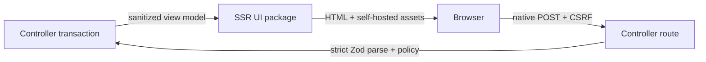
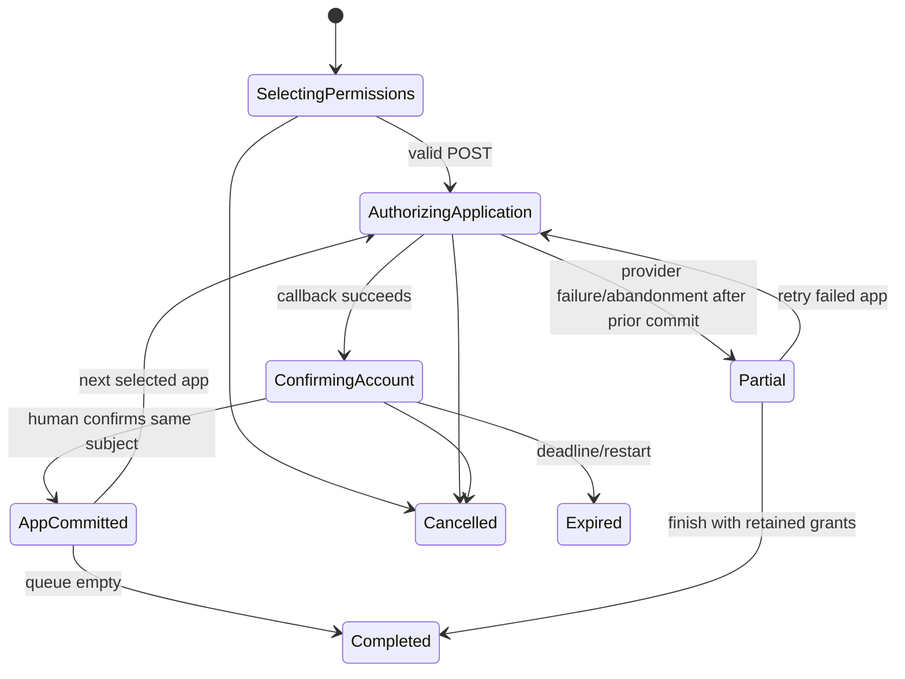

# OAuth Web Approval UI Design

This supporting view is part of the Agent-Guided OAuth Broker Program Design. It
owns the browser presentation boundary only. The controller and OAuth broker remain
the authority for sessions, identity, permissions, scopes, provider calls, and
persistence.

## Package and ownership

```text
@agent-vm/oauth-approval-ui
├── server/
│   ├── layout.tsx
│   ├── permission-selection-page.tsx
│   ├── account-confirmation-page.tsx
│   ├── application-progress-page.tsx
│   ├── partial-completion-page.tsx
│   ├── completion-page.tsx
│   └── error-page.tsx
├── components/
│   ├── permission-choice.tsx
│   ├── application-section.tsx
│   ├── account-summary.tsx
│   ├── progress-summary.tsx
│   └── error-summary.tsx
├── islands/
│   ├── permission-selector.tsx
│   └── application-progress.tsx
├── browser/
│   └── entry.tsx
├── styles/
│   └── oauth.css
└── dist/assets/
    ├── oauth.<content-hash>.css
    └── oauth.<content-hash>.js
```

The package owns Hono JSX renderers, semantic form components, optional Hono DOM
islands, Tailwind sources, and built browser assets. It accepts sanitized view
models and returns pages/forms. It does not import the host broker, SQLite,
Drizzle, secret management, provider adapters, Tool Portal service, or controller
implementation.

`@agent-vm/agent-vm` owns routes, cookies, CSRF/origin enforcement, transaction
state, Tailscale identity, provider redirects, form actions, and static-asset
serving. The UI package never interprets a cookie or decides whether an operation
is authorized.

## Authority and data flow



Browser-facing view models contain only:

```text
transaction presentation ID
account-profile label
application IDs and labels
service IDs and labels
allowed read/write/none choices
Hermes suggestions
current human selections
application progress and safe failure labels
confirmed Google display email after callback
```

They never contain OAuth state, PKCE verifier, authorization code, access/refresh
token, Web client credentials, KEK, encrypted payload, database row ID, provider
raw response, controller dispatch fingerprint, or approval credential.

## Typed browser contract

The UI package consumes readonly discriminated view models. Form submissions are
untrusted and parsed again by the controller-owned Zod schema.

```ts
type OAuthApprovalPageModel =
  | {
      readonly kind: 'permission-selection';
      readonly accountProfileLabel: string;
      readonly applications: readonly OAuthApplicationChoiceModel[];
    }
  | {
      readonly kind: 'account-confirmation';
      readonly accountLabel: string;
      readonly applicationLabel: string;
      readonly grantedPermissionLabels: readonly string[];
    }
  | {
      readonly kind: 'application-progress';
      readonly applications: readonly OAuthApplicationProgressModel[];
    }
  | {
      readonly kind: 'partial-completion';
      readonly completed: readonly string[];
      readonly retryable: readonly string[];
    }
  | { readonly kind: 'completed'; readonly accountLabel: string }
  | { readonly kind: 'expired' | 'cancelled' | 'failed'; readonly message: string };
```

Suggestions use the same `none | read | write` choice type as the server config.
The server intersects them with slot maxima before rendering. An invalid suggestion
is rejected at Tool Portal/controller action validation rather than silently
clamped. Suggested values are visually labeled and become authoritative only after
the verified human submits the permission form.

The controller-owned stores use separate state unions. Sensitive provider results
never enter the UI view model:

```ts
type OAuthCeremonyTransaction =
  | {
      readonly kind: 'selecting-permissions';
      readonly suggestedSelections: OAuthPermissionSelections;
    }
  | {
      readonly kind: 'authorizing-application';
      readonly currentApplication: OAuthApplicationId;
      readonly remainingApplications: readonly OAuthApplicationId[];
      readonly completedApplications: readonly OAuthApplicationId[];
      readonly oauthState: OAuthState;
      readonly pkceVerifier: OAuthPkceVerifier;
    }
  | {
      readonly kind: 'partial';
      readonly completedApplications: readonly OAuthApplicationId[];
      readonly retryableApplications: readonly OAuthApplicationId[];
    };

type OAuthCompletionSession =
  | {
      readonly kind: 'awaiting-account-confirmation';
      readonly currentApplication: OAuthApplicationId;
      readonly remainingApplications: readonly OAuthApplicationId[];
      readonly completedApplications: readonly OAuthApplicationId[];
      readonly providerSubject: string;
      readonly providerGrant: GoogleProviderAuthorizationResult;
    }
  | { readonly kind: 'committing' }
  | { readonly kind: 'consumed' };
```

Both records also carry the opaque IDs, exact agent/account profile, bound
Tailscale login, CSRF secret, and expiry required by their route. The completion
store exclusively owns the exchanged-but-unconfirmed provider grant. It is never
serialized before confirmation.

## Page and route sequence

```text
GET  /oauth/transactions/:transactionId
  verify opaque transaction + Tailscale login
  issue/verify browser-binding cookie
  render permission-selection page

POST /oauth/transactions/:transactionId/permissions
  verify cookie + CSRF + Origin + tailnet identity
  parse choices and validate slot maxima
  derive selected application queue and Google scopes
  render a same-origin application-progress interstitial
  human follows a normal HTTPS link to the first selected Google Web application

GET  /oauth/google/callback
  verify state + PKCE + current application + same Tailscale login
  exchange code and verify the Google subject/scopes
  rotate to completion session
  render account confirmation

POST /oauth/completions/:completionId/confirm
  commit current app grant
  render a same-origin application-progress interstitial for the next selected
  application or render completion summary

POST /oauth/transactions/:transactionId/cancel
  invalidate pending ceremony; preserve already committed application grants

POST /oauth/completions/:completionId/retry
  restart only a retryable application for the same account profile/subject
```

The shared callback never accepts an application ID from query input as authority;
the consumed server transaction names the current application.

Callback and confirmation transitions are atomic:

```text
matching callback
  application transaction → consuming before provider exchange
  exchange succeeds → create awaiting-confirmation completion session
  destroy state/PKCE callback authority

first matching confirmation
  awaiting-confirmation → committing before SQLite work
  commit succeeds → zeroize provider grant → consumed
  create next app transaction with fresh state/PKCE, or complete

duplicate confirmation
  observes committing/consumed and never commits or advances twice
```

Expiry, cancellation, controller restart, or failed commit clears owned provider
grant byte arrays and drops unconfirmed authority. Already committed SQLite grants
remain. After restart, Hermes can list those grants and begin a new ceremony for
unfinished applications; no old callback, completion cookie, state, or PKCE value
can resume.

## Multi-application state



Every application commits independently. The first committed app binds the account
profile's Google subject. Later callbacks must return that subject. A mismatch
fails only that app and never replaces or deletes completed grants.

`none` omits an unselected app/service from the queue. It never revokes an existing
grant. A write-to-read downgrade links to a separate approval-gated revoke and
reauthorize ceremony; the ordinary selector cannot represent a completed downgrade
until revocation succeeds.

## SSR, forms, and islands

Hono JSX server-renders complete usable pages. Native radio inputs and submit
buttons own the no-JavaScript behavior:

```html
<fieldset>
  <legend>Gmail access</legend>
  <input type="radio" name="gmail" value="none">
  <input type="radio" name="gmail" value="read">
  <input type="radio" name="gmail" value="write">
</fieldset>
```

Tailwind `peer-*` classes may present the radios as segmented controls without
removing them from the accessibility tree. Server validation remains authoritative.

`hono/jsx/dom` is allowed only for bounded progressive enhancement:

- disable choices whose dependencies are visibly unsatisfied;
- update a non-sensitive permission summary;
- expand/collapse application sections;
- apply a configured preset;
- render progress across the three independent app flows.

The browser bundle mounts only inside explicit island roots. It does not own
routing, cookies, OAuth state, permission validation, redirects, confirmation, or
persistence. Removing or blocking the bundle leaves the native journey complete.

## Tailwind and asset build

Tailwind runs only at package build time and scans the package TSX/CSS sources. It
emits one minimized, content-hashed CSS asset. The optional Hono DOM entry builds to
one content-hashed, self-hosted module. The package manifest maps logical asset
names to emitted files; the controller resolves assets through package exports and
serves immutable cache headers for hashed assets.

There is no Tailwind CDN, runtime Tailwind compiler, external font, third-party
image, inline style, inline executable script, or general frontend dev server in
production. Hono streaming/Suspense script injection is not used on the OAuth
surface.

## Browser security

Every state-changing form requires the authenticated tailnet peer, browser-binding
cookie, exact server transaction/completion session, session-bound CSRF token, and
expected `Origin`. Forms post only to same-origin HTTPS routes.

The controller sends:

```text
Content-Security-Policy:
  default-src 'none';
  base-uri 'none';
  object-src 'none';
  style-src 'self';
  script-src 'self';
  connect-src 'self';
  img-src 'self';
  form-action 'self';
  frame-ancestors 'none'

Referrer-Policy: no-referrer
X-Content-Type-Options: nosniff
Cache-Control: no-store
```

Hashed static assets may use immutable caching, but HTML, redirects, forms, and
status responses remain `no-store`. Hono JSX escaping is used for all dynamic text;
the package exposes no raw-HTML insertion path.

## Accessibility and visual behavior

- Use semantic headings, labels, fieldsets, legends, buttons, and ordered progress.
- Preserve visible keyboard focus and natural tab order.
- Put validation failures in a focused error summary and associate field errors.
- Announce progress/status changes through appropriate live-region semantics when
  an island updates them.
- Never communicate `none`, `read`, `write`, success, or failure by color alone.
- Keep account identity, application, and permission scope visible on confirmation.
- Match the established product typography/spacing tokens when available; otherwise
  keep the surface neutral and utility-oriented rather than inventing a new brand.

## Proof seams

```text
SSR unit proof
  every page variant, escaping, semantic controls, suggestions, errors

Form integration proof
  no-JS permission POST, CSRF/origin/cookie/identity failure, retry/cancel

Island unit proof
  dependency behavior, summaries, presets, progress, no sensitive model keys

Asset proof
  Tailwind/client build, content hashes, package exports, CSP-compatible HTML

Accessibility proof
  semantic assertions, keyboard/focus/error behavior, no color-only state

Host/browser proof
  actual-size Chrome flow on a second tailnet device with and without JS,
  three-app partial success, same-subject enforcement, and no secret exposure
```

## Non-goals

- No SPA, client router, general hydration root, React, shadcn, Radix, Vite
  production server, Tailwind CDN, or third-party analytics.
- No account-management dashboard, arbitrary grant editor, subject replacement,
  or client-side revoke authority.
- No client-side storage of account selections beyond the current rendered form;
  server sessions remain authoritative.
