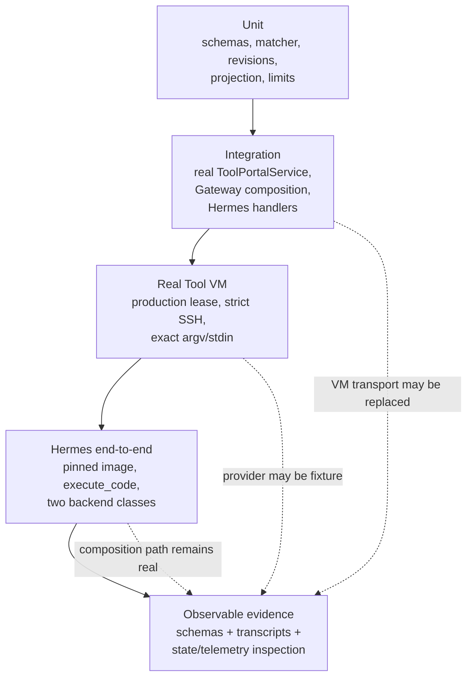

# Tool VM CLI and Hermes Tool Portal Composition Proof Architecture

Program Design authority:
[program-design.md](program-design.md)

Specification authority:
[specification.md](specification.md)

## Requirement, owner, and proof trace

| Requirements | Structural owner | Observable seam | Minimum proof |
| --- | --- | --- | --- |
| R1–R3 | Config contracts, catalog compiler, Tool VM CLI executor | Authored config, public schema, guest argv | Unit plus real Tool VM |
| R4, R7 | Operation-group acquisition and strict SSH | Current generation, cancellation, certainty | Integration plus real Tool VM |
| R5–R6 | Catalog projection and shared output projector | list/search/describe and call result | Unit/integration |
| R8, R15 | Existing controller configured CLI path plus strict discriminants | Old/new config and version skew | Regression and readiness integration |
| R9–R10 | Execute-code Tool Portal bridge and existing handlers | Generated hermes_tools and parent RPC | Python/adapter integration |
| R11–R14 | Pinned Hermes runtime plus ToolPortalService | Multi-call Python result and approval | Hermes end-to-end |

## Proof boundary

This view answers which boundaries must remain real and what each proof layer
may replace.

## Unit floor

- command.cli strict schema accepts executable/help/metadata/resource fields and
  optional hintDeny/hintRequiresApproval, while rejecting admitted grammar,
  unprefixed policy, credential, target-authority, and mixed fields;
- ToolVmCliInput accepts empty and arbitrary argv, punctuation, endpoint-like
  values, arbitrary stdin, and rejects only structural/size violations;
- ToolVmCliInput accepts newline/tab-bearing non-empty NUL-free tokens while
  the separate advisory matcher schema remains control-free;
- catalog projection exposes safe metadata/schema and omits executable/runtime
  authority;
- list/search/describe expose the closed advisory projection only for
  command.cli and never expose matcher contents;
- hintDeny emits the closed advisory error/diagnostic code and fixed safe
  message;
- hintRequiresApproval carries the typed advisory context through the portable
  intent/presentation contract; all other approval requests remain unchanged;
- advisory matcher tests prove path-prefix/flag semantics, unmatched direct
  behavior, hintDeny precedence, and hintRequiresApproval preflight;
- canonical revision tests prove reorder stability and meaningful
  path/name/value/bucket mutation;
- timeout and output projection match the common configured-CLI contract;
- bridge guard, helper stubs, enabled-tool intersection, schema documentation,
  session propagation, install rollback, and restore are exhaustive;
- explicit empty enabled-tool intersections generate zero helpers and reject
  forged RPC requests;
- per-call SSH enforcement covers open commands beyond 30 seconds, configured
  truncate/fail below the hard cap, and immutable hard-cap failure.

## Integration floor

Use real ToolPortalService, Gateway Runtime catalog/backend composition, current
operation-group acquisition seam, strict SSH client seam, artifact/result
projection, and current trusted context. Replace only the actual VM transport
where testing policy requires.

Observe exact executable plus caller argv/stdin, no controller RPC, no
credentialed provider, correct current generation, timeout/cancel, and result
certainty.

Pair one hint-denied and one hint-approved Tool Portal call with the same direct
terminal/Python invocation. Prove that the Portal route follows the hint while
the Tool VM execution remains possible, and verify every diagnostic and
presentation labels the behavior advisory.

Hold a hint-required approval challenge, then mutate only advisoryHints.
Observe stale challenge/grant/direct authority and zero Tool VM acquisition.
Repeat with reorder-equivalent hint configuration and observe an unchanged
binding revision.

For execute_code composition, use the real managed Tool Portal registered
handlers and Hermes execute_code RPC bridge with fake backend ports only where
needed to prove backend-independent routing, session identity, approval, mixed
results, and call counting.

Hold one nested approval pending, then timeout and separately interrupt the
outer execute_code call. Observe exact approval-route closure, coroutine
cancellation, suppression of late approval retry and result-file writes, RPC
thread termination, and sandbox cleanup ordering.

## Real Tool VM floor

Boot the production Tool VM path with a permanent fixture executable that emits
argv and stdin exactly. Prove:

- caller-controlled tokens arrive unchanged;
- shell metacharacters are inert with a non-shell fixture;
- a configured interpreter can execute arbitrary code;
- current workspace/egress/credential mediation remains the actual boundary;
- stale generation and cross-agent calls fail;
- no controller or credentialed VM call occurs.

## Hermes end-to-end floor

Use the pinned Hermes image, Agent VM adapter, real execute_code remote path,
real Gateway Runtime/ToolPortalService, and at least:

- one MCP-backed read capability;
- one Tool VM command.cli fixture;
- Python filtering/combination between calls.

The transcript must show list/search/describe/call availability, multiple call
orders, current profile/session binding, result composition, existing limits,
and absence of private authority in the child. An approval-required non-Tool-VM
fixture must prove normal Hermes presentation and exact result return.

A Tool VM hint-required transcript must show the typed advisory explanation,
while controller, credentialed-VM, MCP, and registered-action approval
transcripts remain unchanged.

A second transcript must terminate execute_code while that approval is pending
and prove zero late backend effects after the outer result. Session variants
with tool-portal enabled, disabled, and an explicit empty sandbox-tool
intersection must prove exact helper availability and zero forged dispatch.
