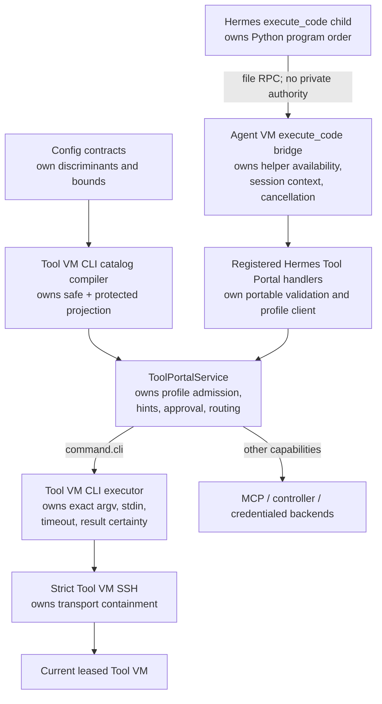
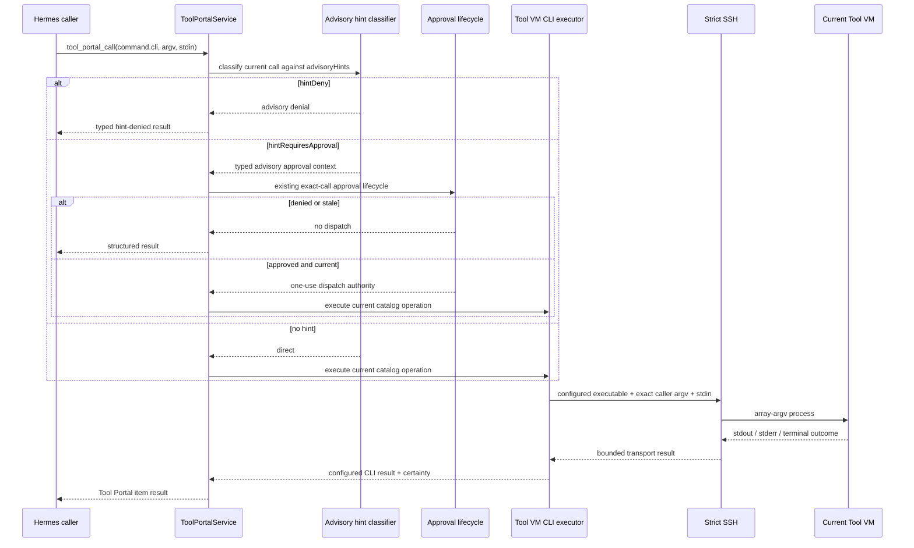
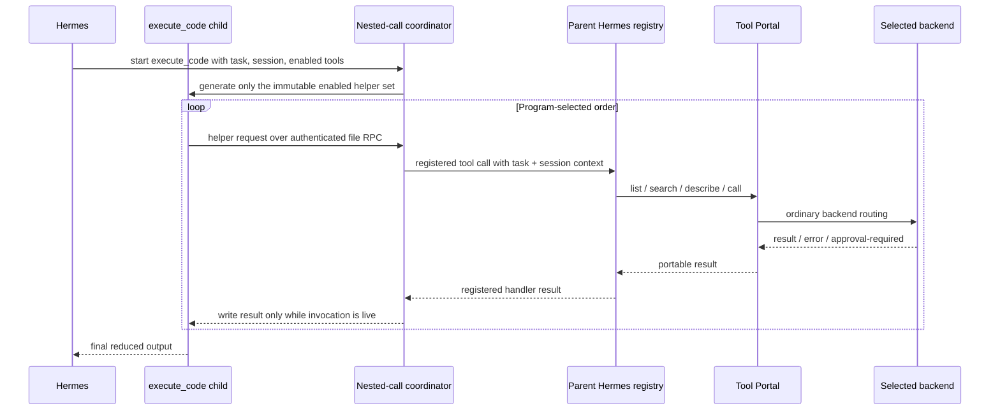
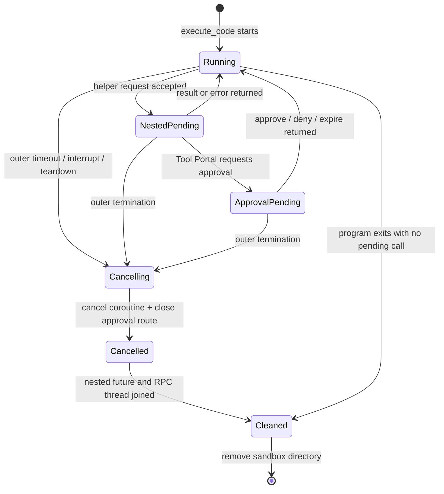
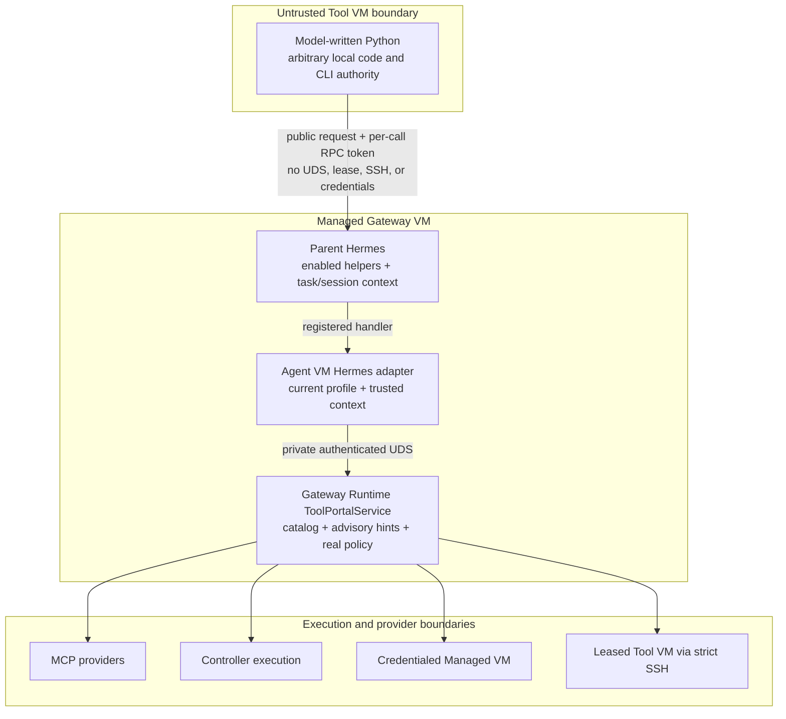

# Tool VM CLI and Hermes Tool Portal Composition Program Design

Requirements:
[requirements.md](requirements.md)

Specification:
[specification.md](specification.md)

## Structural crux

The system must expose one public configured-CLI call shape across execution
locations without pretending that every target has the same authority model.

Controller-host and credentialed-VM execution need semantic invocation policy
because the Tool Portal call is their admitted authority. The leased Tool VM
does not: managed Hermes already has arbitrary terminal and Python execution
there. The same matcher and approval machinery remains useful as route-local
operator guidance only when its Tool VM configuration, diagnostics, manuals,
and approval presentation use explicit hint terminology.

The second crux is context preservation. Hermes execute_code already proxies
nested tool calls back to the parent process, but its generated helper catalog
is hard-coded and its remote RPC path forwards task identity without forwarding
the complete Hermes session identity needed by Tool Portal approval and
telemetry.

## Architecture at a glance

This view answers which component owns each decision and where the two delivery
layers join.



## Current system

### Current Tool Portal target structure

```text
ToolPortalService
  mcp_provider backend
    -> configured MCP provider

  controller_execution backend
    registered_action
      -> controller RPC
    configured_cli
      -> invocation policy
      -> controller_host | ephemeral_managed_vm

  tool_vm_runner backend
    command.fixed | filesystem | process lifecycle
      -> current Tool VM acquisition
      -> strict SSH
```

Current source anchors:

- packages/config-contracts/src/tool-portal-config.ts defines the three backend
  kinds and the command.fixed Tool VM operation.
- packages/config-contracts/src/controller-configured-cli.ts defines the
  restricted configured-CLI policy and controller/credentialed target union.
- packages/tool-portal/src/tool-portal-service-common.ts applies dynamic
  configured-CLI policy only to controller_execution configured_cli.
- packages/gateway-runtime/src/backends/tool-vm-runner-configured-catalog.ts
  compiles fixed Tool VM operations.
- packages/gateway-runtime/src/backends/tool-vm-runner-backend-port.ts acquires
  the current Tool VM and dispatches direct strict SSH.

### Current Hermes execute_code path

```text
Hermes execute_code handler
  -> tools.code_execution_tool.execute_code
  -> remote BaseEnvironment selected from terminal configuration
  -> Agent VM patched HermesGatewayRuntimeEnvironment
  -> Python script runs in leased Tool VM

Python imports hermes_tools
  -> generated file-RPC request
  -> parent _rpc_poll_loop
  -> model_tools.handle_function_call(tool_name, args, task_id)
  -> one of seven hard-coded allowed tools
```

Current source anchors:

- pinned Hermes tools/code_execution_tool.py owns SANDBOX_ALLOWED_TOOLS,
  _TOOL_STUBS, helper documentation, remote execution, and the RPC polling
  loop.
- pinned Hermes execute_code registration forwards task_id and enabled_tools,
  but not session_id.
- python/agent-vm-hermes-adapter managed_gateway_bootstrap.py redirects the
  upstream BaseEnvironment to the authenticated Tool VM.
- managed_tool_portal_capability_tools.py already registers
  tool_portal_list/search/describe/call with validated portable contracts,
  current-profile GatewayRuntimeClient selection, approval presentation, and
  telemetry.

## Selected direction

### Target-specific Tool VM CLI operation

Add an unrestricted CLI operation to the existing tool_vm_runner operation
union. Do not add tool_vm to controller_execution and do not send Tool VM calls
through the controller.

The authored backend remains an honest target discriminant:

```text
backend.kind = controller_execution
  configured_cli
    -> restricted invocation policy
    -> controller_host | ephemeral_managed_vm

backend.kind = tool_vm_runner
  command.cli
    -> configured executable and metadata
    -> unrestricted caller argv/stdin
    -> optional hintDeny / hintRequiresApproval for this Portal call
    -> current leased Tool VM
```

Both variants expose the same public CLI input and model-visible result where
their observable behavior overlaps. Their authored policy and containment
claims remain different.

The hint aliases are scoped to exactly one type branch:

```text
backend.kind = tool_vm_runner
  operation.kind = command.cli
    advisoryHints
      hintDeny
      hintRequiresApproval
```

No common base type, controller execution projection, MCP provider, registered
action, command.fixed, process operation, or filesystem operation contains
those fields. Shared code is limited to pure matcher and approval-lifecycle
machinery; shared names and authority semantics do not cross the discriminant.

The only shared public additions are optional SDK fields with explicit
tool_vm_advisory_hint discriminants. Their absence is the exact unchanged
representation for every other backend and operation.

### Agent VM-managed Hermes bridge

Extend the pinned Hermes execute_code integration from the Agent VM adapter,
not from deployment configuration and not by giving the child a direct Portal
client.

The bridge expands the generated hermes_tools surface with the four already
registered Tool Portal tools and forwards the exact Hermes session identity
through the existing parent RPC dispatcher.

## Alternatives

The selected and rejected structural alternatives, their costs, and their
revisit signals are preserved in
[program-design-decisions-and-interfaces.md](program-design-decisions-and-interfaces.md#alternatives).

## Component ownership

```text
Agent VM configured Tool Portal
  Config contracts
    owns: strict target/operation discriminants and public protocol bounds

  Tool Portal service
    owns: profile/catalog admission and backend authority

  Gateway Runtime Tool VM CLI catalog compiler
    owns: safe capability descriptor and protected runtime definition

  Gateway Runtime Tool VM CLI executor
    owns: current Tool VM acquisition, exact argv dispatch, timeout/cancel,
          output projection, and certainty

Managed Hermes adapter
  Managed Tool Portal capability tools
    owns: registered direct handlers, portable validation, current profile,
          approval presentation, telemetry

  Execute-code Tool Portal bridge
    owns: exact-pin compatibility, helper generation, session propagation,
          installation and restoration

Pinned Hermes
  execute_code runtime
    owns: child process, file RPC, call count, execution timeout, stdout caps
```

### Config contracts

The tool_vm_runner operation union gains command.cli.

Its authored definition owns:

- kind: command.cli;
- executable: an absolute NUL-free path;
- safeHelp: bounded trusted discovery text;
- metadata: an optional closed, bounded object containing displayName, source,
  version, and categories;
- workingDirectory: current Tool-VM-work-relative path;
- timeout: quick or open;
- output: the existing configured-CLI output/resource policy.
- advisoryHints: optional hintDeny and hintRequiresApproval matcher arrays.

Tool VM-specific schema ceilings compose those policies with the strict SSH
transport boundary:

- configured stderrMaxBytes cannot exceed the existing 1 MiB per-stream
  strict-SSH hard ceiling;
- model-visible stdoutMaxBytes cannot exceed 65,536 bytes so every successful
  configured-CLI result remains representable by the Portal JSON string
  contract, while strict SSH retains the independent 1 MiB transport ceiling;
- quick resolves to 5 seconds;
- open resolves to 120 seconds by default and may request up to the common
  configured-CLI maximum of 8 hours;
- the resolved command deadline is supplied per execution and does not change
  the 30-second default used by existing fixed/filesystem/process operations.

It intentionally omits:

- mandatoryArgvPrefix;
- commands and every admitted-command allowlist;
- unprefixed deniedPatterns;
- flagRules;
- unprefixed invocation-level calls;
- semantic stdin policy;
- environment and credential injection;
- executionTarget, image, lease, and SSH fields.

The profile namespace still owns ordinary Tool Portal visibility and admission.
command.cli uses calls.withoutApproval as its baseline. Its optional
advisoryHints may strengthen one matching Tool Portal call to hint denial or
hint-required approval. Static validation rejects using the ordinary unprefixed
namespace calls.requiresApproval selector as Tool VM command policy.

The hint fields reuse ConfiguredCliInvocationMatcher syntax but not configured
CLI admission:

```text
advisoryHints:
  hintDeny: [exact path + present flag predicates]
  hintRequiresApproval: [exact path + present flag predicates]
```

Matcher paths are compared as argv prefixes directly. They do not need a
commands entry because no commands allowlist exists. Unknown or unmatched argv
remains directly callable. The fixed route-local precedence is:

```text
hintDeny > hintRequiresApproval > withoutApproval
```

Non-empty hintRequiresApproval participates in existing approvalAccess and
presenter preflight. The approval presentation, result diagnostics, generated
schema, manual, and reference documentation retain the hint prefix and explain
that terminal or Python can bypass the Tool Portal interaction.

The public ToolVmCliInput schema is target-neutral protocol data:

```text
argv       array, zero to 100 bounded non-empty NUL-free UTF-8 tokens
reason     bounded non-empty audit/intent text
stdin      optional bounded text, no semantic inspection
timeoutMs  optional only for open timeout class
```

Bounds prevent malformed or unbounded protocol/resource use; they do not claim
to constrain executable meaning. Tool VM argv tokens intentionally use a
distinct schema from controller configured-CLI tokens: newline, tab, and other
transport-representable control characters are valid Tool VM argv data and pass
unchanged through strict SSH. Empty individual tokens remain invalid because
the current strict-SSH argv contract requires non-empty tokens; the argv array
itself may be empty.

ConfiguredCliInvocationMatcher remains control-free for advisory matcher paths
and flag predicates. A caller token that cannot appear in a hint matcher still
executes normally; matcher representability never becomes command admission.

### Safe projection and catalog compiler

The effective/Gateway projection retains the protected executable path,
working directory, timeout class, and output policy because Gateway Runtime is
the execution owner. Model-visible catalog projection exposes only safeHelp,
bounded metadata, the public input/output schemas, and truthful annotations.

The catalog entry carries:

```text
public descriptor and summary
protected operation:
  kind = cli-exec
  executable
  workingDirectory
  timeout policy
  output policy
  advisory hint matchers
```

Executable path and runtime fields never appear in Tool Portal list, search, or
describe results. Safe discovery may expose the configured hint descriptions
only with explicit Tool Portal advisory labeling.

The agent-portal-sdk capability descriptor and summary contracts gain one
optional closed advisory projection:

```text
advisory:
  kind: tool_vm_call_hints
  scope: tool_portal_call_only
  bypassableWithinToolVm: true
  hasHintDeny: boolean
  hasHintRequiresApproval: boolean
```

The catalog compiler synthesizes this projection from the presence of matcher
buckets. It never publishes matcher contents, executable paths, or runtime
authority. list, search, and describe preserve the same fixed meanings.
Operations outside tool_vm_runner.command.cli omit advisory entirely, retaining
their current public schemas and summaries.

### Advisory hint classifier

Move exact path-prefix and present-flag predicate matching into a target-neutral
pure matcher. The existing restricted configured-CLI evaluator continues to own
command admission, allowed values, stdin policy, and authoritative
deny/approval disposition for controller targets.

The Tool VM advisory classifier consumes only:

- exact caller argv;
- hintDeny matchers;
- hintRequiresApproval matchers;
- the fixed withoutApproval baseline.

It returns hint-denied, hint-requires-approval, or direct. It never returns
"argv not admitted" and never inspects stdin content. ToolPortalService uses the
classification before backend acquisition:

- hint-denied returns a proven not-dispatched item with an advisory-hint code;
- hint-requires-approval enters the existing exact-call approval lifecycle with
  Tool VM hint presentation text;
- direct proceeds to the Tool VM CLI executor.

The public Portal error and safe-diagnostic code unions gain
tool_vm_advisory_hint_denied. Its fixed safe message states that deployment
guidance declined this Tool Portal call and that it is not a Tool VM containment
result. No caller-controlled matcher, argv, or stdin content enters the code or
message.

Controller revalidation is not added because Tool VM execution remains
Gateway-owned. The current effective catalog revision and approval reservation
still bind the exact Tool Portal call so stale hint policy cannot dispatch
through an old approval.

### Typed advisory approval presentation

The portable GatewayApprovalPresentationRequest gains one optional typed
presentation context:

```text
context:
  kind: tool_vm_advisory_hint
  scope: tool_portal_call_only
  bypassableWithinToolVm: true
```

ToolPortalService, not the model or backend, creates this context only after
hintRequiresApproval classification for tool_vm_runner.command.cli. The
approval intent and presentation projector carry it unchanged to the Hermes
presenter. The Hermes renderer uses fixed copy:

```text
Tool VM advisory hint: approve this Tool Portal call once?
This guidance applies only to Tool Portal; it does not restrict terminal or
Python execution inside the same Tool VM.
```

The existing namespace, capability name, arguments preview, expiry, and allowed
decisions remain separate typed fields. The renderer does not infer advisory
meaning from names or argument previews. Calls without context preserve the
existing presentation schema and text byte-for-byte.

The new context is trusted projection data. Public callers cannot supply,
override, or remove it. It participates in exact approval intent and is covered
by the same redaction and bounded-display rules as the existing presentation.

### Hint semantic freshness

gateway-runtime-portal-semantic-revision adds normalized advisoryHints to the
tool_vm_runner.command.cli binding-revision projection. Canonicalization keeps
bucket identity and path-token order while treating set-like authoring order as
irrelevant:

- sort names and values inside each flag predicate;
- sort predicates by their canonical representation;
- sort matchers within hintDeny and within hintRequiresApproval;
- retain hintDeny and hintRequiresApproval as distinct named buckets;
- retain token order inside each matcher path.

Reordering equivalent names, values, predicates, or matchers preserves the
binding revision. Changing a path token or its order, a name, value, bucket, or
matcher membership changes the revision. Existing profile policy revision,
direct-dispatch fingerprint, approval challenge, grant, reservation, and
current catalog identity consume the changed binding revision.

A hint-only semantic mutation therefore stales both direct authority and any
pending or approved hintRequiresApproval intent before Tool VM acquisition.

### Tool VM CLI executor

The executor parses only the public structural schema. It then:

1. acquires the authenticated principal's current Tool VM operation group;
2. verifies current environment generation and operation authority;
3. connects the strict SSH client;
4. resolves the quick/open timeout;
5. creates a call-scoped cancellation signal combining caller cancellation and
   timeout;
6. executes exact array argv:

```text
[protected executable, ...caller argv]
```

7. supplies caller stdin bytes without content inspection;
8. projects stdout/stderr through the shared configured-CLI output projector;
9. returns the common configured-CLI result with Tool VM runner outcome,
   owning-generation, and certainty metadata;
10. ends the active use and retires the operation group.

reason is retained for Tool Portal intent/telemetry but is never sent to the
guest command.

The common configured-CLI output projector moves to a dependency-neutral shared
package consumed by both controller execution and Gateway Runtime. One
implementation owns truncation, fail-on-overflow, fixed safe stderr summaries,
and result shape.

#### Resource-enforcement order

StrictToolVmSshClient.execute gains an optional per-execution limits object used
only by command.cli:

```text
deadlineMs
stdoutPolicy: { captureBytes, overflow }
stderrPolicy: { captureBytes, overflow }
hardTransportBytesPerStream
```

The client validates deadlineMs against the common 8-hour configured-CLI
ceiling and validates each captureBytes value against the immutable
hardTransportBytesPerStream ceiling. Existing callers that omit the object keep
the current 30-second deadline and 1 MiB per-stream fail-on-overflow behavior.

For command.cli, stream handling follows one order:

1. count all received bytes per stream;
2. retain at most the configured captureBytes;
3. when configured overflow is fail, request cancellation on the first byte
   beyond captureBytes and return completed-failed after terminal proof;
4. when configured overflow is truncate, discard bytes beyond captureBytes
   while continuing to drain both streams;
5. if either stream exceeds the immutable hard transport ceiling, request
   cancellation and return the existing strict-transport execution failure,
   regardless of configured truncate;
6. caller cancellation, configured deadline, and transport failure retain
   distinct certainty classifications.

This ordering lets configured truncation operate below the real transport cap,
allows open commands to run beyond the legacy 30-second default, and preserves
an immutable output and 8-hour runtime containment ceiling. Configuration
cannot raise either hard ceiling.

### Execute-code Tool Portal bridge

The bridge has three responsibilities.

First, it validates the exact pinned Hermes private surface before mutation:

- expected seven-tool SANDBOX_ALLOWED_TOOLS baseline;
- expected _TOOL_STUBS mapping and helper generator;
- expected helper-documentation list;
- expected execute_code registry entry and remote RPC functions.

Mismatch fails managed Hermes startup/readiness with a bounded compatibility
error. There is no degraded mode that silently omits programmatic Tool Portal.

Second, before the first model-tool schema is assembled, it adds:

- tool_portal_list;
- tool_portal_search;
- tool_portal_describe;
- tool_portal_call;

to the execute_code allowed-tool set, stub generator, and helper documentation.
Each generated Python helper accepts one request dictionary and returns one
decoded result dictionary. It calls the existing file-RPC primitive; it does
not implement a Tool Portal client.

Third, it wraps the execute_code handler and remote RPC context so that:

- session_id received by the direct execute_code invocation reaches
  execute_code;
- session_id reaches the remote RPC polling loop;
- each nested handle_function_call receives task_id, session_id, and the
  session's enabled tool set;
- only helpers actually enabled in the session are generated.

An explicitly supplied enabled-tools set is authoritative even when its
intersection with the execute_code allowlist is empty. The bridge removes the
pinned Hermes fallback that replaces an empty explicit intersection with the
process-global allowlist. Legacy fallback to all sandbox helpers remains only
when the caller supplied no enabled-tools set at all. Every execute_code
invocation freezes its own immutable intersection, and the parent RPC guard
uses that same set before registry dispatch.

The bridge records original module and registry state and restores it on
managed Gateway shutdown or failed installation, matching existing Agent VM
Hermes hook discipline.

#### Nested-call lifecycle and cancellation

The bridge creates one ExecuteCodeNestedCallCoordinator per execute_code
invocation. It owns:

- the outer task and session identity;
- one cancellation event linked to outer timeout, interruption, and teardown;
- the exact set of active nested request IDs and parent-dispatch futures;
- approval presentation handles created by nested Tool Portal calls;
- permission to write a nested result file while the invocation remains live.

The RPC polling thread submits each Tool Portal helper request through the
coordinator rather than entering the synchronous registered handler without a
lifecycle owner. The coordinator installs the task/session/enabled-tool context,
starts the existing handler on the adapter-owned runtime, and waits for either
the result or outer cancellation.

The managed Tool Portal handler and approval presenter gain an optional
invocation cancellation context. Direct Hermes calls omit it and retain current
behavior. For a nested execute_code call, cancellation:

1. marks the exact nested request terminal so no later decision may retry it;
2. cancels the in-flight Gateway Runtime coroutine;
3. closes the exact approval presentation route and releases its waiter;
4. ignores a racing late approval decision or provider result;
5. forbids creation or replacement of the nested result file;
6. waits for the nested future and polling thread to terminate before the
   execute_code sandbox directory is removed.

If termination cannot be proven within the existing bounded teardown window,
execute_code returns a bounded internal failure and managed Hermes records an
error; the coordinator still retains the terminal cancellation marker until the
future acknowledges cancellation. No backend retry or detached effect is
permitted after the outer invocation becomes terminal.

## Behavioral interfaces

The three caller-visible internal contracts—authored definition, Tool VM CLI
call, and programmatic Tool Portal helper—are specified in
[program-design-decisions-and-interfaces.md](program-design-decisions-and-interfaces.md#behavioral-interfaces).

## Current-to-proposed call paths

### Configured executable in Tool VM

This sequence makes the changed and preserved edges visible.



```text
CURRENT
tool_portal_call
  -> ToolPortalService                         unchanged
  -> tool_vm_runner catalog command.fixed      changed
  -> empty call arguments                      removed for command.cli
  -> current operation-group acquisition       unchanged
  -> StrictToolVmSshClient.execute(fixed argv) changed
  <- artifact-oriented fixed-command result    changed

PROPOSED
tool_portal_call
  -> ToolPortalService                         unchanged
  -> namespace direct-admission baseline        unchanged
  -> command.cli public structural parse        added
  -> advisory hint classifier                   added
     -> hintDeny: advisory denial, no binding
        -> typed advisory error/diagnostic       added
     -> hintRequiresApproval:
        -> typed advisory approval context       added
        -> existing exact approval lifecycle     unchanged
     -> unmatched: direct
  -> binding-revision freshness check            changed
  -> current operation-group acquisition        unchanged
  -> generation/current-authority check          unchanged
  -> StrictToolVmSshClient.execute(
       configured executable + caller argv,
       caller stdin,
       call-scoped timeout/cancel)               added
  -> common configured-CLI output projection     added
  <- configured-CLI result + Tool VM certainty   added
```

### execute_code composition



```text
CURRENT
Hermes handle_function_call(execute_code, session context)
  -> execute_code handler drops session_id       changed
  -> Python in Tool VM
  -> hermes_tools call among seven names          changed
  -> parent RPC with task_id only                 changed
  -> handle_function_call(nested tool)

PROPOSED
Hermes handle_function_call(execute_code, session context)
  -> Agent VM bridge forwards task_id + session_id + enabled tools
  -> immutable explicit enabled-tool intersection
     (empty stays empty; no global fallback)
  -> invocation-scoped nested-call coordinator
  -> Python in Tool VM
  -> hermes_tools.tool_portal_* request
  -> authenticated file RPC to parent
  -> handle_function_call(
       registered Tool Portal tool,
       task_id,
       session_id,
       enabled tools)
  -> existing managed Tool Portal handler         unchanged
  -> current profile GatewayRuntimeClient          unchanged
  -> ToolPortalService and configured backend      unchanged
  <- portable Tool Portal result
  <- decoded Python dictionary

OUTER TIMEOUT / INTERRUPT
  -> coordinator marks nested request terminal
  -> cancel Gateway coroutine + exact approval route
  -> suppress late retry/result write
  -> join nested future and polling thread
  -> remove execute_code sandbox
```

## State and lifecycle

No new durable state is introduced.

The nested-call lifecycle is the ordering-critical state machine.



| State | Owner | Lifetime | Transition |
| --- | --- | --- | --- |
| Authored Tool VM CLI definition | Deployment config, interpreted by config contracts | Deployment generation | Parse and prepare atomically |
| Protected Tool VM CLI catalog entry | Gateway Runtime | Gateway epoch | Compile at startup; retire with service |
| Tool VM CLI advisory classification | ToolPortalService | One call, derived from current catalog revision | hint deny, exact approval, or direct |
| Advisory public projection | Agent portal SDK and catalog compiler | Gateway epoch and one result/presentation | Closed discovery annotation, denial code, or approval context |
| Tool VM operation group | Existing acquisition port | One call | Acquire, execute, end active use, retire |
| Execute-code bridge installation | Managed Hermes adapter | Hermes process | Validate, install before model assembly, restore on close |
| Execute-code RPC sandbox | Pinned Hermes | One execute_code call | Create, serve bounded calls, remove |
| Nested-call coordinator | Managed Hermes adapter | One execute_code call | Create before RPC thread; cancel/join before sandbox removal |
| Nested Tool Portal approval | Existing controller/Gateway/Hermes owners | One exact Tool Portal item | Existing challenge/decision/retry lifecycle |

Bridge installation is process-global but single-owner and idempotence-guarded.
Concurrent managed sessions consume the same immutable installed helper
definitions and retain distinct task/session context per invocation.

## Failure and recovery

| Failure | Detection/owner | Result and recovery |
| --- | --- | --- |
| Mixed strong/unprefixed policy fields on command.cli | Config schema | Generation rejected; no runtime change |
| hintDeny matches | Tool Portal advisory classifier | Proven route-local denial; no Tool VM binding |
| hintRequiresApproval matches | Tool Portal advisory classifier and existing presenter | Exact advisory approval interaction; deny/expiry creates zero Tool Portal dispatch |
| Hint policy changes after challenge | Existing semantic revision and approval ledger | Old challenge/reservation is stale; new call required |
| Advisory context missing or forged | Portable schema and ToolPortalService projector | Reject or use ordinary non-advisory contract; never infer from argv/name |
| Missing/stale Tool VM binding | Acquisition port | Proven not-dispatched; no fallback |
| SSH connect fails before dispatch | Tool VM CLI executor | Proven not-dispatched |
| Transport lost after dispatch | Strict SSH executor | Ambiguous; no automatic retry |
| Configured CLI deadline exceeds 8 hours | Config/runtime guard | Proven validation failure; no dispatch |
| Configured output ceiling exceeds strict transport ceiling | Config/runtime guard | Generation or call rejected; no dispatch |
| Timeout/cancel before start | Per-call strict-SSH limits and signal | Proven not-dispatched when termination is established |
| Timeout/cancel after start | Strict SSH executor | Existing Tool VM certainty; possible effects visible |
| Configured output overflow=fail | Strict SSH stream owner | Cancel, drain, prove terminal, then completed-failed; no replay |
| Configured output overflow=truncate below hard cap | Strict SSH stream owner | Continue draining, return bounded text with truncated=true |
| Immutable hard transport cap exceeded | Strict SSH stream owner | Cancel and return transport execution failure; configured truncate cannot override |
| Hermes private execute_code seam mismatch | Bridge compatibility guard | Managed Hermes readiness fails; operator-visible bounded diagnostic |
| Explicit enabled-tool intersection is empty | Bridge helper selector | Generate zero helpers; RPC guard rejects forged calls; no global fallback |
| Nested helper not enabled in session | Immutable invocation allowlist/RPC guard | Bounded unavailable-tool result; zero Tool Portal call |
| Malformed helper request | Existing registered Tool Portal validation | Structured validation error to Python |
| Approval denied/expired | Existing approval path | Structured per-item result to Python; no effect |
| execute_code ends during nested call | Nested-call coordinator | Cancel coroutine and approval route, suppress late retry/write, join before cleanup |
| Nested cancellation does not acknowledge in time | Nested-call coordinator | Bounded outer failure; terminal marker prevents detached retry/effect |
| Child RPC token mismatch | Existing Hermes RPC token check | Request discarded; no parent tool invocation |

The Python program owns application-level branching after a returned Tool Portal
result. Agent VM does not invent cross-call transactions, compensation, or
automatic retries.

## Concurrency and consistency

- Each Tool VM CLI call acquires one operation group under the current profile
  and environment generation.
- Existing Tool VM operation authority prevents stale-generation dispatch.
- Independent execute_code programs may run concurrently subject to existing
  Tool VM and Tool Portal capacity.
- One Python program observes the completion order it explicitly awaits.
- Concurrent helper calls have no global ordering guarantee.
- Tool Portal batch items remain independently successful, denied,
  approval-required, or failed.
- Hint classification uses the immutable current catalog revision for the call;
  overlapping hint buckets resolve deterministically with hintDeny precedence.
- Reorder-equivalent hint configuration preserves semantic identity; any
  meaningful matcher or bucket change stales direct and approval authority
  before Tool VM acquisition.
- No new lock spans multiple Tool Portal calls.
- Bridge install/uninstall is serialized at managed Hermes process lifecycle;
  invocation context is never stored in global bridge state.
- Nested-call state is invocation-scoped and becomes terminal before outer
  sandbox cleanup; late decisions and results cannot reopen it.
- Per-call strict-SSH limits are immutable after dispatch and cannot exceed the
  global hard transport/runtime ceilings.

## Trust boundaries



The Tool VM child is untrusted but already has arbitrary authority inside its
VM. hintDeny and hintRequiresApproval govern only calls crossing the Tool Portal
entry point shown above. Their closed advisory SDK projection is the only shared
public representation, and its absence preserves every other operation's
contract. The bridge adds no host or Gateway credential. The parent remains the
sole holder of Tool Portal transport and approval authority.

## Compatibility and cutover

The Tool VM CLI layer is additive:

- command.fixed and process/filesystem operations retain their current schema;
- controller configured CLIs retain restricted semantics;
- command.cli requires new config-contract, hint aliases, and Gateway Runtime
  support;
- unsupported peers reject the new operation kind.

The execute_code composition layer depends on the Tool VM CLI layer for the
complete composition outcome but does not change its runtime behavior:

- direct Hermes Tool Portal tools remain registered;
- existing seven execute_code helpers remain;
- four helpers are added only when tool-portal is enabled;
- exact-pin compatibility failure blocks readiness rather than omitting helpers.

Rollback removes the new config variant and helper bridge together with their
package/Gateway overlay versions. No persisted data migration exists.

## Cross-cutting realization

| Obligation | Owner and mechanism | Failure/degradation | Proof seam |
| --- | --- | --- | --- |
| Honest security boundary | Config schema rejects unprefixed policy; closed SDK advisory projection, hint-specific diagnostics, typed approval context, and manuals identify route-local behavior; trust diagram names real containment | Validation rejects fake-policy fields while hints remain bypassable through terminal/Python | Schema/manual inspection and paired Portal/terminal misuse tests |
| Principal isolation | Existing Tool VM acquisition and managed trusted context | Stale/wrong principal is not dispatched | Cross-profile Tool VM integration |
| Secret isolation | Parent-only GatewayRuntimeClient; no child UDS/SSH material | Helper call fails closed through parent | Child environment/file inspection and forged RPC cases |
| Reliability | Per-call strict-SSH limits plus nested-call coordinator preserve certainty, cancellation, timeout, and no-replay semantics | Ambiguous Tool VM effects remain explicit; nested late retries are suppressed | Fault-injected strict SSH and nested approval/call tests |
| Observability | Existing Tool Portal/Hermes telemetry with bounded identities | No raw argv/stdin/provider body logging | Telemetry field inspection |
| Capacity | Existing execute_code call/time/output limits and Tool Portal capacity | Bounded error/backpressure | Limit and concurrent-call tests |
| Platform compatibility | Exact Hermes pin guard and coherent package generation | Readiness failure on mismatch | Pin-mismatch unit/integration proof |

## Proof architecture

The complete proof floors and real/fake boundary are maintained in
[program-design-proof-architecture.md](program-design-proof-architecture.md).

## Requirement, owner, and proof trace

The complete requirement-to-owner-to-proof trace is maintained alongside its
proof boundaries in
[program-design-proof-architecture.md](program-design-proof-architecture.md#requirement-owner-and-proof-trace).

## Deliberate simplifications and revisit signals

The intentionally omitted machinery and the evidence that would justify
revisiting those decisions are maintained in
[program-design-decisions-and-interfaces.md](program-design-decisions-and-interfaces.md#deliberate-simplifications-and-revisit-signals).
