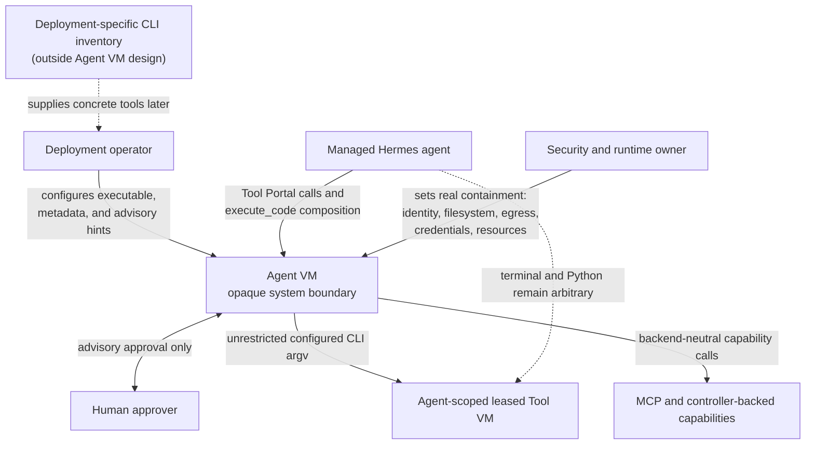
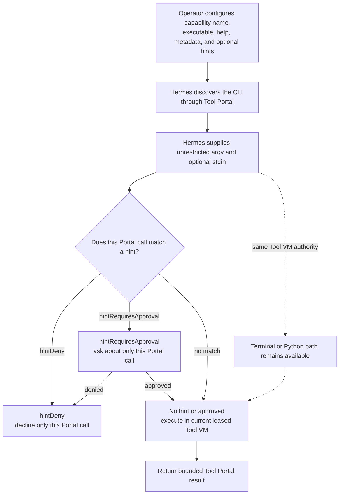
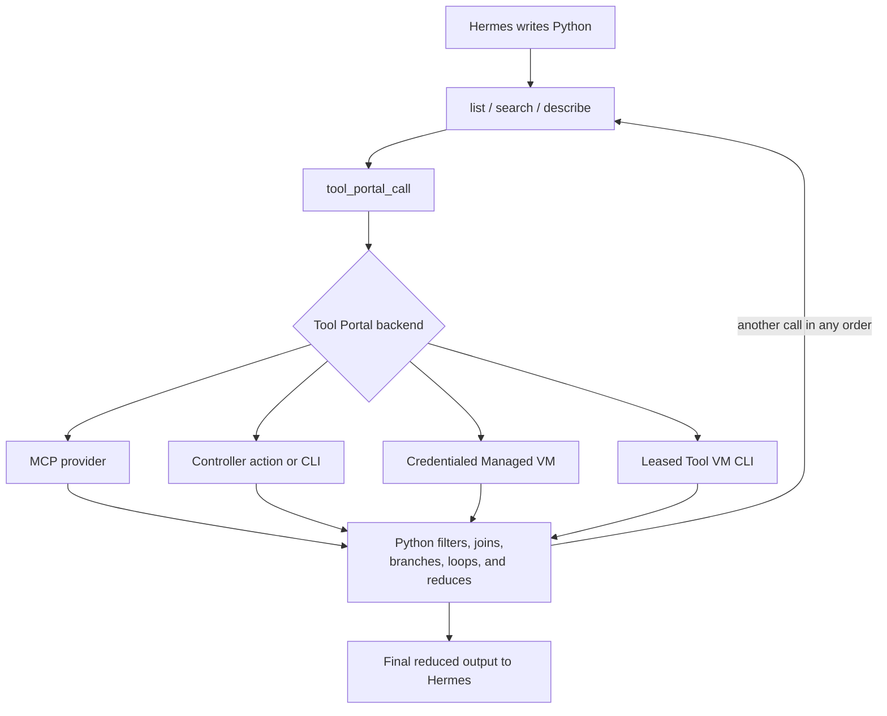

# Tool VM CLI and Hermes Tool Portal Composition Requirements

## Purpose

Managed Hermes already has arbitrary shell and Python execution inside its
leased Tool VM. Tool Portal can also reach that Tool VM, but its configured
catalog currently exposes only fixed commands and process/file operations.
Separately, Hermes execute_code can compose a hard-coded set of seven tools but
cannot call Tool Portal capabilities.

The required outcome is two independently deliverable Agent VM capabilities:

1. an operator can name an executable and useful discovery metadata in a Tool
   Portal Tool VM operation while the caller supplies unrestricted argv; and
2. Hermes execute_code can discover and call Tool Portal capabilities in any
   sequence, regardless of the backend selected by Tool Portal.

Tool VM command restrictions are explicitly not a security boundary. An agent
that can already use terminal or Python in the same Tool VM can bypass any
command-specific Tool Portal rule. Tool Portal may still offer clearly prefixed
hintDeny and hintRequiresApproval behavior for its own call surface, but Agent
VM must describe those outcomes as operator guidance rather than protection.

## System context

This view answers who consumes the change, which Agent VM surfaces they use,
and what remains outside the product boundary.

## Decision authority

The Agent VM owner confirmed the following product meaning on 2026-09-01:

- Agent VM and deployment configuration are separate layers.
- For a Tool VM CLI entry, configuration names the executable.
- The caller supplies completely unrestricted argv.
- Configuration may provide trusted help text, version/source hints, and other
  useful discovery metadata.
- Semantic command, subcommand, flag, value, or stdin conditions for the Tool
  VM route are fake policy and fake safety when presented as containment.
- The existing matcher and approval machinery may be reused through explicitly
  hint-prefixed Tool VM configuration. A matching hint may deny or require
  approval for that Tool Portal call while remaining bypassable through
  terminal or Python.
- The hint-prefixed configuration exists only on the tool_vm_runner
  command.cli discriminant for the leased Tool VM execution environment. No
  other backend, execution target, or operation changes names or semantics.
- The real boundaries are Tool VM identity, filesystem exposure, egress,
  credential mediation, and resource containment.
- A second stacked capability lets Hermes execute_code invoke Tool Portal
  discovery and call tools in any order and compose their results without
  knowing where each capability executes.

The 2026-08-22 Configured CLI Invocation Permissions artifacts remain
authoritative for controller_host and ephemeral_managed_vm configured CLIs.
Their requirement to leave tool_vm_runner unchanged is superseded only for the
new unrestricted Tool VM CLI capability defined here.

## Consumers

- Deployment operators need to publish installed Tool VM CLIs as discoverable
  Tool Portal capabilities without claiming nonexistent argument isolation.
- Managed Hermes agents need a stable capability name, trusted usage metadata,
  and unrestricted CLI argv inside their own Tool VM.
- Hermes execute_code callers need programmatic access to Tool Portal
  list/search/describe/call so code can filter, join, branch, loop, and reduce
  results across heterogeneous backends.
- Security and runtime owners need the implementation and documentation to
  distinguish real VM containment from convenience-level catalog policy.
- Maintainers need the two capabilities to land as a dependency-ordered stack
  without coupling deployment-specific CLI choices into Agent VM.

## Authorized needs

| ID | Affected class | Priority | Authorized need |
| --- | --- | --- | --- |
| U1 | Deployment operator | Must | Configure a named Tool Portal capability for one executable that is expected to exist in the current agent's leased Tool VM. |
| U2 | Deployment operator | Must | Attach concise trusted help text and optional useful metadata to that executable for Tool Portal discovery. |
| U3 | Managed agent | Must | Supply unrestricted tokenized argv and optional stdin to the configured executable; absent a matching route-local hint, every structurally valid invocation executes. |
| U4 | Security owner | Must | Make no claim that Tool Portal argv conditions reduce an agent's authority inside a Tool VM that already exposes terminal and execute_code. |
| U5 | Runtime owner | Must | Preserve current Tool VM agent binding, current-generation checks, strict SSH, workspace, egress, credential mediation, timeout, cancellation, and output/resource containment. |
| U6 | Deployment operator | Must | Keep controller_host and ephemeral_managed_vm configured-CLI invocation policy unchanged and visibly distinct from unrestricted Tool VM CLI execution. |
| U7 | Hermes agent | Must | Invoke Tool Portal list, search, describe, and call from execute_code using the same authenticated profile and session authority as direct Hermes tool calls. |
| U8 | Hermes agent | Must | Compose Tool Portal calls in arbitrary program order with Python control flow and combine them with ordinary Tool VM Python or terminal work. |
| U9 | Tool Portal owner | Must | Route each programmatic Tool Portal call through the normal capability catalog, backend selection, policy, approval, result, and telemetry paths. |
| U10 | Security owner | Must | Keep Gateway Runtime credentials, Tool VM lease identity, strict SSH material, and private UDS authority out of the execute_code child process. |
| U11 | Maintainer | Must | Deliver the Tool VM CLI capability as the first independently provable change and the execute_code bridge as a dependent second change. |
| U12 | Deployment operator and managed agent | Must | Optionally classify Tool Portal calls with visibly advisory hintDeny and hintRequiresApproval rules that reuse the existing matcher/approval experience without being represented as Tool VM containment. |

All priorities are assigned by the Agent VM owner.

## Desired journeys

### Publish and call an installed Tool VM CLI

The configuration does not enumerate an admitted grammar. Optional hint
matchers may identify command/flag combinations to discourage or ask about, but
they do not make other argv unavailable through the Tool VM. The capability is
a discoverable invocation surface with advisory Tool Portal behavior, not an
authority-reduction mechanism.

### Compose Tool Portal calls from execute_code

The Python program never receives backend credentials or chooses an execution
location. Backend selection remains configuration-owned.

## Goal boundary

The design may change Agent VM configuration contracts, Tool Portal catalog and
dispatch behavior, Gateway Runtime Tool VM execution, the in-repo Hermes
adapter, generated schemas, source documentation, generated deployment manual
templates, and proof harnesses.

The design must preserve:

- the existing Tool VM lease and current-generation authority;
- direct Gateway-to-Tool-VM strict SSH with no per-command controller RPC;
- controller_host and ephemeral_managed_vm configured-CLI policy, approval,
  credential, and lifecycle behavior;
- current Tool Portal namespace/profile admission and backend routing;
- current Hermes execute_code timeout, maximum call count, stdout cap, and
  child-process isolation unless a separately authorized requirement changes
  them;
- existing direct Hermes Tool Portal tools and approval presentation;
- the pinned Hermes distribution boundary and Agent VM-owned adapter overlay;
- hard separation from Shravan Claw or any other deployment's concrete CLI
  inventory.

## Real containment

The following remain real enforcement boundaries:

- authenticated zone, agent, profile, and session binding;
- current Tool VM lease and environment generation;
- filtered durable workspace and disposable work area;
- Tool VM image or checkpoint generation;
- egress and WebSocket policy;
- HTTP-mediated credentials and absence of raw host/controller credentials;
- process timeout, cancellation, CPU, memory, stdout/stderr, and artifact
  bounds;
- Tool Portal policy and approval for capabilities whose effects occur outside
  the already-arbitrary Tool VM boundary.

Tool VM hintDeny and hintRequiresApproval behavior is not listed as real
containment. It is enforced only by the Tool Portal call surface.

## Explicit non-goals

- No Tool VM command-path, subcommand, flag, positional-value, environment, or
  stdin-content allow/deny policy presented as security.
- No unprefixed deny or requiresApproval field whose name could imply that a
  Tool VM hint is authoritative outside Tool Portal.
- No claim that hiding a Tool Portal Tool VM capability prevents the same agent
  from running the executable through terminal or Python.
- No general CLI grammar mirror.
- No deployment-specific Firecrawl, Parallel, Ketch, Perplexity, Tavily, or
  other product configuration in Agent VM.
- No movement of Tool VM execution to the controller host or a credentialed
  Managed VM.
- No direct Tool Portal socket, credential, lease, or SSH access from the
  execute_code child.
- No backend-specific API in hermes_tools.
- No replacement of direct Hermes Tool Portal tools.
- No implementation plan, PR mechanics, release, or deployment changes in this
  design cycle.

## Acceptable complexity

One target-specific Tool VM CLI operation shape, one shared public CLI call
shape, one hint-prefixed matcher projection that reuses the existing evaluator,
one direct strict-SSH dispatch path, and one managed Hermes execute_code bridge
are acceptable.

A second policy language, shell scanner, command certification system,
per-executable parser, duplicate Tool Portal client, new privileged socket,
controller execution round trip, or persistent composition service is not.

## Success evidence

Evidence must establish:

- authored/effective/Gateway configuration accepts the unrestricted Tool VM CLI
  variant, accepts only explicitly hint-prefixed advisory matcher fields, and
  rejects strong or ambiguous semantic policy fields on that variant;
- matching hintDeny blocks only the Tool Portal call, matching
  hintRequiresApproval uses the ordinary presenter for only that call, and the
  same underlying Tool VM invocation remains possible through terminal/Python;
- list/search/describe expose trusted metadata and the unrestricted public call
  schema without leaking executable paths or runtime authority;
- a real Tool VM receives the configured executable, exact caller argv, and
  optional stdin;
- shell metacharacters remain inert argv tokens unless the configured
  executable itself interprets them;
- no controller execution RPC or credentialed Managed VM is used for the Tool
  VM target;
- current generation, cancellation, timeout, output, and failure certainty
  behavior remains intact;
- execute_code exposes all four Tool Portal helpers and can call them in
  multiple orders and loops;
- nested calls use the same profile/session authority and normal Tool Portal
  policy/approval behavior as direct calls;
- the execute_code child receives no private Tool Portal or Tool VM authority;
- one end-to-end composition combines at least two differently backed Tool
  Portal capabilities and ordinary Python processing.

## Unresolved decisions

None. Configuration names one executable and trusted discovery metadata. The
caller controls argv without an admitted grammar. Optional hintDeny and
hintRequiresApproval matchers affect only the Tool Portal call and are named and
documented as advisory. Structural and byte bounds remain protocol/resource
containment and must not be described as command safety.
