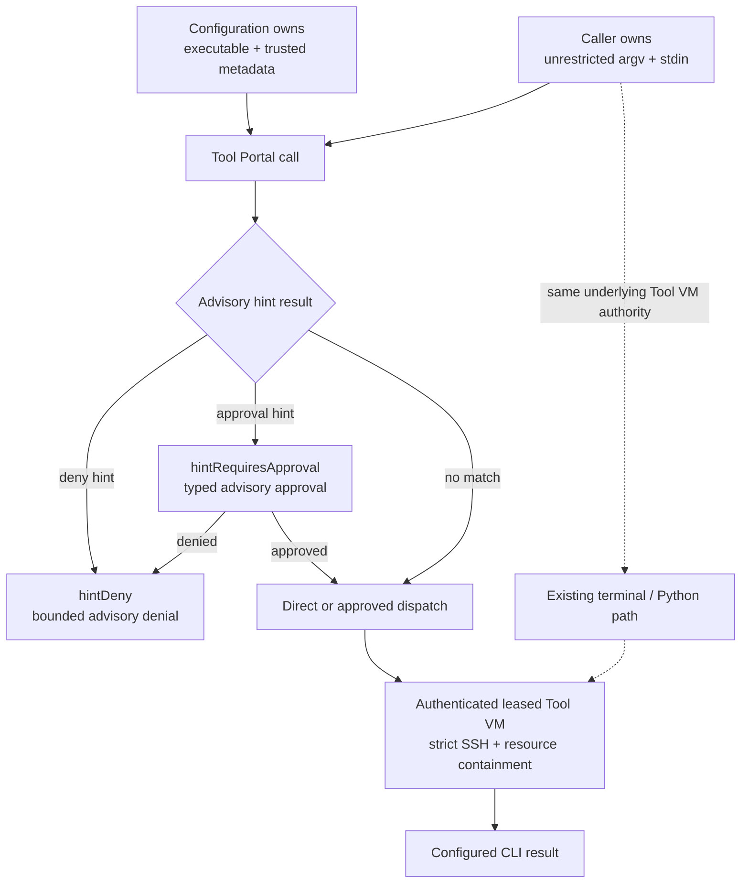
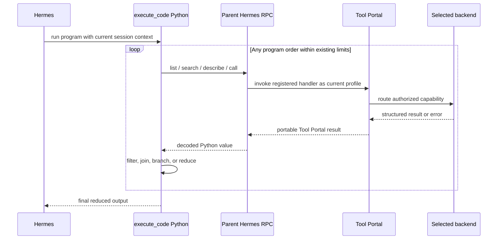

# Tool VM CLI and Hermes Tool Portal Composition Specification

Requirements authority:
[requirements.md](requirements.md)

## Observable model

This view answers what a caller can observe and where advisory behavior ends.





## P1 — Current observable gap

Tool Portal can execute only fixed configured commands in the leased Tool VM.
The model cannot call a named Tool VM CLI through Tool Portal with its own argv.
The richer configured-CLI surface is bound to controller execution and presents
argument policy that would be meaningless as containment inside the already
arbitrary Tool VM.

Hermes execute_code runs in the Tool VM and can invoke local programs, but its
generated hermes_tools module exposes only seven hard-coded tools. Direct Hermes
Tool Portal tools are registered separately and cannot be called from the
program.

## O1 — Desired outcome

Tool Portal exposes an operator-named CLI capability whose configured executable
runs in the authenticated caller's current Tool VM with exact unrestricted argv
and optional stdin.

Hermes execute_code exposes Tool Portal list/search/describe/call helpers so one
program can compose authorized capabilities without depending on their
execution backends.

## R1 — Tool VM CLI is an explicit target-specific configuration variant

Agent VM MUST expose a strict discriminated configuration variant for a named
Tool VM CLI operation.

The variant MUST author:

- an absolute executable path;
- a non-empty trusted safe-help description;
- optional bounded, non-secret discovery metadata such as source name, version
  hint, or usage category;
- a Tool-VM-relative working directory;
- timeout and output/resource policy.

The variant MAY author one optional advisoryHints object:

```ts
type ToolVmCliAdvisoryHints = {
  hintDeny: ConfiguredCliInvocationMatcher[]
  hintRequiresApproval: ConfiguredCliInvocationMatcher[]
}
```

The names MUST retain the hint prefix in authored, effective, generated-schema,
manual, diagnostic, and approval-presentation surfaces.

advisoryHints, hintDeny, and hintRequiresApproval MUST be valid only when the
enclosing backend discriminant is tool_vm_runner and the operation discriminant
is command.cli. controller_execution configured_cli, command.fixed, process and
filesystem Tool VM operations, MCP providers, registered actions, and every
other execution target MUST reject these fields and retain their existing
contracts.

The variant MUST NOT author:

- admitted command paths;
- unprefixed command or flag admission matchers;
- unprefixed denied argv patterns;
- allowed flag values;
- semantic stdin schemas or denied stdin patterns;
- operation-level invocation disposition rules presented as authoritative Tool
  VM policy;
- credential bindings, raw environment values, image selection, lease identity,
  SSH material, or controller target authority.

The configuration schema MUST reject those fields rather than ignore them.

Trace: U1–U6.

## R2 — Configuration names the executable and caller controls argv

The public Tool Portal input MUST accept:

```ts
type ToolVmCliInput = {
  argv: string[]
  reason: string
  stdin?: string
  timeoutMs?: number
}
```

The executable MUST come only from trusted configuration. The caller MUST NOT
override it.

Every structurally valid argv token MUST be passed exactly and in order after
the configured executable. Empty argv MUST be valid. Agent VM MUST NOT define
an admitted CLI grammar, rewrite argv, or claim that a Tool VM invocation is
unavailable based on command, subcommand, flag, positional value, shell
metacharacter, endpoint override, or stdin content.

When advisoryHints is present, Agent VM MAY classify the current Tool Portal
call using hintDeny and hintRequiresApproval. That classification changes only
the Tool Portal call's immediate behavior; it does not reduce the caller's Tool
VM authority.

Structural validation MAY reject malformed protocol values such as NUL-bearing
tokens, overlong frames, invalid UTF-8, excessive item counts, or values outside
the declared transport/resource ceiling. Such rejection MUST be documented as
protocol/resource containment, never CLI safety.

Trace: U1, U3, U4.

## R3 — Tool VM CLI calls preserve array-argv semantics

Agent VM MUST execute:

```text
[configured executable, ...caller argv]
```

without shell interpolation.

Characters such as semicolon, pipe, ampersand, dollar sign, parentheses,
quotes, wildcard characters, redirection characters, and newlines MUST remain
literal argv data. If the configured executable is a shell or interpreter, that
executable MAY interpret its argv and thereby execute arbitrary code; Agent VM
MUST NOT claim to prevent this.

Trace: U3–U5.

## R4 — Tool VM CLI uses the current leased Tool VM directly

For each admitted call, Agent VM MUST resolve the authenticated principal's
current Tool VM binding and current environment generation, establish the
existing strict-pinned SSH channel, and execute in that Tool VM.

The call MUST NOT:

- send a controller_execution RPC;
- execute on the controller host;
- create or reuse a credentialed Managed VM;
- choose another agent's lease or workspace;
- fall back to a different target when Tool VM binding fails.

Binding absence, stale generation, SSH failure before dispatch, ambiguous
transport loss after dispatch, cancellation, timeout, and completed non-zero
exit MUST retain the existing Tool VM runner certainty and retry semantics.

Trace: U5, U6.

## R5 — Discovery is useful metadata, not authority

Tool Portal list/search/describe MUST expose:

- namespace and capability name;
- safe-help text;
- optional configured non-secret metadata;
- the ToolVmCliInput JSON Schema;
- ordinary safety annotations that do not claim argument containment.

They MUST NOT expose:

- configured executable paths;
- Tool VM lease, generation, network, credential, or SSH details;
- invented allowed-command or denied-argument claims.

When advisory hints are configured, discovery and description MUST label them
as Tool Portal call hints and MUST state that they do not constrain terminal,
Python, or another Tool VM execution surface.

Hiding or denying the Tool Portal capability MAY control catalog visibility and
Tool Portal admission. Documentation MUST state that it does not prevent an
agent with terminal or execute_code from running the same executable.

The Tool VM CLI capability MUST use the namespace's withoutApproval selector as
its baseline. Optional hintDeny and hintRequiresApproval matchers MAY strengthen
that one Tool Portal call to route-local denial or approval. The ordinary
unprefixed namespace requiresApproval selector MUST NOT be used to express Tool
VM command safety.

Trace: U2, U4, U5.

## R5A — Advisory hint matching reuses deterministic call classification

hintDeny and hintRequiresApproval MUST reuse the existing exact command-path and
present-flag matcher semantics. Their precedence for the Tool Portal call MUST
be:

```text
hintDeny > hintRequiresApproval > withoutApproval baseline
```

Unlike restricted configured-CLI admission:

- advisory matcher paths do not define an allowlist;
- a matcher path need not appear in a commands array;
- unmatched argv remains directly callable;
- unknown commands, flags, values, and positional tails remain directly
  callable;
- there is no allowed-values validation or semantic stdin validation.

A hintDeny match MUST return a bounded Tool Portal denial whose code and message
identify it as an advisory hint result. A hintRequiresApproval match MUST use
the existing exact-call Hermes approval lifecycle, with presentation text that
identifies the request as a Tool VM advisory hint rather than containment.

Non-empty hintRequiresApproval configuration MUST trigger the existing
approvalAccess and presenter preflight requirements.

Trace: U3, U4, U5, U12.

## R6 — Public result matches configured CLI result semantics

A completed Tool VM CLI call MUST return the same model-visible configured-CLI
result fields used by controller and credentialed-VM configured CLIs:

```ts
type ConfiguredCliResult = {
  exitCode: number
  stdout: string
  stdoutTruncated: boolean
  stderrSummary?: string
  stderrTruncated: boolean
}
```

Output overflow behavior and fixed safe stderr projection MUST follow the
configured output/resource policy. Raw stderr MUST remain absent when policy
selects no model-visible stderr.

The common result contract MUST NOT imply common containment. Target-specific
documentation MUST identify Tool VM, host, and credentialed-VM guarantees
honestly.

Trace: U3–U6.

## R7 — Timeout, cancellation, and stdin are resource contracts

The caller MAY provide arbitrary stdin bytes representable by the public text
transport, up to the platform byte ceiling. Agent VM MUST NOT inspect stdin
content for Tool VM CLI policy.

The configured timeout class and optional caller timeout MUST resolve through
the common configured-CLI timeout contract. Timeout begins at process dispatch,
not Tool VM acquisition. Cancellation MUST target the exact active operation.

Timeout and output bounds MUST be described as resource/liveness controls, not
restrictions on what code the executable can run.

Trace: U3–U5.

## R8 — Existing controller and credentialed configured CLI policy is unchanged

controller_host and ephemeral_managed_vm configured CLI variants MUST retain
their existing:

- admitted command paths;
- flag/value and denied-pattern validation;
- stdin policy;
- invocation-level deny/approval/direct classification;
- controller revalidation;
- approval intent and target binding;
- credential and lifecycle guarantees.

No unrestricted Tool VM semantics may leak into those variants. Configuration
must remain discriminated strongly enough that a mixed or ambiguous operation
fails validation.

Trace: U6.

## R9 — execute_code exposes all Tool Portal operations

In managed Hermes sessions where the tool-portal toolset is enabled,
execute_code MUST make these helpers importable from hermes_tools:

- tool_portal_list;
- tool_portal_search;
- tool_portal_describe;
- tool_portal_call.

Each helper MUST accept and return ordinary Python JSON-compatible values that
preserve the registered direct Hermes tool's request and result contract.

The execute_code schema and generated helper documentation MUST list only the
helpers actually enabled for the current session.

Trace: U7, U8.

## R10 — Programmatic calls reuse direct Hermes Tool Portal authority

Each helper call MUST return to the parent Hermes process through the existing
execute_code tool-RPC path. The parent MUST invoke the already-registered direct
Tool Portal handler with the current task/session context.

The call MUST use:

- the current routed Hermes profile;
- the current authenticated Agent VM principal;
- the same Gateway Runtime client and private UDS;
- the same Tool Portal schema validation;
- the same catalog and backend selection;
- the same policy and approval flow;
- the same telemetry and result shaping.

The execute_code child MUST NOT receive Gateway Runtime credentials, UDS access,
lease identifiers, SSH material, approval authority, or backend selection
fields.

Trace: U7, U9, U10.

## R11 — Program order and backend composition are unrestricted

Within existing execute_code resource ceilings, Python MUST be able to call the
four Tool Portal helpers repeatedly, in any order, under loops, branches,
retries, joins, filtering, and reduction.

One program MAY combine:

- MCP provider capabilities;
- controller registered actions;
- controller-host configured CLIs;
- credentialed Managed VM configured CLIs;
- Tool VM CLIs;
- ordinary Python processing and Tool VM-local programs.

The program MUST address capabilities only by public Tool Portal request
contracts. It MUST NOT inspect or select a backend.

Trace: U8, U9.

## R12 — Approval-required programmatic calls preserve normal behavior

If a nested Tool Portal call requires approval, the existing Hermes-native
approval presenter MUST remain authoritative. The execute_code call MAY remain
pending while the exact nested call is decided.

Approval, denial, expiry, cancellation, stale policy, or presenter failure MUST
return a structured Tool Portal result to the Python caller without granting
the child approval authority or automatically replaying unrelated calls.

A Tool VM CLI capability is not made safe by adding argument-based approval.
For this target, hintRequiresApproval is an operator-guidance interaction on the
Tool Portal route. Approvals remain authoritative containment for capability
effects outside the already arbitrary Tool VM boundary.

Trace: U4, U7–U10.

## R13 — Existing execute_code limits remain the composition ceiling

The existing execute_code timeout, maximum tool-call count, stdout/stderr caps,
and foreground-only nested terminal behavior MUST remain unchanged.

Every programmatic Tool Portal helper invocation MUST count as one execute_code
tool call. Exceeding the limit MUST stop further nested calls and return the
existing bounded error behavior.

Trace: U7–U10.

## R14 — Failure and partial success remain visible to Python

Tool Portal aggregate and per-item results MUST remain intact when returned to
Python. A mixed batch MAY contain successful, denied, approval-required, or
failed items according to the ordinary Tool Portal contract.

execute_code MUST NOT translate a provider or backend failure into Python
process authority, silently retry a call with possible effects, or discard
successful sibling items.

If the execute_code process exits, times out, or is cancelled while a nested
call is pending, the existing exact Tool Portal and backend cancellation
semantics govern that call; no new replay or compensation mechanism is implied.

Trace: U8–U10.

## R15 — Compatibility and cutover are additive and fail closed

Existing command.fixed Tool VM operations and existing configured CLIs MUST
retain their current meaning.

The new Tool VM CLI variant and execute_code helper set MUST require a coherent
Agent VM Gateway Runtime, config-contract, Hermes adapter, and generated-schema
version. Mixed versions that cannot represent the new discriminants or helpers
MUST fail validation, attachment, or readiness rather than reinterpret the
configuration.

No compatibility alias may treat Tool VM unrestricted execution as restricted
configured-CLI policy or vice versa.

Trace: U5, U6, U11.

## Observable examples

Valid Tool VM CLI call:

```json
{
  "argv": ["monitor", "create", "--api-url", "https://example.invalid", ";", "$TOKEN"],
  "reason": "Run the configured CLI with caller-selected arguments",
  "stdin": "{\"arbitrary\":true}",
  "timeoutMs": 30000
}
```

Agent VM passes every argv token literally. It does not reject the endpoint,
semicolon, token-shaped string, or stdin content. Whether those values have
effects is owned by the executable and real Tool VM containment.

Invalid protocol call:

```json
{
  "argv": ["contains\u0000nul"],
  "reason": "Malformed transport value"
}
```

This is rejected because the transport cannot safely represent the token, not
because Agent VM evaluates CLI meaning.

## Cross-cutting obligations

### Security and trust

Agent VM MUST document the Tool VM as the enforcement boundary and MUST keep
host, credentialed-runtime, lease, SSH, and UDS authority outside model input
and execute_code child state.

### Reliability

Calls MUST preserve current stale-generation, cancellation, timeout, transport
ambiguity, and partial-result classifications. No automatic replay after a
possibly dispatched effect is permitted.

### Observability

Telemetry MUST identify the public capability, surface, backend target class,
result classification, and owning generation where safe. It MUST NOT record raw
argv, stdin, credentials, provider response bodies, or private runtime
identities.

### Performance and capacity

No new persistent service, queue, or VM is introduced. Programmatic Tool Portal
calls share existing execute_code and Tool Portal capacity limits.

### Accessibility

Not applicable: no new visual interface is defined. Existing Hermes approval
presentation remains governed by its current accessibility contract.

## Proof obligations

| ID | Requirements | Required evidence class |
| --- | --- | --- |
| V1 | R1, R5A, R8, R15 | Automated configuration and generated-schema behavior proving strict target discrimination, hint-prefixed aliases, and mixed/strong-policy rejection. |
| V2 | R2, R3, R5A | Automated behavior plus Tool Portal and terminal transcripts proving exact unrestricted argv, hint route behavior, bypassability, and inert shell metacharacters. |
| V3 | R4, R7 | Real Tool VM integration proving current binding, strict SSH, stdin, timeout, cancellation, and no fallback/controller RPC. |
| V4 | R5, R6 | API/CLI transcript and schema inspection proving discovery/result usefulness without private-authority leakage. |
| V5 | R6, R14 | Automated output/error behavior covering truncation, stderr policy, non-zero exit, ambiguous transport, and mixed results. |
| V6 | R9, R13 | Hermes adapter behavior proving enabled helper generation, documentation, call counting, and existing limits. |
| V7 | R10, R12 | Cross-process Hermes integration proving current profile/session authority and native approval without child credentials. |
| V8 | R11 | Hermes end-to-end transcript composing at least two different Tool Portal backend classes with Python processing. |
| V9 | R10, R14 | Security misuse cases proving no direct UDS/lease/SSH/backend authority and no unsafe replay. |
| V10 | R15 | Version-skew and readiness behavior proving additive hard cutover and preservation of existing operations. |

## Requirement trace

| Need | Problem/outcome | Requirements | Contracts | Proof |
| --- | --- | --- | --- | --- |
| U1–U3 | P1 / O1 | R1–R3, R5–R7 | Tool VM CLI config, call, hints, discovery, result | V1–V5 |
| U4–U6, U12 | P1 / O1 | R3–R8, R12, R15 | Advisory route behavior, real containment, and target separation | V1–V5, V9–V10 |
| U7–U10 | P1 / O1 | R9–R14 | execute_code helper and nested Tool Portal call | V6–V9 |
| U11 | O1 | R15 | Additive compatibility boundary | V10 |

## Undefined behavior

- Agent VM does not define what arbitrary CLI arguments mean to the executable.
- Agent VM does not guarantee that configured metadata matches a binary changed
  out of band after image or checkpoint publication.
- Agent VM does not make provider effects reversible.
- Agent VM does not guarantee order between independent concurrent programs or
  calls beyond the order in which one Python program awaits them.
