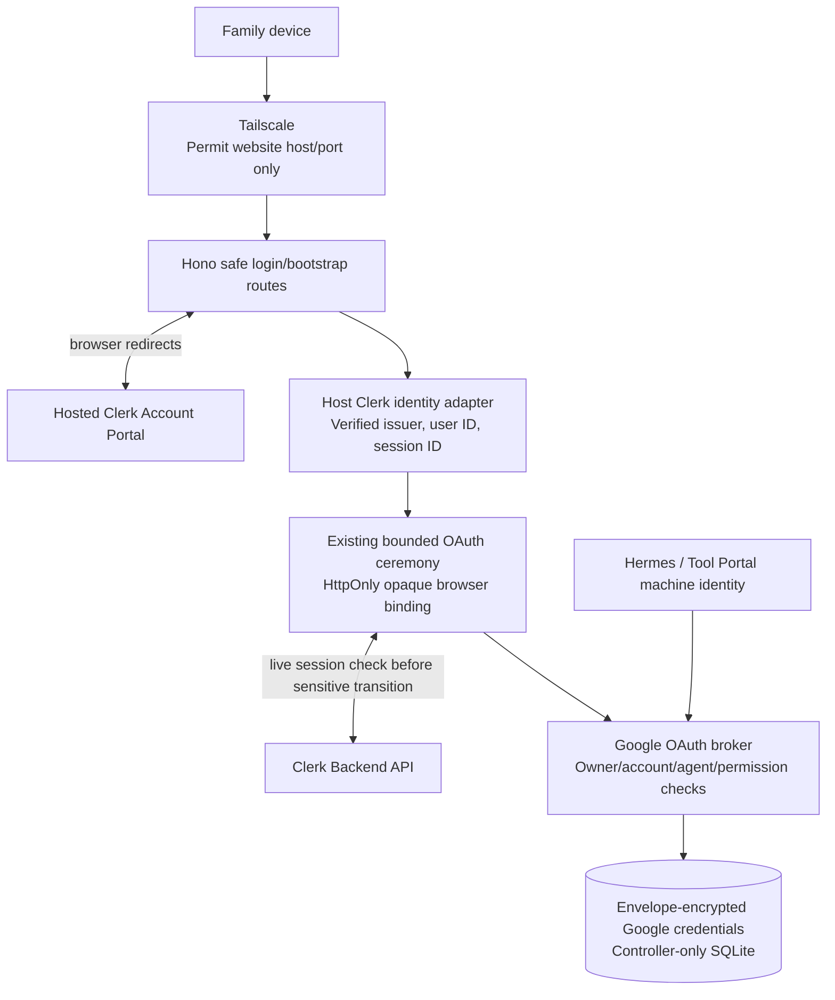
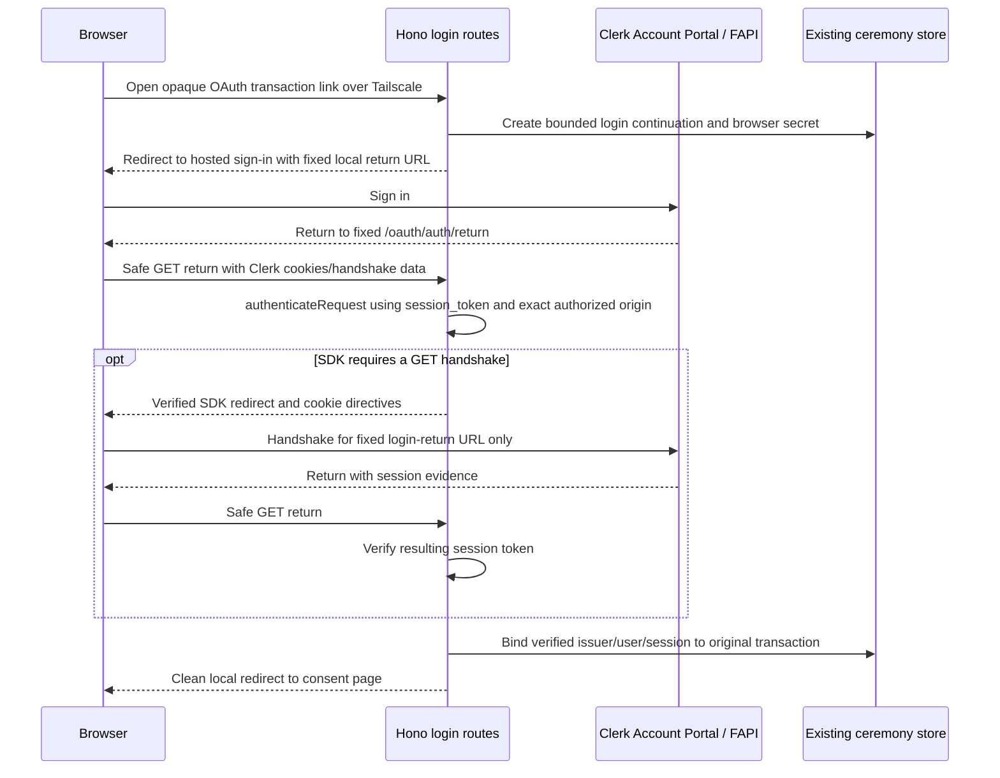

# Clerk browser identity behind restricted Tailscale

This is the browser-identity realization of [Specification R9/C9](specification.md#r9--c9-clerk-login-and-restricted-network-access),
within the [Program Design](program-design.md). It changes human authentication,
not machine authentication or Google credential ownership.

## Owners and dependency boundary

The host integration in `agent-vm/controller/oauth` uses the public
`@clerk/backend` API directly, through a small `ClerkBrowserIdentityVerifier`.
This gives exact route control instead of installing blanket middleware. Its
portable input/output identity contract lives with the existing OAuth contracts;
the browser/UI, broker core, and machine packages do not import Clerk SDK types.
Composition resolves the Clerk secret key through 1Password. The publishable key,
issuer and hosted sign-in URL are non-secret configuration. The verifier must
not use Clerk social-provider access tokens or Clerk's OAuth authorization-server
feature for Gog.

Configure hosted Clerk sign-in as invite-only, Google-only and single-session per
browser client (multi-session handling disabled). Clerk's Google
social connection uses basic identity scopes, with no additional Google resource
scopes configured or requested after sign-up. Disable password, email/SMS code,
magic-link, and other social sign-in methods. Do not disable Google's own security
checks. The controller never calls `getUserOauthAccessToken` to obtain Gog material;
it owns resource consent/code exchange, refresh, and envelope-encrypted storage.
Clerk may retain its login connection's credentials; those are distinct from the
Google resource credentials governed by this design.

Verified identity is `{ issuer, userId, sessionId }`, with the Clerk actor claim
absent. Durable owner identity binds issuer + userId; sessionId is transient
ceremony evidence. Email is a display/login identifier only. A deleted/recreated
Clerk user or different instance has a new owner identity and does not inherit
accounts. Invite-only Clerk admission and the relevant configured owner or editor
membership are both required. Editor membership is not account ownership, and
neither admission grants an OAuth account by itself.

## Login and ceremony bootstrap

Use only server-generated HTTPS origins and paths. `/oauth/auth/start` and
`/oauth/auth/return` are the only login/bootstrap routes; `/oauth/google/callback`
and all consent POSTs are excluded. The original destination is a bounded
process-local continuation, keyed by a random HttpOnly browser cookie, not a URL
parameter sent to Clerk. It expires with the existing ten-minute ceremony and
is consumed once on successful binding. Loss/restart returns restart-required.
No account, Google code/state, PKCE, or pending selection is sent to Clerk.

Call `createClerkClient({ publishableKey, secretKey })` and
`authenticateRequest(request, { acceptsToken: 'session_token', authorizedParties })`
with the exact public application origin, fixed configured Clerk instance, and
untrusted forwarded-header handling disabled by constructing the verified request
URL from the configured origin. Check signed-in state, token type, subject, session,
issuer, temporal validity and absence of impersonation. Machine/API/OAuth-server
tokens fail. A missing or mismatched authorized-party claim is not accepted as
human consent authority.
The expected verified `azp` is exactly the configured website origin, including
its port. V7 observes the hosted-login and handshake-issued tokens at the safe
return route. An absent claim or an accounts/FAPI origin is a qualification failure;
do not relax the rule or add a broader authorized party merely to complete login.
Issuer checking is an explicit application comparison on verified claims:
`sessionClaims.iss === configuredIssuer`. Do not pass an invented `issuer` option
or assume the SDK's JWT verifier checks `iss`; the inspected verifier checks
signature, subject, audience/authorized-party and time claims. Validate all other
required claims after successful SDK verification, never by trusting a decoded JWT.

Handle `signed-in`, `signed-out`, and `handshake` distinctly. SDK cookie directives
are copied without merging multiple Set-Cookie headers into one comma-separated
value. Redirects are accepted only on safe GET routes and only for the configured
Clerk FAPI/account origin or fixed local return. Unexpected destinations, missing
handshake location, and bounded redirect-loop failure return authentication failure.
Clear transient Clerk handshake parameters with a clean local redirect before
showing account information. `Cache-Control: no-store` and `Referrer-Policy:
no-referrer` apply to login/bootstrap and callback responses; do not log auth URLs.

## Native forms and Google callback

Clerk's short session JWT is not the long-lived login session. It normally expires
after about sixty seconds; a Google consent roundtrip or a paused native form can
outlast it. Automatic Clerk handshake is GET-only and embeds the current request
URL in its redirect. It must never process the Google callback or retry a sensitive
POST automatically.

The existing opaque ceremony, created only after successful login verification,
retains the bound Clerk issuer/user/session. Every sensitive transition requires
the opaque browser secret plus its existing CSRF/Origin/state/PKCE checks and a
live `clerkClient.sessions.getSession(boundSessionId)` result. Require matching ID
and userId, `status === 'active'`, future `expireAt`, and no actor/impersonation.
The session ID is looked up from server state, never accepted from form input.
Clerk lookup is an authenticated host request; a returned session ID alone is not
a browser bearer credential.
Treat SDK Session fields as untrusted remote data despite their TypeScript types:
only the literal active state passes; pending, replaced, ended, revoked, abandoned,
removed, and expired states fail. `actor` must be null, and timestamps must be
validated in the provider-defined unit before comparison to the injected clock.

The verifier returns typed `verified | signed-out | identity-mismatch |
verification-unavailable` results. An unavailable or invalid session never falls
back to a Tailscale login or an expired JWT. Bounded provider timeouts fail before
Google exchange or state mutation. Do not cache an active result across separate
sensitive requests. A single request may use its fresh verified result throughout
its synchronous decision/commit section; recheck after an external exchange before
the subsequent human confirmation commit. There is no claim of distributed atomic
revocation between Clerk and a local commit.

If a currently valid Clerk cookie identifies a different user/session than the
bound ceremony, reject and clear it. This is additional protection, not the switch
mechanism. The website's Change signed-in person action is a CSRF/Origin-protected
POST that cancels this browser's pending consent and policy drafts, revokes the
bound Clerk session through the backend API, clears local bindings, then returns
to the fixed safe login-start GET. Failure to revoke does not retain an editable
local ceremony and must not be presented as completed sign-out.

The deployment also qualifies actual single-session hosted login: a different
sign-in on the same Clerk browser client must make the prior bound session inactive
so the next live session check rejects it, even after the old JWT expires. Merely
setting the Dashboard toggle is not evidence of that behavior. If this exact
private-origin/hosted-login behavior does not hold, stop deployment and return to
design; do not fall back to the old active-session-pinning semantics. Another
browser profile/device is a separate session context. Choosing a different Google
resource account in the broker flow is not a Clerk login switch.

No-JavaScript applies to the post-login consent forms for the bounded lifetime,
not to Clerk's hosted login. No custom persistent login session, password database,
browser token localStorage, or refreshable app-cookie authority is introduced.

## CSP, deployment prerequisites, and future public ingress

Clerk UI and its JavaScript execute on the hosted Account Portal origin. The
OAuth pages keep self-hosted assets and the existing strict CSP; there is no
embedded ClerkJS, iframe, inline style exception, or blanket external script
allowlist on those pages. Backend-only verification and top-level navigation
do not require inserting Clerk components into the consent renderer.

The production Clerk instance must use an owned domain whose redirect rules admit
the current `auth.claw.askluna.xyz:18900` origin. Clerk/FAPI/Account Portal DNS and
browser HTTPS reachability are separate from the privately reachable consent host.
Do not proxy Clerk FAPI through the controller or expose a new route to satisfy
setup. Controller outbound HTTPS to configured Clerk endpoints is needed for
keys/handshake/session verification. The exact production port/private-origin
roundtrip remains a live qualification prerequisite.

The future public website keeps the same Clerk production instance and owner
records. Clerk development users are not migrated into production automatically.
The domain/port may change only through a later explicit deployment change that
updates authorized origins, redirects and Google callback registration and repeats
the browser/network proof. The controller's general admin API is never part of
that public ingress. Tailscale can remain for private administration.

Clerk outages block new consent and sensitive consent transitions; they do not
block already authorized machine calls or the broker's Google refresh path. Clerk
sign-out is not Google disconnect. Disabling an owner in config denies further
ceremonies and follows the separate configured authorization policy; it does not
silently erase Google credentials or call Google revoke.

## Source and proof anchors

- [Clerk backend authentication](https://clerk.com/docs/reference/backend/authenticate-request)
  defines session-token verification, authorized parties, request states and headers.
- [Account Portal direct links](https://clerk.com/docs/guides/account-portal/direct-links)
  require the return URL to fit the instance domain/subdomain rules.
- [Session lookup](https://clerk.com/docs/reference/backend/sessions/get-session)
  and [Backend Session](https://clerk.com/docs/reference/backend/types/backend-session)
  define the active user/session/expiry/actor checks.
- [Clerk architecture](https://clerk.com/docs/guides/how-clerk-works/overview)
  distinguishes the short JWT from the login session and documents browser handshake.
- [Clerk Hono source](https://github.com/clerk/javascript/blob/main/packages/hono/src/clerkMiddleware.ts)
  demonstrates RequestState header/redirect integration. The host uses the public
  backend API with stricter route/token policy; it does not copy private SDK internals.
- [Clerk JWT verification source](https://github.com/clerk/javascript/blob/bc3c89e023c42a5fd231b81b99ac68540193801b/packages/backend/src/jwt/verifyJwt.ts#L116)
  establishes the need for the application's explicit verified-issuer comparison.
- Published `@clerk/backend` 3.17.1 and `@clerk/hono` 0.1.76 support
  Node 24/Hono 4.12.24. Implementation pins and tests the selected
  backend package; GitHub main source is supporting evidence, not a version lock.
- [Clerk session options](https://clerk.com/docs/guides/secure/session-options)
  defines the multi-session setting; disabling it is a deployment prerequisite,
  not proof of replacement timing across the hosted/private origins.
- [Session statuses](https://clerk.com/docs/js-frontend/reference/types/session-status)
  defines ended/replaced/revoked as distinct from active.

The same browser verifier guards owner-consent and policy-editor forms. It returns
identity only: host override admission separately checks configured editableAgentIds
AND ownership of the selected account. A valid editor session alone cannot read or
edit another owner's account policy. Config-default activation is operator work,
not a Clerk-authenticated owner edit. Login continuations accept server-owned
consent or admitted agent/account-page targets only;
no new arbitrary return URL input is added. Native policy pages retain the bounded
form-session design, not a new persistent application login cookie. The fixed
post-login landing target is `/oauth/agents`; verified navigation may continue to
an admitted agent/account page. Each protected page/form receives a fresh bounded
read/edit context through the safe bootstrap route, with live session checks for
sensitive transitions. An expired context returns to safe GET bootstrap without
replaying a POST; navigation does not introduce a persistent app-owned login session.

V7 must qualify the real hosted return and port, bounded no-JS form after JWT expiry,
session logout/revocation/switch, code-free Clerk requests, wrong issuer/user/actor,
Clerk outage, no public ingress, and positive website/negative administration
reachability. Deterministic fake sessions prove local denial logic only.
