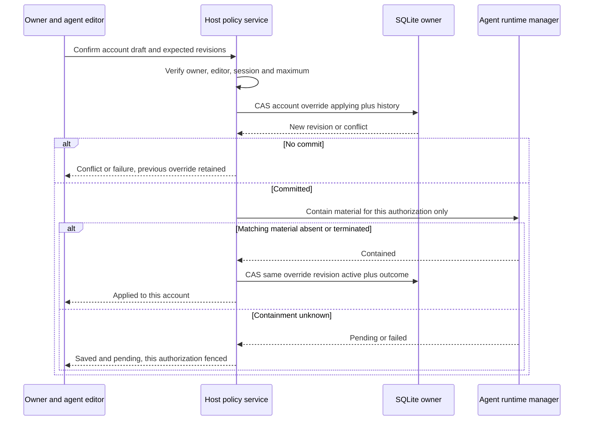

# Account-specific Google/Gog policy

Structural realization of [Specification R10/C10 and R11/C11](specification.md#r10--c10-website-managed-policy),
composed by [Program Design](program-design.md). The website edits an owner's
account overrides; Tool Portal config supplies live defaults. This is one-level
fallback, not a general policy framework or inherited Tool Portal profiles.

## One home for each decision

| Decision | Authoritative home | Readers and permitted writer |
| --- | --- | --- |
| Supported Google groups and exact Gog operations | Versioned code/catalog | Compiler, broker, Portal and host; reviewed code changes only |
| Agents, integrations and hard maxima | Deployment configuration | Host composition; operator file edits and restart |
| Who may edit each agent | Deployment configuration | Browser admission; operator only, never editor self-delegation |
| Account ownership | Controller SQLite catalog | Broker establishes verified owner; editors cannot change it |
| Live Read/Write defaults | Tool Portal config per agent/application/service | Prepared host policy; operator config activation |
| Explicit account overrides | Authenticated SQLite snapshot per authorization tuple | Account owner AND admitted agent editor via website |
| OAuth grant | Existing controller SQLite catalog | Account owner's consent/disconnect flow |
| Exact invocation approval | Existing controller approval ledger | Existing Portal/Hermes/controller path |
| Permission/default-change history | Controller SQLite | State owners append; account-filtered website reads |

The existing better-sqlite3/Drizzle connection is the sole SQLite transaction owner.
It exposes narrow override and history repositories alongside credential methods.
Neither Portal nor UI opens SQLite or resolves 1Password secrets. Sharing storage
does not make the OAuth scope compiler the owner of call approval policy.

`GooglePermissionPolicyService` in host controller composition owns override
preview/save, owner-plus-editor admission, account revision and containment recovery.
The pure evaluator in `tool-portal` first resolves each required service/effect:
explicit override wins, otherwise compiled default. A missing default is Deny.
Then hard limits, exact-command eligibility and current owner grant constrain use.
Across all effects required by a command, Deny wins, then Ask, then Allow.

## Configuration and current-path changes

Tool Portal's Google namespace introduces a strict
`calls.source = managed_google_policy` variant. It cannot also declare static
namespace withoutApproval/requiresApproval selectors or invocation Ask/Allow rules.
Hard command/flag/stdin/output/timeout admission and explicit executable denials remain.

Each Tool Portal agent has `googlePolicyDefaults`, either a pinned catalog collection
reference or an explicit application/service Read/Write map. These are alternatives,
not a merge chain; the operator can author a complete map when tuning a collection.
Omitted default cells resolve to Deny. OAuth config owns hard limits, clients and
owner/editor admission, not a duplicate default map. Consent recommendations can
use the paired collection's scope suggestions but never its authority as consent.

| Current source path | Current behavior | Target change |
| --- | --- | --- |
| `config-contracts/oauth-tool-portal-config.ts` | Static profile requirements and every-write-must-ask rule | Validate finite descriptors, maxima, default map and managed source; no blanket write approval |
| `tool-portal-service-common.ts:callPolicyDecision` | Static namespace/argv policy | Managed branch obtains account-specific resolved policy from host; non-Google branches unchanged |
| `tool-portal-service.ts:resolveOAuthAvailabilityByRequirement` | Service/rank and static profile availability | Resolve each own account's override/default/grant combination, not a single agent-wide disposition |
| `controller-oauth-runtime.ts` | Load and validate config pair before startup | Also prepare immutable default map/digest and record changed default activation |
| `gateway-control-controller-execution-authorization.ts` | Recompute exact identity, policy and fingerprint | Recompute selected account override revision, active defaults and grant binding |
| `configured-cli-managed-vm-executor.ts` | Reserve agent runtime, resolve exact credential, final checks | Bind account policy revision/default digest into material and final admission |
| `credentialed-runtime-manager.ts:invalidateMaterial` | Agent slot retirement | Compare expected account/authorization/material before and after active wait |
| `oauth-https-server.ts` | Bounded owner ceremonies; no policy editor | Add owner-account override preview/confirm/history; no machine policy writer |

The Portal source paths are under `packages/tool-portal/src`; controller paths
are under `packages/agent-vm/src/controller`. These are current-to-target changes,
not a claim that a mutable policy/default editor already exists. No deployment
config is written by the website.

Agents sharing a complete profile can share the installed command surface without
sharing defaults or account overrides: both resolve using trusted agent identity.
The profile must still fit each agent's configured maximum or pair validation fails.
Changing an agent's default cannot change explicit account overrides or another
agent's policy. Activation still uses stop/update/start, not a live file watcher.

## Override identity and authenticated state

```text
google_account_policies
  authorization_id                              primary key / FK
  zone_id, agent_id, account_id, application_id   unique tuple
  override_revision, state: applying | active
  encrypted_override_snapshot

authenticated override snapshot
  format, zone, owner issuer/user, agent, account, application
  authorization_id, override_revision, state
  services[serviceId]
    read:  inherit | explicit(deny | ask | allow)
    write: inherit | explicit(deny | ask | allow)
  last editor identity and timestamp

permission_change_events
  event_id, transition_id, zone, agent, optional account/authorization
  actor: verified owner-editor | operator-config | system-recovery
  old/new override or defaults revision, bounded diff, result

google_policy_defaults_activation
  zone_id, active_defaults_digest, prior/default snapshot
```

Each authorization record has exactly one companion policy row, created atomically
with first enrollment, initially all known cells inherit. An ordinary absent
override is the authenticated `inherit` value; it is not a missing row, null from a
failed query, malformed ciphertext or a deleted snapshot. A missing/corrupt required
row returns unavailable, never a fallback that could bypass an explicit Deny.
No policy or default creates a usable grant without owner consent.

Use the existing envelope primitive with a distinct policy purpose. AAD binds zone,
verified owner, agent, account, application, authorization ID, format and override
revision. Authenticate applying/active and all override values in the payload;
ordinary columns are checked query hints. Activation re-encrypts the same revision's
state atomically with its outcome event. Decryption does not use current defaults
as AAD: changing a default must not invalidate ciphertext or rewrite an override.

The companion row remains across owner disconnect as noncredential policy state,
together with the authorization tombstone; it contains no Google tokens. Fresh
owner re-enrollment of that tuple preserves overrides and shows the effective
policy before confirmation, with a new grant generation. It cannot resurrect the
old credential. A new account/agent tuple instead begins with inherit. Owner
reassignment, account merging and automatic deletion of policy history are excluded.

The default map is compiled from trusted active config, not read back as authority
from history. Its digest covers concrete defaults, collection/version and agent/
application/service bindings. History's stored default snapshot explains prior
behavior; it cannot override the prepared map. Missing installed services/defaults
fail closed as the configuration and supported-group contract requires.

## One account page, one scoped edit

The website lists admitted agents and the signed-in person's accounts. An account
page is `/oauth/agents/:agentId/accounts/:accountId`. The server checks zone,
account owner and allowed agent before private disclosure. Editing additionally
requires current configured editor membership for that agent. An owner without
editor admission sees own connection controls, grant history and current effective
policy/default/override values read-only; override history and preview/save/reset
remain editor-gated. Neither an allowed agent page nor a caller-provided account ID
satisfies account ownership.

`POST .../policy/preview` accepts a complete typed set of desired inherit/explicit
cells for one account/application and expected override/config revisions. It
resolves current defaults, validates hard maxima and stores a bounded server-owned
draft. Confirmation posts its opaque draft ID and browser/CSRF binding, not a
trusted actor/diff supplied by the browser. No client-side authority cache or
automatic replay after login. Owner-initiated connect/upgrade/disconnect retains
Program Design's separate owner-admission and ceremony-initiation contract.

```text
Selected agent → Your selected account → Application/service

Read    Using default: Allow
        Use default / Deny / Ask / Allow

Write   Your override: Ask
        Use default / Deny / Ask / Allow

Hard limit          Read and Write available
Google connection   Granted read only — write needs owner consent
Reset preview       Ask override → current default Deny
History             Your edits + relevant default activations
```

This example is not a default grant. A user may override a field to the same value
as its current default deliberately: it then stays pinned when the default changes.
Reset to default changes the source as well as the value and must be explicit.
A saved explicit value above a reduced maximum remains stored but is effective
Deny; show the retained value and current restriction. A new explicit save above
the maximum is rejected, and a repair preview shows a proposed Deny, not silent
clamping. Inherit values are evaluated against the validated current defaults.

| Interface | Trusted input | Result / guarantee |
| --- | --- | --- |
| `readAccountPolicyView` | Verified owner + agent/account/application | Scoped overrides, defaults/source, effective policy, maximum and own history |
| `previewPolicyChange` | Owner AND agent editor + desired cells + expected revisions | Bounded draft/diff; no token exchange or durable change |
| `confirmPolicyChange` | Same owner/editor/session + opaque draft | Single-consumption CAS, history, containment; conflict/denied/pending/applied |
| `resolveManagedGoogleInvocation` | Trusted agent + exact accountId/argv | Exact effects, override/default resolution, grant/metadata checks, bound disposition |
| `resolveActivityAvailability` | Trusted agent + supported shapes or exact argv | Each own account's separate ready/consent-required/denied/unavailable result |
| `approvalChallenge.managedGoogleDisplay` | Controller-computed display context on managed Google approval-required result | Typed account alias/application label and exact binding delivered via Portal to SDK bridge; absent/mismatched context refuses presentation |
| `readCurrentPolicyForDispatch` | Executor + expected authorization/override/default binding | Authenticated current snapshot and current config digest; no stale fallback |

All these interfaces use strict schemas. The public save can select inherit or
explicit disposition only, never a scope, other agent, owner identity or default
revision to activate. A configured editor cannot edit their wife's account merely
because both use ember. The root operator can still change inheriting accounts
through config defaults; this deliberately granted power is not a website override.

## Save and contain only affected material



Each save advances the selected authorization's override revision, not an
agent-wide policy revision. Record applying and history before the async containment
call. Admission for that authorization denies applying; old direct/approval bindings
are stale. Other accounts' snapshots and revisions do not change. Do not accept
another save for the same applying row; independent account edits may proceed.

Use the existing runtime-key lock. The synchronous final policy/material checks
occur after async reload and materialization, immediately before publishing
activeCommand with no intervening await. The save's SQLite CAS is synchronous and
holds no runtime lock; it precedes invalidateMaterial. Either final admission sees
the new override/applying state, or containment observes the already-admitted
command. Already-admitted resource effects are contained, not claimed undone.

The runtime manager compares the requested authorization ID and older material/
override revision under its lock and again after any active-command wait. If the
agent's singleton slot carries a different account's material, report the target's
material absent rather than retire that unrelated slot. Acquisition reservations
and the final current-policy check prevent a pending old-material acquisition from
escaping this check. Shared runtime contention may return busy, but does not change
another account's permissions. New calls can retry independently when the slot frees. If containment is unproven,
the existing runtime manager may quarantine the whole agent key as owner-unsafe,
temporarily denying other accounts on that singleton too. Report runtime-unavailable
until existing cleanup establishes safety; do not change those accounts' policy or
grants or describe that safety quarantine as a cross-account policy edit.

Restart invalidates drafts/old execution epochs, performs existing no-adoption
cleanup, then recovers each applying row only after absence of its old runtime
material is proven. Activation/outcome append failure leaves that row applying.
No implicit rollback, second admission lock, Google revoke or background scheduler.

## Config defaults are a live fallback

An operator prepares and validates a new defaults map, stops the old controller,
and starts the new generation. Before managed admission is published, existing
runtime cleanup proves old material absent and one SQLite transaction records the
new defaults digest plus a bounded before/after event. Use operator-config origin;
a file edit does not establish the identity of a Clerk human. Repeated startup with
the same digest adds no duplicate default-change event. If startup later fails,
admission stays closed; a retry may reuse the recorded digest after cleanup.

Activation immediately changes every inheriting cell, including Ask -> Allow,
without creating account overrides or asking the account owner again. Explicit
Deny/Ask/Allow cells stay unchanged, subject to hard maxima and actual grants.
Publishing a new collection version without activating config changes nothing.
The website does not write or activate defaults. This is not account-owner consent.

Default changes have a new prepared config/default digest and controller epoch.
Old direct authority, approvals and edit drafts are invalidated even if an explicit
override would yield the same disposition. This conservative epoch behavior matches
config restart semantics. New invocations recompute effective policy and cannot
borrow a stale resolved disposition. No in-place live reload mechanism is needed.

## Integrity, history and exact approvals

Override saves/reset and grant/disconnect changes append their metadata event in
the same transaction as the state transition. Policy row initialization is tagged
as system initialization, not an editor decision. Containment outcomes correlate
to their transition. Do not store token/code/session secrets, email subjects,
resource bodies, arbitrary argv or another owner's private policy in history views.

Owner override history requires both ownership and editor admission. Own grant
history remains accessible under owner admission; relevant default events are
shown without another owner's account data. Default history distinguishes operator
activation from owner edits. Retention is until explicitly authorized offline
retirement; no purge UI, immutable-audit promise or lossless every-call logging.
Existing exact-approval ledger and bounded optional telemetry remain separate.

The managedGoogleBinding in direct/approval fingerprints includes account and
authorization ID/generation, override revision, active defaults digest, client/
command-table bindings and authorization_metadata_revision. Preserve every existing
caller/epoch/call-ID/original-argv/semantic revision input. A normal token refresh
changes record/material revisions, not authorization metadata, and does not
invalidate an otherwise-current exact action approval. Final material checks
independently validate the freshly resolved token.

The host-bound account alias/display context is verified before preview and again
at reservation/arming/dispatch. The controller preflight computes
`managedGoogleDisplay = { accountId, authorizationId, accountAlias, applicationLabel,
authorizationMetadataRevision }` and binds its canonical content to the exact
managed approval fingerprint. The controller challenge carries this context;
Tool Portal's `approvalRequiredItem` forwards it only from the authenticated
controller response as `approvalChallenge.managedGoogleDisplay` on the
`approval_required` item, with `approvalChallenge.kind = managed_google`.
The portable Portal result schema and generated Python contract add this strict
discriminated managed variant with required display context; non-Google challenges
retain their existing variant. The compiled operation selects the variant, never
a caller-supplied marker.
The Python SDK bridge reads this field from the returned challenge, not
`original_call.arguments`, and checks accountId matches the exact original call.
No public call field can provide or override it. Missing/invalid context makes the
managed challenge unavailable; non-Google challenges retain their existing shape. The existing Python bridge's managed branch formats
that typed context beside sanitized original arguments within the 4096-byte bound;
it does not put an alias in executable argv. Missing/mismatched context refuses
presentation. Non-Google preview, Hermes presenter and exact retry behavior stay
unchanged. Discovery is advisory and returns account-specific dispositions: two
accounts on ember can legitimately have different Ask/Allow outcomes for the same argv.

## Cutover, views and proof

Existing source uses static account slots and config policy; the target remains an
explicit hard cutover with a preserved old config/catalog pair. Do not infer new
owner overrides from legacy static profiles or from the superseded unshipped
agent-wide policy draft. A new catalog enrollment creates the authenticated inherit
row; configured defaults can then govern only within its owner-granted access.
This has no automatic migration of existing production credentials or policy.

Pure Hono views compose the agent/account heading, two independent policy rows,
source badges, limit/scope warnings, owner-filtered account controls and history,
then a server-owned confirmation diff. Reuse native forms, existing compiled assets,
strict CSP, semantic labels and error/focus treatment. Clerk remains only the human
identity verifier. Editor checks add account ownership; they do not change machine
identities or use Discord as policy-write authority.

V8 must prove two accounts on one agent have distinct policies; one owner's edit
cannot affect another's row or retire its current runtime; missing/corrupt records
do not fall back; Reset/explicit Deny and same-value overrides survive defaults
changes correctly; config activation records history and invalidates stale bindings;
and no default change grants new Google scopes. Real Hono/SQLite proves transactions
and owner checks; real Portal/controller/Gog/runtime proof is needed for stale
authority and material containment. V7 continues to qualify actual Clerk login/
switch behavior. This remains a bounded one-level fallback, not a generic policy DSL.
