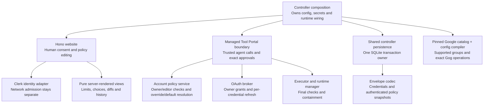
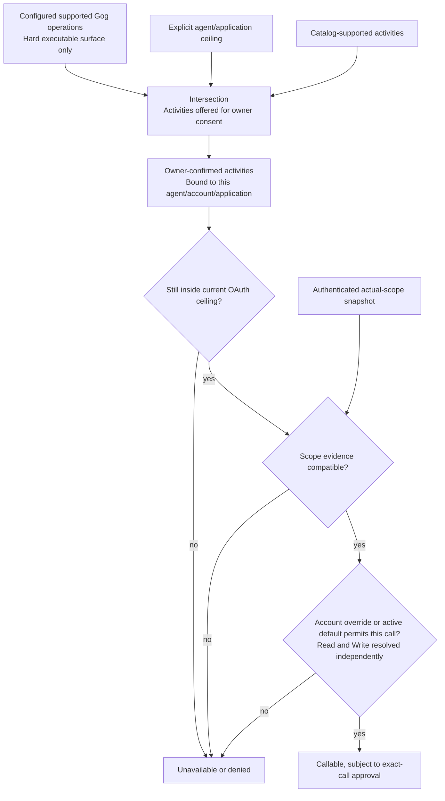
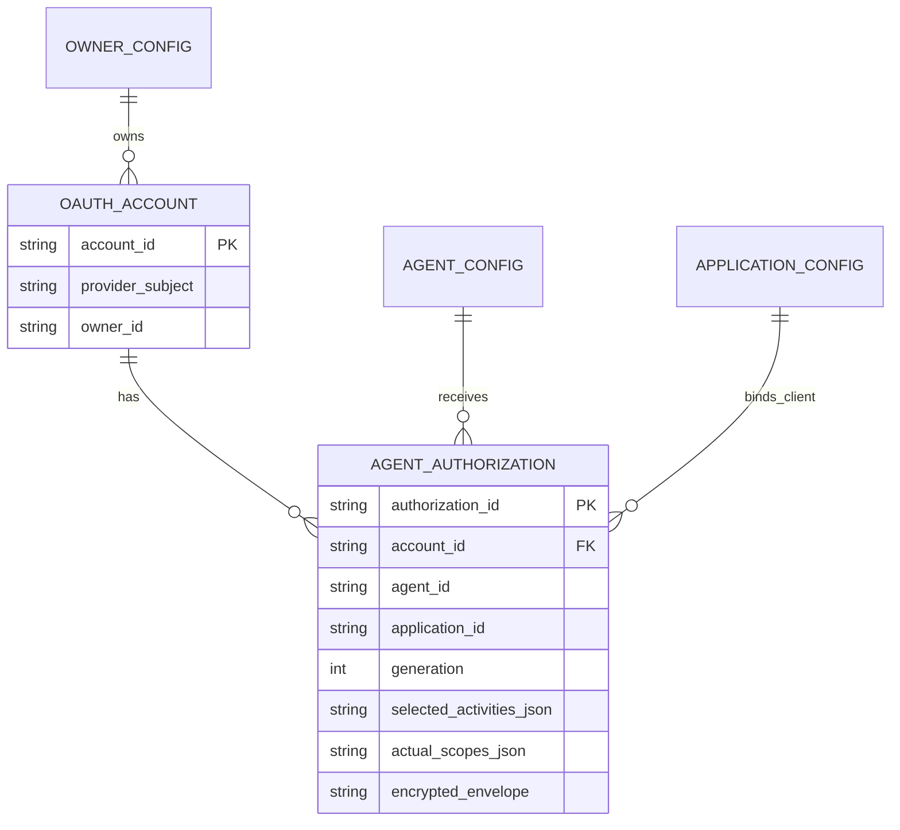
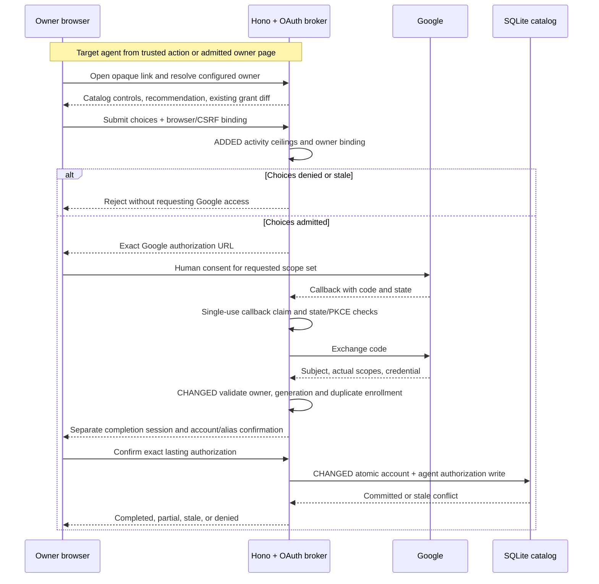
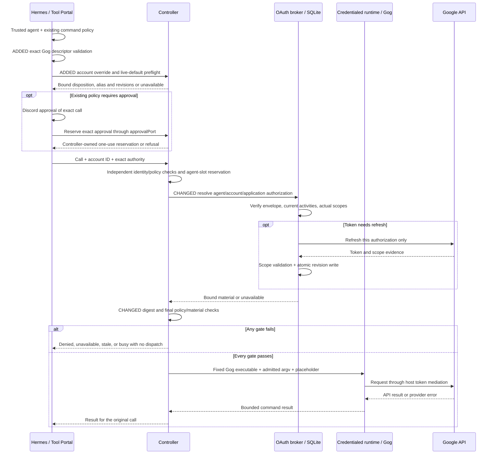
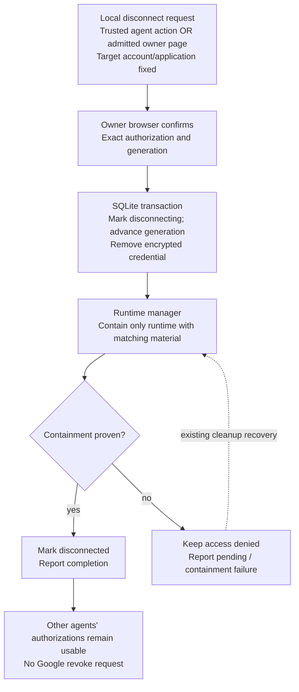
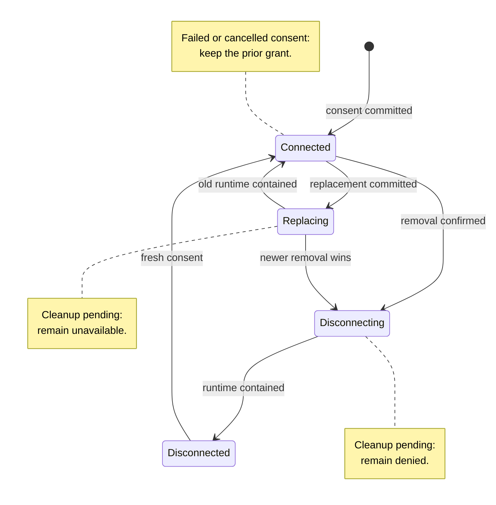
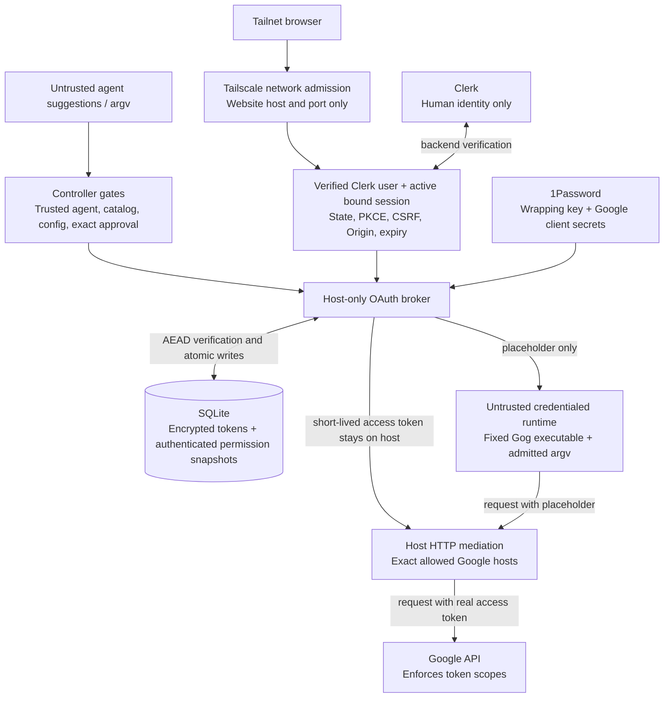

# Agent account authorization and Gog execution

The [Specification](specification.md) owns observable behavior; its user basis is
[Requirements](requirements.md). This design keeps controller-owned credentials,
the existing managed Tool Portal/Hermes approval path, and one credentialed runtime
per agent. It replaces static account slots with human-owned accounts and separate
agent/account/application authorizations.

## Integrated structure



This is a component-responsibility tree, not execution order. Catalog compilation
is process-local and does not live in SQLite. Browser and resource-call sequences
below and the two linked companions show actual calls, effects and failure paths.

The compiler changes with policy contracts; the catalog/adapter with provider and
pinned Gog facts; the broker with consent/lifecycle rules; the UI with browser
journeys; the executor/runtime with admission and containment. The arrows name
their consumers and effects. Host-side secret resolution is detailed below.

These are responsibilities in existing packages, not new services. The Google
catalog remains under `oauth-broker/google`; portable schemas belong in
`oauth-broker-contracts`. `config-contracts` owns authored configuration and pair
compilation. `oauth-approval-ui` owns sanitized view models/rendering. Controller
composition in `agent-vm` owns secrets, TLS/Tailscale, and runtime effects.
It also owns the Clerk backend integration; no Clerk SDK or human session enters
Tool Portal, Gateway Runtime, Hermes, or Gog. See
[browser-identity.md](browser-identity.md) for the login, handshake, native-form,
and future-ingress realization of R9/C9. The bounded website policy editor and
live Tool Portal policy realization are in [policy-management.md](policy-management.md)
for R10/C10 and R11/C11; it is not a general policy framework.
The complete byte/input/result/workspace/attachment path for R12/C12 is in
[file-delivery.md](file-delivery.md). The controller owns bounded disk-backed
staging shared through isolated producer and read-only receiver views. Published
files expire with the receiving Tool VM or one hour after publication; Google
disconnect does not recall delivered files. Payloads are never collected whole
in application memory. Gateway Runtime retains the existing private call/result
boundary; Hermes owns explicit native attachment
delivery. Existing artifact storage for unrelated backends remains unchanged.
The hosted human login is Google-only with identity scopes. Google resource
authorizations remain in the broker; Clerk's login external account is never a
credential source for an agent.

UI, Tool Portal, Gateway Runtime, Hermes, and Gog never open the SQLite catalog or
resolve 1Password secrets. The provider catalog does not import Tool Portal;
portable effect records let the pair compiler validate the two contracts.
Gondolin access stays behind the existing managed-vm composition boundary.

## Current source and structural change

Current-source anchors refer to local `oauth-post-merge` at `b4647ae2`; the older
dirty design documents are not implementation evidence.

| Path or owner | Current behavior | Target delta and preserved boundary |
| --- | --- | --- |
| `config-contracts/src/oauth-config.ts` | `agents.accountProfiles`, raw read/write scopes, three fixed client IDs | Replace with fixed catalog application bindings, configured humans and per-agent activity ceilings; no account slots or raw scope policy |
| `oauth-broker/src/catalog-schema.ts` | Profile row owns agent; grant keyed by profile/application | Account owns human identity; authorization keyed by agent/account/application with its own credential |
| `google-oauth-permission-policy.ts` | Numeric none/read/write validation against static profile | Supported Google groups with exact scope unions; independent read/write disposition belongs to saved Tool Portal policy |
| `google-provider-authorization-callback.ts` | State/PKCE consumption, subject binding, extra-scope rejection | Preserve checks; bind dynamic owner/account/authorization and generation before commit |
| `tool-portal-service.ts:resolveManagedInvocation` | Trusted principal checked against active profile projection | Intentionally unchanged; agent comes from trusted context, not public arguments |
| `tool-portal-service-common.ts:callPolicyDecision` | Namespace selectors then configured-CLI matcher | Preserve disposition precedence; add validated Gog effect classification and dynamic availability |
| `configured-cli-managed-vm-executor.ts` | Resolve static profile credential under agent runtime reservation; final checks | Resolve exact dynamic authorization and revision; preserve reserve-before-materialize and final authorization |
| `credentialed-managed-vm.ts` | Fixed executable + argv; host-mediated placeholder; no broad mounts | Preserve; expand compatibility digest with dynamic authorization/policy identity |
| `credentialed-runtime-manager.ts:invalidateMaterial` | Selects runtime by agent key | Add expected authorization/material binding check under the runtime lock before retirement and again after awaiting an active command |
| `oauth-broker-contracts` finite Gog command validation | Portable OAuth schemas, no shared Gog operation/effect table | Finite exact descriptors/parsers consumed by Portal and controller; no generic classification DSL or caller-authored semantic rules |
| `google-oauth-broker-service.ts:revoke` | Google revoke then one-row deletion | Remove from new public contract; replace with local disconnect and runtime containment only |
| Registered OAuth action contracts, pair validator, controller action registry and invocation-context adapter | Fixed revoke action and forced approval for reauthorize/revoke | Hard-cut revoke to disconnect in all action-ID unions and dispatch adapters; require one configured call disposition, not forced Ask; mandatory owner browser remains |
| `oauth-https-server.ts` / `oauth-approval-ui` | Slot-oriented native forms and opaque ceremonies | Add unified agent policy page, owner/account labels, supported groups, upgrade diff, history and local disconnect |
| `resolveOAuthAvailabilityByRequirement` / `capabilityDiscoveryMetadata` | Service/minimumPermission requirement keys and `accountProfile` input | Change to application/service/effect availability and opaque `accountId`; exact invocation-dependent results are recomputed by host |
| `oauth-tool-portal-config.ts` | Config-only disposition, every OAuth write requires approval | Managed Google policy source replaces authored disposition for that surface; finite command compatibility validation remains; other namespaces unchanged |
| `oauth-https-server.ts` / `oauth-transaction-store.ts` identity guards | Tailscale login is the browser owner binding | Separate peer admission from Clerk user/session identity; fixed safe login-return route; sensitive callbacks and POSTs never run generic Clerk handshake middleware |
| Python `hermes_approval_presenter.py` | Native session routing and Approve/Deny once | Intentionally unchanged; no owner-only Discord policy or standing approval |
| Python SDK `gateway_approval_bridge.py` | Builds preview only from original call arguments, then retries exactly | For managed Google challenges, include host-bound account display context; original retry arguments and presenter behavior unchanged |

## Why separate authorizations, and what remains shared

The credential belongs to an authorization for one agent, account, and application.
It is not a shared account/application credential with a per-agent permission label.
This choice preserves R1/R3's narrow credential goal and avoids using sun's token
for ember. It costs more encrypted records and refresh/reauthorization state.

One Google application-family client is shared across agents. The operator avoids
provisioning a client/project for every agent. This does not isolate Google-side
revocation: project-wide invalidation remains a provider constraint. Three service
families may themselves share a Google project; the config records that association
without pretending it is independent revocation authority.

| Alternative | Consequence | Disposition |
| --- | --- | --- |
| Shared broad credential + per-agent database restrictions | Simpler refresh state, but removes a provider-scope barrier for a narrower agent | Not selected; violates the chosen narrow-credential direction |
| Separate client/project per agent | Additional provider separation and operating setup | Not selected for this design; revisit if V1 disproves shared-client scoped credentials |
| Shared clients + separate scoped authorizations | Low client setup, independent local consent and lifecycle, shared provider revocation | Selected subject to true-provider qualification; never silently fall back |

Provider evidence is explicit:

- [Google revocation](https://developers.google.com/identity/protocols/oauth2/web-server#tokenrevoke)
  invalidates the affected user's tokens across clients in the same project.
- [Incremental authorization](https://developers.google.com/identity/protocols/oauth2/web-server#incrementalAuth)
  can combine project scopes. Broker requests omit `include_granted_scopes` and
  accept only exact evidenced scopes; absence of that flag is not itself proof.
- Pinned [Gog v0.38.1 client auth](https://github.com/openclaw/gogcli/blob/v0.38.1/internal/googleapi/client_auth.go#L357)
  returns a static token source for direct access tokens before its stored-grant
  logic. Thus Gog does not enforce an agent's local grant or refresh it itself.
- Pinned [root commands](https://github.com/openclaw/gogcli/blob/v0.38.1/internal/cmd/root.go)
  include generic `api`, auth/client/token overrides, exact command allowlists and
  Gmail no-send flags. They are explicit denial/qualification targets.
- Pinned [Gmail no-send guard](https://github.com/openclaw/gogcli/blob/v0.38.1/internal/cmd/gmail_no_send.go)
  covers canonical send, reply, reply-all, autoreply, forward and draft-send paths.
  It is defense in depth, not the host authorization owner.

The deployment currently installs v0.38.1 in `shravan-claw/vm-images/tool-vms/default/install-agent-clis.sh`.
The credentialed-runtime image must independently pin and verify the same reviewed
Gog build; a Tool VM installation alone is not credentialed-runtime proof.

## Configuration and compilation

This delivery's catalog, compilation changes, and provider qualification cover
Google/Gog. Notion and other integrations belong to a separate follow-up PR.
Existing non-Google Tool Portal policies and backend behavior are preserved;
shared contracts do not automatically admit another provider or tool.

The authored contract is a hard-cut OAuth schema version 2, paired with the
managed Tool Portal executable catalog and account overrides and config-default Google policy.
Important identifiers use distinct strict
Zod schemas; runtime types derive from those schemas.

```text
oauth.config
  zoneId
  browser / storage key reference                 existing protected boundaries
  browser.identity
    kind: clerk; issuer; publishableKey; secretKey reference
    hostedSignInUrl; fixedLoginReturnOrigin
  browser.network
    admittedTailnetLogins                         network only, not owner mapping
  owners[ownerId]
    label, clerkUserId, allowedAgentIds            config alias only
  policyEditors[editorLabel]
    clerkUserId, editableAgentIds                  website only
  providers.google
    catalogVersion, gogBuildIdentity
    projects[projectId]: publishingStatus
    applications[applicationId]
      catalogFamilyId, projectId, clientCredentials, label
  agents[agentId].applications[applicationId]
    ceiling: catalog-preset | explicit-google-groups

tool-portal.config
  existing agents -> complete profile assignment
  agents[agentId].googlePolicyDefaults
    pinned collection OR explicit application/service Read/Write defaults
  other namespaces: existing visibility and calls selectors unchanged
  Google/Gog namespace: calls source = managed_google_policy
    configured Gog operations
      commands, flags/pattern/stdin/output/timeout admission
      hard denied paths/patterns only, no duplicate Ask/Allow rules
      authorization: oauth_account                 no path-to-activity rules
```

There are no Google subjects/emails or account slots in config. Owner identity is
the verified Clerk issuer + user ID, mapped to one configured owner entry. Tailscale
logins admit connections only and may differ from the browser user. Duplicate Clerk
identity mappings fail validation. Email, display label, Tailscale peer, and a
recreated Clerk user cannot take over an existing account. An owner must be admitted
for the initiating agent. The same Clerk production instance is retained for any
future public browser ingress; development/test Clerk identities never seed live
account ownership. The Clerk secret key uses a host-only 1Password reference.

Application IDs remain stable, independent of human labels and Google client IDs.
For the existing deployment, `gmail-app`, `workspace-app`, and `youtube-app` may
bind the communication, document, and YouTube catalog families respectively;
renaming `workspace-app` is not needed to display "Drive & documents." Existing
client credentials are checked against their configured project/client binding
metadata at preparation, and client IDs must not be duplicated across families.
Replacing a resolved client ID changes its binding revision and requires fresh
authorization; rotating only its client secret does not grant new scope authority.

Application ID alone is not a service-policy key. Effective policy uses the complete
zone/agent/account/application/service tuple from Specification R10. Each authorization
has a companion authenticated account-policy row containing its service overrides;
config defaults omit the account dimension because accounts remain dynamic. Application is the stable configured
family ID, not the resolved client ID. A
Gmail-family authorization may contain Calendar or Contacts selections, each with
its own service read/write policy. A finite command descriptor selects the family
client and all required service groups; it cannot select another agent's grant.

Durable `owner_id` is a versioned canonical encoding of the verified Clerk issuer
and user ID, not the `owners` key. Persist both constituents or that exact encoding
and authenticate it in AAD. Changing a config alias's clerkUserId creates a
different human identity with no access to the former human's accounts. Editor
admission uses the same verified identity comparison, not email or display name,
and must additionally match the selected account's verified owner.

The pair compiler performs set intersections, not implicit profile inheritance:



A recommended selection that exceeds this set fails config validation. Missing
ceilings deny. A reachable operation must map to compatible application/service
read/write effects or explicit no-OAuth help; ambiguity, wildcard parent paths, and unsupported args
fail validation or runtime classification. Denied paths do not need an executable
scope mapping. Schema compatibility preserves all unrelated configured-CLI fields,
stdin/output/timeout policies, and exact approval fingerprint inputs.

Config activation uses the existing prepared generation and controller restart.
The new policy digest includes owner admission, resolved application/client binding,
catalog/Gog build, activity mapping, ceilings, editor admission and resolved defaults.
Activated default changes affect only inheriting cells, never stored overrides or
Google grants. Config activation records its defaults digest/history before admission
and invalidates old runtime/approval epochs. Runtime policy checks use the selected
account's authenticated override revision plus active defaults digest, never files
edited after startup. Website saves do not rewrite deployment
files or replace the prepared executable generation.

## Supported Google groups and exact Gog command validation

The provider catalog separates supported local operations from technical scope effects:

```text
Google permission group
  stable groupId, family/service, read or write, label/help
  required scopes (exact set or explicitly qualified alternatives)
  implied provider capabilities / warning text
  supported Google modes and dependencies
  compatible canonical Gog paths and argument variants
  effects: read and/or write; sendsMail marker for defense in depth
```

The UI renders two independent account/service rows: Use default or explicit
Deny/Ask/Allow, with resolved value and source. Separate Google consent/mode controls
show actual grant authority. Unsupported cells have reasons. Collections are
versioned snapshots with label/summary/rationale and separate policy/consent choices.
There is no five-element permission rank, arbitrary activity editor, or inferred
policy from natural-language labels.

Gmail illustrates the mapping: reading uses `gmail.readonly`; broad write uses
`gmail.modify`, with reading/drafting/organization/sending authority disclosed.
No draft-only group is offered. Calendar event and
contact choices map independently; Forms bodies and responses remain separate;
Drive named modes distinguish `drive.file` from all-file read/write. Exact shipped
choices must have pinned Google API scope evidence and at least one classified
Gog operation. An unclassified choice cannot appear in an effective preset.

Host mediation allow-lists are declared on the pinned catalog family descriptor
and qualified against the selected Gog build, not copied from the legacy
`googleRuntimeAllowedHostsByApplication` constant. The communication family includes
its Gmail, Calendar and People API hosts; the documents family includes its file,
document and Forms hosts; YouTube includes its qualified API hosts. Exact `www.googleapis.com`
usage is included only where qualified operations require it. Pair compilation
projects this allow-list into runtime material and its digest. Family regrouping
therefore cannot leave Calendar attached to the old workspace-app host map.

`resolveGogOperation` is a finite pure command parser/table adapter exported by
`oauth-broker-contracts/gog-commands`. It has no database, host or Portal dependency.
The host-owned pinned Google catalog supplies non-secret descriptors to composition;
the compiler projects them into the effective Tool Portal executable generation.
Descriptors enumerate exact paths/aliases, qualified argument parsers and required
application/service read/write effects. There are no user-authored classification
expressions or config path-to-activity mappings. This one function owns argv-to-effects;
controller recomputes the result rather than trusting a caller-provided effect.
The existing matcher still validates hard command, flag, stdin, output and timeout
constraints. Account overrides resolved against active config defaults supply disposition. Compilation rejects any
reachable credentialed shape without a unique descriptor or whose required groups
exceed the agent's maximum. When a matcher is too broad to prove compatible, config
fails; dynamic arguments are checked again at runtime. Local help/version have
explicit no-credential descriptors, never a caller-selected bypass.

This bounded validation is necessary because the existing matcher admits a token prefix
and does not reject all unknown flags. Giving it `gmail` or `api` as a broad prefix
would not establish activity isolation. The Gog-specific schema rejects alternate
auth/client/account flags, configuration/auth/MCP/root-batch execution, generic API methods, output or
input modes that introduce unclassified effects, and unknown flags. Canonical
classification identifies the activity but does not rewrite the executable argv.
The original validated argv array reaches the fixed executable, matching the exact
arguments included in the approval fingerprint. Classification and effective
inventory revision are recomputed at the controller; changing an alias, argument,
flag, or inventory invalidates the previous approval. There is no second rewritten
argv that an approver never saw. `--home`/`GOG_HOME`, client/account/access-token
selection and runtime defense flags/environment are controller-owned and cannot be
supplied or overridden by public call input.

Runtime defense flags are controller-owned, and user argv cannot override them.
When Gmail write is outside effective policy or the owner's grant, fixed `GOG_GMAIL_NO_SEND=1` is included
in the runtime compatibility digest and environment. Sending is configurable,
never implied merely by a send-capable token; the no-send guard follows effective
configured policy and human-confirmed Gmail write authority. Read-only runtime flags may be used only after proving
they preserve admitted read workflows; they are not a substitute for host policy.

## Durable data and envelope integrity

The sole catalog remains below
`<controllerStateDir>/zones/<zone>/oauth/credentials.sqlite`, never in a VM mount
or normal zone backup. Keep one better-sqlite3/Drizzle owner, foreign keys, WAL,
full synchronous commits, bounded busy timeout, directory `0700`, and database,
WAL, and SHM `0600`. These preserve the [storage model](../../architecture/storage-model.md).

```text
oauth_accounts
  account_id, zone_id, provider_id, provider_subject, owner_id
  display_label, record_revision, timestamps
  UNIQUE(zone_id, provider_id, provider_subject)

oauth_agent_authorizations
  authorization_id, account_id FK, agent_id, application_id
  account_alias, generation, access_state, lifecycle, record_revision
  authorization_metadata_revision
  catalog_version, client_binding_revision
  selected_activities_json, requested_scopes_json, actual_scopes_json
  credential_id, material_revision, encrypted_envelope
  refresh attempt/success/retry metadata, timestamps
  UNIQUE(account_id, agent_id, application_id)

oauth_schema_metadata
  schema/envelope versions and existing key-verification metadata
```

The authorization row is both the agent assignment and its independently issued
credential; its policy companion is separately described in policy-management.md.
There is no second assignment table pointing to a shared grant. Alias
is agent-local presentation, not global account identity. Disconnected rows retain
minimal identity/generation as tombstones but remove credential ciphertext; they
prevent stale callbacks from restoring an old authorization. Owner reassignment
and account merging are outside scope.



The three `*_CONFIG` entities are configuration, not additional SQLite tables.
The unique agent/account/application tuple is what separates sun's credential
from ember's when both use the same account and configured Google client.

Envelope version 2 preserves the current XChaCha20-Poly1305 construction: fresh
32-byte DEK per payload write, independent 24-byte payload/wrap nonces, wrapping
under the 1Password KEK, and distinct purpose strings. Versioned canonical AAD
binds zone, owner, provider subject, account, agent, application, resolved client
identity/binding revision, authorization ID, generation, credential ID, and
catalog version. IDs are fixed before encryption; JSON serialization is canonical
and versioned rather than concatenating unescaped user input.
Decryption uses the row-recorded consent-time binding and catalog/client versions,
not current configuration values. After AEAD verification the broker independently
checks compatibility with active config. A current recommendation change cannot
turn a valid stored envelope into an authentication failure.

The encrypted payload includes access/refresh tokens and expiry, plus the exact
confirmed activity and requested/actual scope snapshots. Plain metadata copies
are query hints. Before advertising usable authorization or materializing a token,
the broker verifies AEAD and compares those copies with the authenticated payload.
Database edits cannot expand selected activities merely by changing a JSON column.
Mutable operational lifecycle counters are not authority and do not require
re-encryption; a credential/scope/selection change does.

`record_revision` is the CAS revision for any row write, including refresh.
`material_revision` changes when token/runtime material changes.
`authorization_metadata_revision` is separately authenticated and changes only
when alias, confirmed groups/scopes, client binding or authorization generation
changes. An ordinary refresh preserving those facts does not change it. Exact-call
approval binds the metadata revision, not the refresh/CAS revision; final material
validation still verifies the freshly resolved credential independently.

Catalog construction allocates account/authorization/generation identities before
encryption, then inserts or replaces under a transaction comparing the observed
account owner and authorization revision. Concurrent first enrollments resolving
the same provider subject use the unique account key: the losing candidate must
rebind/re-encrypt only if the owner is the same and no authorization conflict
exists; otherwise it returns stale or denied. No plaintext identity rewrite can
make an already encrypted candidate belong to another agent or account.

No persisted token fingerprint or plaintext token is required. Plaintext bytes are
bounded to the host critical section and cleared where the runtime permits. No
claim is made about whole-file rollback or a privileged live host attacker.

## Interfaces and source-anchored call changes

All public and internal variants are strict Zod discriminated unions. Named IDs
are non-interchangeable and inferred types remain separate for public metadata,
provider responses, decrypted payloads, and runtime material.

| Owner interface | Consumer, input, and guarantee | Effects/errors |
| --- | --- | --- |
| `compileOAuthPolicy` | Composition; catalog + config pair + resolved client metadata | Pure effective policy or exact validation error; no credentials exposed |
| `beginEnrollment` | Registered action with trusted agent, or admitted website-owner entry with page agent + family | Bounded transaction with typed initiator and opaque URL; suggestions have no authority |
| `beginReauthorization` | Trusted agent action or verified account-owner page + account/application | Bind existing subject/generation/metadata revision; owner consent required |
| `submitConsent` / `completeCallback` | Hono; verified owner + cookie/CSRF + typed choices or state/code | Single-use transition; external Google exchange; no commit until scope/subject checks |
| `confirmAuthorization` | Hono; separate completion identity and expected revision | Atomic account resolve/create + authorization replace; stale/owner/subject mismatch fails |
| `resolveAuthorizationMaterial` | Executor under agent runtime reservation; trusted agent/account/classified activity | Verified current encrypted snapshot and required scopes; JIT refresh; no fallback credential |
| `beginDisconnect` / `confirmDisconnect` | Trusted agent action or verified owner page starts; same owner browser confirms | Durable deny/tombstone first, runtime containment second; typed complete/pending/failure |
| `list/status/cancel` | Authenticated agent; own account list, only its agent-initiated ceremony IDs | Sanitized metadata/results or cancellation; no website-initiated ceremony lookup |
| `resolveActivityAvailability` | Existing Portal availability port; trusted agent + application/service/effects, optionally exact validated argv | Sanitized own accountId/alias options, each account's override/default revision binding and ready/consent-required/denied/unavailable; no token refresh or secret output |
| `preflightFileInputs` | Controller preflight + trusted caller + descriptor-classified paths relative to `/work` in the current Tool VM | Bind normalized source/staged name, current lease/VM and streamed hash/length to the exact-call fingerprint; never inherit terminal cwd, retain payload or reserve the credentialed runtime during approval |
| Staging directories | Controller allocates owned producer/receiver directories using existing RealFS and read-only mounts | Admission/publication size bounds, expiry deletion, VM lifecycle and recovery cleanup; no custom filesystem or per-handle revocation |
| Staging publication | Executor + exact current receiver lease + checked files from a stopped producer command | Bounded host copy into independent receiver-side files, then directory rename under the publication/authorization guard; producer writes cannot mutate the delivered copy; never rerun Gog |

### Enrollment and upgrade: changed path

The current path starts with `begin(profile)`, renders a static slot form, and
writes a profile/application grant. The target changes those three boundaries:



Current anchors: `google-oauth-broker-service.ts:beginAuthorization/submitPermissions`,
`google-provider-authorization-callback.ts:handleGoogleCallback`, and
`oauth-https-server.ts:createOAuthHttpsApp`. Google effects are async; claiming and
committing local transaction states is synchronous before any await. Reauthorization
uses the same path with an expected subject and generation, never an alternate agent.

Website initiation is an added entry with no predecessor: a CSRF/Origin-protected
owner POST on the admitted agent page calls the same broker begin operation, with
target agent resolved server-side from that route and owner admission. It creates
`initiator: { kind: website_owner, ownerIdentity }`; the existing agent action
creates `initiator: { kind: agent, agentId }`. Both retain the target agent separately.
The transaction store and completion store preserve this discriminator through
callback/retry, and agent status/cancel checks it before lookup. Browser status/cancel
requires the bound owner/session/browser secret. No new account assignment authority.

For begin-enrollment, subject lookup after exchange rejects an existing non-disconnected
authorization for the same tuple as duplicate-authorization, discarding the candidate
without revoke. A new owner-bound reauthorize link references current metadata and
generation and never reuses the consumed callback. Repeat the check under the commit
transaction to catch concurrent winners. Disconnected tombstones require a fresh
generation rather than resurrection of the previous credential.

The tombstoned tuple keeps its original authorization_id on re-enrollment. Allocate
a new generation and credential identity, not a replacement authorization_id, so
the separately authenticated override companion remains bound to the same owner/
agent/account/application tuple. First-ever tuples allocate both authorization and
inherit-policy rows atomically. Display retained overrides before reconnect commit;
neither reconnect nor token refresh resets them.

The registered-action cutover includes oauth-authorization-action-contracts.ts,
oauth-tool-portal-config.ts, gateway-control-controller-execution-authorization.ts,
gateway-control-oauth-invocation-context.ts and the registered action-ID union/dispatch.
Remove revoke rather than aliasing it. Each lifecycle tool has exactly one configured
Ask/direct disposition; the old forced reauthorize/revoke approval special case is
removed for the new owner-confirmed request path. No machine action can commit
disconnect, grant replacement or an override without the appropriate browser flow.

### Resource command: changed path



Anchors: `tool-portal-service.ts:resolveManagedInvocation`,
`tool-portal-service-common.ts:callPolicyDecision`,
`gateway-control-controller-execution-authorization.ts`,
`configured-cli-managed-vm-executor.ts`, and `credentialed-managed-vm.ts`.

For file-consuming operations, the preflight arrow additionally computes the
source hash/length under current Tool VM authority; only metadata is retained for
approval. Relative input name `p` always selects `/work/p` in that Tool VM and is
staged as `p` in the execution folder; a terminal's logical cwd is not consulted.
Source lease/VM and normalized path identity join the exact binding. After runtime
reservation and material resolution, input staging from that same current source and
comparison against that approved identity occur before the final check/dispatch.
The input contract in [file-delivery.md](file-delivery.md#input-files)
shows that added branch, mismatch denial and its reservation boundary. The
controller never holds the execution runtime while waiting for human approval.

File-bearing commands use explicit relative file arguments and execute with the
operation folder as cwd. That derived cwd is bound together with unchanged argv
before approval and independently checked at dispatch; the agent does not construct
an internal absolute path. Existing Portal orientation and capability discovery
explain the convention and exact CLI syntax. Bounded CLI result metadata identifies
actual filenames, with common folder listing as an additional discovery surface;
the controller enforces folder access independently of those reported paths.
Completed delivery returns a Tool VM path for subsequent ordinary tools. The
[publication contract](file-delivery.md#publication-and-file-meaning) separates
these execution and destination paths. Non-file commands retain configured cwd.

The runtime remains one slot per zone/agent, not per account. Switching accounts,
application, credential material, effective activity authority, or defense flags
retires/recreates that slot. The compatibility digest covers all of them. No
leased Tool VM or generic shell path receives the credentialed runtime's placeholder.

### Disconnect: replacement for provider revoke

The old path calls Google revoke before deleting one local row. The target removes
that provider effect because it can invalidate other agents' Google credentials.



Current anchor: `google-oauth-broker-service.ts:737-818`; retirement owner is the
existing credentialed runtime manager. A runtime already executing a different
authorization must not be retired accidentally: compare its material binding to
the removed authorization. Other agents' slots and authorizations are untouched.
No provider revocation compensation is attempted after local or provider failures.

## Ceremonies, state, and concurrency

TransactionStore and completion store stay process-local, capacity-bounded, and
short-lived. Store original public ceremony ID separately from callback state.
Browser cookies are Secure/HttpOnly/SameSite and narrowly pathed; actual Tailscale
peer admission is checked separately from the bound Clerk user/session. Origin,
CSRF, state, and PKCE must agree. No raw code/secret is reflected
into another URL or log. Initial owner binding occurs once and cannot switch
during a multi-app ceremony.

| Broker-owned state | Transition/guard | Failure or illegal transition |
| --- | --- | --- |
| Selecting | Verified admitted owner submits within active policy | Reject excess or stale config; no Google call |
| Authorizing | Atomically claim callback with exact state/binding/expiry | Duplicate loses before exchange |
| Consuming callback | Async exchange, scope/subject verification | Failure returns retryable/denied; discard candidate without revoke |
| Awaiting confirmation | Distinct completion session + same owner | Stale generation or owner mismatch: no commit |
| Committing | Compare expected account/auth generation and revision inside SQLite transaction | Conflict preserves winner and returns stale |
| Replacing | Commit new encrypted candidate as unavailable; advance generation; contain prior runtime | CAS to connected only after containment; a concurrent disconnect wins by generation |
| Completed/partial | Per-app result recorded in bounded ceremony state | Restart invalidates ceremony, not committed grants |
| Disconnect pending | Owner confirms exact current auth generation | Duplicate/stale confirmation has no effect |
| Disconnecting | Durable no-use state before async runtime containment | Remains denied until containment proven |
| Disconnected | No envelope, minimal generation tombstone | Fresh enrollment requires new generation and consent |

Credential lifecycle active/degraded/reauthorization-required is separate from
access connected/replacing/disconnecting/disconnected. A provider outage does not remove
owner binding or cause credential sharing. Scope reduction due to config is
derived unavailable state until fresh valid consent; it does not mutate Google's
grant or delete a credential silently.

Replacement is a durable `replacing` row containing the new encrypted candidate.
The previous material cannot be newly admitted after the replacement CAS. If
cleanup fails, the new candidate remains unavailable; startup recovery proves
the old runtime absent before changing the matching generation to connected.
This uses the existing no-adoption runtime cleanup, not a background token job.

Single-flight is keyed by authorization/credential identity, never by account or
application alone. Different agents may refresh independently. Provider exchange
does not hold a SQLite transaction. It snapshots revision, performs bounded async
work, then commits only on compare-and-swap. Disconnected generations cannot be
revived. Refresh replacement omitted by Google retains the same authorization's
existing refresh token; a newly enrolled agent without its own refresh token
fails qualification rather than borrowing another row's token.

Avoid lock inversion: dispatch reserves the existing agent runtime first, then
does bounded credential resolution. Disconnect/replace makes its database decision
without awaiting a runtime lock, releases the transaction, then asks the runtime
manager for containment. The final execution/material guard observes generation
and policy immediately before admission. A disconnect racing an already-dispatched
API call cannot undo that call; it denies new work and contains the runtime before
reporting completion. Replacement returns not-yet-active until stale runtime
material is contained; admission to the new credential cannot race old material.

## Failure containment and cutover



This is the access-state machine. Credential health is separate: transient refresh
failure becomes degraded with a bounded next retry; invalid grants or scope
mismatches require reauthorization; stale refresh writes are discarded and current
state is re-read. A failed uncommitted candidate is discarded without Google revoke.
Restart uses existing no-adoption cleanup before restoring OAuth readiness.

Only successfully committed scope/credential replacements advance usable material.
If the database fails before a deny/replace commit, report failure without claiming
changed authority. If it fails after the durable fence while containment is pending,
runtime cleanup and the tombstone retain denial. Do not return success merely from
the runtime manager's `retire-after-active` acknowledgment.

Controller startup validates defaults/maxima/catalog/client bindings, resolves KEK
and client secrets, opens/hardens the catalog, verifies envelope format, completes
existing runtime cleanup, and records changed defaults activation before admission.
Listener binding retains transactional rollback on failure. Override snapshots are
not rewritten by defaults activation; policy-management.md owns that sequence.
Shutdown closes admission, invalidates ceremonies, completes bounded writes and
containment, and closes both listeners using existing lifecycle ownership.

Old nonempty account-slot catalogs cannot be assigned human ownership from their
agent ID. Before any write-mode catalog open, WAL pragma, or Drizzle migration,
startup performs a non-mutating SQLite schema inspection under deployment ownership.
It reads schema metadata and table layout; known legacy, unknown, or inconsistent
formats return cutover-required rather than invoking the existing migrate-on-open
path. Only a proven current schema or explicitly new empty catalog proceeds to
normal write initialization. Version-2 startup detects the old schema and returns cutover-required,
leaving original bytes untouched. Offline operator cutover preserves the old
encrypted database, initializes the new schema, activates version-2 config, and
requires fresh owner consent. Old data is never a live fallback or migration
authority. Rollback requires stopping the new controller and restoring an explicitly
preserved matching config/catalog pair; do not run mixed versions concurrently.
This is a hard cutover, not a dual runtime path or an automatic destructive migration.

## UI composition and trust boundaries



The host mediator restricts hosts, not Gmail read-versus-send endpoints. Command
classification and narrow provider scopes supply those separate activity limits.

Renderer hierarchy is one server page/layout with application sections and generic
control variants. Pure child views receive allowed choices, recommendation,
current/desired selections, human explanation, validation errors, and progress.
The server owns bounded ceremonies, scopes, owner identity binding, and commits.
Clerk owns human login and its session lifecycle. Hosted Clerk pages may use
JavaScript; native consent forms after login use the bounded session-check path
without requiring ClerkJS on consent pages. Islands only improve selection/diff presentation.
Do not pass provider response objects or private catalog rows into JSX.

Account aliases and granted activity status are visible only to the authorized
agent and admitted owner. A Discord link contains an opaque transaction ID, not
the account subject, requested scopes, or credentials. Detailed owner confirmation
stays on the protected browser surface. Exact-call argument previews retain the
existing redaction and bounds.

## How contracts are realized and proved

| Specification | Structural owner and observation | Enforcement / real boundary |
| --- | --- | --- |
| R1/C1 | Broker + SQLite; two agents share subject without sharing authorization | Strict IDs, unique keys, owner/generation guards; real SQLite + V1 Google |
| R2/C2 | Catalog/config pair compiler; reject missing/excess ceilings and unsafe recommendation | Schema/set logic tests; real config materialization |
| R3/C3 | Provider adapter + completion + refresh; exact actual scope snapshots | Runtime guards, AEAD snapshots; true Google V1 qualification |
| R4/C4 | Finite Gog operation validator + Tool Portal + controller executor; admitted path or pre-exec denial | Schema + runtime guards + exact fingerprints; real Gog/Hermes V4 |
| R5/C5 | Existing Hermes bridge/presenter and controller approval ledger | Exact-call one-use reservation; real Discord/native presenter path |
| R6/C6 | Broker CAS/tombstones + existing runtime manager | SQLite atomic fence + real VM containment; V5 concurrency and restart |
| R7/C7 | Envelope codec/catalog + host mediation | AEAD identity/payload binding and file permissions; real DB/VM leakage inspection |
| R8/C8 | Hono/Tailscale/session stores and controller lifecycle | Real route misuse, off-tailnet negative probe, phone/keyboard/no-JS UI proof |
| R9/C9 | Host browser-identity verifier and existing ceremony stores | V7 real Clerk hosted-return, live bound-session verification, native forms, no callback leakage, no machine dependency |
| R10/C10 | Account policy service, pure override/default evaluator and existing runtime manager; see policy-management.md | V8 owner AND editor guards, scoped override CAS, default activation, exact binding and containment |
| R11/C11 | Existing SQLite transaction owner with account-filtered history and defaults-activation record | V8 atomic override/grant/default history and append-failure rollback; no private cross-owner data |
| R12/C12 | Controller shared-staging owner, isolated producer mount, read-only Tool VM view and Hermes sender; see file-delivery.md | V9 byte identity, exact inputs, publication authority, one-hour/receiver expiry, admission/publication limits, visible disk-full failure, recovery cleanup and native attachment proof |

```text
Deterministic proof: synthetic provider responses -> real broker/compiler/codec
  -> inspect exact decisions and durable transactions (not live Google proof)

Runtime proof: real Hermes/Portal/controller -> real credentialed VM/Gog
  -> instrument host mediation and account-specific API effects

Provider qualification: authorized test owner -> real consent/code exchange
  -> two per-agent authorizations -> real refresh -> inspect actual scopes
```

Current in-process boundaries may be substituted for deterministic failure tests;
Google scope behavior, Tailscale reachability, native approval UI, and VM material
containment cannot be established with fake edges. No test should send real mail
or revoke a real household Google project without separate explicit authorization.
Qualification failure reopens the shared-client realization, not its proof bar.
