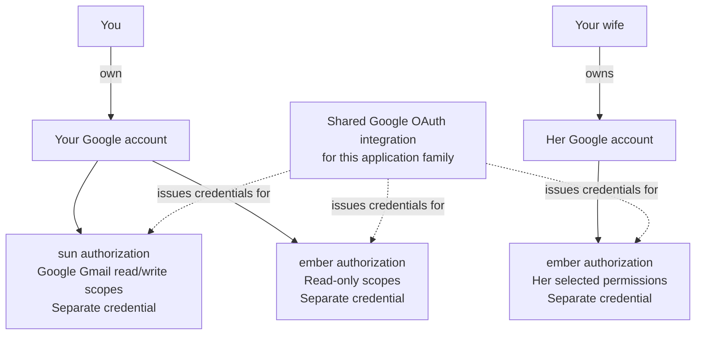
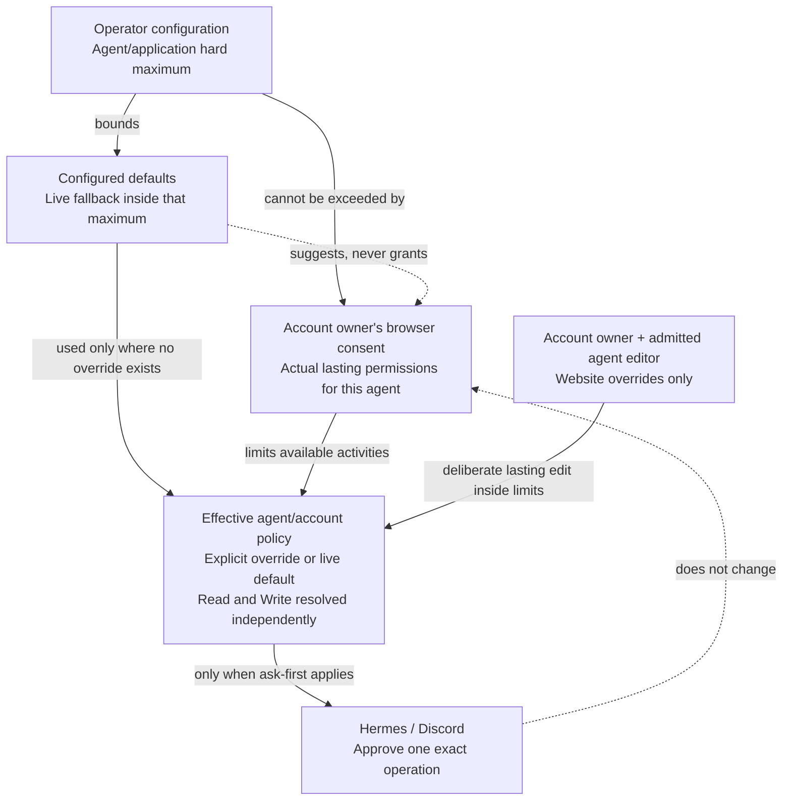

# Agent account and tool permissions

## Problem and desired outcome

People need to give different agents different access to their accounts and tools,
understand what those agents can do, and change those permissions deliberately.
An account belongs to a person. Giving an agent access does not make the agent the
account's owner or authorize another agent to use it.

The deployment is `shravan-claw`, with agents `sun`, `mak`, and `ember` in the
`apollofam` zone. `ember` is shared by the two household members. Each person may
authorize accounts for that shared agent, while the same accounts may also be
authorized separately for other agents.

The intended result is understandable, independently adjustable permissions for
each agent and account/service, together with clear rules for when the agent must
ask a human. The selected direction shares Google application-family clients
across agents while retaining separate agent/account authorizations. The provider
behavior needed for separately scoped credentials remains a qualification gate.

People sign into the browser surface through Clerk. Tailscale restricts network
reachability to that surface; it does not determine account ownership. Human
ownership uses the verified Clerk instance/user identity, while sun, mak, and
ember retain their existing managed runtime identities. Google API credentials
remain controller-owned, separate from Clerk login credentials.

### One account, different agent authorizations

This example illustrates U-PERM-001–003. The example permissions are not defaults.
The shared integration is not a shared credential.

The separate-credential scope behavior remains subject to provider qualification
below. Google project revocation can affect several authorizations even though
their local permissions and credentials are separate.

## People and agents

| Consumer or stakeholder | Need |
| --- | --- |
| Person connecting an account | Choose which agents may use it and for which activities; understand and change that access. |
| Person interacting with an agent | Understand whether an action is available, requires approval, or is unavailable. |
| Both household members using ember | Each account owner authorizes lasting OAuth access to their account. Individual tool-call approval continues through Tool Portal and the existing Hermes/Discord rules. |
| Deployment operator | Configure fixed integrations, hard limits and which verified humans may edit each agent's policy; routine policy edits must not require editing deployment files. |
| Account owner admitted as policy editor | Use one website to see hard limits, inherited defaults and own overrides for a specific agent/account/service, without editing another owner's policy. |
| sun, mak, and ember | Discover their own available accounts/tools and follow the applicable access and approval rules. |

No separate buyer or third-party developer requirements have been established.

## Requirements established in the discussion

These rows record the user's expressed needs. Their relative delivery priorities
have not been ranked. No example below establishes production permission defaults.

| ID | Need and reason | Authority and evidence | Priority |
| --- | --- | --- | --- |
| U-PERM-001 | Accounts belong to people independently of the agents permitted to use them. Sharing an agent must not imply that the people share every account. | Authorized: S1. | Requested; ranking open. |
| U-PERM-002 | The same Google account can be authorized separately for multiple agents. An authorization for one agent must not implicitly authorize another. | Authorized: S1. | Requested; ranking open. |
| U-PERM-003 | Each agent can have different access and permitted activities for the same account/service, including no access. This supports differences such as sun having email editing capabilities while ember has only reading capabilities or no access. | Authorized: S1, S4. | Requested; ranking open. |
| U-PERM-004 | Permission controls follow supported Google permission groups, with truthful descriptions of their authority. V1 does not invent a draft-only Gmail grant or a general-purpose activity-classifier framework. Read and write each have independent Deny / Ask / Allow policy where supported. | Authorized: S3, S19. | Required; user-selected simplification. |
| U-PERM-005 | Account/service permissions and Tool Portal policy fit together so an agent can determine what it may do and when Hermes must ask. Read and write approval policies are independent; approving once never edits them. | Authorized: S1, S19. | Required. |
| U-PERM-006 | Human-facing recommended settings help configure both account permissions and Tool Portal authorizations for Google/Gog. Start with the read-only collection below; other collections can evolve through later reviewed changes. Notion and other integrations follow separately. | Authorized: S1, S3, S13, S19. | Google/Gog in scope; others deferred. |
| U-PERM-007 | Account-specific Google/Gog policy overrides are edited through the website only. The human must own the selected account and be configured to edit the selected agent. Hard limits and live defaults are visible; agents and Discord can request changes but cannot commit overrides. | Authorized: S1, S18, S20, S21, S22; supersedes S12's UI deferral. | Required. |
| U-PERM-008 | Access to Gog does not make its entire command surface available. Each agent can be restricted to a permitted subset of its activities, coordinated with the chosen account's permissions and invocation approval rules. | Authorized: S6. | Requested; ranking open. |
| U-PERM-009 | Removing one agent's local account access preserves other agents' separately authorized access. The account owner confirms disconnect in the website. Google-side revocation is a separate provider operation with shared-project effects, not the mechanism for local removal. | Authorized: S7, S18. | Required. |
| U-PERM-010 | An agent's request or an accidental ordinary consent/approval must not expand that agent beyond configured account/service permission limits. Recommendations alone do not establish those limits. Deliberately raising the maximum initially requires a configuration change; ordinary OAuth consent and invocation approval cannot perform that change. | Authorized: S8, S12. | Requested; ranking open. |
| U-PERM-011 | Each person authorizes lasting OAuth access and scope upgrades for their own accounts. This is separate from individual call approval through Tool Portal/Hermes/Discord. The operator's existing host/root access does not imply a new administrative UI role. | Authorized: S10. | Requested; ranking open. |
| U-PERM-012 | Retained OAuth access/refresh tokens and sensitive account credential payloads use envelope encryption in SQLite. The envelope wrapping key and application client secrets remain in 1Password. | Authorized: S11. | Requested; ranking open. |
| U-PERM-013 | Clerk identifies the human signed into the website using only Sign in with Google, including on shared devices. No application password or email-code login is offered. Clerk requests basic identity scopes only; sign-in grants no Google resource or agent permissions. Google resource enrollment, per-agent credentials, and refresh remain controller-owned rather than moving to Clerk social connections. | Authorized: S14, S16. | Required by user-selected login direction. |
| U-PERM-014 | Family devices may reach the OAuth website through restricted Tailscale access without gaining access to other hosts, SSH, controller administration, or private subnet services through that membership. Verify both permitted website access and denied infrastructure access. | Authorized: S14. | Required by user-selected network boundary. |
| U-PERM-015 | A later public browser entry point must be able to preserve human account ownership and agent authorizations. Bind them to Clerk identity, not Tailscale login/IP. Public exposure, reverse-proxy deployment, and its additional security proof are a separate future change. | Authorized: S14. | Prepare identity boundary now; public exposure deferred. |
| U-PERM-016 | Gmail write access, including sending and drafting, is configurable. V1 uses Google's supported broad write group rather than a pretend draft-only scope. Sending is a write operation governed by the independent write approval policy; configuration or a recommendation alone grants no account access. | Authorized: S15, S19. | Required; recommendations remain read-only. |
| U-PERM-017 | Configuration admits editors per agent, but admission alone is insufficient: the editor must also own the selected account. Editors cannot change another owner's account overrides, consent on their behalf or appoint editors. Operator changes to inherited config defaults remain possible without modifying those explicit overrides. | Authorized: S18, S21, S22. | Required. |
| U-PERM-018 | Permission changes are recorded so the operator can understand who changed what for which agent and when, without recording OAuth secrets or mailbox/document content. | Authorized: S17; metadata-only scope is the smallest useful permission-change log. | Required; full every-call audit is not established. |
| U-PERM-019 | Each agent can use a pinned recommendation collection for config defaults. Explicit account overrides win independently for read and write; otherwise the current config default applies. Activating changed defaults immediately affects inheriting accounts without owner reconfirmation, but cannot alter explicit overrides or Google consent. | Authorized: S18, S19, S22; live fallback supersedes the earlier snapshot-only recommendation behavior. | Required. |
| U-PERM-020 | The same agent may need different approval requirements for different accounts. Scope policy by agent/account/application/service, and clearly show whether each read/write value is inherited or explicitly overridden. Deny is a real override; Reset to default deliberately resumes inheritance. | Authorized: S21, S22. | Required. |
| U-PERM-021 | Admitted Gog operations must return their data without byte corruption. Downloaded files must be usable by subsequent tools in the requesting agent's ordinary working files and available for deliberate chat attachment delivery, not merely named inside a credentialed VM. File inputs must preserve the selected bytes too. Payload transfers must stream with bounded flow control, without whole-payload accumulation in controller or Gateway memory. Failures and incomplete transfers must not masquerade as complete files or cause an already executed remote mutation to be repeated. | Authorized: S23, S25. | Required for usable Google/Gog file operations and controller stability. |

## Meaning of access and approval

The distinction under discussion is:

The same account may give sun Gmail read/write access and ember read-only access
or none. Read and write approval are orthogonal: both can ask, only reads can ask,
only writes can ask, neither can ask, or either class can be denied. Supported
provider dependencies must be disclosed rather than silently enabling another class.

Approving an individual action does not change standing permissions. Tool Portal
decides whether an admitted operation needs approval; Hermes presents that
approval through the existing Discord/channel flow. An OAuth scope upgrade
instead requires the account owner's browser authorization, bounded by configured
permissions. A Discord invocation approval cannot grant additional OAuth scopes.

Hard limits, installation settings, per-agent editor admission and live policy
defaults remain in deployment configuration. The website owns explicit account
overrides. These are not competing copies: an explicit Deny/Ask/Allow wins over its
default; Use default follows the currently active configured value. Config-default
activation can change inherited policy, including Ask to Allow, without another
owner approval. It never rewrites an override or grants new Google scopes.
Account enrollment and agent/account authorizations remain dynamic. A dedicated
permissions agent and a UI for editing editor admission or installation limits are
not included. Root access remains existing host administration, not an application role.

Gog availability is not an all-or-nothing permission. For example, permission to
read Gmail must not imply permission to send mail or use unrelated Google
services. One website selects agent, account and service before editing. Standing
policy is account-specific: editing one account does not change another account's
override or policy. The owner must also be a configured editor for that agent.
Owner consent remains per agent/account/application and can be narrower.
Channels do not select different
execution permissions for the same agent; the website is simply the sole policy-edit surface.

## Current evidence that affects the choices

### Preferred direction and provider qualification

The user prefers the model of a shared Google integration with separate
authorizations for each agent/account, each carrying actual provider-granted
scopes (S9). An authorization instance is distinct from the registered OAuth
integration and from an individual Tool Portal invocation approval.

The candidate realization uses separately scoped credentials rather than copying
a broader credential and labeling one copy read-only. This remains conditional
on verifying Google's issuance and refresh behavior for repeated enrollment of
the same account through the same client. It is not a claim that independently
scoped or independently revocable credentials have already been demonstrated.

Before accepting that realization, the proposed provider proof covers enrolling
one account for two agents with different scope sets, observing actual scopes
after both enrollments and refresh, rejecting excessive returned scopes, and
removing one agent's local access while the other's remains usable. Provider
revocation is a separate operation with the documented shared-project impact.
A failure of that proof must return to design; it must not silently select a
broader shared credential. The selected families are Gmail/Calendar/Contacts,
Drive/documents, and YouTube, with one shared Web OAuth client per family, not
one client per agent. Config records whether those clients share a Google project.

### Observed foundation

Current implementation is evidence of what exists, not authority for the desired
behavior. The research inspected source; it did not exercise live credentials,
the deployment runtime, or the browser UI.

- `shravan-claw` declares separate agents and Hermes profiles for sun, mak, and
  ember. Its Tool Portal configuration assigns sun to `sun-things`, while mak and
  ember share `default`. Shared profile settings are therefore a concrete concern
  for independently adjustable agent permissions. See
  [deployment Tool Portal config](../../../../shravan-claw/config/gateways/apollofam/tool-portal.config.jsonc).
- The existing OAuth implementation requires configured per-agent account slots.
  See [account configuration](../../../packages/config-contracts/src/oauth-config.ts)
  and [catalog schema](../../../packages/oauth-broker/src/catalog-schema.ts).
- Managed Tool Portal uses explicit standing policy. Hermes presents an exact
  action for approval with an "Approve ... once?" prompt; this is not an existing
  permanent permission-edit flow. See
  [managed call policy](../../../packages/tool-portal/src/tool-portal-service-common.ts)
  and [Hermes presenter](../../../python/agent-vm-hermes-adapter/src/agent_vm_hermes_adapter/managed_tool_portal/hermes_approval_presenter.py).
- The current Hono surface supports OAuth ceremonies, not ongoing account/agent
  permission management. See
  [OAuth browser routes](../../../packages/agent-vm/src/controller/oauth/oauth-https-server.ts).
- Google's [revocation documentation](https://developers.google.com/identity/protocols/oauth2/web-server#tokenrevoke)
  says revocation invalidates the affected user's grants across all clients in the
  same Google project. A separate client per agent inside one project does not
  establish independent revocation. Separate token issuance also does not prove it.
- Gog is the execution CLI. Its use does not decide which human owns an account,
  which agent is authorized, or when human approval is needed. Google credentials
  and local permission enforcement have distinct effects.
- Existing configured-CLI policy can admit command paths and classify invocations
  as denied, approval-required, or direct; denial takes precedence. This is a
  foundation for Gog segregation, not proof of complete Gog command/alias/argument
  coverage or the new account-specific behavior. See
  [CLI allowance evaluation](../../../packages/tool-portal/src/cli-allowances/cli-allowance-validator.ts).

## Initial supported permission groups and recommendations

The service inventory below is the initial supported surface. Read/write group
definitions follow Google scopes; they are not an arbitrary activity-permission DSL.
Each shipped Gog command must be explicitly qualified and bound to its service and
read/write effects. Table entries do not grant any live account access.

| Service | Initial supported groups and consequences | Recommended selection |
| --- | --- | --- |
| Gmail | Read messages/settings; broad write including drafts, organization, trash and sending. No draft-only permission promise | Read only; write denied |
| Calendar | Read calendars/events; create/edit/cancel events and RSVP | Off in the communication-family baseline; read-only when deliberately selected |
| Contacts | Read contacts; create/edit/delete contacts | Off in the communication-family baseline; read-only when deliberately selected |
| Drive | List/search/read/download files; create/update/move/trash files, with app-authorized versus all-file modes distinguished | All-files read-only |
| Docs, Sheets, Slides | Read content; create/edit content | Reading under the selected Drive/document read scope; no content editing |
| Forms | Read form bodies; create/edit form bodies; read responses independently | Read form bodies and responses when the Forms controls are deliberately enabled; otherwise off |
| YouTube | Read account/channel/video/playlist data; supported Google write access for video/playlist/comment operations, with scope overreach disclosed | Read-only; write denied |

The initial recommendation collection is read-only-assistant: selected read groups
are Allow and writes Deny. Custom offers Ask or Allow for supported writes inside
the hard maximum; when first enabling a write group, suggest Ask. Reads can also
be Ask independently. An authorized website editor can deliberately select Allow
for writes; no hard-coded every-write-must-ask rule survives. Later recommendation
collections can change proposed config defaults. Activating a different pinned
collection or explicit default changes inheriting accounts immediately; explicit
account overrides and existing owner grants remain unchanged. Merely publishing a
new collection version does not activate it in deployment configuration.

Permanent Gmail-message/Drive-file/video deletion, account administration, permission
sharing/delegation, bulk generic API execution, and any unclassified Gog command
are outside this first executable inventory. Draft/contact/comment deletion remains
an explicit activity with separate consequences, not a hidden part of "read."
Adding an excluded executable operation is a reviewed catalog change, not a
permission editor enabling an unknown command. The broad Google token may permit
more than this executable surface; the website must disclose that distinction.

The provider catalog must disclose scope overreach: compose permits sending,
Gmail organize scopes may also permit sending, and broad Drive scopes cover more
resource operations than the locally selected activity. Service/activity controls
describe the broker's permissions separately from Google's technical authority.

## Remaining decisions and qualification boundaries

| Item | Current disposition |
| --- | --- |
| Initial permission groups and recommendations above | Selected V1 direction; exact supported Gog paths and Google scope dependencies must be qualified |
| Clerk identity and restricted Tailscale | Selected; hosted login, active-session checks, and private port roundtrip require V7 proof |
| Separate Google scope-bearing credentials for one account/client | Selected direction with V1 qualification; no shared-broad-token fallback |
| Configuration limits, owner upgrades, and Discord once approval | Settled separate authorities; exact contracts in Specification R2/R5/R6 |
| Local disconnect versus Google revocation | Settled separate effects; no Google revoke for local disconnect |
| Google/Gog scope versus Notion/others | Google/Gog now; other integrations follow separately |
| Policy editing | Website only, account ownership AND configured agent-editor membership required; overrides per account |
| Default precedence | Explicit account override wins; otherwise active config default; no owner reconfirmation when inherited defaults change |
| Browser sign-in switch | Cancel old in-progress consent/policy changes; a later sign-in cannot finish another person's ceremony |
| Public website and different auth/network provider | Future design/deployment change; no public ingress shipped here |

## Scope and foundation

The product context includes `shravan-claw`, agent-vm, Hermes, Tool Portal, Google
OAuth, and Gog. The authorized delivery includes design amendments and local
implementation in this source checkout, with real SDK integration and deterministic
tests while live provider setup is deferred (S24). It does not authorize production
configuration, provider-state changes, live mail or attachment sends, merge, or release work.

Existing authenticated agent identities, exact-call approval, controller-owned
credential handling, and the Hono rendering foundation are relevant evidence and
reuse candidates. Their detailed realization is not fixed by this requirements
draft. Existing repository security constraints remain applicable.

Use the published stock Gondolin dependency. The owner approved retiring the
obsolete rootfs-transfer path and PR #136 patch on 2026-09-09; no maintained fork
or guest-code change is selected. Every Gondolin patch/change requires explicit approval;
see [Gondolin patches](../../architecture/gondolin-patches.md). The owner's
file-transfer direction uses the supported vm.fs API and
vm.exec output streaming, without bulk process-stdin duplex. Files must not be
collected in application memory merely because a transfer API exposes chunks.
Small bounded transport chunks and flow-control windows are necessary; their
memory budget must not grow with total payload size. The controller remains in
the file-access path without whole-payload collection. S28 permits dedicated
host-disk staging shared between the isolated credentialed VM and the requesting
agent's Tool VM. This replaces the earlier prohibition on controller disk staging;
it does not permit payload-sized MemoryProvider storage. Ordinary runtime files
and credentials remain outside the shared area. The previous exec-reader/fs-writer
relay is implementation evidence, not a constraint on the shared-staging design.

V1 file access is folder-scoped: the controller selects a fresh dedicated working
folder for each operation. The requesting agent can list and read regular files
inside that folder, including outputs not individually predeclared in the Gog
catalog. Arbitrary execution-VM rootfs access, symlinks and traversal are excluded.
Folder access remains bound to the existing agent/account/operation and VM identity;
no per-file permission registry, new permission UI, custom credit protocol, or
separate host runner executable/service is selected. These are implementation
constraints, not permission to relax account isolation, safe publication or
complete-file proof. S28 permits a dedicated RealFS staging area without moving
the rest of the credentialed VM's rootfs or credentials onto a host share.
Published files are read-only to the agent and remain available independently of
Gog VM retirement. They must be cleaned up when the receiving Tool VM finishes or
one hour after publication, whichever occurs first. Agent instructions and file
results must communicate this temporary lifetime and the expiry time. Reading
does not extend it. Publication into the read-only Tool VM view counts as delivery:
disconnecting the Google authorization stops future Google access, but does not
recall published files before their normal cleanup deadline. Source basis: S25,
S26, S27, S28, S29 and S30. Use ordinary RealFS/read-only providers and existing
controller lifecycle cleanup, not a custom filesystem, per-handle revocation or
provider quota framework. Ordinary deletion does not recall already-open/cached
bytes. Application publication limits are not an OS disk quota on Gog writes.
Explicit attachment copies use the existing Gateway cache and are cleaned after
sender settlement; crash leftovers remain owned recovery work.

Google/Gog is the initial provider/tool scope. Notion and other integrations are
deferred to a separate follow-up PR; existing non-Google policies are preserved.
The specification defines compatibility/cutover, lifecycle, and proof obligations.
Envelope-encrypted SQLite credentials with the
wrapping key and client secrets in 1Password are settled storage constraints.
Clerk is selected for human login only. Its hosted sign-in and session validation
must fit the existing browser consent boundary; it does not replace the Google
broker or supply agent credentials. No homegrown password/recovery system,
token-sharing fallback, public ingress implementation, or PR breakdown is selected.
The bounded website policy editor is included. A dedicated permissions agent,
channel-dependent execution policy, non-Google policy editor, editor-administration
UI, and new admin override UI are outside initial scope.

Acceptance scenarios carried into the Specification include two agents with different
permissions on one account, an agent with no access, both people's accounts used
by ember, a persistent change affecting only its intended targets, and a clear
distinction between removing local access and withdrawing provider consent.
The Specification's V1–V9 define the required observation boundaries. Listing
these gates does not claim that live Google, Clerk, network, or UI proof has run.

## Source basis

- **S1 — user statements in this discussion:** "the same Google account can be
  given to multiple agents"; "the accounts really belong to us"; "separate
  authorization"; "permissions that might be different per agent"; recommended
  Tool Portal authorizations and permanent changes through a UI.
- **S2 — user corrections:** agent names are sun, mak, ember; deployment repo is
  `shravan-claw`.
- **S3 — user requirements discussion:** services need different kinds of controls;
  application grouping may be wrong; separate apps per agent may be cumbersome.
  Separate apps were proposed as a question, not confirmed as a requirement.
- **S4 — user example:** sun might edit emails while ember can only read them or
  has no access. Actual activity defaults were not specified.
- **S5 — user direction:** understand the requirements and create a new folder for
  Requirements, Specification, and Program Design from scratch.
- **S6 — user Gog clarification:** "not everything in the Google CLI should be
  accessible all the time"; segregation is part of Tool Portal access and setup.
- **S7 — user isolation clarification:** independent removal is wanted "from our
  UI"; Google-side independence and setup cost need concrete scenarios before a
  choice. Whether provider credentials must independently limit each agent's
  activities was initially open; S9 and the provider-qualification boundary above
  select separately scope-bearing credentials without claiming live proof.
- **S8 — user escalation concern:** an agent could request scopes it should not
  have and a human could accidentally approve; recommendations, authenticated
  agent identity, application segmentation, and SQLite persistence must not be
  mistaken for sufficient protection against scope expansion or misconfiguration.
- **S9 — user model preference:** after the shared `apollofam-gmail` integration
  and separate sun/ember authorization example, the user described an
  "instantiation of the oauth scopes" and said "I like this," then requested
  tradeoffs and readiness to proceed. This establishes a preferred direction for
  design, not proof of Google behavior or settlement of remaining policy choices.
- **S10 — user ownership/approval clarification:** the person controls their
  account; root means existing laptop/infrastructure access. Upgrading ember's
  OAuth scopes is distinct from the current Tool Portal approval shown in Discord.
- **S11 — user storage decision:** envelope-encrypted account credentials in
  SQLite; "Only the envelope key is in 1p with app client secrets."
- **S12 — user initial-scope decision:** "for now keep it config. I'll use codex
  to change we can solve this ui problem later," after discussing hard limits,
  persistent permission management, and a proposed dedicated permissions agent.
- **S13 — user delivery scope:** "do notion and others in another PR as a follow
  up." This delivery covers Google/Gog only.
- **S14 — user login/network choice:** use Clerk with restricted Tailscale access
  for people, retain existing machine authentication, keep Google credentials in
  the controller, and prepare for a future public browser entry point by binding
  ownership to Clerk user identity. Public exposure remains future work.
- **S15 — user sending choice:** "gmail is configurable." Availability is not
  blanket consent or a default permission grant.
- **S16 — user login and credential decision:** Clerk is for authentication only;
  the controller manages Google resource tokens using envelope encryption. "Remain
  passwordless for Clerk use one Sign in with Google." A login-only Clerk external
  account may exist, but it is not the resource authorization used by agents.
- **S17 — current owner confirmations:** accept the three Google families and
  initial inventory/recommendations; keep a log; cancel unfinished consent when
  signing in as another person on a shared browser.
- **S18 — policy-management clarification:** "configure who can change which
  agents policy. Separate" and "website only channel for perm edition." Hard
  limits must be visible; agents can request permissions, not edit them.
- **S19 — permission simplification:** read and write each independently support
  denial, approval, or direct use; "Else it's just write gmail. We should do what
  allowed." Recommendations derive from collections and can be tuned in later PRs.
  A general-purpose permission classifier is not V1 scope.
- **S20 — scope continuation:** after the config-only goal versus website-editor
  conflict was stated explicitly, "continue update spec then review then continue"
  authorizes the revised design, not a production deployment or implementation.
- **S21 — account-specific policy and editing:** "this should be by account as
  well ... different requirement based on account"; the owner explicitly agreed
  that account ownership is required even for a configured agent editor.
- **S22 — live fallback:** "the overrides are source of truth ... config is
  fallback"; the owner selected the consequence that changed defaults affect all
  inheriting accounts while explicit overrides remain untouched, then clarified
  "No overrides the defaults would work. She still controls the rest."
- **S23 — complete data journey:** the user confirmed that downloaded files belong
  in the agent's ordinary working files and should be shareable in chat, then asked
  to fix data-stream returns and check Gondolin support. The later continuation
  explicitly names the binary-safe runner, artifact, workspace-delivery and attachment
  path. This is not authority to publish or send real account content during tests.
- **S24 — local implementation authority:** "use the clerk sdk" and "good test and
  unit or tdd or mocks for now" authorize local development before external setup.
  Live provider qualification remains a distinct, unperformed release boundary.
- **S25 — streaming and dependency direction:** "dont buffer data in memory,
  controller will become unstable, we should be streaming"; "we should use the
  streaming option in vm.exec"; "we cannot have duplex for exec" for this Gog
  workflow; and "yes lets do vm.fs". The owner declined assuming upstream
  Gondolin ownership or taking on a maintained fork. This selects stock APIs
  and bounded streaming, not a guarantee that every API named Stream already
  supplies end-to-end backpressure. File-based transfer and execution replace
  bulk stdin duplex; separate-executable packaging remains unselected.
- **S26 — controller relay and folder-scoped V1:** "everything has to go through
  the controller" with normal streaming memory but no payload collection or
  controller storage; "first version only dedicated working folder" and "agent
  can access list ... only in this folder ... lets do this" select regular-file
  listing/reading within a fresh controller-selected operation folder rather than
  a per-file permission registry. After the source-read backpressure distinction,
  "ok lets go" and "lets try it out" authorize qualifying fixed vm.exec source
  reads into vm.fs destination writes with no fork or bulk stdin duplex. This is
  not authority to expose arbitrary shell execution or rootfs paths to agents.
- **S27 — dependency patch and rootfs:** the owner retained ephemeral execution
  rootfs and explicitly approved the exact two-line upstream PR #136 patch, with
  code documentation, a dedicated architecture document, approval required for
  all further Gondolin patches, and a TODO to evaluate a fork later. A fork and
  RealFS conversion are not authorized by that patch approval. Its deployment
  distribution and qualification remain explicit, separate from local proof.

- **S28 — shared staging and cleanup:** the owner proposed keeping Gog in its
  separate VM with a shared file staging area, using RealFS and a read-only view
  for the Tool VM, and confirmed: "when tool vm finished or 1 hour passes I want
  the files to be cleaned up the agent should know this from instructions."
  This supersedes the rootfs-only file handoff and no-host-staging constraints,
  not credential isolation, bounded payload memory, or dependency-patch approval.
- **S29 — published-file delivery boundary:** the owner answered "Yes" to
  treating published staging files as already downloaded files: disconnecting
  Google leaves them until Tool VM completion or normal one-hour expiry. Account
  consent and current policy still govern new Google operations and publication;
  published-file reads do not repeat OAuth authorization.

- **S30 — simplicity and attachment cleanup:** the owner rejected the custom
  filesystem machinery: "There's too much over engineering let's just use the
  realfs system we decided." The owner accepted copying selected attachments
  into the existing host-backed Gateway cache "as long as cleanup happens."
  This removes the proposed custom provider controls, not path isolation,
  retained-file limits, bounded streaming, or cleanup/recovery proof.

The [earlier OAuth design](../2026-08-29-agent-oauth-broker/requirements.md) is a
reference to previously proposed behavior, not the governing requirements for
this new design. Its exclusive-agent account ownership conflicts with U-PERM-002.
Its app grouping, permission defaults, and management exclusions are not imported
as settled choices.
