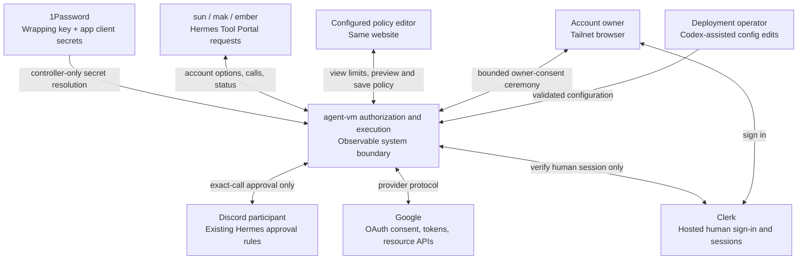
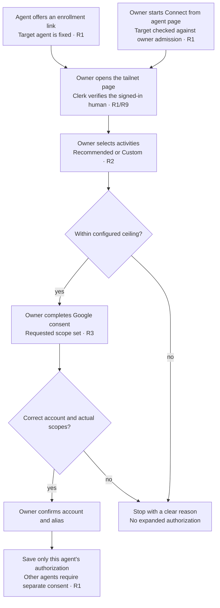
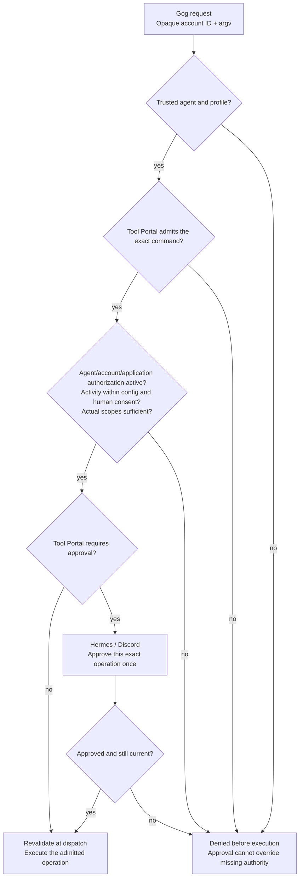
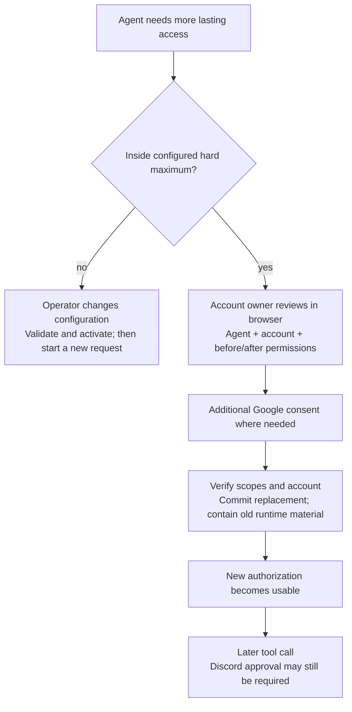
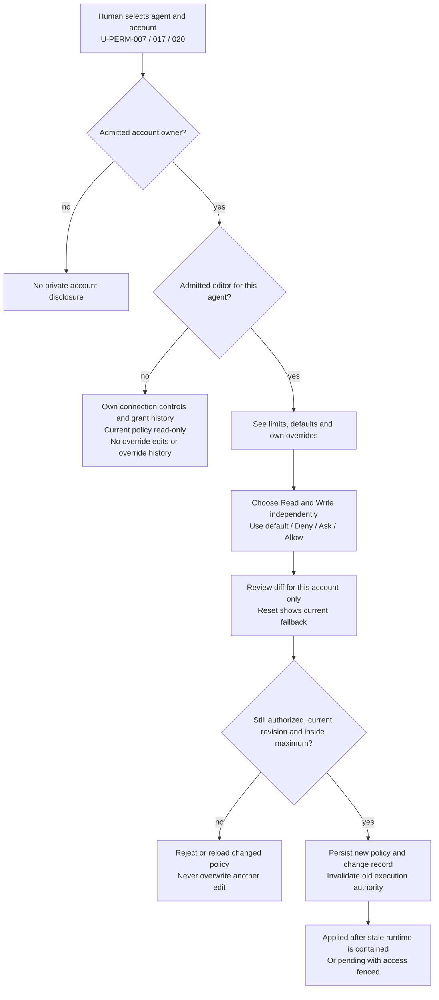

# Agent account authorization and Gog permissions

This specification derives observable behavior from [requirements.md](requirements.md).
The internal realization belongs in [program-design.md](program-design.md).

## System boundary and vocabulary



Outside initial scope: non-Google policy editing, permissions agent, editor or
hard-limit administration UI, public OAuth ingress, channel-dependent execution
permissions, and new Discord human-identity policy. The Google/Gog website editor
is in scope; it is not a general controller administration console.

A Google **project** groups consent branding, clients, and provider revocation
effects. An **OAuth client** identifies the registered integration. An **account**
is a person's provider identity. An **agent authorization** permits one agent to
use one account through one configured application with confirmed activities and
verified provider scopes. An **invocation approval** permits one exact operation
under existing Tool Portal/Hermes policy. These identities are not interchangeable.

The deployment remains the Hermes `apollofam` zone in `shravan-claw`, with sun,
mak, and ember. This design changes agent-vm's account/configuration contracts;
it does not authorize changing running deployments or Google Console state.
Other zones, frameworks, providers, and existing non-OAuth paths retain their
current behavior. An OAuth request outside the configured zone is denied.

## P1: Different agents need different access to the same account

**O1:** a person can authorize the same account for multiple agents without
granting one agent another's authority. Basis: U-PERM-001, 002, 003, 011.

### R1 / C1: Account and authorization identity

- Accounts MUST be dynamic, identified by zone + provider + verified stable
  provider subject. Email and alias are presentation, never identity authority.
- An account MUST record a human owner independently of agent authorizations.
  First enrollment requires both an admitted browser owner and Google account
  authentication. If that subject is already bound to another owner, reject the
  operation without changing its owner or exposing the existing account.
- Multiple agents MAY have separate authorizations for that account. There is at
  most one current authorization per agent + account + application. Each retains
  its own selections, actual scopes, credential, lifecycle, and revision.
- A new agent authorization MUST require that account owner's explicit consent.
  An existing authorization for sun does not satisfy ember's enrollment. Tokens
  MUST NOT be copied between authorizations or silently shared as a fallback.
  An initial enrollment requires its own refreshable provider credential; omission
  of a refresh token cannot be filled from another agent's authorization.
- Reauthorization MUST preserve the existing account subject, agent, owner, and
  application binding. An account change requires a new enrollment.
- If a new enrollment resolves to a subject already authorized for this agent and
  application, return `duplicate-authorization` and discard the candidate without
  provider revocation. Do not convert it silently into replacement. Offer that
  verified owner a bounded reauthorization entry that starts a new ceremony with
  the existing subject/generation and before/after review. A disconnected tombstone
  instead permits fresh enrollment at a new generation. A concurrent winner is
  checked again at commit, with no overwrite or credential borrowing.
- The browser human MUST be identified by verified Clerk instance and user ID.
  Tailscale peer admission gates network access only; it cannot select or replace
  the human owner. Configured owner admission maps Clerk identities to permitted
  agents, without Google account slots. Email changes do not transfer ownership.
  Root access is an operational reality, not a new application role.
- Agents may see only their own authorization options and enrolled account
  aliases/status. They cannot enumerate another agent's accounts or credentials.

### Owner enrollment journey

An admitted account owner may also start connect from the website's agent page;
the selected page fixes the target agent after owner admission. The same consent
and final-confirmation journey follows either entry. Editor membership alone is
not authority to connect an account as its owner.



Current pain: authored agent account slots and the earlier exclusive-owner design
cannot represent this relationship. See Requirements observed foundation.

## P2: Recommendations and accidental consent must not expand authority

**O2:** operator limits, human selections, and provider credentials agree; an
ordinary request or approval cannot increase the maximum. Basis: U-PERM-004,
006, 010, 011.

### R2 / C2: Configuration, defaults, and catalog

The deployment authors fixed OAuth clients/application groups, owner admission,
per-agent hard permission maxima, policy-editor admission, recommendation collection
assignments, live read/write defaults, and Tool Portal's supported executable surface. It MUST NOT predeclare
Google subjects, emails, account slots, tokens, or dynamic authorizations. Standing
Google/Gog account overrides are website-managed durable policy; config defaults
are the fallback, not another editable copy of those overrides. Other Tool Portal capabilities keep
their current config-authored policies and unchanged behavior.

The initial Google permission families are:

| Family | Service controls |
| --- | --- |
| Gmail, Calendar & Contacts | Gmail read/write, calendar events, contacts |
| Drive & documents | Drive file access, Docs, Sheets, Slides, Forms bodies/responses |
| YouTube | Supported channel/video/playlist/comment activities |

Each family uses one configured Web OAuth client shared across agents. The
client's application ID is stable deployment configuration; display names do
not enforce scopes. Applications record their Google project association and
publishing status so the UI can describe shared provider effects truthfully.
No separate project or client per agent is provisioned by this feature.

A reviewed, versioned Google catalog MUST own supported service/permission-group
IDs, exact scope sets, scope implications, recommendation contents, and a finite
Gog command/effect table. Raw Google scopes MUST NOT be caller- or deployment-authored policy.
Pinned provider/CLI discovery is development drift evidence, never runtime admission.

Per-agent ceilings MUST be explicit, either a named catalog ceiling preset or an
explicit set of supported permission groups. Missing agent/application ceilings
deny enrollment and policy activation. Per-account consent may narrow that maximum.
The website shows the maximum beside editable controls and explains unavailable
choices; forged form requests above it fail server-side. Offered groups intersect
the maximum with the configured, supported Gog executable surface, not with current
saved Deny/Ask/Allow choices. On an existing account authorization, consent scope
changes and override edits may occur in either order; neither alone supplies
execution authority. First enrollment establishes the account/authorization identity
before account-specific overrides can be edited.

Named recommendation collections MAY be shared across agents or assigned per agent.
They MUST have a version, label, short summary, rationale, exact Google selections
and independent read/write policy selections. Recommendations and
custom submissions outside the ceiling fail validation rather than being silently
clamped. Recommended values never change an existing OAuth authorization automatically.
Activating a new catalog version or assigning another collection requires an
explicit config update. Once activated, its policy defaults apply immediately to
accounts using Use default, without another owner confirmation. No explicit override
or account consent is rewritten. The initial collection is read-only-assistant,
with Requirements' service defaults: selected reads Allow, writes Deny. First
explicitly enabling writes suggests Ask, but that is not mandatory.
For each Read/Write class, resolve an explicit account Deny/Ask/Allow override,
otherwise the active config default. A missing configured default resolves to Deny.
First-ever enrollment of an agent/account/application tuple begins with both classes
using defaults. Re-enrollment of a disconnected tuple retains its explicit overrides
and shows their current effective values before owner confirmation; disconnect is
not Reset to default. The new grant generation does not restore old credentials.
A missing or
corrupt required policy record is unavailable, not permission to assume inheritance.

Deliver a validated illustrative OAuth/Tool Portal config pair and website
recommendation preview for the initial collection. It contains no live identities
or credentials, is not automatically imported, and proves both halves of U-PERM-006.
This one-level account/default fallback is not Tool Portal profile inheritance
or a runtime recommendation engine. Config defaults are per agent/application/service,
with a pinned collection or explicit read/write values. No dynamic accounts in config.

For the browser, each application supports Off / Recommended / Custom. Custom
starts from the displayed recommendation on first entry and retains subsequent
human edits. Agent suggestions are separate, visibly advisory data. Unsupported
suggestions are rejected; they never replace the recommendation.

An enrollment starts the requested family at Recommended and others Off. An
existing authorization instead starts from its current selections and shows a
before/after diff; Off is not an implicit disconnect. Agent-led upgrade pages
require explicit confirmation of the changed lasting access.

The initial catalog covers Google/Gog only. Its supported groups are Gmail read
and write; Calendar read and write; Contacts read and write; Drive/document read
and write with Google-supported file-access modes; Forms body read/write and
response read separately; YouTube read and write. Details follow Requirements'
inventory. A mode is shipped only when its Google scope mapping and pinned Gog
operations are qualified. No empty permission choice is advertised as usable.

### R3 / C3: Exact scopes and honest controls

The scope request MUST be the normalized union of the human-confirmed catalog
choices plus required identity scopes. Agents cannot supply clients, raw scopes,
redirects, token references, or an alternate target agent.

The broker MUST check actual scopes after code exchange and refresh. Unexpected
additional scopes fail closed; missing required scopes do not produce a usable
authorization. A provider response that omits scopes may retain prior evidence
only where the pinned provider contract defines omission as unchanged; it cannot
be interpreted as expansion or used to establish an unknown initial scope set.

Controls distinguish supported service read/write groups and named Google access
modes where scope sets are non-linear. Approval behavior is independent for read
and write, each taking Deny / Ask / Allow. This is not a five-element rank; in
particular read Ask with write Ask and read Allow with write Ask are distinct.
Every control states
the difference between intended activity permissions and the token's technical
authority. In particular:

- Gmail write includes supported drafting, organization and sending. V1 does not
  offer a draft-only grant. `gmail.modify` has broad read/compose/send authority;
  an approval requirement does not narrow that Google authority.
- Drive `drive.file` does not grant access to arbitrary pre-existing files. Its
  label must describe app-created or explicitly app-authorized files; the Gog
  integration must not imply it provides a file-picker workflow when it does not.
- Forms bodies and response access are separate controls.
- Calendar RSVP uses calendar authority, not Gmail authority.

Write groups may technically include read authority. Read Deny means the local
read operations are denied, not that Google issued a write-only token. Commands
requiring both read and write effects must satisfy both policies; Ask wins over
Allow and Deny wins over both. Do not automatically permit a denied helper read
to make a write workflow succeed. Unsupported combinations are explained and
rejected, never silently expanded. Permanent message/file/video deletion, resource
sharing/delegation and unclassified generic operations remain outside the executable
inventory even when the selected Google token technically permits them.

Separate narrowly scoped credentials for repeated enrollments of one Google
account/client are subject to V1 provider qualification. No UI, spec result, or
runtime status may claim that untested provider behavior is proven. A failed
qualification returns the design to the owner; a broader shared token is not an
authorized fallback.

## P3: Gog availability must not unlock the entire CLI

**O3:** only the authenticated agent's admitted operations reach its own account
credential. Basis: U-PERM-003, 005, 008, 010.

### R4 / C4: Per-call authorization

Every Gog request MUST carry an opaque account ID beside argv in the Tool Portal
input. Only the classified argv reaches Gog. The runtime identity, agent, owning
human, application, activity, and credential are resolved from trusted state.

An executable operation requires all of:



These are logical permission gates; the Program Design defines their internal
call ordering and the final stale-authority checks.

Denial takes precedence. Invocation approval MUST NOT override missing account
access, a ceiling, an unsupported command, or a missing scope. Revalidation at
dispatch MUST catch stale grants, client bindings, policy, and approvals.

The finite reviewed Gog command table MUST identify the service and read/write
effects of admitted exact paths, aliases, meaningful flags and argument shapes.
This is sufficient command validation, not a general-purpose classification DSL.
Unknown commands, broad parent
prefix admission, generic API escapes, alternative auth/account/client options,
or other unclassified behavior fail closed. Local help/version may be explicitly
admitted without credentials. Credentialed `auth`, `config`, `mcp`, root `batch`,
`update`, `schema`, `completion`, and generic `api` execution are not admitted.
Shell execution and unknown command surfaces also fail closed. This list names
pinned Gog surfaces; it does not claim a `plugin` command exists.

Tool Portal remains the sole call disposition authority, consuming the current
website-managed policy for Google/Gog. The OAuth catalog
describes scopes/effects and validates compatibility; it cannot silently grant
Tool Portal visibility or bypass an approval requirement. A config pair with
unmapped, ambiguous, incompatible, or excessive admitted paths fails validation.
For managed Google/Gog policy, the legacy blanket rule that every OAuth write must
require approval is removed. Ask or Allow comes from the resolved account override or active config default;
hard executable denial cannot be overridden by it. Existing non-Google namespace
and invocation-policy precedence remains unchanged.

### R5 / C5: Discord invocation approval remains separate

Hermes continues to present an exact operation in its originating supported
Discord/channel session. Existing framework actor-admission rules apply. The
controller verifies the configured presenter and exact managed caller/operation
authority; this design adds no Google-owner-to-Discord-user approval policy.

Approving once does not change scopes, ceilings, or future-call policy. An
OAuth action may itself require Tool Portal approval under config, but that
approval only admits the action; it never substitutes for owner browser consent.
Agent-facing OAuth lifecycle requests, including reauthorize and disconnect, have
an explicit configured Ask or direct disposition. There is no action-name rule
forcing Ask: these tools create owner-confirmed ceremonies, not immediate Google
revocation or policy edits. Their mandatory browser-owner confirmation cannot be
disabled by that call disposition. Website-owner initiation has no Discord approval
step; it still requires the same owner, browser and transaction checks.

Sharing ember delegates use of its admitted account permissions to the existing
managed interaction/approval surface. It does not create account-owner-only
read access or an account-owner-only invocation presenter.

The exact-call preview MUST identify the agent-local account alias and application
alongside bounded operation arguments. Resolve the alias from trusted authorization
state, never a caller-provided display string; opaque accountId remains the binding.
Do not expose Google subjects, tokens or another agent's accounts. An alias change
after preview makes that approval stale rather than changing its displayed target.

## P4: Lasting changes must be distinct from one-time approval

**O4:** changes affect the intended authorization, are understandable, and cannot
silently expand other agents. Basis: U-PERM-002, 007, 009, 010, 011.

### R6 / C6: Upgrade, local disconnect, and configuration changes

An agent may request an upgrade through its authenticated OAuth action, but the
owner must review the existing and requested lasting permissions in the browser.
The new selections must remain within current config. An above-ceiling request
returns `configuration-change-required`; no consent link can lift that ceiling.
Configuration changes are operator work, including Codex-assisted edits.



The agent-facing `oauth_authorization` namespace exposes `list`, `begin`, `status`,
`cancel`, `reauthorize`, and `disconnect`. `begin` takes a requested application
and optional typed catalog suggestion/alias. `reauthorize` and `disconnect` take
the authenticated agent's account ID and application ID. The caller cannot supply
an owner, another agent, or a credential. `status` and `cancel` take an opaque
ceremony ID. The former provider-effecting `revoke` operation is removed at the
hard cutover; it is not an alias for local disconnect. Tool Portal configuration
must reference the new registered actions explicitly.

The website's owner account controls may initiate connect, reauthorization or
disconnect without asking an agent to create a link first. The server derives the
target agent from the admitted page and checks ownership of existing account IDs.
Ceremonies retain whether their initiator was the trusted agent or the verified
website owner. Agent `status` and `cancel` apply only to that agent's agent-initiated
ceremonies, never an owner's website-initiated ceremony. The owner can view/cancel
their own bounded ceremony in the website regardless of its entry path.

`list` returns the authenticated agent's account ID/alias, application ID/label,
confirmed activities, actual scope descriptions, connected/replacing/disconnecting/
disconnected state, active/degraded/reauthorization-required health, and whether
each configured activity is ready, consent-required, or denied by current policy.
Unverified/corrupt metadata produces unavailable status, not a permission grant.
`describe` reports admitted command/argument shapes and current read/write
disposition and policy revision; invocation-dependent results say so explicitly. Discovery is advisory:
the exact input and current authorization are rechecked for every call. No token,
Clerk session, provider subject of another owner, or hidden activity is exposed.

Replacing an authorization MUST affect only the selected agent/account/application
and use a separately issued credential satisfying R3. Cancellation, refusal,
provider failure, or stale confirmation preserves the previous valid grant unless
current policy already makes it unusable. No Google revoke is called as cleanup
for a failed or abandoned exchange because it could affect other authorizations.
If replacement has committed but the previous runtime is not yet contained, return
replacement-pending or containment-failed. The new credential remains unavailable
until containment is established; do not claim an active grant or restore the
old credential implicitly.

Local disconnect MUST be a separate action from provider revocation. It denies
new use of the selected authorization, removes its retained credential, and
contains any runtime carrying its material before reporting completion. It does
not call Google and does not undo resource effects already dispatched. Unknown
containment returns a pending/failure status rather than success. Other agents'
authorizations remain usable. A later enrollment is a new authorization generation;
an old callback cannot restore disconnected access.

The initial local disconnect uses the existing short-lived browser-ceremony
pattern to confirm the owner and exact authorization, linked from the unified
website. It does not change standing policy. Agents cannot disconnect another agent's authorization. Broad
provider disconnection is done in Google's own account controls outside this
feature. The owner is warned that Google revocation can invalidate that account's
tokens for every client in the same project; other people's accounts are not
thereby revoked.

Installation/editor-admission/hard-limit/default configuration still activates through
validated stop/update/start. A file edit alone changes no active authority.
Website policy changes use R10's live revisioned activation. In either case,
incompatible authorizations become unavailable and old execution authority cannot
survive the relevant generation/revision change. Reducing local policy never
claims to reduce already issued Google token scopes.
If confirmed activities exceed the newly configured OAuth ceiling, the whole
authorization is unavailable pending bounded reauthorization. Do not retain a
broader credential while presenting that authorization as newly scope-restricted.
Tool Portal saved read/write restrictions may independently deny operations without
claiming a provider-scope change.

Removing an agent/owner or ceiling from active configuration disables use; it is
not credential erasure. Encrypted disabled rows remain retained until an explicit
owner disconnect or separately authorized offline retirement. There is no automatic
purge, deletion timer, or new admin API in this delivery. Operators should disconnect
accounts before decommissioning the identities that can initiate those ceremonies.
Restoring configuration cannot override a disconnected generation tombstone.

## P5: Credentials and browser authority must remain protected

**O5:** credentials remain controller-owned and browser consent cannot be forged,
replayed, or redirected to the wrong agent. Basis: U-PERM-010, 011, 012 and the
repository's existing credential/runtime security boundaries.

### R7 / C7: Storage and runtime exposure

Persisted access/refresh tokens and sensitive account credential payloads MUST be
envelope-encrypted in controller-only SQLite. The wrapping key and application
client secrets remain in 1Password, outside SQLite and all VM mounts. Neither
agent-facing results nor logs contain plaintext or encrypted credential material.

Encrypted data MUST be bound to its zone, owner, agent, account, application/client,
and credential identity. Swapping rows, editing confirmed authority metadata,
using the wrong key, or supplying malformed ciphertext fails closed. Non-secret
query/display metadata may remain ordinary SQLite fields, but it cannot enlarge
authority without verification against authenticated credential data.

Gog executes in the existing per-agent singleton credentialed Managed runtime.
It receives only an opaque token placeholder; host mediation supplies the real
access token only on allowed Google hosts. The Gateway, ordinary leased Tool VM,
and Gog do not receive refresh tokens or client secrets. Access tokens never
enter ordinary VM files or argv. This host-level mediation is not an HTTP
method/path activity firewall; activity enforcement and provider scopes remain
separate controls.

Envelope encryption does not claim protection against root access to a running
controller with access to the wrapping key. No key-rotation UI, database rollback
detection, new backup system, or whole-database encryption is introduced.

### R8 / C8: Browser and lifecycle safety

Retain direct tailnet HTTPS and verified socket-peer Tailscale admission. Clerk
provides human login as specified in R9; no public ingress, proxy identity headers,
or admin override role is introduced. Each ceremony binds owner,
agent, account when known, application/client, selection, config/catalog revision,
state, PKCE, redirect, expiry, browser binding, and CSRF/Origin checks.

Callbacks and final confirmations are single-consumption. Restart invalidates
pending ceremonies. Multi-application consent reports individual committed and
uncompleted results; it does not roll back successful apps by provider revocation.
Every application in a multi-app account enrollment must return the same subject.

After Clerk sign-in, Hono server-rendered native forms remain authoritative with
JavaScript disabled on the consent pages for the bounded ceremony lifetime.
Clerk's hosted sign-in pages may require JavaScript; no promise of a JavaScript-free
Clerk login is made. Embedding Clerk scripts in consent pages is not required.
Use semantic labels, visible focus, non-color-only feedback, explicit scope
overreach, self-hosted compiled assets, and the existing restrictive CSP. Owner
identity and secret scope details must not leak through a shared Discord link.

Refresh remains just-in-time, single-flight per credential, with atomic replacement
token retention and explicit active/degraded/reauthorization-required outcomes.
Never borrow another agent's credential to recover a failed refresh. Google
External/Testing expiry and project-level production verification expectations
must be disclosed; no weekly refresh-token durability promise is made.

Legacy account-slot configuration is a hard-cut input error. Existing encrypted
legacy catalogs must not be silently reassigned to inferred human owners or
agents. Preserve them and require explicit offline cutover plus fresh owner
enrollment. Neither startup nor this design deletes a live deployment catalog.

## P6: Browser identity must be independent of network membership

**O6:** an admitted device can reach only the website, and the signed-in person
can authorize only their own accounts. Future ingress changes do not change
account ownership. Basis: U-PERM-013, 014, 015.

### R9 / C9: Clerk login and restricted network access

Use an invite-only Clerk production instance with Sign in with Google as its sole
human sign-in method. Do not offer app passwords, email/SMS codes, magic-link login,
or other social login providers. Google may apply its own authentication and MFA;
"passwordless" here means no separate password managed by our app or Clerk.
The Clerk Google connection requests only basic identity scopes, not Gmail,
Calendar, Drive, YouTube, or other Google resource scopes. Its login-only external
account and tokens are never selected as agent credentials. Connecting any Google
resource account, including the account used for login, requires the separate
controller-owned consent flow and agent authorization. The application
MUST verify browser session tokens from that configured issuer and authorized
origin, accepting human session tokens only. Clerk machine/API/OAuth-server tokens
are not human consent authority. Impersonated sessions do not authorize account
enrollment or upgrades. Application admission is still configuration-controlled;
an invitation or successful Clerk sign-in does not grant access to any Google
account or agent automatically.

The browser enters through a fixed local login-return route with no account,
agent, scope, provider code, or ceremony secret in the external return URL. A
short-lived server-owned continuation carries the intended ceremony. Clerk
handshake redirects apply only to safe login/bootstrap GET requests. A Google
callback or state-changing form MUST NOT be redirected to Clerk with its URL,
query, body, or code. Arbitrary `returnTo`, Host, Forwarded, or identity headers
cannot redirect authorization or establish identity.

After verified login, the existing bounded opaque ceremony binds the Clerk issuer,
user ID, and session ID alongside the initiating agent and browser-binding secret.
Every sensitive form transition, Google callback exchange, and final authorization
commit checks the bound Clerk session is active, unexpired, and owned by that same
user. Sign-out, revocation, user/session mismatch, or unavailable verification fails
closed. No sensitive POST is automatically replayed after login. Clerk does not
refresh or hold the Google credentials used by Gog.

The consent or policy-edit ceremony stays pinned to its initiating Clerk user/session.
Switching the website's signed-in person cancels unfinished changes and requires a
fresh ceremony. An old tab cannot complete them under the new person's login.
The supported Clerk deployment uses single-session handling per browser client;
qualify that replacement/logout ends the bound session. A verified conflicting
cookie is an additional rejection check, not the sole switch detector. A different
browser profile/device has independent sessions. Selecting a Google resource
account during consent is not switching the Clerk login: an owner may connect
more than one of their own Google accounts. Display the acting human throughout.

The network admission policy MUST permit family users only the website destination
and port needed here, without granting controller admin, SSH, other hosts, or
subnet-route access. Existing overlapping broad grants must be accounted for:
adding a narrow allow rule does not negate them. This contract concerns Tailscale
traffic; direct LAN exposure also needs inspection before claiming infrastructure
isolation. The feature does not edit the tailnet's ACLs itself.

Preserve the same Clerk production issuer/user identities and controller data if a
future change replaces the tailnet-only ingress. No public-listener toggle, public
proxy, alternate identity mode, or dormant bypass is shipped now. That future work
must separately qualify narrow route exposure, rate/request limits, forwarded
headers, cookie/CSRF handling, and continued administration isolation.

Clerk failure blocks new human ceremonies or sensitive transitions requiring a
session check. Existing agent calls and Google refresh use their existing machine
authority and do not call Clerk. The application does not claim protection from a
compromised browser with valid access or from a privileged live controller host.

## P7: Routine policy changes need one understandable management surface

**O7:** authorized editors can change an agent's standing Google/Gog policy in
one website for their own accounts, with visible limits and explicit config
inheritance. Basis: U-PERM-007, 010, 017, 018, 019, 020.

### R10 / C10: Website-managed policy

Configuration maps verified Clerk issuer/user identities to editable agent IDs.
Editing requires BOTH this agent-editor admission AND ownership of the selected
account, using verified Clerk identity. Discord invocation approval remains separate.
Only the website can commit account overrides. The operator may separately change
config defaults. Agents and Discord may produce a
bounded request/link, but no policy-write tool, chat command, or caller-supplied
actor identity is introduced. A policy editor cannot appoint editors, change hard
limits, or provide Google consent for another person through this interface.

Policy is resolved per zone/agent/account/application/service, not per Discord
channel or individual call. Each Read/Write class independently has an explicit
Deny/Ask/Allow override or Use default. Deny is not an absent value. Reset to default
clears only that class's override after showing the current fallback and consequence.
An edit affects only the selected agent/account/application, not other accounts or
the same account's other agent authorizations. A service without a supported write
group exposes it as unavailable. Each account still needs compatible owner consent.
An agent editor who does not own the selected account cannot read or edit its
private override or history, even if they can edit their own accounts on that agent.

An admitted account owner who is not an editor for this agent may view their own
connection controls, grant status/history, effective policy, current defaults and
stored override values/source badges read-only. They cannot preview/save/reset
overrides or read override-change history, which requires editor admission as well.
Removing editor admission must not prevent the owner from disconnecting their account.

Application here is the stable configured family binding, not a resolved Google
client ID. Each service belongs to exactly one catalog family in V1. Replacing a
Google client requires fresh account authorization but does not silently reset or
transfer the saved service policy. Moving a service between families is not an
ordinary website edit or an automatic policy migration.

The website shows: acting owner/editor, target agent, selected account alias,
service, hard maximum, effective read/write policy, stored override or Use default,
current config default and its version/source, and proposed before/after diff.
Inherited values carry "Using default" and warn that operator default changes take
effect automatically. Explicit choices carry "Your override." Changing a default
cannot alter an explicit override; changing a hard maximum can still restrict it.
It distinguishes policy-denied, consent-required, ready, and unavailable. A denied
group can have retained Google consent; a permitted group may still lack consent.
Setting both classes Deny stops local use but does not disconnect the account,
erase its credentials, or revoke Google consent. Offer owner disconnect separately.

After a configuration reduction, a saved Ask/Allow outside the current maximum is
effective Deny. Show both the retained saved value and "Blocked by current limit."
The next preview explicitly proposes Deny for that cell and shows the change; only
the editor's confirmation persists it. A forged or stale save still containing an
above-maximum Ask/Allow is rejected. Neither activation nor rendering silently
rewrites the saved policy or Google grant.



Every save requires verified active browser identity, current account ownership
and editor admission,
CSRF/Origin protection, expected policy/config revision, exact desired values and
explicit confirmation. A stale edit returns conflict and current values; it does
not merge choices or overwrite a concurrent edit. Repeating the same consumed save
cannot create another policy change. Out-of-maximum input is rejected, not clamped.

A saved override revision invalidates earlier direct-call authority and exact
approvals for the selected agent/account/application. Activated config changes
invalidate old configuration-generation authority, including inherited decisions.
Final dispatch resolves current override and default before checking policy.
New calls for the affected authorization stay fenced while its stale runtime material is contained;
unknown containment is pending/failure, never Applied. Already dispatched remote
effects cannot be undone. A failed write before commit preserves the previous policy;
a failure after commit never resurrects it. Other accounts' policies and other
agents remain unchanged; sharing one agent runtime may cause ordinary slot contention,
not cross-account policy changes or retirement of unrelated material.
If runtime containment cannot establish safety, the existing agent-slot quarantine
may make all accounts on that agent temporarily unavailable until recovery. This
does not modify their overrides or grants; it must be reported as runtime-unavailable,
not a permission change. Other agents' slots remain independent.
Policy saves do not refresh Google tokens or contact Google. Clerk outage blocks
policy editing, not previously authorized machine calls.

### R11 / C11: Permission-change history

Retain a durable record of successful account-override edits/resets and account authorization
grant/replace/disconnect transitions, including time, verified actor identity,
target agent, opaque account/authorization ID where applicable, old/new permission
or policy revision, and result. Record the change atomically with its durable state.
If recording fails, that state change must not commit. Runtime containment outcomes
are subsequent correlated records; a committed-but-pending transition is not success.

Record active default-configuration revision changes too, with old/new defaults
and operator-config origin. Do not invent a Clerk actor for file edits or write
one synthetic owner-edit event per inheriting account. The account view combines
its own override history with relevant default activations to explain effective policy.
Failure to durably record a new defaults revision prevents its activation.

Show override history only to its account owner while admitted as that agent's
editor; show an account owner their own authorization history. Do not disclose other owners' subjects,
emails, tokens, codes, message bodies, file content or arbitrary argv in this log.
Records are retained until explicit offline operator retirement; no automatic purge
or log-management UI is included. Retain existing exact-call approval records and
bounded operational telemetry. This is not a claim of complete, immutable or
lossless every-call auditing, nor resistance to root or database rollback.

## P8: A successful file operation must deliver usable data

**O8:** an admitted file operation produces complete, byte-exact data that the
requesting agent can use in subsequent tools and deliberately share in chat.
Basis: U-PERM-021, bounded by U-PERM-008, 010 and 012.

The current configured-CLI output projector decodes stdout as UTF-8, while the
Hermes Portal tool returns JSON rather than writing a workspace file. A path in
the separate credentialed runtime is not an accessible working file. See
[output projection](../../../packages/agent-vm/src/controller/runner/configured-cli-output.ts)
and [Hermes call handling](../../../python/agent-vm-hermes-adapter/src/agent_vm_hermes_adapter/managed_tool_portal_capability_tools.py).

### R12 / C12: Byte-safe results, working files and attachments

An admitted operation MUST have an explicit result contract distinguishing text,
structured data and file content. Content must not be guessed from whether bytes
happen to decode as text. The underlying execution boundary MUST preserve each
stdout/stderr stream's bytes and order before its declared presentation policy;
no exact temporal order between independent streams is promised. Text/JSON results
retain their existing bounded presentation and safe diagnostic behavior. Preserving
raw bytes internally does not authorize exposing raw stderr or credentials as artifacts.

A successful file result MUST preserve every byte, including zero bytes and
non-UTF-8 sequences. It MUST report an integrity identity and byte length and make
the complete file available in the requesting agent's ordinary working files.
The returned workspace path must be usable by the agent's subsequent file/terminal
tools. A credentialed-runtime path, an inaccessible artifact reference, model-visible
base64, or a truncated preview alone does not satisfy this obligation. Empty files
are valid complete results. Multiple declared outputs retain their separate identities;
stdout and stderr must not be concatenated into one file.
Each declared file has its own completion and publication outcome. A file that
has satisfied its declared completion and integrity checks remains publishable
and redeliverable if a sibling output fails; the failed sibling receives no
complete path. Report partial delivery for the aggregate, not all-or-nothing
success or implicit deletion of completed siblings. Process termination or EOF
alone does not prove that an interrupted file is complete.

File-byte availability and producer success are separate claims. A known nonzero
Gog exit MUST NOT by itself hide otherwise eligible regular files. Such files may
be published for inspection with that exit status even when their contents are
an incomplete export. Successful file publication means the checked stored bytes
are available intact; it MUST NOT be labeled as successful export or semantic
completeness on that basis alone. Unknown producer termination and failed file
integrity/publication checks still prevent claiming successful delivery.

File transfer MUST be bounded in total bytes, in-flight buffering, duration and
retained storage. Limits and unsupported input/output shapes must be discoverable
before dispatch where determinable. A complete-file result cannot silently use the
text-preview truncation policy. On size violation, truncation, malformed encoding,
integrity mismatch, cancellation, expiry or incomplete transfer, no partial file
may be published as complete. Existing unrelated working files must remain unchanged.
Provider filenames and caller destinations cannot escape the authorized workspace,
select host paths, overwrite unrelated files implicitly, or cross agent/account
authority. Filenames and content are untrusted data, not executable instructions.

Payload handling MUST stream with end-to-end backpressure. Controller and Gateway
application memory used for a transfer MUST remain bounded by its fixed chunk,
window and concurrency budgets, independently of total payload size. Collecting
all chunks, allocating a payload-sized array, or concatenating the complete output
before storage, integrity verification, redelivery or attachment is prohibited.
Hashing and byte counting operate incrementally. A stream-shaped API alone does
not satisfy this contract: when its destination slows or stops consuming, upstream
production must stop within the declared in-flight bound rather than accumulate
the remainder in hidden queues. Complete-file availability still requires all
completion and integrity checks; streaming never publishes an incomplete file as
complete. Existing bounded human-readable previews and diagnostics are not bulk
payload storage and cannot grow with the size of the transferred file.
Dedicated controller-owned temporary disk staging is permitted for file handoff.
It MUST NOT expose unrelated host files or credentials, become normal backup
state, or accumulate whole payloads in controller/Gateway application memory.
The requesting Tool VM receives read-only access to published staging files; a
normal readable mounted path satisfies working-file availability without a second
copy into its rootfs. Editing or durable retention requires an explicit agent copy.

Published staging files MUST expire one hour after publication or when their
receiving Tool VM finishes, whichever occurs first. Gog VM retirement alone MUST
NOT expire published files for a still-current receiving Tool VM. Reads do not
extend expiry. Each published result MUST include its usable Tool VM path and
absolute `expiresAt` time. Agent runtime instructions MUST state the one-hour/VM
lifetime, read-only access, and the need to copy wanted files into durable workspace
before expiry. This is temporary storage, not a one-hour availability guarantee
across controller failures or receiving-VM loss.

At expiry or receiving-VM retirement, new controller delivery MUST stop and the
owned published paths MUST be removed using ordinary filesystem deletion.
Controller-managed staging copies MUST settle or be cancelled before their
temporary targets are removed. Already open guest descriptors or cached bytes
may remain usable until closed or the VM ends; expiry is not forced descriptor
revocation or an immediate physical-block reclamation guarantee. Failed
cleanup MUST remain accounted for and be retried rather than reported as deleted.
Recovery MUST remove owned orphan staging only after the relevant old writers
are known stopped. Copies already made into other authorized locations are not
deleted by staging cleanup. Deletion is not a secure-erasure guarantee.

V1 authorizes the requesting agent to list and read regular files under its
operation's dedicated working folder. The controller selects a fresh folder and
binds it to the existing trusted agent/account/operation and execution-VM identity.
The caller supplies only a folder-relative path within that bound operation, never
an execution-VM root, host path, different VM identity or replacement principal.
Output files do not require individual predeclaration or per-file permission rows.
This does not admit new Gog commands or remove exact invocation approval.
Traversal, symlinks, special files, expired/unavailable operation folders and
another agent's folder are rejected without exposing private path information.
Listings are bounded and report their limit rather than collecting arbitrary
directory trees. Listing/reading does not grant edit, delete or arbitrary shell
execution. Credential, configuration and other rootfs paths remain outside this
agent-facing transfer surface.

When an admitted Gog operation consumes a file, the selected input bytes MUST be
the bytes used at dispatch. Exact approval binds the input's content identity as
well as its account and operation; changing the file after approval cannot silently
change the approved action. File access does not grant the credentialed runtime
general access to the agent workspace or give the agent access to runtime secrets.
Unsupported file-only command shapes remain unavailable until their complete input
and output journey is implemented and qualified.

Chat attachment delivery MUST be a deliberate action under the existing authorized
chat/channel rules, not an automatic side effect of downloading a file. The actual
attachment bytes must match the selected file. A Tool VM path alone cannot be
reported as a delivered chat attachment. Local-development qualification uses a
recording sender; real chat delivery remains a separately authorized live proof.
The per-send temporary attachment copy MUST be cleaned after sender settlement
on success or failure. Failure before dispatch also cleans owned temporary data.
An unconfirmed delivery result MUST NOT trigger resend; if the sender has settled,
its temporary file may be cleaned. If the sender may still be reading, retain the
copy until settlement or proven Gateway containment. Failed cleanup is reported
and retried; normal cache contents and unrelated files are not cleanup targets.

Results MUST distinguish remote operation completion, working-file availability
and chat delivery. A completed Google mutation followed by failed result storage
or delivery remains a completed mutation with a delivery failure; it must not be
automatically rerun to recover the file. Unknown remote outcomes retain existing
ambiguous/no-automatic-retry semantics. A retained complete authorized result may
be redelivered without re-executing Gog. Retry is unavailable after expiry or loss
of the applicable file/receiver authority and must say so; it is not permission to
borrow another agent's result. Google disconnect after publication is not loss
of delivered-file authority, as defined below.

Publication into the requesting Tool VM's read-only staging view is delivery.
Publication MUST revalidate current agent/account authorization and the exact
receiving Tool VM binding. Disconnect or policy change before publication MUST
prevent publication. After publication, Google disconnect or policy changes MUST
NOT recall the delivered files or require OAuth reauthorization for ordinary
filesystem reads. Their read-only, per-agent isolation and expiry constraints
continue to apply. Unpublished references cannot bypass current authorization.
Already delivered staging, working-file and chat copies are outside OAuth
revocation's recall guarantees. This adds no public download endpoint, general-purpose file
server, broader workspace mount, or new cross-channel permission system.

### Agent and recipient file journey

```text
R12 observable boundary (internal structure omitted):
  Agent -- admitted file input/request --> [agent-vm]
  Google <-- authorized resource operation --> [agent-vm]
  [agent-vm] -- complete file + status --> Agent's working files
  Agent -- explicit permitted sharing request --> [agent-vm]
  [agent-vm] -- native attachment + status --> Selected chat recipient
  No public download service; no authority to access another agent's files.

U-PERM-021: requesting agent
  Request admitted download
    -> receive a complete file in ordinary working files
    -> use it with subsequent tools
    -> deliberately request an attachment for an allowed recipient

U-PERM-021: person receiving the requested file
  Request the document through the agent
    -> receive a native attachment, not a VM-only filename
    -> open the same bytes the operation produced

Current pain: text projection can corrupt bytes; a result path/reference
does not itself deliver a working file or native attachment.
Required difference: separate, truthful completion at each visible step.
Failure: retain the remote outcome; never retry a mutation to mask delivery loss.
```

## Observable failure vocabulary

| Condition | Outcome and permitted next step |
| --- | --- |
| Agent/account/owner mismatch or hidden authorization | Non-secret denied/not-found; no credential resolution |
| Requested activity above config | Configuration-change-required; no effective upgrade |
| Missing authorization or scope | Authorization-required with a bounded owner-consent action |
| Extra/unknown scopes | Scope-mismatch; candidate discarded, prior valid authorization preserved |
| New enrollment resolves to an existing agent/account/application authorization | Duplicate-authorization; no replacement, owner may start a separately bound reauthorization |
| Expired, duplicate, cancelled, or stale ceremony | Typed ceremony failure; no second provider exchange/commit |
| Transient provider failure | Degraded with bounded retry guidance; no token substitution |
| Revoked/expired refresh authority | Reauthorization-required; original account/agent binding preserved |
| Local disconnect not contained | Disconnecting or containment-failed; no new calls admitted |
| Provider revoke outside system | Affected calls become reauthorization-required as discovered; do not misreport successful refresh |
| Config/catalog/client mismatch | Validation/startup failure or authorization unavailable; never widen automatically |
| Legacy catalog | Explicit cutover-required; preserve original bytes |
| Invalid/missing Clerk login before ceremony binding | Safe hosted sign-in via fixed return route; no account details exposed |
| Bound Clerk session inactive, expired, impersonated, unverifiable, or conflicting with verified current browser identity | Stop the sensitive transition; no Google exchange/commit, no automatic POST replay |
| Policy editor lacks agent admission or attempts a chat/machine write | Denied; no standing policy change |
| Concurrent policy save or expired edit form | Conflict/restart-required; no overwrite or implicit merge |
| Policy saved but runtime containment unknown | Pending/failure; affected agent's managed calls fenced |
| Policy/history atomic write fails | No state change; prior valid policy retained |
| File exceeds its limit, is partial, corrupt or cancelled | File delivery failed; no complete path or attachment published |
| Remote operation completed but file storage/delivery failed | Preserve remote completion; retry authorized retained-result delivery only, never rerun the mutation automatically |
| Result expired or authority changed before retrieval | Artifact unavailable; no stale-reference bypass or cross-agent fallback |
| One declared output completes while another fails | Partial delivery; retain the independently validated complete output, with no complete path for its failed sibling and no automatic command rerun |

## Requirement and proof coverage

| User need | Problem/outcome | Contract | Required evidence |
| --- | --- | --- | --- |
| U-PERM-001 | P1/O1 | R1/C1 | V2 owner identity, subject, and cross-owner denial |
| U-PERM-002 | P1/O1, P4/O4 | R1/C1, R6/C6 | V1 two agents/same account; V5 isolated disconnect |
| U-PERM-003 | P1/O1, P3/O3 | R1/C1, R4/C4 | V1 distinct scopes; V4 account/activity denial |
| U-PERM-004 | P2/O2 | R2/C2, R3/C3 | V3 every control and scope consequence |
| U-PERM-005 | P3/O3 | R4/C4, R5/C5 | V4 real exact-call approval and denied calls |
| U-PERM-006 | P2/O2 | R2/C2 | V3 preset expansion, configured limits, no automatic upgrade |
| U-PERM-007 | P7/O7 | R10/C10 | V8 real website edit, wrong editor rejection, current policy at dispatch |
| U-PERM-008 | P3/O3 | R4/C4 | V4 pinned Gog effect/alias/argument coverage and escape denial |
| U-PERM-009 | P4/O4 | R6/C6 | V5 two-agent disconnect, in-flight containment, no Google revoke |
| U-PERM-010 | P2/O2, P5/O5 | R2/C2, R3/C3, R7/C7, R8/C8 | V2 tampered forms, V3 ceilings, V4 stale authority, V6 envelope binding |
| U-PERM-011 | P1/O1, P4/O4 | R1/C1, R5/C5, R6/C6 | V2 wrong human rejected; V4 Discord does not change grants |
| U-PERM-012 | P5/O5 | R7/C7 | V6 SQLite ciphertext, no token leakage, wrong-key and swap rejection |
| U-PERM-013 | P6/O6 | R1/C1, R9/C9 | V7 login/session misuse and identity persistence, V2 owner denial |
| U-PERM-014 | P6/O6 | R9/C9 | V7 permitted website and denied infrastructure access |
| U-PERM-015 | P6/O6 | R9/C9 | V7 identity independent of peer network; no public ingress shipped |
| U-PERM-016 | P3/O3 | R2/C2, R3/C3, R4/C4, R5/C5 | V3 explicit sending configuration; V4 no accidental send admission |
| U-PERM-017 | P7/O7 | R9/C9, R10/C10 | V8 account ownership AND agent-editor admission, no cross-owner edit or channel write |
| U-PERM-018 | P7/O7 | R11/C11 | V8 atomic history/state, privacy and scoped history views |
| U-PERM-019 | P2/O2, P7/O7 | R2/C2, R10/C10 | V3/V8 live fallback, activation affects inheritance only, OAuth consent unchanged |
| U-PERM-020 | P7/O7 | R10/C10, R11/C11 | V8 distinct account overrides, reset/inherit semantics and scoped history |
| U-PERM-021 | P8/O8 | R12/C12 | V9 byte identity, working-file usability, explicit attachment delivery and failure isolation |

- **V1 — true external provider qualification:** same account/client, two distinct
  agent enrollments with different scopes, both enrollment orders, actual scope
  observation before and after refresh/re-enrollment, no token substitution, and
  documented project-wide provider revocation. Use only authorized test accounts.
  A real Google result is necessary; fake responses cannot qualify the topology.
- **V2 — browser/identity:** real controller routes with actor mismatches, CSRF,
  origin, state, PKCE, replay, account-subject changes, and partial app completion.
  Cover sequential and concurrent duplicate-subject enrollment, no accidental
  replacement, and fresh enrollment after a disconnected generation.
  Real authorized-tailnet positive and off-tailnet negative reachability are
  required for the running deployment's access claim.
- **V3 — configuration/UI:** automated exact preset/ceiling/scope mapping plus
  phone-size visual and keyboard/no-JavaScript evidence for read/write independence,
  supported Google mode controls and disabled hard-limit choices,
  upgrade diff, scope overreach, and local-disconnect consequences.
- **V4 — command execution:** deterministic policy tests plus real Hermes/Tool
  Portal/controller/Gog runtime proof of an admitted read, an approval-required
  supported mutation, a denied activity, forbidden alias/flag/API escape, wrong
  account/agent, and stale exact approval. No live mail is sent without separate
  test authorization.
- **V5 — state/concurrency:** real SQLite and runtime-boundary evidence for
  duplicate enrollment, concurrent refresh/replace/disconnect, crash/restart,
  active-command containment, and policy activation. Other agent access survives.
- **V6 — secret boundary:** real encryption/SQLite tamper and swap tests, inspection
  of VM environment/files/results for placeholders only, and no key/client secret
  in SQLite, logs, URLs, or portable results. Root compromise remains excluded.
- **V7 — real Clerk/browser boundary:** qualify invite-only hosted login returning
  to the owned-domain tailnet HTTPS origin and configured port; verify expired
  browser token after Google consent still has a valid bounded ceremony only when
  its Clerk session is active. Cover sign-out, revoked/pending sessions, wrong
  issuer/user, account switching, impersonation, Clerk outage, hostile redirects,
  and no Google code/body in Clerk requests. Prove no-JavaScript consent forms
  after sign-in. Machine calls continue without Clerk session dependence. A live
  production-shaped test instance and restricted network path are required before
  claiming this works on the deployment; mocked sessions are not live proof.
  Verify that hosted sign-in offers only Google, its consent requests only identity
  scopes, and signing in cannot create an agent resource grant. The broker must not
  retrieve its Google tokens through Clerk's social-provider token API.
  With single-session handling, signing in as another person in the same browser
  must invalidate the old ceremony even after its short JWT expires. If the real
  Clerk session behavior fails that condition, do not deploy this binding strategy.
  Observe the verified `azp` claim on the session token delivered by hosted login
  and each required handshake at the fixed return route. It must equal the configured
  website origin; absent or different values fail qualification, not broaden the
  accepted-party list. Record claim metadata only, never the raw session token.
- **V8 — policy management and history:** real Hono/SQLite/controller boundaries
  for editor admission, website-only writes, independent read/write policies,
  stale/duplicate saves, audit-write failure rollback, and hidden account details.
  Runtime proof covers a saved Ask replacing Allow while an old call/approval is
  pending, containment failure/restart recovery, and another agent remaining usable.
  A policy save cannot make a missing grant executable. Render and keyboard-test
  the unified page, default/override sources, hard limits, account-specific effect and history.
  Cover owner-initiated connect/upgrade/disconnect without an agent link, denial of
  agent status/cancel for those ceremonies, and explicit repair of retained saved
  choices after a maximum reduction. Routine refresh with unchanged consent metadata
  must not invalidate an otherwise current exact approval.
  Cover no-override fallback, independent Read/Write inheritance, explicit Deny,
  Reset to default, missing-default Deny, corrupt-policy unavailability, cross-owner
  editor rejection, and different policies for two accounts on ember. Activate a
  default change Ask -> Allow: inheriting accounts change without reconfirmation,
  explicit overrides and scopes do not change, old approvals become stale, and the
  defaults-activation history explains the new behavior. Record failure blocks activation.
  Re-enroll a disconnected tuple and prove its overrides persist while its credential
  generation changes; only explicit Reset resumes inheritance. Cover owner-not-editor
  read-only policy/connection access and rejection of override writes/history access.
  Verify runtime quarantine does not mutate another account's policy or credentials.

- **V9 — complete data journey:** automated byte identity checks for empty files,
  all byte values, invalid UTF-8, split multibyte text, concurrent stdout/stderr,
  exact limits and overflow; state/transport observations for cancellation,
  partial results, storage failure and bounded buffering. Real controller/Portal/
  workspace boundaries must deliver a file readable by the requesting agent's next
  tool, with no path escape, implicit overwrite or cross-agent artifact access.
  Cover file changes after approval, expiry/policy invalidation and repeated delivery
  without duplicate remote mutations. Real pinned Gondolin execution must prove
  byte-exact guest output and binary input through the neutral wrapper; an SDK-only
  simulation is insufficient. A local recording attachment sender must consume the
  same bytes through the actual adapter path. Distinguish this from live authorized
  chat delivery, which additionally proves the recipient can open the attachment.
  For a declared two-file result, complete one file and fail the other by overflow,
  cancellation or storage failure. Observe byte-exact usable output for the completed
  sibling, no complete path for the failed sibling, aggregate partial-delivery status
  and zero repeated remote executions. Interrupted EOF alone must not publish a file.
  For success, redelivery and attachment paths, observe bounded resident payload
  memory with payloads much larger than the in-flight window and with a stalled
  destination. Verify production cannot read arbitrarily ahead of consumption and
  that cancellation settles retained work without accumulating remaining bytes.
  Qualification uses stock Gondolin and the selected file-input/output-stream
  workflow, not a patched helper or bulk process-stdin duplex. A separate diagnostic
  of unsupported duplex behavior is not evidence for or a prerequisite of this
  selected file-based workflow. Existing byte integrity, publication, containment,
  partial-success and no-repeat proof obligations remain mandatory.
  Cover authorized listing and reading of an unpredeclared regular output inside
  the dedicated operation folder; rejection of parent traversal, symlinks, special
  files, rootfs paths, another operation/agent binding and stale VM identity; and
  bounded listings. Verify only dedicated controller-owned disk staging is used,
  with no unrelated host exposure or payload-sized application-memory storage.
  Observe a published file remaining readable after Gog VM retirement, then
  becoming unavailable at the earlier of receiving Tool VM retirement and its
  one-hour publication deadline. Check returned expiry and runtime instructions,
  reads not extending expiry, read-only enforcement, ordinary unlink/open-handle
  behavior and controller-copy cleanup ordering,
  cleanup failure/retry and orphan cleanup after controller recovery. A saved copy
  outside staging must survive staging cleanup under its own storage lifetime.
  Disconnect before publication must deny publication; disconnect after publication
  must stop new Google operations without denying reads of delivered files before
  their normal expiry. No fresh OAuth permission is needed to read delivered bytes.

## Qualification boundary

Recommendation scope is Google/Gog only; other integrations follow separately.
The initial service inventory, read-only recommendation and independent read/write
policy model are selected. Future collection tuning is data work with operator
config activation; activated defaults change inherited call policy, not explicit
overrides or OAuth consent. Exact Google/Gog operation feasibility,
shared-client token isolation and Clerk/private-browser behavior require the named
live proof. Source-grounded design does not claim those external results have run.
