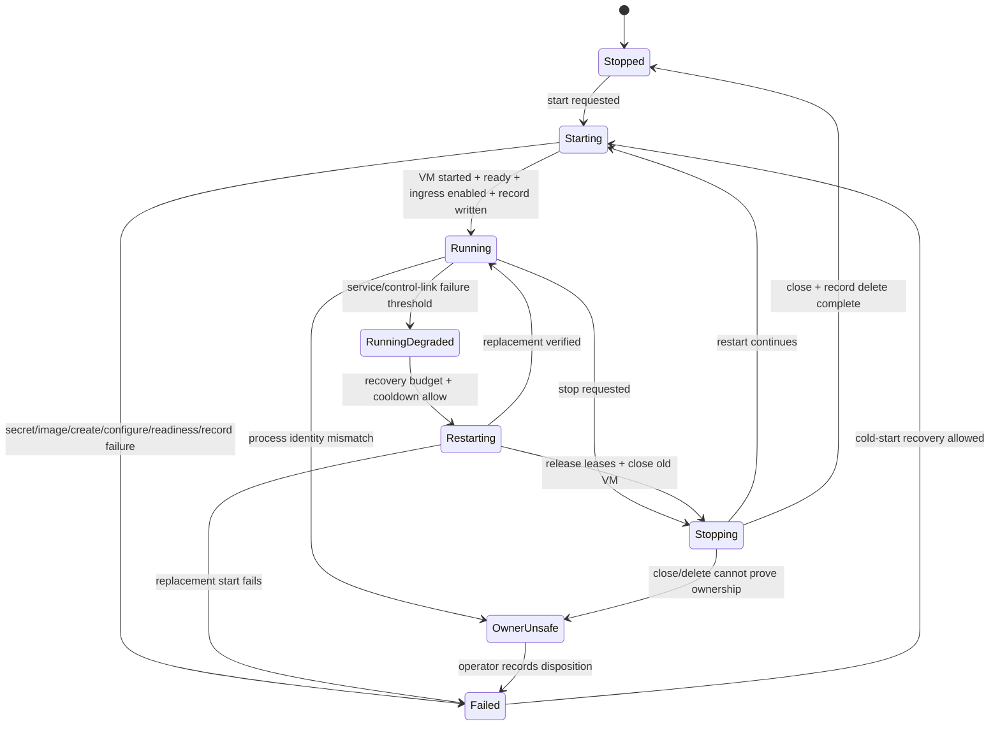
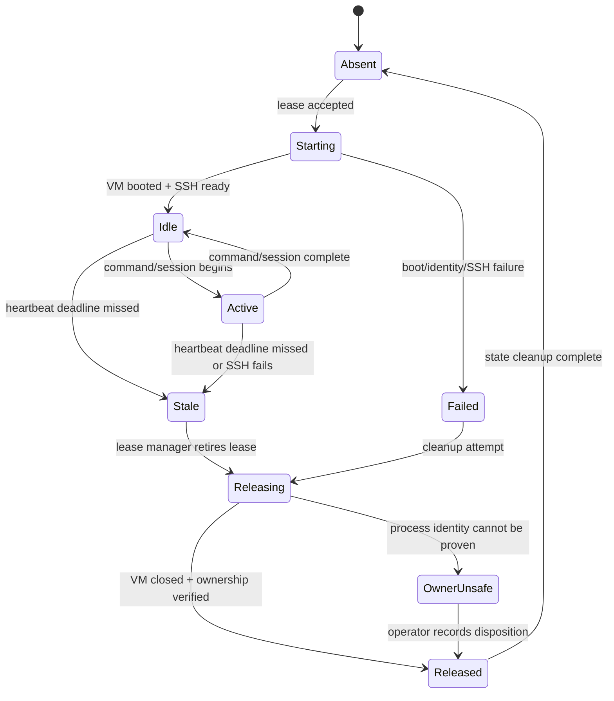

# Gateway Controller Resilience State Machines Implementation Plan

> **For agentic workers:** REQUIRED SUB-SKILL: Use superpowers:subagent-driven-development (recommended) or superpowers:executing-plans to implement this plan task-by-task. Steps use checkbox (`- [ ]`) syntax for tracking.

**Goal:** Make the controller resilient when any gateway runtime, gateway service, agent channel provider, Tool VM lease, or recovery loop fails. The controller should classify each failure at the correct layer through generic contracts, record enough durable evidence to reconstruct the incident, and choose the least destructive recovery action that can actually work.

**Architecture:** Add explicit controller-side state machines for gateway infrastructure and Tool VM leases, then separate those from gateway-service and channel-provider health. Recovery becomes an action selected from classified state, not a special case buried inside the health monitor. Durable lifecycle and recovery events close the current evidence gap where stdout/stderr on an old TTY is the only record.

**Tech Stack:** TypeScript, pnpm, Vitest, OXC, existing `@agent-vm/*` packages, Gondolin/QEMU gateway VMs, gateway implementation plugins, existing controller health event store and HTTP routes. OpenClaw is the current gateway implementation used to prove the plan, but OpenClaw/provider/platform details must stop at the plugin/controller health contract.

---

## Mental Model

The current controller has a boolean-ish view of a gateway runtime:

```text
gateway handle exists      -> running
lastError exists           -> failed
neither exists             -> stopped
```

That view is too small for resilience. The incident showed multiple different failures collapsing into the same surface:

```text
controller alive
gateway runtime failed/down
gateway-runtime.json missing
no live QEMU process
recovery tried old-gateway-not-running
secret resolution now blocks explicit start
original VM disappearance not proven from durable logs
```

The new model must keep these labels separate:

```text
original outage cause       the first proven thing that broke user behavior
current runtime state       whether controller/gateway/Tool VM/provider is up
current recovery blocker    the reason repair cannot proceed now
last attempted operation    the last start/restart/stop/cold-start attempt
```

A 1Password or `op` resolver error must never be displayed as the original cause
unless the durable operation log proves the gateway was being started or
restarted at the moment the outage began. In the common incident shape, it is a
current recovery blocker, not the causal explanation for why the VM disappeared.

## Generic Plugin/Controller Boundary

Gateway implementations and plugins may understand OpenClaw, Discord, Slack,
model providers, SDK-specific close codes, or platform-specific retry semantics.
The controller must not. Past the plugin/controller contract, controller code
only branches on generic facts:

```text
gateway runtime state
gateway service health
agent channel-provider health
secret-resolution blocker
Tool VM lease health
ownership evidence
recovery eligibility
```

Provider-specific details belong in redacted event payloads for diagnosis. They
must not become controller state names, recovery reason strings, or controller
policy branches.

The new model should treat the system as four planes:

```text
┌──────────────────────────────────────────────────────────────────────┐
│                         Controller Plane                              │
├──────────────────────────────────────────────────────────────────────┤
│ Zone lifecycle state machine, recovery policy, durable event log,     │
│ secret resolver refresh, runtime records, ownership checks.           │
└──────────────────────────────────────────────────────────────────────┘
              │ controls / probes / records
              ▼
┌──────────────────────────────────────────────────────────────────────┐
│                       Gateway Infrastructure Plane                     │
├──────────────────────────────────────────────────────────────────────┤
│ Gondolin/QEMU VM, ingress listener, gateway service process,          │
│ controller control link, runtime record, VM identity.                 │
└──────────────────────────────────────────────────────────────────────┘
	              │ runs gateway implementation + brokers leases
              ▼
┌──────────────────────────────────────────────────────────────────────┐
│              Gateway Service / Channel-Provider Plane                  │
├──────────────────────────────────────────────────────────────────────┤
│ Generic channel-provider health, model/tool provider summaries,        │
│ mediated API-key reachability, provider reconnect state.               │
└──────────────────────────────────────────────────────────────────────┘
              │ starts / tracks / retires
              ▼
┌──────────────────────────────────────────────────────────────────────┐
│                            Tool VM Plane                              │
├──────────────────────────────────────────────────────────────────────┤
│ Per-lease Tool VMs, SSH reachability, heartbeats, stale ownership,    │
│ lease release, orphan quarantine.                                     │
└──────────────────────────────────────────────────────────────────────┘
```

Recovery must not treat every app/provider failure as a VM infrastructure
failure. An agent channel provider can make the gateway service unhealthy and
eligible for restart only when the gateway/plugin reports the generic
`unhealthy-recoverable` state and config allows restart. A missing VM handle
with no live QEMU should not be classified as "old gateway not running" and then
give up.

## Failure Matrix

| Layer | Failure case | Trigger / observation | Current behavior | Desired behavior |
| --- | --- | --- | --- | --- |
| Controller | Controller process alive but resolver cannot resolve zone secrets during start/recovery | `controller credentials refresh`, start, restart, or cold-start returns `Failed to resolve zone secrets` | Zone remains failed; error repeats as `lastError` and can look like root cause | Classify as `secret-resolution-failed` under `currentRecoveryBlocker`. Do not present SDK/`op` errors as `originalOutageCause` unless the operation log proves the outage began during that start/restart operation |
| Controller | Controller ready while selected zone failed | `startSelectedZones()` catches/logs zone failure and controller `/health` can become ready | External monitor sees controller healthy while gateway zone is down | `/health` stays controller liveness only. Add zone/system readiness output that makes selected-zone failure explicit and alertable |
| Controller | Recovery suspended after failed attempts | `gateway-recovery-suspended`, `max-failed-recoveries` | Suspends after repeated `old-gateway-not-running` | Suspend by failure class; allow cold-start classes to use a separate budget from running-VM restart classes |
| Durable state | Gateway runtime record missing | `gateway-runtime.json` absent | Snapshot cannot prove previous VM identity or last operation | Treat absence as evidence, not automatically unsafe. Missing record can be clean or failed-before-write. Maintain append-only lifecycle evidence so the controller can explain which case occurred |
| Durable state | stdout/stderr only on old TTY | Controller launched from terminal; no persisted controller log | Decisive transition can be lost | Append structured recovery/lifecycle events under controller runtimeDir logs |
| Gateway infra | Gateway service unhealthy while VM handle is running | `/readyz` probe fails repeatedly | Existing recovery can restart VM after threshold | Restart known running gateway: release leases, close old VM, verify old process gone, start replacement, verify new identity |
| Gateway infra | Control link stale/failed while `/readyz` is ok | `gateway-control-link` missing/stale/failed | Existing policy can trigger VM restart only after service probe is ok and control-link unhealthy | Restart known running gateway; classify as `gateway-control-link-unhealthy` and include last control-link timestamp in recovery evidence |
| Gateway infra | VM process disappeared while controller still has handle | QEMU PID gone; ingress/readyz fails; snapshot may still say running | Eventually service probe fails and recovery attempts restart | Detect missing process explicitly; evict stale handle; run cold-start only after port/record ownership is safe |
| Gateway infra | Runtime already failed or missing before recovery | Snapshot `failed`/`stopped`, no gateway handle | Recovery returns `old-gateway-not-running`, retries, suspends | Run cold-start recovery after missing-record preflight, runtime-record cleanup, and ingress-port owner checks pass |
| Gateway infra | Explicit restart requested for running gateway | Operator/admin restart, credentials refresh, upgrade, recovery action | `restart()` releases leases, clears state early, then starts | Transactional restart: operation record, lease eviction, close/kill verified owner, record delete, start, runtime record write, cold-start/restart verifier |
| Gateway infra | Explicit restart requested while runtime already failed/stopped | Operator/admin restart after old failure | Can fall into `old-gateway-not-running` or start failure path | Treat as cold-start request, not running-gateway restart; preserve failure history and current blocker separately |
| Gateway infra | Stop clears handle before close/delete succeeds | `stopNow()` clears memory before VM close and record delete | Snapshot can become stopped while VM or record remains | Move to `Stopping`; preserve previous identity until close/delete outcome is recorded |
| Gateway infra | Start fails after old record deletion | Restart deletes old record, new start fails on secrets/image/readiness | Missing runtime record plus failed lastError | Keep restart operation record and prior identity until replacement is verified or old VM is proven closed |
| Gateway infra | Owner unsafe / stale record cannot be proven | Runtime record PID command/lstart mismatch, unexpected port owner, unknown process | Cleanup skips safely but state may remain ambiguous | Enter `OwnerUnsafe`; no kill; expose operator action and exact evidence |
| Gateway infra | Owned stale VM or record is safe to evict | Runtime record scope matches and PID/port ownership proves the old VM is managed by this controller/zone | Cleanup can remove stale record or terminate orphaned VM | Kill only the proven owner; delete runtime record only after close/kill/absence is confirmed; record `evictedRuntimeVm` evidence |
| Gateway service | Channel provider cannot communicate, restart may recover | Gateway/plugin publishes `agent-channel-provider-health` with `health: "unhealthy-recoverable"` | Controller may see healthy `/readyz` and do nothing | Count as gateway-service unhealthy; restart gateway when channel-provider policy allows |
| Gateway service | Channel provider cannot communicate, restart will not recover | Gateway/plugin publishes `health: "unhealthy-unrecoverable"` | Controller may repeatedly restart a gateway that cannot self-heal | Surface diagnosis; do not restart by default |
| Gateway service | Channel provider is reconnecting/warming/backing off | Gateway/plugin publishes `health: "transitioning"` | Can stay quietly stuck forever | Wait until controller-owned transition timeout, then classify as channel-provider unhealthy by policy |
| Application provider | Non-channel provider is degraded, such as model or MCP provider | Gateway/plugin publishes health details or future non-channel provider event | May look like gateway outage | Surface as app/provider degraded; do not trigger gateway restart unless a separate policy says gateway restart can recover it |
| Ingress | Slow streaming/non-streaming request hits timeout | Long request exceeds ingress/proxy timeout | User sees broken response; health may pass | Classify as request-timeout/app-path problem; tune timeout/streaming; no VM restart by default |
| Tool VM | Lease heartbeat stale | Lease heartbeat missing beyond threshold | Health issue, but gateway may keep running | Move lease to `Stale`; attempt release/quarantine; do not restart gateway unless lease manager/control link is degraded |
| Tool VM | Tool VM SSH unreachable | `tool-vm-ssh` health event failed | Snapshot issue, not policy input | Retire or quarantine that lease; keep gateway running |
| Tool VM | Tool VM process owner unsafe | PID/identity mismatch for Tool VM | Risky cleanup if broad kill | Enter `OwnerUnsafe`; no kill; require operator or exact identity proof |

## Recovery Authority

Durable lifecycle logs are evidence, not authority.

Recovery decisions must use the current runtime snapshot, the current
`gateway-runtime.json` proof when it exists, and live process/port ownership
checks. Append-only lifecycle events explain what happened before and during
the decision; they must not become a second source of truth that can override
live ownership checks.

Cold-start recovery is allowed when:

| Condition | Meaning | Automated action |
| --- | --- | --- |
| `gateway-runtime.json` is missing and no active gateway handle exists | No durable proof of an old VM; may be clean stop or failed-before-write | Cold-start can proceed only after this plan adds a missing-record ingress-port owner preflight and that preflight shows no conflicting owner |
| Runtime record exists and ownership is proven stale/closed | Old owner is safely gone or safely cleaned | Cold-start can proceed |
| Runtime record is malformed, scope-mismatched, or ownership cannot be proven | Controller cannot prove the old owner is safe to ignore or kill | Enter `OwnerUnsafe`; operator action required |
| Unexpected process owns gateway ingress/control port | Controller cannot prove ownership | Enter `OwnerUnsafe`; no kill |

## Restart And Eviction Matrix

| Request / trigger | Precondition | Action | Success proof | Failure classification |
| --- | --- | --- | --- | --- |
| Running gateway unhealthy | Internal lifecycle state has running gateway handle; owner proof safe | Release zone leases, close/kill proven old VM, delete old record, start replacement | New gateway id/host pid/boot timestamp differs from old; new runtime record written; `/readyz` ok; control link resumes | `restart-verification-failed`, `owner-unsafe`, `readiness-failed`, or `secret-resolution-failed` as current blocker |
| Failed/stopped runtime with no handle | Missing or failed internal state; no current gateway handle | Run missing-record preflight, cleanup stale owned record if present, cold-start gateway | New gateway handle installed; runtime record written; ingress owner matches new VM when host pid is available; `/readyz` ok | `owner-unsafe`, `missing-record-port-owned`, `secret-resolution-failed`, `readiness-failed` |
| Explicit credentials refresh | Operator requested refresh | Fresh resolver preflight, then restart running gateway or cold-start failed gateway according to internal state | Secret preflight ok, replacement/cold-start verifier passes | `secret-resolution-failed` is `currentRecoveryBlocker`, not `originalOutageCause` |
| Explicit stop | Operator requested stop | Mark stopping, release/close gateway, verify owned process closed, delete runtime record | No live owned ingress listener; runtime record deleted; snapshot projects stopped | `owner-unsafe` or `stop-timeout` |
| Controller process restart | Operator restarts controller process | New controller reloads config, creates fresh resolver, starts selected zones or reports failed zone | Controller `/health` ok and selected zone readiness reports running if gateway recovered | Controller liveness ok but zone readiness failed if gateway did not start |
| Unknown port owner | Ingress port is occupied by unproven process | Do not kill, do not cold-start | Operator sees exact pid/command/port evidence | `owner-unsafe` |

The plan must never use broad process cleanup such as `pkill qemu`, and it must
never kill a controller process as part of automatic gateway recovery. Controller
restart is an explicit operator/admin repair action; gateway recovery may close
or kill only a proven owned gateway VM.

## Health Semantics

| Surface | Means | Does not mean |
| --- | --- | --- |
| Controller `/health` | Controller HTTP server is alive and can answer controller liveness | Selected gateway zone is usable |
| Zone lifecycle state | Controller's current internal gateway lifecycle state | Agent channel/model/MCP path is healthy |
| Gateway service health | Gateway service `/readyz` answers through ingress, plus channel-provider health when configured as gateway-service input | Model/MCP providers are healthy |
| Gateway control link | VM can call back to controller health pins | User messages will get replies |
| Channel provider health | Agent communication channel can communicate, is transitioning, or is unhealthy with a recoverability hint | Controller knows platform-specific cause |
| Tool VM lease health | One lease/tool VM is usable or stale | Gateway VM must be restarted |
| System readiness | Controller liveness plus selected-zone gateway infra readiness, and optionally provider/Tool VM readiness for the requested workflow | Original outage cause |

System status output must show at least:

```text
controllerLiveness       ok | failed
selectedZoneReadiness    running | degraded | failed | owner-unsafe
gatewayInfrastructure    running | starting | stopping | failed | owner-unsafe
channelProviderPlane     ok | transitioning | degraded | failed | unknown
toolVmPlane              ok | degraded | failed | unknown
currentRecoveryBlocker   none | secret-resolution-failed | owner-unsafe | readiness-failed | ...
originalOutageCause      unknown | proven:<event-kind/error-code>
lastOperation            start | stop | restart | cold-start | credentials-refresh | none
```

Only `currentRecoveryBlocker` may contain `secret-resolution-failed` when the
evidence is a later failed start/recovery attempt. `originalOutageCause` remains
`unknown` unless durable evidence ties the secret failure to the initial outage
transition.

System readiness is `running` only when all required infrastructure conditions
are true:

| Condition | Required value for system running |
| --- | --- |
| Controller liveness | `ok` |
| Selected zone readiness | `running` |
| Gateway infrastructure | `running` |
| Current recovery blocker | `none` |
| Owner safety | no `owner-unsafe` state or issue |
| Gateway service health | latest `/readyz` is ok and not stale; channel-provider health is healthy when channel-provider recovery input is enabled |
| Gateway control link | latest control-link event is ok and not stale |

Channel-provider and Tool VM health can degrade workflow readiness without
making the gateway infrastructure non-running. Status must show those planes
separately so operators can tell "gateway is running but the channel/tool path
is degraded" from "gateway infrastructure is down."

## Gateway Infrastructure State Machine



State meanings:

| State | Meaning | Allowed automated actions |
| --- | --- | --- |
| `Stopped` | No active gateway and no current error | Start on explicit operator/controller request |
| `Starting` | Start/cold-start is in progress | Resolve secrets, build image, create VM, enable ingress, write record |
| `Running` | Gateway handle, VM identity, ingress, record, and probes align | Probe and record events |
| `RunningDegraded` | Gateway is running but service/control link is unhealthy | Restart VM if policy allows |
| `Restarting` | Replacing a known running gateway | Release leases, close old VM, start replacement, verify identity changed |
| `Stopping` | Closing a gateway or deleting runtime record | Complete close/delete; preserve previous identity until recorded |
| `Failed` | No active gateway because start/restart failed or runtime is gone | Cold-start if safe and policy allows; otherwise expose failure |
| `OwnerUnsafe` | Controller cannot prove process/port/record ownership | No kill/restart of ambiguous process; expose evidence |

Recovery suspension is a policy overlay from
`packages/agent-vm/src/controller/health/gateway-vm-recovery-policy.ts`, not a
gateway lifecycle state. The tracker can suspend one recovery class while the
runtime remains `running-degraded`, `failed`, or `owner-unsafe`.

## Tool VM Lease State Machine



Tool VM failures should usually retire one lease, not restart the gateway. Gateway restart is justified only when the gateway cannot manage leases because its own service/control-link is degraded.

## Agent Channel Provider Health Model

```text
┌───────────────────────────────┐
│ Gateway/plugin/provider layer  │
│ platform-specific details      │
│ restart recoverability hint    │
└───────────────┬───────────────┘
                │ emits generic channel-provider health
                ▼
┌───────────────────────────────┐
│ agent-vm controller            │
│ healthy / transitioning /      │
│ unhealthy-recoverable /        │
│ unhealthy-unrecoverable        │
└───────────────┬───────────────┘
                │ config policy
                ▼
┌───────────────────────────────┐
│ observe, wait for timeout,     │
│ restart gateway, or report     │
└───────────────────────────────┘
```

Channel-provider health is intentionally not provider-specific inside the
controller. The gateway/plugin owns platform details and chooses the generic
controller-facing health value:

| Channel health | Controller action |
| --- | --- |
| `healthy` | No action |
| `transitioning` | Wait until `transitioningTimeoutMs`, then classify by policy |
| `unhealthy-recoverable` | Count as gateway-service unhealthy and restart if policy allows |
| `unhealthy-unrecoverable` | Surface diagnosis; do not restart by default |

## Implementation Tracks

The work is split into three implementation tracks. Track A is the foundation and must land first. Tracks B and C depend on Track A's durable health/event vocabulary but can be implemented by separate subagents after Track A stabilizes.

```text
Track A: Gateway infrastructure recovery classification and cold-start recovery
Track B: Tool VM lease lifecycle audit and per-lease remediation
Track C: Agent channel-provider health and recovery policy
```

## File Structure Proposal

The implementation should reuse the existing ownership and runtime boundaries
instead of inventing a parallel controller. New files hold pure classification,
diagnosis, or append-only evidence. Existing files keep the authority they
already have.

### Reused authority files

| File | Existing responsibility | Plan responsibility | Must not do |
| --- | --- | --- | --- |
| `packages/agent-vm/src/gateway/gateway-recovery.ts` | Scoped gateway runtime cleanup, runtime-record validation, port owner proof when a record exists, managed VM kill/delete | Remains the only gateway orphan cleanup/kill authority. Extend it with missing-record ingress owner preflight | Must not choose recovery policy, classify health, or read controller status |
| `packages/agent-vm/src/gateway/gateway-zone-orchestrator.ts` | Gateway start/cold-start orchestration: cleanup, secret resolution, image build, VM start, readiness, record write | Calls the existing cleanup authority and the new missing-record preflight before VM creation | Must not duplicate ownership proof or perform broad process cleanup |
| `packages/agent-vm/src/gateway/gateway-runtime-record.ts` | Durable `gateway-runtime.json` contract | Remains the durable owner/identity record; lifecycle logs do not replace it | Must not encode policy counters, health history, or provider health |
| `packages/agent-vm/src/controller/zone-runtimes/openclaw-zone-runtime.ts` | In-memory OpenClaw zone runtime handle, start/stop/restart sequencing, credentials refresh | Owns runtime state transitions and operation sequencing; delegates classification to pure helpers | Must not own recovery budgets, process ownership scanning, or status presentation |
| `packages/agent-vm/src/controller/health/gateway-vm-recovery-policy.ts` | Recovery thresholds, cooldown, failed-recovery suspension | Remains the recovery budget/suspension authority; adds cold-start class accounting | Must not start, stop, close, or kill VMs |
| `packages/agent-vm/src/controller/health/gateway-vm-recovery-runner.ts` | New focused boundary | Executes a selected recovery action against one OpenClaw runtime and verifies restart/cold-start results | Must not own recovery budgets, health observation, process ownership scanning, or provider-specific classifications |
| `packages/agent-vm/src/controller/health/gateway-service-health-monitor.ts` | Health observations and recovery trigger loop | Records observations and invokes classified recovery actions | Must not own process cleanup, secret refresh, or final status projection |
| `packages/agent-vm/src/controller/controller-runtime.ts` | Controller wiring, registry, HTTP server | Stays thin: constructs registries, starts monitor, and supplies recovery runner dependencies | Must not grow a second lifecycle reducer, cleanup authority, or policy engine |
| `packages/agent-vm/src/controller/controller-runtime-support.ts` | Controller startup support and resolver construction | Hosts fresh resolver provider if that boundary is needed | Must not perform recovery or mutate runtime state directly |
| `packages/agent-vm/src/operations/controller-status.ts` | Public controller/zone status projection | Adds diagnosis/readiness projection without becoming recovery authority | Must not be read by recovery decisions as the lifecycle source of truth |
| `packages/agent-vm/src/controller/http/controller-zone-operation-routes.ts` | Zone status HTTP route registration | Serializes the status projection from `controller-status.ts` | Must not compute lifecycle, recovery, or ownership state inline |
| `packages/gateway-interface/src/health/agent-vm-health.ts` | Health event contracts, validation, zone health snapshot derivation | Adds provider/diagnosis issue vocabulary and keeps health event exhaustiveness | Must not contain process cleanup, secret resolution, or VM lifecycle logic |

### Ownership flow

Recovery action selection and process cleanup must stay separate.

```text
gateway-service-health-monitor.ts
  observes probes and control-link events
        |
        v
gateway-recovery-actions.ts
  pure decision: restart running VM, cold-start failed runtime,
  refresh resolver, suspend, or require operator
        |
        v
gateway-vm-recovery-runner.ts
  executes the selected runtime action and verifies restart/cold-start
        |
        v
openclaw-zone-runtime.ts
  lifecycle operation: start, stop, restart, credentials refresh
        |
        +--> gateway-zone-state-machine.ts
        |     pure internal state and public-status projection
        |
        +--> gateway-lifecycle-operation-record.ts
        |     append-only evidence, not authority
        |
        v
gateway-zone-orchestrator.ts
  start/cold-start path before VM creation
        |
        v
gateway-recovery.ts
  the only gateway runtime-record cleanup, port-owner proof,
  and proven-owned VM kill/delete authority
```

Status and diagnosis read from the runtime state, health snapshot, durable
evidence, and latest operation record. They report what happened; they do not
decide what process to signal.

### New focused files

| File | Responsibility | Must not do |
| --- | --- | --- |
| `packages/agent-vm/src/gateway/gateway-ownership-evidence.ts` | Shared gateway ownership evidence type and proof-to-evidence mapping helpers | No controller lifecycle state, no process signaling |
| `packages/agent-vm/src/controller/zone-runtimes/gateway-zone-state-machine.ts` | Pure internal gateway lifecycle state, projection to public status, diagnosis derivation | No filesystem, no process kill, no secret resolution |
| `packages/agent-vm/src/controller/zone-runtimes/gateway-lifecycle-operation-record.ts` | Append-only lifecycle evidence in runtime logs | No recovery authority, no runtime-record replacement |
| `packages/agent-vm/src/controller/health/gateway-recovery-actions.ts` | Pure action selection and restart/cold-start verification helpers | No direct process kill, no HTTP route ownership |
| `packages/agent-vm/src/controller/health/channel-provider-recovery-observation.ts` | Convert latest generic channel-provider health events plus controller policy into recovery observations | No provider-specific branching, no VM start/stop/kill, no health-event validation |
| `packages/agent-vm/src/controller/health/durable-health-event-log.ts` | Append-only health/recovery event log | No in-memory health snapshot replacement |
| `packages/agent-vm/src/controller/leases/tool-vm-lease-lifecycle.ts` | Pure Tool VM lease lifecycle classification and release/renew decision helpers used by `lease-manager.ts` | No VM close, no runtime-record delete, no TCP slot mutation |
| `packages/openclaw-agent-vm-plugin/src/provider-health/agent-channel-provider-health.ts` | Build redacted generic channel-provider health events from OpenClaw/SDK/provider observations | No controller status reads, no log scraping, no token/prompt/message body capture, no provider-specific controller semantics |

### Test placement

| Behavior | Test file |
| --- | --- |
| Gateway cleanup/kill ownership, ownership evidence mapping, missing-record ingress preflight | `packages/agent-vm/src/gateway/gateway-ownership-evidence.test.ts` and `packages/agent-vm/src/gateway/gateway-recovery.test.ts` |
| Orchestrator blocks cold-start before VM creation on unsafe port owner | `packages/agent-vm/src/gateway/gateway-zone-orchestrator.test.ts` |
| Internal lifecycle reducer, status projection, no false root-cause attribution | `packages/agent-vm/src/controller/zone-runtimes/gateway-zone-state-machine.test.ts` |
| OpenClaw runtime start/stop/restart sequencing | `packages/agent-vm/src/controller/zone-runtimes/openclaw-zone-runtime.test.ts` and `zone-runtime-registry.test.ts` |
| Recovery action selection, cold-start verification, policy budget, channel-provider recovery observation | `packages/agent-vm/src/controller/health/gateway-recovery-actions.test.ts`, `channel-provider-recovery-observation.test.ts`, `gateway-vm-recovery-policy.test.ts`, `gateway-service-health-monitor.test.ts`, `controller-runtime.test.ts` |
| Readiness/diagnosis status | `packages/agent-vm/src/operations/controller-status.test.ts` and `packages/gateway-interface/src/health/agent-vm-health.test.ts` |
| Channel-provider health contract | `packages/gateway-interface/src/health/agent-vm-health.test.ts` and `packages/openclaw-agent-vm-plugin/src/provider-health/*.test.ts` |
| Tool VM per-lease remediation | `packages/agent-vm/src/controller/leases/tool-vm-lease-lifecycle.test.ts` plus existing lease tests |

### Explicit non-goals

Do not create a second cleanup authority. Do not add a broad process killer. Do
not move `gateway-runtime.json` semantics into lifecycle logs. Do not make
`controller-runtime.ts` or `lease-manager.ts` absorb large new policy blocks.

## Track A: Gateway Infrastructure Resilience

### Task A1: Add explicit lifecycle state types and failure classes

- [x] Create `packages/agent-vm/src/controller/zone-runtimes/gateway-zone-state-machine.ts`.
- [x] Reuse existing codebase types where they already exist:
  - `ControllerRuntimeZoneStatus` from `packages/agent-vm/src/operations/controller-status.ts`.
  - `GatewayZoneRuntimeHandle` from `packages/agent-vm/src/controller/zone-runtimes/zone-runtime-types.ts`.
  - `GatewayVmRecoveryReason` from `packages/agent-vm/src/controller/health/gateway-vm-recovery-policy.ts`.
  - `GatewayOwnershipEvidence` from `packages/agent-vm/src/gateway/gateway-ownership-evidence.ts`.
- [x] Define the discriminated state union:

```ts
export type GatewayZoneLifecycleState =
	| { readonly kind: "stopped" }
	| { readonly kind: "starting"; readonly operationId: string; readonly startedAtMs: number }
	| { readonly kind: "running"; readonly gateway: GatewayZoneRuntimeHandle }
	| { readonly kind: "running-degraded"; readonly gateway: GatewayZoneRuntimeHandle; readonly reason: GatewayVmRecoveryReason }
	| { readonly kind: "stopping"; readonly previousGateway: GatewayZoneRuntimeHandle | undefined; readonly operationId: string; readonly next: "stopped" | "starting" }
	| { readonly kind: "restarting"; readonly previousGateway: GatewayZoneRuntimeHandle; readonly operationId: string }
	| { readonly kind: "failed"; readonly error: GatewayLifecycleErrorSnapshot; readonly coldStartEligible: boolean }
	| { readonly kind: "owner-unsafe"; readonly evidence: GatewayOwnershipEvidence };

export interface GatewayLifecycleErrorSnapshot {
	readonly code: GatewayLifecycleErrorCode;
	readonly message: string;
}

export interface GatewayDiagnosisSnapshot {
	readonly controllerLiveness: "ok" | "failed";
	readonly selectedZoneReadiness: "running" | "degraded" | "failed" | "owner-unsafe";
	readonly gatewayInfrastructure: GatewayZoneLifecycleState["kind"];
	readonly channelProviderPlane: "ok" | "transitioning" | "degraded" | "failed" | "unknown";
	readonly toolVmPlane: "ok" | "degraded" | "failed" | "unknown";
	readonly currentRecoveryBlocker: GatewayLifecycleErrorCode | "none";
	readonly originalOutageCause:
		| { readonly kind: "unknown" }
		| {
				readonly kind: "proven";
				readonly eventKind: AgentVmHealthEvent["kind"] | "gateway-lifecycle-operation";
				readonly errorCode?: string;
		  };
	readonly lastOperation: "start" | "stop" | "restart" | "cold-start" | "credentials-refresh" | "none";
}
```

- [x] Define `GatewayLifecycleErrorCode` with at least:
  - `secret-resolution-failed`
  - `image-build-failed`
  - `vm-create-failed`
  - `vm-start-failed`
  - `readiness-failed`
  - `record-write-failed`
  - `old-gateway-not-running`
  - `vm-process-missing`
  - `gateway-control-link-unhealthy`
  - `gateway-service-unhealthy`
  - `agent-channel-provider-unhealthy`
  - `owner-unsafe`
  - `recovery-timeout`
  - `stale-generation-closed`
- [x] Keep recovery reason vocabulary derived from one shared literal list.
  In `packages/gateway-interface/src/health/agent-vm-health.ts`, define the
  recovery reasons as a const-backed union and derive controller recovery aliases
  from that source. In the controller lifecycle code, derive the overlapping error
  subset instead of hand-copying the same strings:

```ts
export const gatewayRecoveryHealthReasons = [
	"gateway-control-link-unhealthy",
	"gateway-service-unhealthy",
] as const;

export type GatewayRecoveryHealthReason = (typeof gatewayRecoveryHealthReasons)[number];

export type GatewayRecoveryErrorCode = Extract<
	GatewayLifecycleErrorCode,
	GatewayRecoveryHealthReason
>;
```

  Track C4 extends the same const list with `agent-channel-provider-unhealthy`
  when channel-provider recovery is wired. Add a type-level test or `satisfies`
  check proving the controller recovery subset and gateway-interface health
  reason list stay in sync.
- [x] Add pure reducer helpers:
  - `transitionGatewayZoneState(state, event)`
  - `classifyGatewayStartError(error)`
  - `classifyGatewayRecoveryPrecondition(snapshot, ownership)`
  - `deriveGatewayDiagnosisSnapshot(inputs)`
- [x] Add `projectGatewayZoneLifecycleStateForStatus(state)` for CLI/status only.
  The controller recovery path must consume the internal state, not the projected
  `running` / `failed` / `stopped` public status value.
- [x] Add unit tests in `packages/agent-vm/src/controller/zone-runtimes/gateway-zone-state-machine.test.ts`.
  Include cases proving:
  - a later `secret-resolution-failed` recovery attempt sets
    `currentRecoveryBlocker` but leaves `originalOutageCause: unknown`.
  - a secret failure during the first recorded start can be marked as a proven
    original cause.
  - controller liveness ok plus selected-zone failed projects to system
    readiness failed, not running.

Expected focused command:

```bash
pnpm vitest run packages/agent-vm/src/controller/zone-runtimes/gateway-zone-state-machine.test.ts
```

Expected result:

```text
Test Files  1 passed
Tests       8 passed
Exit code   0
```

Commit:

```bash
git add packages/agent-vm/src/controller/zone-runtimes/gateway-zone-state-machine.ts packages/agent-vm/src/controller/zone-runtimes/gateway-zone-state-machine.test.ts
git commit -m "Add gateway zone lifecycle state machine"
```

### Task A2: Add durable lifecycle operation records

- [x] Create `packages/agent-vm/src/controller/zone-runtimes/gateway-lifecycle-operation-record.ts`.
- [x] Store records under the zone runtime log directory:

```text
<runtimeDir>/zones/<zoneId>/gateway-lifecycle/events.jsonl
```

- [x] Do not use the lifecycle log as recovery authority. If a latest-operation
  view is needed for CLI/status output, derive it from the append-only JSONL log
  at read time.
- [x] Define operation records for:
  - `start-requested`
  - `restart-requested`
  - `cold-start-requested`
  - `stop-requested`
  - `vm-close-started`
  - `vm-close-finished`
  - `runtime-record-written`
  - `runtime-record-deleted`
  - `operation-failed`
  - `operation-finished`
- [x] Include operation id, zone id, gateway type, controller pid, controller start time if available, previous gateway identity, current gateway identity, error code, error message, and timestamps.
- [x] Include an `operationTrigger` field:
  - `controller-start`
  - `operator-start`
  - `operator-stop`
  - `operator-restart`
  - `credentials-refresh`
  - `auto-recovery`
  - `upgrade`
- [x] Add tests for append, latest read, corrupt latest handling, and event ordering.
- [x] Write the failing tests before implementation. The test file must include
  one named test for each operation-record behavior listed above.

Expected focused command:

```bash
pnpm vitest run packages/agent-vm/src/controller/zone-runtimes/gateway-lifecycle-operation-record.test.ts
```

Expected result:

```text
Test Files  1 passed
Tests       4 passed
Exit code   0
```

Commit:

```bash
git add packages/agent-vm/src/controller/zone-runtimes/gateway-lifecycle-operation-record.ts packages/agent-vm/src/controller/zone-runtimes/gateway-lifecycle-operation-record.test.ts
git commit -m "Persist gateway lifecycle operation events"
```

### Task A3: Add missing-record ingress owner preflight

- [x] Create `packages/agent-vm/src/gateway/gateway-ownership-evidence.ts`.
- [x] Define the ownership evidence vocabulary in the gateway layer, next to the
  code that proves or refuses process ownership:

```ts
export type GatewayOwnershipEvidence =
	| { readonly kind: "missing-record-port-owned"; readonly port: number; readonly ownerPid: number; readonly ownerCommand: string }
	| { readonly kind: "record-parse-error"; readonly path: string; readonly message: string }
	| { readonly kind: "record-scope-mismatch"; readonly expectedScope: string; readonly actualScope: string }
	| { readonly kind: "port-owner-mismatch"; readonly port: number; readonly expectedPid: number; readonly ownerPid: number }
	| { readonly kind: "unmanaged-port-owner"; readonly port: number; readonly ownerPid: number; readonly ownerCommand: string };
```

- [x] Map existing `GatewayPortOwnershipProof` outcomes to this evidence instead
  of introducing a third vocabulary:
  - `owned` and `record-stale` remain safe non-blocking proof outcomes.
  - `unproven` because port owner pid differs from `runtimeRecord.qemuPid`
    becomes `port-owner-mismatch`.
  - `unproven` because port owner command is not a managed VM process becomes
    `unmanaged-port-owner`.
  - malformed runtime record becomes `record-parse-error`.
  - runtime record scope mismatch from `validateRuntimeRecordCleanupScope(...)`
    becomes `record-scope-mismatch`.
  - missing runtime record plus occupied configured ingress port becomes
    `missing-record-port-owned`.
- [x] Modify `packages/agent-vm/src/gateway/gateway-recovery.ts`.
- [x] Modify `packages/agent-vm/src/gateway/gateway-zone-orchestrator.ts` to pass
  the configured host-facing gateway ingress port into the recovery helper.
- [x] Export a new helper that checks the configured gateway ingress port even
  when `gateway-runtime.json` is missing:

```ts
export type MissingGatewayRuntimeRecordPortPreflight =
	| { readonly kind: "clear" }
	| { readonly kind: "blocked"; readonly evidence: GatewayOwnershipEvidence };
```

- [x] Use `readTcpListenPortOwner(zone.gateway.port)` for the missing-record
  branch before cold-start recovery proceeds. If an unexpected process owns the
  ingress port, return `owner-unsafe`; do not start a second gateway.
- [x] Keep the existing runtime-record-scoped `verifyGatewayPortOwnership`
  behavior for loaded records. The new preflight covers only the current early
  return at `cleanupOrphanedGatewayIfPresent(...)` when the record is missing.
- [x] Add tests in `packages/agent-vm/src/gateway/gateway-recovery.test.ts`:
  - [x] missing runtime record and free ingress port returns clear.
  - [x] missing runtime record and occupied ingress port returns owner-unsafe evidence.
  - [x] loaded runtime record still uses the existing qemuPid-scoped ownership proof.
  - [x] each existing `GatewayPortOwnershipProof` unsafe/unproven branch maps to one
    `GatewayOwnershipEvidence.kind`.
- [x] Add tests proving the orchestrator blocks cold-start before VM creation
  when the missing-record port preflight returns owner-unsafe.

Expected focused command:

```bash
pnpm vitest run packages/agent-vm/src/gateway/gateway-recovery.test.ts packages/agent-vm/src/gateway/gateway-zone-orchestrator.test.ts
```

Expected result:

```text
Test Files  2 passed
Tests       50 passed
Exit code   0
```

Commit:

```bash
git add packages/agent-vm/src/gateway/gateway-recovery.ts packages/agent-vm/src/gateway/gateway-recovery.test.ts packages/agent-vm/src/gateway/gateway-zone-orchestrator.ts packages/agent-vm/src/gateway/gateway-zone-orchestrator.test.ts
git commit -m "Guard cold-start recovery when runtime record is missing"
```

### Task A4: Make OpenClaw runtime transitions transactional

- [x] Modify `packages/agent-vm/src/controller/zone-runtimes/openclaw-zone-runtime.ts`.
- [x] Create `packages/agent-vm/src/controller/zone-runtimes/openclaw-zone-runtime.test.ts`.
- [x] Replace implicit `gateway`/`lastError`-only lifecycle with the state machine while preserving the existing public `ControllerRuntimeZoneStatus` shape.
- [x] In `stopNow()`:
  - Record `stopping` before clearing the active gateway.
  - Preserve previous gateway identity until close and runtime-record deletion are recorded.
  - Ensure normal route handling and lease creation cannot use a gateway that is
    in `stopping` or `restarting`.
  - Classify close timeout or ownership ambiguity instead of collapsing to plain stopped.
- [x] In `startNow()`:
  - Record `starting` before resolving secrets.
  - Classify failures using `classifyGatewayStartError`.
  - Keep `coldStartEligible` true for failures before a replacement VM is running and false for owner-unsafe failures.
- [x] In `restart()`:
  - Record `restart-requested`.
  - Evict/release zone leases before old VM close as today.
  - Preserve operation identity across stop and start.
  - Handle stale generation cleanup at the current `startNow(...)` stale branch:
    record `stale-generation-closed` and leave an explicit internal state
	  instead of silently projecting to public `stopped`.
  - Record replacement verification outcome.
- [x] Add a host-process liveness detector for a running gateway handle. Today
  `getSnapshot()` projects `running` from handle presence alone. The new state
  machine must check the available VM host pid before claiming the gateway is
  actually running:
  - use `gateway.vm.getHostPid()` when available.
  - if the host pid is missing when it is expected, no longer alive, or fails
    managed-process identity proof, classify the internal state as
    `vm-process-missing` or `owner-unsafe`.
  - do not signal a process from this detector; cleanup and kill remain in
    `packages/agent-vm/src/gateway/gateway-recovery.ts`.
- [ ] Add or update tests covering:
  - [x] stop timeout leaves `stopping` or `owner-unsafe` evidence, not silent stopped.
  - [x] restart start failure preserves failure class and prior operation evidence.
  - [x] restart evicts zone leases before closing the old gateway.
  - [x] close/kill only targets the proven owned gateway VM and never a controller process.
  - [x] stale generation successful start closes the stale VM and does not install it.
  - [x] a missing/dead gateway host pid is not projected as a healthy running gateway
    and is classified as `vm-process-missing` or `owner-unsafe`.
  - [x] `getSnapshot()` remains backward-compatible for CLI/status callers.

Expected focused command:

```bash
pnpm vitest run packages/agent-vm/src/controller/zone-runtimes/openclaw-zone-runtime.test.ts packages/agent-vm/src/controller/zone-runtimes/zone-runtime-registry.test.ts
```

Expected result:

```text
Test Files  2 passed
Tests       27 passed
Exit code   0
```

Commit:

```bash
git add packages/agent-vm/src/controller/zone-runtimes/openclaw-zone-runtime.ts packages/agent-vm/src/controller/zone-runtimes/openclaw-zone-runtime.test.ts packages/agent-vm/src/controller/zone-runtimes/zone-runtime-registry.test.ts
git commit -m "Make OpenClaw zone lifecycle transitions explicit"
```

### Task A5: Replace running-only recovery with classified recovery actions

- [x] Create `packages/agent-vm/src/controller/health/gateway-recovery-actions.ts`.
- [x] Define recovery actions:

```ts
export type GatewayRecoveryDecisionAction =
	| { readonly kind: "restart-running-gateway"; readonly reason: GatewayVmRecoveryReason }
	| { readonly kind: "cold-start-gateway"; readonly reason: GatewayVmRecoveryReason }
	| { readonly kind: "refresh-secret-resolver"; readonly reason: "secret-resolution-failed" }
	| { readonly kind: "suspend-recovery"; readonly errorCode: "max-failed-recoveries" }
	| { readonly kind: "operator-required"; readonly reason: "owner-unsafe" | "ambiguous-runtime-state" }
	| {
			readonly kind: "observe-only";
			readonly reason:
				| "recovery-disabled"
				| "recovery-in-flight"
				| "recovery-unobserved"
				| "channel-provider-unrecoverable"
				| "cooldown-active";
	  };
```

- [x] Consume `GatewayVmRecoveryReason` from
  `packages/agent-vm/src/controller/health/gateway-vm-recovery-policy.ts`; do not
  extend the alias in this task. Track C4 adds
  `agent-channel-provider-unhealthy` at the source union in
  `packages/gateway-interface/src/health/agent-vm-health.ts`. Do not add
  provider-specific reasons such as Discord, Slack, or SMS.
- [x] Extend `packages/gateway-interface/src/health/agent-vm-health.ts` so
  gateway recovery events can report `action: "gateway-vm-cold-start"` without
  fake old VM identity. Restart success still requires old and new identity.
- [x] Modify `packages/agent-vm/src/controller/controller-runtime.ts`:
  - Keep `controller-runtime.ts` thin. Put action selection and verification
    helpers in `packages/agent-vm/src/controller/health/gateway-recovery-actions.ts`
    or another focused file instead of growing controller runtime with policy logic.
  - Keep the current restart behavior for `running` or `running-degraded` gateway state.
  - [x] Read the internal gateway lifecycle state for recovery decisions. Do not
    decide recovery from the public `ControllerRuntimeZoneStatus.lifecycleState`
    projection.
  - [x] Add cold-start behavior for `failed`/`stopped` states when the state machine
    marks them cold-start eligible and the Task A3 missing-record port preflight
    or existing runtime-record ownership proof is clear.
  - [x] Permit cold-start when the runtime record is missing and live process/port
    checks show no conflicting owner.
  - [x] Do not cold-start when runtime record or process ownership is ambiguous,
    malformed, scope-mismatched, or points at an unexpected live owner.
  - [x] Classify `old-gateway-not-running` as a precondition result that can lead to `cold-start-gateway`, not as a terminal recovery failure by itself.
  - [x] Use a distinct cold-start success verification: new snapshot must be
    `running` with gateway id, host pid when available, ingress enabled, and a
    written runtime record. Do not reuse the restart verifier that requires
    old-vs-new identity differences.
  - [x] Return structured recovery outcome with `action`, `reason`, and `errorCode`.
  - [x] Add `operationId` and explicit `zoneId` to recovery outcome records when
    Task A7 persists recovery/lifecycle events. Today `zoneId` is supplied by the
    monitor record context, and runtime restart/cold-start results now supply
    `operationId`.
- [x] Modify `packages/agent-vm/src/controller/health/gateway-service-health-monitor.ts`:
  - Reuse and extend `packages/agent-vm/src/controller/health/gateway-vm-recovery-policy.ts`.
  - Keep suspension in the recovery tracker, not in the gateway lifecycle state.
  - Keep the existing cooldown for repeated running-VM restarts.
  - [ ] Add a separate cold-start budget with a longer cooldown.
- [ ] Add tests:
  - [x] failed runtime with safe state selects `cold-start-gateway`.
  - [x] failed runtime with secret error selects `refresh-secret-resolver`; Task A6
    proves the fresh resolver behavior.
  - [x] owner-unsafe state selects `operator-required` and does not call restart/start.
  - [x] cold-start success uses the cold-start verifier and does not require an old
    gateway identity.
  - [x] repeated cold-start failures preserve `gateway-vm-cold-start` in the
    suspended recovery event.
  - [x] secret-blocked failed runtime selects `refresh-secret-resolver`, builds a
    fresh resolver, and records recovery as cold-start success when the gateway
    starts.
  - [x] `secret-resolution-failed` from a later recovery attempt is surfaced only as
    `currentRecoveryBlocker`.
  - [x] system readiness is not running when controller liveness is ok but selected
    zone readiness is failed or owner-unsafe.
- [x] Write the failing tests before implementation. The new/updated test files
  must include one named test for every bullet in this test list.

Focused command run:

```bash
pnpm vitest run packages/agent-vm/src/controller/health/gateway-recovery-actions.test.ts packages/agent-vm/src/controller/health/gateway-service-health-monitor.test.ts packages/agent-vm/src/controller/health/gateway-vm-recovery-policy.test.ts packages/agent-vm/src/controller/controller-runtime.test.ts packages/agent-vm/src/controller/zone-runtimes/openclaw-zone-runtime.test.ts packages/agent-vm/src/controller/zone-runtimes/zone-runtime-registry.test.ts packages/gateway-interface/src/health/agent-vm-health.test.ts
```

Observed result:

```text
Test Files  7 passed
Tests       90 passed
Exit code   0
```

Additional focused checks:

```bash
pnpm --filter @agent-vm/agent-vm typecheck
pnpm --filter @agent-vm/gateway-interface typecheck
pnpm lint
pnpm fmt:check
```

Observed result:

```text
agent-vm typecheck           exit code 0
gateway-interface typecheck  exit code 0
lint                         0 warnings, 0 errors, exit code 0
fmt:check                    all matched files formatted, exit code 0
```

Commit:

```bash
git add packages/agent-vm/src/controller/health/gateway-recovery-actions.ts packages/agent-vm/src/controller/health/gateway-recovery-actions.test.ts packages/agent-vm/src/controller/health/gateway-vm-recovery-policy.ts packages/agent-vm/src/controller/health/gateway-vm-recovery-policy.test.ts packages/agent-vm/src/controller/health/gateway-service-health-monitor.ts packages/agent-vm/src/controller/health/gateway-service-health-monitor.test.ts packages/agent-vm/src/controller/controller-runtime.ts packages/agent-vm/src/controller/controller-runtime.test.ts
git commit -m "Recover failed gateways with classified actions"
```

### Task A6: Add controller secret resolver refresh boundary

- [x] Inspect the current secret resolver creation in `packages/agent-vm/src/controller/controller-runtime-support.ts` and `packages/agent-vm/src/controller/controller-runtime.ts`.
- [x] Add a controller-owned `SecretResolverProvider` abstraction only if it earns its boundary:
  - one job: create a fresh resolver from current controller config/environment/keychain source when requested.
  - one reason to change: secret resolver construction or refresh semantics.
- [x] Decision: a standalone provider type does not yet earn a separate file.
  Keep resolver construction in `controller-runtime-support.ts`; controller
  runtime owns only a small `createFreshSecretResolver` closure that calls the
  existing support helper.
- [x] Modify credentials refresh to use a fresh resolver for controller-side restart attempts, not only the resolver captured at controller startup.
- [x] Modify cold-start recovery to consume the same fresh resolver boundary
  once Task A5 introduces the cold-start action.
- [x] Keep resolver construction outside `controller-runtime.ts`; prefer a
  focused helper in `controller-runtime-support.ts` or a new support file if the
  implementation would otherwise grow the already-large runtime module.
- [x] Limit this task's fresh resolver semantics to gateway zone start,
  gateway restart, and `controller credentials refresh`.
  Host git credentials, existing Tool VM creation paths, and unrelated
  controller operations keep their current resolver behavior unless a separate
  task proves they need the same boundary.
- [x] Preserve existing direct resolver behavior for non-refresh operations unless the recovery action is `refresh-secret-resolver`.
- [ ] Add tests:
  - [x] initial resolver fails, refresh provider returns a working resolver, restart uses new resolver.
  - [x] cold-start uses new resolver after Task A5 adds cold-start recovery.
  - refresh provider failure records `secret-resolution-failed` as a recovery
    blocker, not as root cause.
  - environment-source secrets still resolve without 1Password-specific behavior.
  - environment-source secret refresh is documented as process-bound: if the
    controller process was launched with a bad environment value, refreshing the
    resolver cannot observe a value outside that process environment.

Focused command run:

```bash
pnpm vitest run packages/agent-vm/src/controller/controller-runtime-support.test.ts packages/agent-vm/src/controller/controller-runtime.test.ts packages/agent-vm/src/controller/zone-runtimes/openclaw-zone-runtime.test.ts packages/agent-vm/src/controller/zone-runtimes/zone-runtime-registry.test.ts packages/agent-vm/src/operations/credentials-refresh.test.ts
```

Observed result:

```text
Test Files  5 passed
Tests       43 passed
Exit code   0
```

Additional focused checks:

```bash
pnpm --filter @agent-vm/agent-vm typecheck
pnpm lint
pnpm fmt:check
```

Observed result:

```text
typecheck  exit code 0
lint       0 warnings, 0 errors, exit code 0
fmt:check  all matched files formatted, exit code 0
```

Commit:

```bash
git add packages/agent-vm/src/controller/controller-runtime-support.ts packages/agent-vm/src/controller/controller-runtime-support.test.ts packages/agent-vm/src/controller/controller-runtime.ts packages/agent-vm/src/controller/controller-runtime.test.ts
git commit -m "Refresh controller secret resolver for recovery"
```

### Task A7: Persist health and recovery events

- [x] Create `packages/agent-vm/src/controller/health/durable-health-event-log.ts`.
- [x] Append structured health and recovery events to:

```text
<runtimeDir>/controller-health/events.jsonl
```

- [x] Include zone id, event kind, observed timestamp, controller pid, controller port, operation id when present, and the compact event body.
- [x] Use `operationId` as the join key between lifecycle operation events and
  recovery health events.
- [x] Wire the durable log into `packages/agent-vm/src/controller/health/health-event-store.ts` or the controller runtime wiring that records events.
- [x] Keep in-memory snapshots for fast HTTP reads.
- [x] Add a bounded read route or CLI support only if existing route patterns make it small; otherwise persist the log and rely on filesystem inspection in this task.
- [x] Add tests:
  - [x] appends valid JSONL.
  - [x] log write failure does not break health recording.
  - [x] recovery event includes action and failure class.
  - [x] durable log can reconstruct last operation separately from current recovery blocker.

Expected focused command:

```bash
pnpm vitest run packages/agent-vm/src/controller/health/durable-health-event-log.test.ts packages/agent-vm/src/controller/health/health-event-store.test.ts packages/agent-vm/src/controller/controller-runtime.test.ts
```

Expected result:

```text
Test Files  3 passed
Tests       28 passed
Exit code   0
```

Commit:

```bash
git add packages/agent-vm/src/controller/health/durable-health-event-log.ts packages/agent-vm/src/controller/health/durable-health-event-log.test.ts packages/agent-vm/src/controller/health/health-event-store.ts packages/agent-vm/src/controller/health/health-event-store.test.ts
git commit -m "Persist controller health and recovery events"
```

### Task A8: Add system readiness and diagnosis status output

- [x] Modify `packages/agent-vm/src/operations/controller-status.ts`.
- [x] Modify `packages/agent-vm/src/operations/controller-status.test.ts`.
- [x] Modify `packages/agent-vm/src/controller/http/controller-zone-operation-routes.ts`
  only to serialize the status projection produced by
  `packages/agent-vm/src/operations/controller-status.ts`.
- [x] Add a derived diagnosis/status object for each selected gateway zone:

```ts
export type ControllerZoneDiagnosisStatus = Readonly<GatewayDiagnosisSnapshot>;
```

  Do not duplicate the eight diagnosis fields or loosen them to bare `string`.
  If status output needs JSON-safe formatting, derive it from
  `GatewayDiagnosisSnapshot` while preserving the precise unions for
  `currentRecoveryBlocker` and `lastOperation`.

- [x] Keep `/health` as controller liveness. Do not make controller `/health`
  fail merely because a selected zone is failed; expose zone/system readiness in
  status/health-snapshot output instead.
- [ ] Add tests:
  - [x] controller liveness ok + selected zone running => readiness running.
  - [x] controller liveness ok + selected zone failed => readiness failed.
  - [x] controller liveness ok + selected zone owner-unsafe => readiness owner-unsafe.
  - [x] controller liveness ok + selected zone running + current recovery blocker
    set => readiness degraded or failed, not running.
  - stale gateway service or stale control link prevents system running.
  - [x] later secret resolver failure appears as `currentRecoveryBlocker`, while
    `originalOutageCause.kind` remains `unknown`.
  - provider degraded does not change gateway infrastructure from running.

Expected focused command:

```bash
pnpm vitest run packages/agent-vm/src/operations/controller-status.test.ts packages/gateway-interface/src/health/agent-vm-health.test.ts
```

Expected result:

```text
Test Files  2 passed
Tests       readiness and diagnosis status cases passed
Exit code   0
```

Commit:

```bash
git add packages/agent-vm/src/operations/controller-status.ts packages/agent-vm/src/operations/controller-status.test.ts packages/gateway-interface/src/health/agent-vm-health.ts packages/gateway-interface/src/health/agent-vm-health.test.ts
git commit -m "Expose zone readiness separately from controller liveness"
```

## Track B: Tool VM Lease Resilience

### Task B1: Extract Tool VM lease lifecycle decisions

- [x] Read existing lease lifecycle code before adding a new abstraction:
  - `packages/agent-vm/src/controller/leases/lease-manager.ts`
  - `packages/agent-vm/src/controller/leases/tool-vm-runtime-record.ts`
  - `packages/agent-vm/src/controller/leases/tool-vm-recovery.ts`
  - `packages/agent-vm/src/controller/leases/idle-reaper.ts`
- [x] Keep `lease-manager.ts` as the in-memory registry and orchestration owner:
  - stores `leases`, `activeUses`, tombstones, and agent indexes.
  - serializes per-agent operations with `withAgentLeaseLock`.
  - calls `createManagedVm`, `vm.close()`, runtime-record writes/deletes, and
    `tcpPool.release()` / `tcpPool.quarantine()`.
  - returns the public `LeaseManager` interface.
- [x] Document the current implicit lease states in the task diff or design note:
  - `absent`
  - `starting`
  - `idle`
  - `active`
  - `stale`
  - `releasing`
  - `released`
  - `failed`
  - `owner-unsafe`
- [x] Create `packages/agent-vm/src/controller/leases/tool-vm-lease-lifecycle.ts`.
- [x] Move pure decisions out of `lease-manager.ts` into that helper:
  - lease is idle-expired.
  - lease is expired only when idle-expired and active-use count is zero.
  - renew should evict expired lease.
  - renew should evict non-live VM.
  - release is blocked by active use unless `force: true`.
  - release with `ifLastUsedAtBeforeOrAt` should skip a recently-touched lease.
  - close failure should preserve runtime record and quarantine TCP slot.
  - successful close should release TCP slot and delete runtime record.
- [x] Do not move the actual side effects into the helper. The helper returns a
  decision; `lease-manager.ts` executes the decision.
- [x] Add helper tests for pure lease lifecycle decisions: idle expiry,
  active-use expiry guard, renewal eviction, renewal VM-liveness eviction,
  active-use release blocking, recently-touched release skip, close failure,
  and close success.
- [x] Keep side-effect coverage for release success, release timeout, TCP slot
  quarantine/release, and runtime-record delete/preserve in existing
  `lease-manager.test.ts`. Track B2 owns any new per-lease remediation behavior
  for `tool-vm-ssh`, heartbeat stale, and owner-unsafe process identity.
- [x] Put the focused lease lifecycle tests in
  `packages/agent-vm/src/controller/leases/tool-vm-lease-lifecycle.test.ts`.

Expected focused command:

```bash
pnpm vitest run packages/agent-vm/src/controller/leases/tool-vm-lease-lifecycle.test.ts packages/agent-vm/src/controller/leases/lease-manager.test.ts
```

Expected result:

```text
Test Files  2 passed
Tests       45 passed
Exit code   0
```

Commit:

```bash
git add packages/agent-vm/src/controller/leases
git commit -m "Extract Tool VM lease lifecycle decisions"
```

### Task B2: Make Tool VM health remediation per-lease

- [x] Wire failed `tool-vm-ssh` health ingestion to retire only the affected
  lease by calling `leaseManager.releaseLease(leaseId, { force: true })`.
  `releaseLease` remains the owner of VM close, TCP slot release/quarantine,
  and runtime-record delete/preserve.
- [x] Keep `lease-manager.ts` thin. The new health-event remediation wiring
  stays in `controller-health-event-routes.ts`; no substantial policy code was
  added to the existing large lease manager.
- [x] Ensure `lease-heartbeat` and `lease-renew` failures do not trigger gateway
  VM restart by themselves.
- [x] Persist failed Tool VM SSH lease events through the same durable health
  event log shape from Track A.
- [x] Add tests:
  - SSH failed retires one lease through the controller health-event route.
  - route and full controller app wire the same per-lease remediation.
  - heartbeat failure remains observation-only.
  - gateway recovery is not called when only one Tool VM lease fails.
  - release success/failure still deletes or preserves runtime records and
    releases or quarantines TCP slots in `lease-manager.test.ts`.
  - ambiguous process identity remains covered by the Tool VM recovery tests and
    does not move into health-event route remediation.

Expected focused command:

```bash
pnpm vitest run packages/agent-vm/src/controller/http/controller-health-event-routes.test.ts packages/agent-vm/src/controller/http/controller-http-routes.test.ts packages/agent-vm/src/controller/health/gateway-service-health-monitor.test.ts packages/agent-vm/src/controller/health/health-event-store.test.ts packages/agent-vm/src/controller/leases/lease-manager.test.ts packages/openclaw-agent-vm-plugin/src/sandbox-backend/tool-vm-ssh-operation-guard.test.ts
```

Expected result:

```text
Test Files  6 passed
Tests       158 passed
Exit code   0
```

Commit:

```bash
git add packages/agent-vm/src/controller/leases packages/agent-vm/src/controller/health
git commit -m "Retire unhealthy Tool VM leases independently"
```

## Track C: Agent Channel Provider Health

Track C covers the case where the gateway process is alive, but the agent's
communication channel cannot communicate. The controller must not understand
Discord, Slack, SMS, email, or any other channel platform. The gateway/plugin
owns provider-specific diagnosis and reports only the generic recovery class
that the controller can act on.

Controller-facing health states:

```text
healthy
transitioning
unhealthy-recoverable
unhealthy-unrecoverable
```

Controller meaning:

| Health | Controller meaning | Default action |
| --- | --- | --- |
| `healthy` | Channel provider can communicate | No recovery |
| `transitioning` | Gateway/plugin reports reconnecting, warming, backoff, or other temporary transition | Wait until transition timeout |
| `unhealthy-recoverable` | Channel provider cannot communicate and gateway/plugin says gateway restart may recover it | Count as gateway-service unhealthy; restart if policy allows |
| `unhealthy-unrecoverable` | Channel provider cannot communicate and gateway/plugin says gateway restart will not recover it | Surface diagnosis; do not restart by default |

Provider-specific details are payload only. The controller may display and store
details, but recovery code must not branch on them.

### Task C1: Add generic channel-provider health event contract

- [x] Modify `packages/gateway-interface/src/health/agent-vm-health.ts`.
- [x] Add `agent-channel-provider-health` to `agentVmHealthEventKinds`.
- [x] Add `agent-channel-provider-unhealthy` to `zoneHealthIssueKinds`.
- [x] Add a new union member to `AgentVmHealthEvent`, not a standalone type
  outside the discriminated union:

```ts
| (AgentVmHealthEventBase & {
	readonly kind: "agent-channel-provider-health";
	readonly channelProviderId: string;
	readonly health:
		| "healthy"
		| "transitioning"
		| "unhealthy-recoverable"
		| "unhealthy-unrecoverable";
	readonly transitionStartedAtMs?: number | undefined;
	readonly unhealthySinceMs?: number | undefined;
	readonly details?: Partial<
		Record<
			| "closeCode"
			| "providerType"
			| "reconnectAttempt"
			| "reconnecting"
			| "sleepResumeSuspected"
			| "statusCode",
			string | number | boolean | null
		>
	> | undefined;
})
```

- [x] Keep `AgentVmHealthEvent` as the discriminated union authority for health
  event validation.
- [x] Define the required mapping between the new `health` field and the existing
  `AgentVmHealthEventBase.result` field:

| `health` | Required base `result` | Why |
| --- | --- | --- |
| `healthy` | `ok` | Provider can communicate |
| `transitioning` | `ok` | Transition is not a failure until controller policy timeout expires |
| `unhealthy-recoverable` | `failed` | Provider cannot communicate and restart may recover |
| `unhealthy-unrecoverable` | `failed` | Provider cannot communicate and restart is not expected to recover |

- [x] Reject invalid event combinations in `isAgentVmHealthEvent(...)`, such as
  `health: "healthy"` with `result: "failed"` or
  `health: "transitioning"` with `result: "failed"`.
- [x] Keep provider events whitelisted and redacted at the generic contract
  boundary:
  - no prompt text.
  - no generated message text.
  - no inbound channel message content.
  - no provider token.
  - no 1Password value.
  - no raw request/response body.
- [x] Reject detail keys outside the shared operational whitelist and reject
  credential-shaped string values such as `Authorization: Bearer ...` and
  `op://...`.
- [x] Update `isAgentVmHealthEvent(...)` validation.
- [x] Update `failedIssueKindForEvent(...)` so the exhaustive switch handles
  `agent-channel-provider-health`.
- [x] Update `healthEventBucketKey(...)` so channel health is bucketed by zone
  and provider id:

```ts
return `${event.zoneId}:agent-channel-provider-health:${event.channelProviderId}`;
```

- [x] Keep `deriveZoneHealthSnapshot(...)` policy-free. It may surface the latest
  channel-provider event and failed issues from base `result`; it must not apply
  `transitioningTimeoutMs`, because that timeout belongs to controller recovery
  policy.
- [x] Ensure diagnosis/status projection can still derive
  `channelProviderPlane: "transitioning"` from the latest channel-provider event
  even though base `result` is `ok`.
- [x] Derive gateway-service recovery input from channel-provider health in
  `packages/agent-vm/src/controller/health/channel-provider-recovery-observation.ts`:
  - `healthy` produces an `ok` observation.
  - `transitioning` before timeout produces an `unobserved` or observe-only
    result.
  - `transitioning` after timeout produces an
    `agent-channel-provider-unhealthy` recovery observation.
  - `unhealthy-recoverable` produces an `agent-channel-provider-unhealthy`
    recovery observation eligible for gateway restart when config allows.
  - `unhealthy-unrecoverable` produces an observe-only diagnosis unless config
    explicitly enables restart on unrecoverable health.
- [x] Add tests proving the controller does not branch on provider-specific
  details:
  - `{ details: { providerType: "discord", closeCode: 1006 } }` is classified
    only through `health`.
  - `{ details: { providerType: "discord", statusCode: 403 } }` is classified
    only through `health`.
  - no controller secret operation means no `op` / 1Password root-cause display.

Expected focused command:

```bash
pnpm vitest run packages/gateway-interface/src/health/agent-vm-health.test.ts packages/agent-vm/src/controller/health/channel-provider-recovery-observation.test.ts packages/agent-vm/src/controller/health/gateway-service-health-monitor.test.ts packages/agent-vm/src/controller/controller-runtime.test.ts
```

Expected result:

```text
Test Files  4 passed
Tests       59 passed
Exit code   0
```

Commit:

```bash
git add packages/gateway-interface/src/health/agent-vm-health.ts packages/gateway-interface/src/health/agent-vm-health.test.ts
git commit -m "Add agent channel provider health events"
```

### Task C2: Add whitelisted channel-provider event builders in the OpenClaw plugin

- [x] Read the current producer files and available OpenClaw SDK/provider APIs
  before editing:
  - `packages/openclaw-agent-vm-plugin/src/gateway-control-link-monitor.ts`
  - `packages/openclaw-agent-vm-plugin/src/sandbox-backend/sandbox-backend-handle-factory.ts`
  - any provider/runtime status files under `packages/openclaw-agent-vm-plugin/src`
- [x] Create `packages/openclaw-agent-vm-plugin/src/provider-health/agent-channel-provider-health.ts`.
- [x] Export builder functions that accept already-classified provider
  observations and return redacted `AgentVmHealthEvent` values.
- [x] The builder API must require the gateway/plugin to choose one generic
  controller-facing health value:
  - `healthy`
  - `transitioning`
  - `unhealthy-recoverable`
  - `unhealthy-unrecoverable`
- [x] Provider-specific operational detail may be attached under `details`, but
  tests must prove only whitelisted primitive fields are emitted and sensitive
  values are rejected.
- [x] Add tests for examples:
  - laptop slept / provider stuck -> `unhealthy-recoverable`.
  - provider reconnecting -> `transitioning`.
  - provider auth rejected and restart will not help -> `unhealthy-unrecoverable`.
  - provider ready -> `healthy`.

Expected focused command:

```bash
pnpm vitest run packages/openclaw-agent-vm-plugin/src/provider-health/*.test.ts packages/gateway-interface/src/health/agent-vm-health.test.ts
```

Expected result:

```text
Test Files  2 passed
Tests       22 passed
Exit code   0
```

Commit:

```bash
git add packages/openclaw-agent-vm-plugin/src/provider-health packages/openclaw-agent-vm-plugin/src/index.ts packages/gateway-interface/src/health
git commit -m "Add channel provider health builders"
```

### Follow-up Task C3: Wire channel-provider health to real gateway/plugin observations

Current repo evidence: the controller contract and plugin event builder exist,
and OpenClaw has a real channel runtime health source. What is missing is the
production bridge from OpenClaw channel health to agent-vm
`agent-channel-provider-health` events.

Known source evidence from `openclaw@2026.5.12` / `openclaw@2026.5.20`:

- `server-channels-Yroq926v.js` exposes the channel runtime snapshot with
  `channels` and `channelAccounts`.
- `channel-health-policy-C5iGlzQd.js` classifies channel states such as
  `not-running`, `disconnected`, `stale-socket`, and `stuck`.
- `server.impl-D3CWr7f5.js` uses channel health in `/readyz`.
- `server-methods-CxcGaVP0.js` exposes `channels.status`.
- `server-runtime-services-CZSN189K.js` contains OpenClaw's internal channel
  health monitor and channel restart loop.

Agent-vm-side evidence:

- `gateway-interface/src/health/agent-vm-health.ts` defines
  `agent-channel-provider-health`.
- `openclaw-agent-vm-plugin/src/provider-health/agent-channel-provider-health.ts`
  builds and redacts the generic event.
- `sandbox-backend-handle-factory.ts` publishes Tool VM SSH health, not channel
  provider health.

Verified blocker:

- OpenClaw plugin `runtime.channel.runtimeContexts` is stable, but current
  channel implementations use it for approval-native contexts, not channel
  health snapshots.
- OpenClaw plugin services receive `OpenClawPluginServiceContext`, which has
  config/state/logger but no `getRuntimeSnapshot()`.
- OpenClaw plugin HTTP routes are wrapped by
  `withPluginRuntimeGatewayRequestScope(...)`, but the route scope supplies
  client identity and not `GatewayRequestContext`; route handlers cannot read
  `getRuntimeSnapshot()`.
- `getRuntimeSnapshot()` is available in OpenClaw gateway RPC method handlers,
  but agent-vm does not currently have a bounded controller-side client for
  calling a plugin-owned gateway RPC method as part of health monitoring.

Therefore this PR must not claim real channel-provider producer coverage. The
implemented scope is the generic controller contract, recovery policy, diagnosis,
manual guidance, and synthetic/contract tests. C3 is explicitly outside the
current PR and remains a follow-up requiring one of two explicit boundaries:

1. a stable OpenClaw plugin API that exposes generic channel health snapshots to
   trusted native plugins, or
2. an agent-vm controller health probe that calls a plugin-owned OpenClaw gateway
   RPC method and records returned generic `agent-channel-provider-health`
   events.

Do not synthesize provider health from logs, static config, `/readyz`, or private
bundled OpenClaw modules.

- [ ] Add or adopt the exact OpenClaw/SDK hook that can observe
  channel-provider communication state.
- [ ] If using a gateway RPC method instead of a publisher service, add a
  bounded controller-side gateway RPC probe and tests that prove it records only
  generic `AgentVmHealthEvent` values.
- [ ] Publish `agent-channel-provider-health` events through the existing
  `/zones/:zoneId/health-events` control-link path, or have the controller probe
  record those same events itself after receiving them from the gateway RPC
  method.
- [ ] Keep provider-specific interpretation inside the gateway/plugin. The
  controller receives only the generic health value and redacted details.
- [ ] Add tests against the real adapter/publisher boundary:
  - provider stuck but restart may help publishes `unhealthy-recoverable`.
  - provider reconnecting publishes `transitioning`.
  - provider auth/config failure that restart cannot fix publishes
    `unhealthy-unrecoverable`.
  - provider recovered publishes `healthy`.

Expected follow-up focused command:

```bash
pnpm vitest run packages/openclaw-agent-vm-plugin/src/provider-health/*.test.ts packages/openclaw-agent-vm-plugin/src/gateway-control-link-monitor.test.ts packages/gateway-interface/src/health/agent-vm-health.test.ts
```

Expected follow-up result:

```text
Test Files  exact focused plugin/controller files passed
Tests       exact pass count reported
Exit code   0
```

Commit:

```bash
git add packages/openclaw-agent-vm-plugin/src packages/gateway-interface/src/health
git commit -m "Publish channel provider health to the controller"
```

### Smoke harness speed boundary

This PR includes the small isolated harness fix because live recovery
verification otherwise pays avoidable cold-cache costs. The current OpenClaw
smokes still pack local tarballs and refresh Docker layers as packaging
evidence, but they should not force Gondolin VM asset rebuilds per file when the
fingerprint has not changed.

Existing repo evidence:

- `smoke-harness.ts` uses `AGENT_VM_SMOKE_CACHE_DIR` when set and otherwise a
  deterministic shared smoke cache root.
- `vitest.smoke.config.ts` uses
  `packages/agent-vm/src/integration-tests/smoke-workspace-build-global-setup.ts`
  so live VM smokes run `pnpm build` once per smoke command before Vitest starts
  isolated test-file workers. Ordinary ungated smoke runs skip this build.
- OpenClaw smokes call `runBuildCommand({ systemConfig })` without
  `forceRebuild: true`, so the prepared-image/fingerprint cache can short-circuit
  unchanged Gondolin VM assets.
- Reusing cached images while still testing local PR code requires a real
  boot-time overlay or clearly named "use published packages" mode; silently
  skipping local tarballs would weaken evidence.

Follow-up scope:

- Add fuller setup helpers that choose one lane explicitly:
  - fast real-VM behavior integration: reuse prepared images and run the
    recovery/lease probe without refreshing package/image layers.
  - packaging smoke: rebuild local package tarballs and image layers, then boot
    and probe the production-shaped path.
- Ensure command names and final reports respect the testing pyramid: fake
  boundaries are integration, real VM behavior is real VM integration, and
  package/image rebuild plus outside-observable behavior is smoke/e2e.
- Document the tradeoff in `smoke-harness.ts`, `AGENTS.md`, and the relevant
  smoke test comments so future agents do not call a fast VM lane "smoke" if it
  skips packaging.

### Task C4: Add channel-provider recovery policy

- [x] Modify the existing `controller.health.gatewayServiceAutoRestart` config.
- [x] Do not add a separate top-level recovery config.
- [x] Add channel-provider policy fields to the existing health recovery policy:

```ts
readonly channelProviderHealth: {
	readonly enabled: boolean;
	readonly transitioningTimeoutMs: number;
	readonly consecutiveFailureThreshold: number;
	readonly restartGatewayOnRecoverable: boolean;
	readonly restartGatewayOnUnrecoverable: boolean;
};
```

- [x] Default policy:

```ts
channelProviderHealth: {
	enabled: true,
	transitioningTimeoutMs: 120_000,
	consecutiveFailureThreshold: 3,
	restartGatewayOnRecoverable: true,
	restartGatewayOnUnrecoverable: false,
}
```

- [x] Update the recovery action classifier so:
  - `healthy` produces no action.
  - `transitioning` before timeout produces no action.
  - `transitioning` after timeout is treated as stale/unhealthy.
  - `unhealthy-recoverable` can select gateway restart after threshold/cooldown.
  - `unhealthy-unrecoverable` surfaces an issue but does not select restart
    unless config explicitly enables `restartGatewayOnUnrecoverable`.
- [x] Create `packages/agent-vm/src/controller/health/channel-provider-recovery-observation.ts`.
- [x] Wire `packages/agent-vm/src/controller/health/gateway-service-health-monitor.ts`
  so the monitor reads latest `agent-channel-provider-health` events from the
  health event store and feeds the derived observation into the existing recovery
  tracker.
- [x] Update `packages/gateway-interface/src/health/agent-vm-health.ts`:
  - Extend the const-backed `gatewayRecoveryHealthReasons` list and derived
    `GatewayRecoveryHealthReason` union with `agent-channel-provider-unhealthy`.
  - Update the `gateway-recovery` successful-event validator branch so this
    reason is accepted.
  - Update the `gateway-recovery` failed-event validator branch so this reason is
    accepted.
- [x] Update `packages/agent-vm/src/controller/health/gateway-vm-recovery-policy.ts`
  so the tracker can count channel-provider failures separately from
  gateway-service and control-link failures.
- [x] Add tests that prove the controller branches only on `health` and policy,
  not on `details`.
- [x] Add focused monitor-loop tests proving:
  - `/readyz` ok plus latest `unhealthy-recoverable` channel-provider event can
    trigger restart after threshold/cooldown.
  - `/readyz` ok plus latest `unhealthy-unrecoverable` channel-provider event
    does not trigger restart by default.
  - `/readyz` ok plus `transitioning` before timeout does not trigger restart.
  - `/readyz` ok plus `transitioning` after timeout can trigger restart when
    policy allows.

Expected focused command:

```bash
pnpm vitest run packages/agent-vm/src/controller/health/channel-provider-recovery-observation.test.ts packages/agent-vm/src/controller/health/gateway-recovery-actions.test.ts packages/agent-vm/src/controller/health/gateway-vm-recovery-policy.test.ts packages/agent-vm/src/controller/health/gateway-service-health-monitor.test.ts packages/gateway-interface/src/health/agent-vm-health.test.ts
```

Expected result:

```text
Test Files  5 passed
Tests       56 passed
Exit code   0
```

Commit:

```bash
git add packages/agent-vm/src/controller/health packages/gateway-interface/src/health packages/agent-vm/src/config
git commit -m "Add channel provider recovery policy"
```

### Task C5: Validate May 30-shaped provider failures through generic contract

- [x] Add a fixture-driven test that feeds the health snapshot and recovery
  classifier with May 30-shaped generic events:
  - channel provider stuck after sleep -> `unhealthy-recoverable`.
  - channel provider auth/config rejection -> `unhealthy-unrecoverable`.
  - channel provider reconnecting -> `transitioning`.
  - later controller recovery `secret-resolution-failed`.
- [x] Assert the derived diagnosis says:
  - gateway infrastructure can still be running while channel provider health is
    unhealthy.
  - `unhealthy-recoverable` can trigger gateway restart by config.
  - `unhealthy-unrecoverable` does not trigger gateway restart by default.
  - timed-out `transitioning` is surfaced and handled by policy.
  - `secret-resolution-failed` is `currentRecoveryBlocker`, not
    `originalOutageCause`, unless operation evidence proves the first outage
    transition happened during a start/restart.
- [x] Pin status semantics for the generic controller contract:
  - `unhealthy-recoverable` maps to degraded channel-provider plane.
  - `unhealthy-unrecoverable` maps to failed channel-provider plane.
  - provider-specific facts stay in `details`; controller recovery decisions
    branch only on generic `health` and policy.
- [x] Preserve the recovery-blocker boundary in tests:
  - channel provider failure is recorded as `agent-channel-provider-unhealthy`.
  - later `secret-resolution-failed` is recorded as `gateway-recovery-failed`
    or lifecycle `currentRecoveryBlocker`.
  - status keeps `originalOutageCause: { kind: "unknown" }` unless durable
    operation evidence proves otherwise.

Expected focused command:

```bash
pnpm vitest run packages/gateway-interface/src/health/agent-vm-health.test.ts packages/agent-vm/src/controller/health/gateway-recovery-actions.test.ts packages/agent-vm/src/controller/http/controller-health-event-routes.test.ts packages/agent-vm/src/controller/health/health-event-store.test.ts packages/agent-vm/src/controller/controller-runtime.test.ts
```

Expected result:

```text
Test Files  5 passed
Tests       61 passed
Exit code   0
```

Commit:

```bash
git add packages/gateway-interface/src/health packages/agent-vm/src/controller/health packages/agent-vm/src/controller/http
git commit -m "Validate channel provider recovery diagnosis"
```

### Task C6: Add channel-provider remediation guidance

- [x] Update `docs/architecture/openclaw-gateway.md` to explain the health
  planes.
- [x] Update `docs/subsystems/controller.md` to document recovery action
  selection.
- [x] Update `docs/reference/configuration/system-json.md` with implemented
  recovery settings:
  - running VM restart threshold/cooldown.
  - `gatewayServiceAutoRestart.channelProviderHealth.enabled`.
  - `transitioningTimeoutMs`.
  - `restartGatewayOnRecoverable`.
  - `restartGatewayOnUnrecoverable`.
- [x] Update `packages/agent-vm/src/cli/manual-templates.ts` so generated manuals teach operators how to distinguish:
  - VM/service down.
  - channel provider down.
  - Tool VM lease down.
  - secret resolution blocking restart.
- [x] Update `packages/agent-vm/src/cli/manual-templates.test.ts`.

Expected focused command:

```bash
pnpm vitest run packages/agent-vm/src/cli/manual-templates.test.ts
```

Expected result:

```text
Test Files  1 passed
Tests       3 passed
Exit code   0
```

Commit:

```bash
git add docs/architecture/openclaw-gateway.md docs/subsystems/controller.md docs/reference/configuration/system-json.md packages/agent-vm/src/cli/manual-templates.ts packages/agent-vm/src/cli/manual-templates.test.ts
git commit -m "Document controller resilience health planes"
```

## Configuration Changes

Modify the existing `controller.health.gatewayServiceAutoRestart` config in
`packages/agent-vm/src/config/system-config.ts`,
`packages/agent-vm/src/controller/health/gateway-vm-recovery-policy.ts`, and
`docs/reference/configuration/system-json.md`. Do not introduce a separate
top-level `gatewayRecovery` block in this plan; the current schema is strict and
a rename would break deployed configs unless every consumer and generated
example is cut over in the same change.

```jsonc
{
	"controller": {
		"health": {
			"gatewayServiceAutoRestart": {
				"enabled": true,
				"consecutiveFailureThreshold": 10,
				"cooldownMs": 3660000,
				"maxConsecutiveFailedRecoveries": 3,
				"failedRecoveryResetMs": 86400000,
				"restartTimeoutMs": 600000,
				"channelProviderHealth": {
					"enabled": true,
					"transitioningTimeoutMs": 120000,
					"consecutiveFailureThreshold": 3,
					"restartGatewayOnRecoverable": true,
					"restartGatewayOnUnrecoverable": false
				}
			}
		}
	}
}
```

Rationale:

| Setting | Why |
| --- | --- |
| `enabled` | Preserves the current operator off-switch |
| `cooldownMs: 61m` | Preserves the current recovery cooldown for automatic gateway recovery actions |
| `maxConsecutiveFailedRecoveries` | Preserves the existing suspension limit while the tracker adds class-aware accounting |
| `restartTimeoutMs: 10m` | Existing default; keep until live smoke shows a better bound |
| `channelProviderHealth.enabled` | Lets deployments include/exclude channel-provider health from gateway-service recovery |
| `channelProviderHealth.transitioningTimeoutMs: 2m` | Prevents reconnecting/warming/backoff from becoming a forever quiet state |
| `channelProviderHealth.restartGatewayOnRecoverable` | Allows stuck communication channels to recover by gateway restart when the gateway/plugin says restart may help |
| `channelProviderHealth.restartGatewayOnUnrecoverable` | Defaults false so auth/config failures do not cause restart loops |

Cutover checklist:

- [ ] Update `packages/agent-vm/src/config/system-config.ts`.
- [ ] Update `packages/agent-vm/src/config/system-config.test.ts`.
- [ ] Update `packages/agent-vm/src/controller/health/gateway-vm-recovery-policy.ts`.
- [ ] Update `packages/agent-vm/src/controller/health/gateway-vm-recovery-policy.test.ts`.
- [ ] Update `packages/agent-vm/src/controller/health/gateway-service-health-monitor.ts`.
- [ ] Update `packages/agent-vm/src/controller/health/gateway-service-health-monitor.test.ts`.
- [ ] Update `packages/agent-vm/src/controller/controller-runtime.ts`.
- [ ] Update `packages/agent-vm/src/controller/controller-runtime.test.ts`.
- [ ] Update `packages/agent-vm/src/integration-tests/live-openclaw-control-link.smoke.test.ts`.
- [ ] Update `packages/agent-vm/src/cli/manual-templates.ts`.
- [ ] Update `packages/agent-vm/src/cli/manual-templates.test.ts`.
- [ ] Update `docs/reference/configuration/system-json.md`.

## End-to-End Verification

Evidence must follow the agent-vm testing pyramid. Name each result by the
highest real layer it exercised:

| Layer | What it proves | What it cannot be called |
| --- | --- | --- |
| Unit | Pure reducers, schemas, policy decisions, error classification, deterministic helpers | Integration or smoke |
| Integration | Real Node/controller wiring, HTTP routes, temp state dirs, lifecycle orchestration with fake/stubbed VM/provider boundaries, built CLI/manual generation | Smoke when the VM/provider/product path is fake |
| Real VM integration | Real Gondolin/QEMU or managed-image path, host/guest wiring, ingress, control link, runtime records, Tool VM SSH with `mise exec --` | Full smoke/e2e unless user/operator behavior is proven |
| Smoke/e2e | Production-shaped behavior from outside the system: real controller, real OpenClaw gateway VM, real plugin path, real lease/tool path when relevant, observable operator/user behavior | Unit or fake-client contract coverage |

Fake clients, fake VM factories, schema-only checks, and manual-template checks
are useful tests, but they are not smoke evidence. Skipped live smoke tests prove
only that the gate works.

### Live VM Test Lane Split

Do not make image packaging the only way to prove gateway/controller runtime
behavior. A raw QEMU/Gondolin VM start should remain seconds-fast once the image
artifact already exists. The slow path in the current OpenClaw smoke comes from
the development packaging loop around that VM: rebuilding workspace packages,
packing local tarballs, installing them into gateway/Tool VM images, exporting
Docker layers, preparing Gondolin artifacts, then booting the VM.

Keep two named live lanes:

| Lane | Should do | Should not do | Evidence name |
| --- | --- | --- | --- |
| Fast real-VM behavior integration | Reuse an existing prepared image or managed-image artifact, boot the controller/gateway VM, run the recovery/lease/health probe | Rebuild gateway or Tool VM images for every test edit | Real VM integration |
| Packaging smoke | Rebuild or refresh local package tarballs and image layers, then boot and probe the production-shaped path | Be the only inner loop for recovery behavior | Smoke/e2e or packaging smoke |

If a behavior change only touches controller recovery, lifecycle classification,
health-event policy, or the runtime probe, prefer the fast real-VM lane during
iteration and reserve the packaging smoke for merge/release confidence. If a
change touches Dockerfiles, package installation, managed-image contents,
gateway plugin packaging, or image cache keys, run the packaging smoke.

TDD rule for executing this plan: for each task, write the focused failing test
or smoke first, run it and record the failure, implement the smallest change
that makes it pass, then rerun the focused command. Do not count a task complete
unless its test file contains at least one named test for every behavior listed
in that task's test checklist.

Run focused tests after each task. Before claiming the work complete, run:

Every focused task checkpoint must report the exact command, exit code, and the
test runner's concrete file/test/skipped counts. The prose in the per-task
`Expected result` blocks is a behavior checklist, not a substitute for copied
runner counts from the actual execution.

```bash
pnpm typecheck
pnpm lint
pnpm lint:types
pnpm test:unit
pnpm test:integration
pnpm check
```

Expected final local result:

```text
pnpm typecheck        exit code 0, diagnostics 0
pnpm lint             exit code 0, warnings 0, errors 0
pnpm lint:types       exit code 0, warnings 0, errors 0
pnpm test:unit        exit code 0, exact Test Files / Tests / skipped counts copied from runner output
pnpm test:integration exit code 0, exact Test Files / Tests / skipped counts copied from runner output
pnpm check            exit code 0, include the nested command counts printed by the script
```

Do not report only "exit code 0" for tests. The final report must climb the
agent-vm testing pyramid with the exact command, exit code, and pass/fail/skipped
counts printed by the current runner output.

Live smoke is required before calling VM recovery fixed:

```bash
AGENT_VM_OPENCLAW_SMOKE=1 mise exec -- pnpm vitest --config vitest.smoke.config.ts run packages/agent-vm/src/**/*.smoke.test.ts
```

The smoke must include these scenarios:

| Smoke scenario | Required proof |
| --- | --- |
| Kill gateway service inside still-live VM | Controller classifies service unhealthy and restarts running gateway |
| Kill QEMU/Gondolin gateway VM process | Controller classifies VM missing and recovers or cold-starts safely |
| Force failed runtime with no `gateway-runtime.json` | Controller uses cold-start recovery instead of suspending on `old-gateway-not-running` |
| Make 1Password/op resolution fail, then recover | Conditional until the smoke harness can inject resolver source rotation. Controller records `secret-resolution-failed` and uses fresh resolver on refresh |
| Simulate channel provider unhealthy while `/readyz` passes | Requires Track C3 provider wiring. `unhealthy-recoverable` can trigger gateway restart by config; `unhealthy-unrecoverable` does not restart by default |
| Simulate one Tool VM SSH failure | Lease is retired/quarantined without gateway restart |
| Controller alive but selected zone failed | Controller `/health` reports liveness, while status/health-snapshot reports selected-zone readiness failed and system not running |
| Later recovery hits secret resolution failure | Status shows `currentRecoveryBlocker=secret-resolution-failed` and does not invent `originalOutageCause` |

If the current smoke suite does not contain these files, add smoke coverage under the existing `packages/**/*.smoke.test.ts` pattern before claiming live recovery coverage.

Current verification evidence from 2026-06-07 continuation:

```text
pnpm check
  exit code 0
  package version sync: 11 @agent-vm packages synced at 0.0.92
  lint:types: 0 warnings, 0 errors
  fmt:check: all matched files formatted
  typecheck: all workspace package typechecks passed

pnpm test:unit
  exit code 0
  Test Files  218 passed (218)
  Tests       2098 passed (2098)

pnpm build
  exit code 0
  pnpm -r build completed for 11 workspace projects

pnpm test:integration
  exit code 0
  Test Files  11 passed | 6 skipped (17)
  Tests       18 passed | 12 skipped (30)

mise exec -- pnpm test:smoke
  exit code 0
  Test Files  1 passed | 7 skipped (8)
  Tests       1 passed | 13 skipped (14)

AGENT_VM_OPENCLAW_SMOKE=1 mise exec -- pnpm vitest --config vitest.smoke.config.ts run packages/agent-vm/src/integration-tests/live-openclaw-control-link.smoke.test.ts
  exit code 0
  Test Files  1 passed (1)
  Tests       2 passed (2)
  Notes       Exercised real OpenClaw gateway/control-link path and observed auto-restart after consecutive gateway-service-unhealthy observations.

AGENT_VM_OPENCLAW_SMOKE=1 mise exec -- pnpm vitest --config vitest.smoke.config.ts run packages/agent-vm/src/integration-tests/openclaw-subagent-lease.smoke.test.ts
  exit code 1
  Test Files  1 failed (1)
  Tests       1 failed (1)
  Red 1       The gateway-side probe imported OpenClaw SDK/helper surfaces that
              transitively imported OpenClaw's resolve-target-error-cases-*.js.
              In openclaw@2026.5.20 that bundled file imports package "vitest",
              which is not present in the production-shaped gateway image.
              The failure happened before the Tool VM lease assertion.

AGENT_VM_OPENCLAW_SMOKE=1 mise exec -- pnpm vitest --config vitest.smoke.config.ts run packages/agent-vm/src/integration-tests/openclaw-subagent-lease.smoke.test.ts
  exit code 1
  Test Files  1 failed (1)
  Tests       1 failed (1)
  Red 2       After replacing the in-VM OpenClaw SDK import with a raw backend
              WebSocket RPC probe, the run was accepted but returned
              Error: Thinking level "low" is not supported for openai/gpt-5.5.
              The smoke harness request was corrected to use thinking "off".

AGENT_VM_OPENCLAW_SMOKE=1 mise exec -- pnpm vitest --config vitest.smoke.config.ts run packages/agent-vm/src/integration-tests/openclaw-subagent-lease.smoke.test.ts
  exit code 0
  Test Files  1 passed (1)
  Tests       1 passed (1)
  Duration    221.31s
  Notes       Exercised real controller, real OpenClaw gateway VM, real gateway
              RPC handshake, real agent run, real plugin path, and real Tool VM
              lease request path. The probe uses generic/raw gateway RPC instead
              of OpenClaw SDK imports so it does not depend on test-only runtime
              packages inside the managed image.

pnpm fmt:check
  exit code 0
  Files       600 checked
  Result      All matched files use the correct format

pnpm lint packages/agent-vm/src/integration-tests/openclaw-subagent-lease.smoke.test.ts
  exit code 0
  Files       554 checked
  Warnings    0
  Errors      0

pnpm --dir packages/agent-vm typecheck
  exit code 0
  Diagnostics 0
```

## Self-Review Checklist

- [ ] Each failure in the matrix maps to exactly one primary layer.
- [ ] Gateway infrastructure failures do not masquerade as provider failures.
- [ ] Channel-provider details do not trigger gateway restart; only generic `unhealthy-recoverable` plus config can trigger restart.
- [ ] Tool VM lease failures retire one lease before considering gateway restart.
- [ ] Cold-start recovery is possible for failed/missing runtime states.
- [ ] Owner-unsafe states never kill ambiguous processes.
- [ ] Secret resolver refresh uses a fresh controller-side resolver when requested.
- [ ] Durable events can reconstruct the last lifecycle transition after controller stdout/stderr is gone.
- [ ] `secret-resolution-failed` is never shown as the original outage cause unless durable operation timing proves it.
- [ ] Controller liveness and selected-zone readiness are separate in status output.
- [ ] Unit, integration, and live smoke tests match the agent-vm TDD pyramid.

## Implementation Order

Task numbers are stable document section identifiers. Execution intentionally
runs A6 before A5 because classified recovery actions need the fresh
controller-side resolver boundary before the end-to-end `secret-resolution-failed`
recovery path can be proven.

1. Track A Task A1: state types, reducer, and public status projection.
2. Track A Task A2: append-only lifecycle operation evidence.
3. Track A Task A3: missing-record ingress owner preflight.
4. Track A Task A4: transactional OpenClaw runtime transitions.
5. Track A Task A6: fresh secret resolver refresh boundary.
6. Track A Task A5: classified recovery actions and cold-start recovery.
7. Track A Task A7: durable health/recovery event log.
8. Track A Task A8: system readiness and diagnosis status output.
9. Track B Task B1: Tool VM lease lifecycle decision extraction.
10. Track B Task B2: per-lease remediation.
11. Track C Task C1: generic channel-provider health event contract.
12. Track C Task C2: whitelisted channel-provider event builders.
13. Track C Task C4: channel-provider recovery policy from generic contract and
    synthetic health events.
14. Track C Task C5: May 30-shaped generic channel-provider reconstruction from
    synthetic/contract events.
15. Track C Task C6: docs/manuals/config.
16. End-to-end verification and live smoke.

Follow-up after this PR:

1. Track C Task C3: real gateway/plugin channel-provider producer wiring once a
   stable OpenClaw plugin or gateway RPC health source exists.
2. Real channel-provider smoke coverage that proves producer events can trigger
   or suppress recovery according to config.

This order keeps the core infrastructure recovery fix independent from provider and Tool VM improvements, while still giving all three planes a single vocabulary for state, durable evidence, and operator-facing diagnosis.
